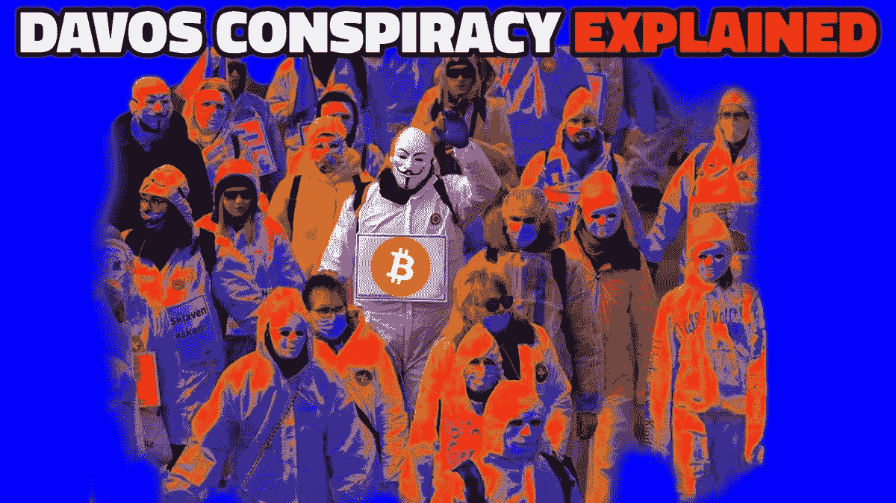

# 比特币和达沃斯人的陨落

> 原文：<https://medium.com/coinmonks/bitcoin-and-the-fall-of-davos-man-2dc20c407c47?source=collection_archive---------16----------------------->

汤姆·朗格(Tom Luongo)讨论了他的达沃斯人理论，以及在这个巨大变革的时代，比特币在地缘政治上意味着什么。

[**在 YouTube 上看这一集**](https://youtu.be/myZOQua-eTw)

**听这一集:**

*   苹果
*   [Spotify](https://open.spotify.com/episode/09vCnz6WkSJQSfWYE3Fprp?si=BNHG2XrqQ-2WDwAY1nfTDQ&nd=1)
*   [谷歌](https://podcasts.google.com/feed/aHR0cHM6Ly9mZWR3YXRjaC5saWJzeW4uY29tL3Jzcw==/episode/ZDQ5NjkzNGUtOTYyOS00ZGQ3LWEzMmEtNzU2YTMyODBmMDAz)
*   [Libsyn](http://fedwatch.btc.libsynpro.com/the-fall-of-davos-man-ft-tom-luongo-fed-72)
*   [阴天](https://overcast.fm/+m2aeLshdw)

在《比特币》杂志的“美联储观察”播客的这一集中，我和 Christian Keroles 与 Gold Goats ' N Guns 的 Tom Luongo 坐下来谈论欧洲和央行政治。我们走进了杂草中，谈论着在紧闭的门后发生的事情，这是你在任何其他节目中都找不到的讨论。Luongo 的理论围绕着他关于主要是欧洲/西方精英的观点，他将其概括为“达沃斯人”。这是一次广泛的讨论，我将在下面概述。

你可以在 Luongo 的网站上找到他所有的内容。我建议回到第 75 至 77 集，以获得达沃斯人和他的地缘政治框架的总结。Luongo 是比特币的长期拥护者，所以当然，我们讨论了在这个大变革的时代，比特币在地缘政治上意味着什么。

# 达沃斯人是谁或什么？

几个月前，我在 Luongo 网站上读到了一篇文章，这篇文章是由零对冲基金(T21)联合发布的。在那篇文章中，他称欧洲精英为“达沃斯人”。我被这个框架打动了，因为它完美地总结了我的一般地缘政治框架中衰落的世界秩序的精英。Luongo 将他们描述为“所有自以为统治世界的人。”

他们的名片是全球化、国际机构(如北约、欧盟和联合国)、气候变化和全球税收制度。他总结为“共产主义者”，我想补充一点，他们是全球共产主义者。

达沃斯的目标是扭转二战的局面，当时欧洲经济被摧毁，资本逃往美国。这一次，他们希望在欧洲以外造成全球混乱，并使欧盟成为未来几十年资本外逃的中心。

# 鲍威尔和达沃斯

Luongo 将当前的斗争框定为达沃斯人和华尔街之间的战斗。美联储主席杰罗姆·鲍威尔不是珍妮特·耶伦；他忠于美国的金钱利益，这与达沃斯对世界的全面施压相矛盾。

Luongo 填补了我们关于鲍威尔与众不同的空白。去年，在“美联储观察”节目中，我和克罗勒一直说鲍威尔是一个“直截了当的人”。我们感觉到他不同于典型的央行精英。现在我明白了，这些央行精英是达沃斯世界秩序的一部分。

鲍威尔拥有强硬的中央银行数字货币(CBDCs)并提供货币设施，维持了美元在全球金融体系中的主导地位。Luongo 解释了为什么他的再次提名如此重要，因为这就像画了一条红线——美国将不再玩达沃斯的游戏。最受欢迎的灰姑娘莱尔·布雷纳德没有被提名为美联储主席，因为美国参议院对她的任命存在疑问，而且她通过丈夫与中国共产党的深厚关系已经浮出水面。

# 地缘政治世界之旅

在节目的后半部分，我们的谈话进入了世界各地特定热点的杂草中。我们一致认为欧洲正处于困境之中。但我担心的是俄罗斯对战略纵深的天然地缘政治驱动力及其不断减弱的人口定时炸弹，Luongo 并不担心，因为俄罗斯不想被拖入战争。

为了让你了解我们在播客最后快速覆盖的领域，我们引入了阿富汗以及为什么阿富汗是如此重要的事件，麦金德和布热津斯基的[陆心说](https://en.wikipedia.org/wiki/The_Geographical_Pivot_of_History)，以及美国回归不干涉主义。

*原载于 2021 年 12 月 6 日 https://bitcoinmagazine.com***。**