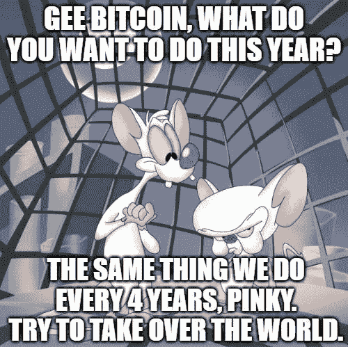

# 比特币和流动性危机

> 原文：<https://medium.com/coinmonks/bitcoin-and-the-illiquidity-crisis-b4ffbfc58760?source=collection_archive---------1----------------------->

## 毫无疑问，2021 年已经开始踩下比特币的油门，但总的来说，对于整个加密世界来说，主要硬币的回报率达到了惊人的百分比。

短短 3 天，[以太坊](/coinmonks/guide-to-ethereum-2-0-36caea41f471)在运动高峰期达到+ 60%，2 年多后回归$ 1000…