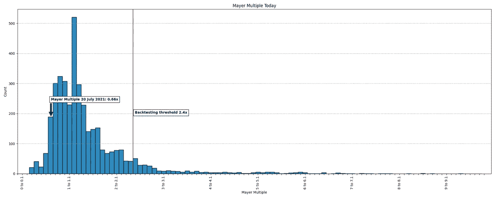
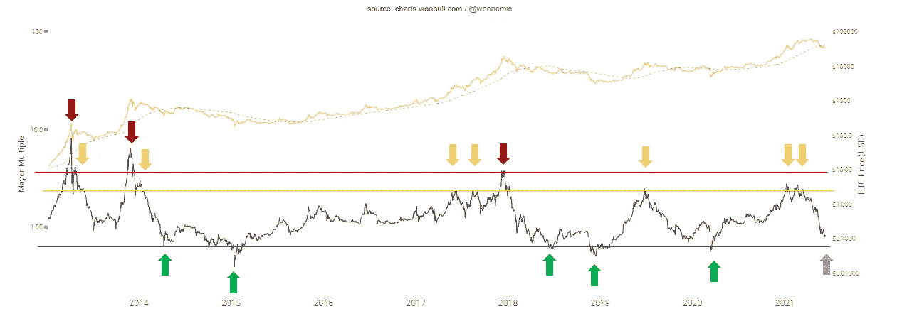
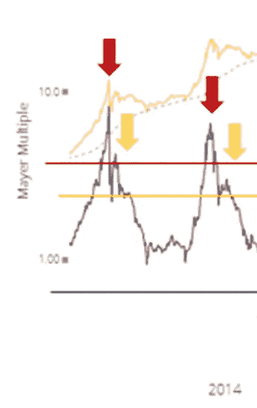
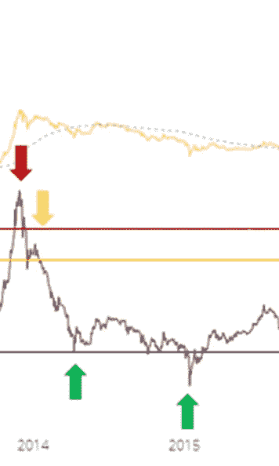
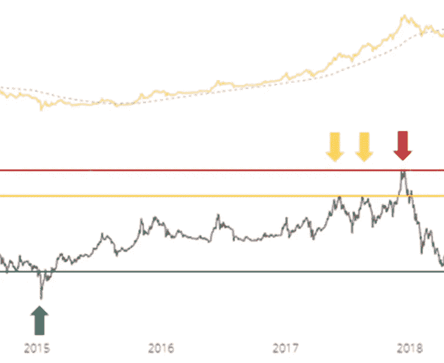
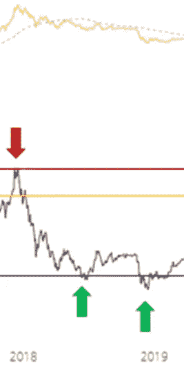
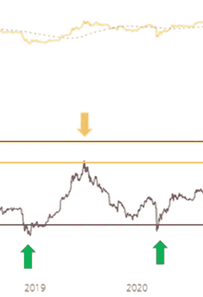
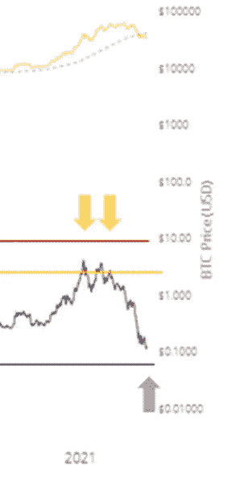

# 比特币和迈耶倍数(反转的市场迹象)

> 原文：<https://medium.com/coinmonks/bitcoin-and-the-mayer-multiple-market-signs-of-reversal-79bed77a92b1?source=collection_archive---------7----------------------->

Mayer Multiple

一个平均盈利的交易者在他们的交易过程中至少经历了 8 个指标，以给出一个在给定时间内市场方向的合理预测，帮助他们确定最佳的进场和出场，以获得利润和降低风险。常见的是相对强弱指数(RSI)，移动平均线或艾略特波浪，但今天我们谈论的是一个使用长期价格行为的指标，即迈尔倍数

Reflection of the Mayer Multiple with Bitcoin’s price action

迈耶倍数是衡量比特币当前价格与长期历史价格波动(200 天移动平均线)的指标，迈耶倍数显示了比特币价格多年来的超买或超卖情况。值得注意的是，随着市场变得更大，波动性更小，峰值也变得不那么夸张了。这是 2014 年至今的图表。

为了更好地理解图表，下面是上面的线条和箭头的含义:

> 褐红色-迈耶倍数折线图
> 
> 黄色折线图— BTC 价格
> 
> 灰色折线图-200 日均线
> 
> 红色水平线—迈耶倍数为 3.78
> 
> 黄线——迈耶倍数为 2.49
> 
> 黑线——迈尔倍数为 0.645

**每个红色和黄色箭头**表示**超买区域**的迈耶倍数(MM ),在该区域比特币的价格经历了下跌、回撤或熊市的开始。**红色箭头表示 3.78(红线)以上的 MM，而黄色箭头指向 2.41(黄线)左右的 MM**。每个**绿色箭头指向超卖区域**的 MM on 或**【0.645(黑线)**下方的**，这往往会产生趋势向上移动的信号。为了更清楚地了解情况，让我们按细分市场进行分析:**

2013 Price for Bitcoin

去年 2013 年 4 月，当 MM 位于第一个红色箭头所代表的红线(3.78)上方时，比特币的价格经历了一次回撤，被第一个黄色箭头确认为更高的低点(位于 2.41)，但价格趋势在 200MA 处获得了支持，并继续其上升势头。这最终导致了 2013 年 12 月 MM 的另一次超调(第二次红箭)，第二个黄色箭头创造了另一个更高的低点(2.41)，标志着牛市的结束。

2014 and 2015 Price for Bitcoin

在 2014 年的熊市中，MM 朝着黑线(0.645)向下发展。我们看到 Q2(四月)的第一个绿色箭头所代表的第一次触摸。在那次接触之后，比特币的价格在 200 毫安时被拒绝之前得到了某种形式的缓解。之后有趣的是，MM 超过 0.645 以下，呈现超卖情绪。这标志着购买比特币的金融机会，也是对 2014 年 12 月熊市结束的确认。后来很快就发生了逆转。

2015 to 2017 Bitcoin Price Action

比特币从 2015 年 1 月开始稳步增长，伴随着 MM 的增加，最终在 2017 年 6 月和 8 月达到黄线(2.41)。当时比特币的价格只是在 200 毫安时获得支撑后出现了下跌。最终，到 2017 年底(12 月)，MM 已经延伸到红线(3.78)以上，并在 2018 年 1 月拉开了熊市的序幕。

2018 Bitcoin Price Action

2018 年的熊市与 2014 年的熊市不相上下。2018 年的 MM 在 6 月份首次触及黑线(0.645)，也发出了价格向上的缓解信号，但在 200 毫安时再次被拒绝。接下来是 2018 年 12 月 MM 超过 0.645，这证实了 2018 年 12 月熊市的结束和 2019 年初的反转/牛市

2019 to 2020 Bitcoin Price Action

2019 年的牛市与 7 月份看到的过去相比有所不同，当时 MM 触及黄线(2.41)并发出回撤信号。三月是 MM 回撤至黑线(0.645)的点，标志着上升趋势的继续

2021 Bitcoin Price Action

那么目前的价格比较如何呢？去年 1 月和 2021 年 2 月，MM 实际上经历了两次触及黄线(2.41)，这标志着一次回撤，并以去年 5 月比特币价格从 6 万到 3 万结束。目前，价格低于 200 毫安，这也是一个看跌势头的警告信号。从那以后 MM 就一直往下走。目前的牛市结束了吗？在过去的牛市中，顶部是由高于红线(3.78)的 MM 发出的信号。今年我们还没有看到这种情况。目前 MM 在 0.679，还没有触及黑线(0.645)。触及该区域将是积累 BTC 的最佳机会，但也可能是一个信号，表明我们将在继续向下直到再次触及黑线之前看到 200 毫安的缓解。

这还有待证明。现在的 MM 趋势也可以比作 2017 年黄线处的双触。在此之后，我们已经看到比特币价格的潜在上涨，直到我们可能在今年年底达到红线(3.78)或超买区。

TLDR；

1.  MM 延伸到红线(3.78)以上的时间通常意味着牛市的结束，发生在年底(12 月)。只有一次，它没有确认熊市的逆转(只有 2013 年 4 月的一次下跌)
2.  触及黑线(0.645)的 MM 要么是对 200MA 的一次放松反弹，要么是牛市的开始。MM 延伸到黑线(0.645)以下的时间也是年底。这是牛市反转/开始的信号。
3.  触及黄线(2.41)的 MM 通常是周期内的下跌/回撤
4.  买入或卖出的机会处于极端(3.78 或以上的 MM 和 0.645 或以下的 MM)
5.  市场越成熟/市值越大，MM 的波动性越小

推特:[https://twitter.com/Rightsideonly](https://twitter.com/Rightsideonly)

> 加入 [Coinmonks 电报频道](https://t.me/coincodecap)，了解加密交易和投资

## 另外，阅读

 [## 2021 年 17 款最佳加密交易机器人(免费和付费)

### 2021 年币安、比特币基地、库币和其他密码交易所的最佳密码交易机器人。四进制，位间隙…

medium.com](/coinmonks/crypto-trading-bot-c2ffce8acb2a)  [## 存储比特币的最佳加密硬件钱包[2021]

### 保管您的数字资产很容易，但找到正确的存储方式却是一项繁琐的任务。在线钱包有一个风险…

blog.coincodecap.com](https://blog.coincodecap.com/best-hardware-wallet-bitcoin)