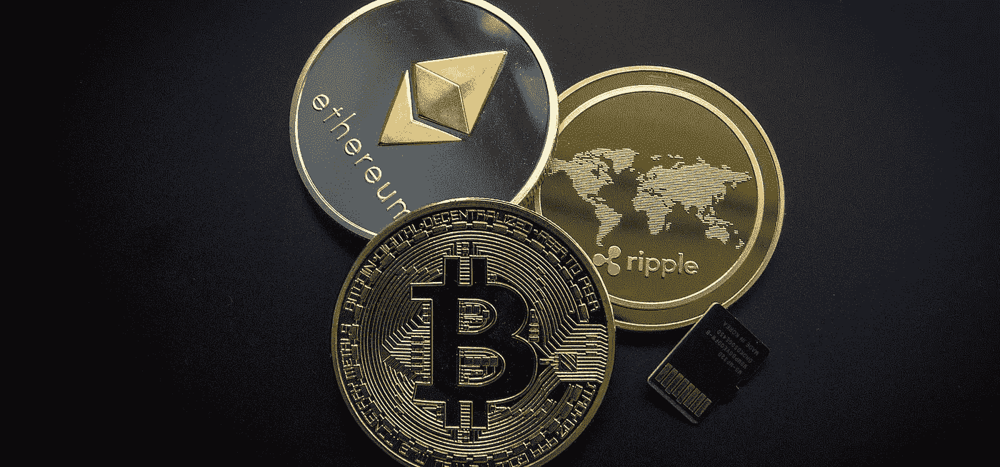

# 比特币和其他:如何用加密货币支付

> 原文：<https://medium.com/coinmonks/bitcoin-and-the-rest-how-to-pay-with-cryptocurrency-3c0e056394ec?source=collection_archive---------14----------------------->

当你听到“加密货币”这个术语时，你是否有一种感觉，你已经进入了另一个星系际空间？

嗯，不完全是这样，但如果你使用加密货币，你就加入了数百万在被称为加密空间的虚拟世界中交换现金的用户。比特币只是数百种数字现金形式中的一种。

学习如何使用加密货币支付可能会很棘手，因为你首先需要学习什么是加密货币以及它们如何工作。在本文中，我们将尝试解释这一点。

# 什么是加密货币？

加密货币是数字现金。你看不到，摸不到，但是很真实。密码(简称 Crypto)可以用来购买商品和服务，也可以用来交易获利。要购买密码，你必须用真实的货币来交换。然后，公司发行代币来换取加密货币进行购买。

你现在可能听到更多关于它的信息，但是 crypto 从 80 年代末就已经存在了。但是，当时人们并不明白这是什么，认为风险太大。直到 2009 年，随着比特币的发明，它才变得意义重大。

投资者被吸引到加密货币交易中来获利。加密货币的一些有趣的[用途包括:](https://bravenewcoin.com/insights/10-awesome-uses-of-cryptocurrency)

*   汇款，尤其是国际汇款
*   通过[流动性挖掘赚取利息](https://cryptogeeks.org/yield-farming-liquity-mining-guide/)
*   投资初创企业
*   用密码支付的公司的工作收入

# 流行的加密货币

比特币无疑是最受欢迎的加密货币，被认为是加密“黄金”。虽然它是最古老的加密形式，但最近还有其他形式引起了用户的注意。

一种这样的加密货币是以太坊，简称以太。以太坊是一个数字平台，也是[最常用的区块链](https://www.investopedia.com/terms/b/blockchain.asp)。以太被认为是最流行的加密形式之一，但是以太坊并不仅仅是为货币兑换而设计的。

用户可以通过安全算法开发数字应用，不仅用于交易数字现金，还可以用于创建销售合同或启动筹款网站等事项。

Litecoin，Dogecoin，Cardano，Polkadot…这些是你在市场上能找到的许多类型的密码中的一些。

# 如何用加密货币支付

使用 crypto 支付的第一步是设置您的数字钱包。钱包存储您所有的私钥，用于对加密货币交易进行数字签名。

有许多类型的加密钱包，从桌面版本到虚拟，纸质，移动，等等。加密货币钱包应用可以安装在你的智能手机上。

登录钱包后，您就可以发送数字现金了。说到加密，硬币交易是可以接受的。你不能把比特币发送到以太，反之亦然。

若要付款，请添加收款人的公共钱包地址，并输入您要支付的金额。听起来很简单，对吧？一旦你理解了加密货币的来龙去脉，发送和接收加密将成为一个不那么令人生畏的过程。

# 成为一名加密专家

加密货币交易可能很复杂，在开始之前做好研究很重要。两条建议:投资于你所知道的，并采取措施保证你的密码安全。人们很容易被外面的所有信息淹没，所以花点时间来学习诀窍，你会在成为一名专业加密员的道路上走得很好。

> 加入 Coinmonks [电报频道](https://t.me/coincodecap)和 [Youtube 频道](https://www.youtube.com/c/coinmonks/videos)了解加密交易和投资

## 也阅读

 [## 最佳加密交易所| 2021 年十大加密货币交易所

### 编辑描述

blog.coincodecap.com](https://blog.coincodecap.com/crypto-exchange)  [## 2021 年最佳加密借贷平台| 6 大比特币借贷平台

### 获得比特币和其他加密货币的最佳贷款利率

medium.com](/coinmonks/top-5-crypto-lending-platforms-in-2020-that-you-need-to-know-a1b675cec3fa)  [## 2021 年最佳免费加密交易机器人

### 2021 年币安、比特币基地、库币和其他密码交易所的最佳密码交易机器人。四进制，位间隙…

medium.com](/coinmonks/crypto-trading-bot-c2ffce8acb2a)  [## 最佳 4 个加密交易信号电报通道

### 这是乏味的找到正确的加密交易信号提供商。因此，在本文中，我们将讨论最好的…

medium.com](/coinmonks/best-crypto-signals-telegram-5785cdbc4b2b)  [## 5 个最佳社交交易平台[2021] | CoinCodeCap

### 编辑描述

blog.coincodecap.com](https://blog.coincodecap.com/best-social-trading-platforms)  [## BlockFi 评论 2021:利弊和利率| CoinCodeCap

### 编辑描述

blog.coincodecap.com](https://blog.coincodecap.com/blockfi-review)  [## 如何在印度购买比特币？2021 年购买比特币的 7 款最佳应用[手机版]

### 如何使用移动应用程序购买比特币印度

medium.com](/coinmonks/buy-bitcoin-in-india-feb50ddfef94)  [## 加密税务软件——五大最佳比特币税务计算器[2021]

### 不管你是刚接触加密还是已经在这个领域呆了一段时间，你都需要交税。

medium.com](/coinmonks/best-crypto-tax-tool-for-my-money-72d4b430816b)  [## 存储比特币的最佳加密硬件钱包[2021] | CoinCodeCap

### 编辑描述

blog.coincodecap.com](https://blog.coincodecap.com/best-hardware-wallet-bitcoin)  [## Pionex 评论 2021 |免费加密交易机器人和交换

### Pionex 是为交易自动化提供工具的后起之秀。Pionex 上提供了 9 个加密交易机器人…

medium.com](/coinmonks/pionex-review-exchange-with-crypto-trading-bot-1e459d0191ea)