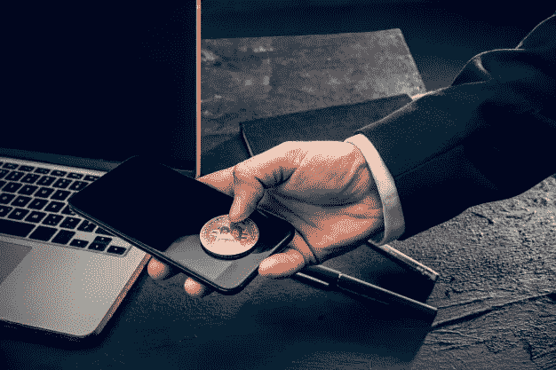

# 比特币套利:初学者指南

> 原文：<https://medium.com/coinmonks/bitcoin-arbitrage-a-beginners-guide-c8c36aa23725?source=collection_archive---------1----------------------->

如果你熟悉加密货币交易和比特币交易，你可能听说过比特币套利。一般来说，套利是指在不同的平台、交易所或地点同时买卖一种商品，以便从差价中获利的过程。这同样适用于加密货币市场，与传统市场中的套利相比，只有很少的差异。

换句话说，加密套利，或比特币套利，是交易者根据交易所之间的价格差异交易加密货币的过程。他们可能在一个交易所以较低的价格购买加密货币，在另一个交易所以较高的价格出售，并在此过程中获利。让我们通过一个例子来说明这一点。

让我们想象一下，一个比特币在 Exchange 1 上的价格是 8000 美元。假设交易所 2 的价格为 8500 美元。因此，价格差异将是 500 美元。假设一个人从交易所 1 以每枚 8000 美元的价格购买 50 枚比特币，然后在交易所 2 以每枚 8500 美元的价格出售。如果你做了数学计算，这就是结果:

*   兑换 1 50 个比特币的价格= 50 * 8000 美元=**400000 美元**
*   **50 个比特币的兑换 2 价格= 50 * 8500 美元=**425000 美元****

******因此，总利润为 425000 美元减去 400000 美元= 25000 美元******

****这可能看起来是一个简单的过程。唯一的症结似乎是首先要有足够的资金从 Exchange 1 购买大量比特币。从表面上看，似乎没有风险，只有通过利用各种交易所的价差来获利。****

****然而，如果你挖掘表面之下，你会发现实现成功的套利涉及许多风险，特别是考虑到如何不可预测的加密市场。****

****如果你刚刚开始学习比特币或加密套利，这里有一些你需要知道的事情。首先，让我们从基础开始，进入一些目前看到的最常见的套利方法。****

# ****套利方法****

## ******1。空间套利******

****这是最简单也是最基本的套利形式，交易者同时在两个交易所买卖加密货币，以从市场无效率中获利。交易者将以较低的价格从平台获得密码，然后立即在第二个交易所以更高的价格出售。****

## ******2。三角套利******

****交易员利用三角套利，通过利用价格差异，从三种加密货币中获利。例如，一名交易员可能会将比特币兑换成以太币，然后将以太币转换成莱特币，再将莱特币换回比特币。如果莱特币和以太的价值对你有利，你将能够赚取更多的比特币。****

## ******3。统计套利******

****采用这种方法的交易员通过使用定量数据模型、机器人和复杂的交易算法，从大规模套利机会中获利。本质上，这种方法包括在考虑了所有交易所的所有费用后，估算微小的价格差异。****

## ******4。闪贷套利******

****快速贷款和快速贷款套利是最近的热门话题，被认为是分散融资领域最重要的发展之一。与传统银行系统不同，在传统银行系统中，申请贷款和获得批准需要很长时间，闪贷允许客户借入任何金额的贷款，而无需提供任何抵押品或通过信用检查。****

****因此，快速贷款使交易者能够更快地借钱，利用多个分散的交易所，并在一次交易中即时切换货币。通过交易几种不同的加密货币，而不是一两种，可以获得可观的收益。****

# ****比特币套利的风险****

****虽然在加密套利中获得巨大收益的可能性和潜力非常高，但专业知识是必不可少的，因为你的袖子里有一些交易者的技巧和技术。新手和新投资者经常被对加密套利的流行描述所欺骗，在这种描述中，交易者从一个交易所购买加密，然后在另一个几乎没有风险的交易所出售获利。****

****以下是你在参与比特币套利之前需要考虑的主要风险。****

## ******高额的交易和取款费用******

****大多数交易所对交易和撤单都收取高昂的费用。因此，即使你从套利中获利，其中很大一部分也会被交易所拿走。然而，如果交易者做好研究，并对各种交易所的费用结构有更深入的了解，这种风险可以很容易地减轻。****

## ******市场波动******

****加密市场高度不稳定，市场波动是加密套利的主要风险。你可能从一个交易所以较低的价格购买了加密货币，但当你将资金发送到另一个交易所时，价格水平可能已经下降，这可能导致交易者遭受重大损失。****

## ******定时******

****就像市场波动一样，时机在加密套利中也至关重要，因为价格波动发生在眨眼之间。如果你不立即抛售你从另一个交易所以更便宜的价格购买的比特币，或者如果你的交易需要很长的等待时间才能处理，你最终可能会得不偿失。因此，在最终确定你的套利之前，研究不同交易所的交易和处理时间。****

## ******同名******

****几个交易者已经成为同一个名字问题的牺牲品。市场上有超过 1000 种加密货币，其中一些项目共享相同名称或符号的可能性非常高。因此，如果你搞混了，把错误的硬币送到了错误的钱包地址，你就会失去所有的资金。以下是几个名称相似的加密货币示例:****

*   ****现金硬币现金和现金扑克职业现金****
*   ****比特币加密 BTCS 和比特币白银 BTCS****
*   ****北极弧和拱廊令牌弧****
*   ****莱特币 LBTC 和闪电咬 LBTC****

****比较您在多个交易平台上选择的加密货币的价格和交易量是处理这一问题的最简单方法。如果差价大得离谱，很有可能不是正品。你可以通过检查不同交易所的标志来进一步验证硬币，看看它们是否匹配。****

## ******钱包状态******

****交换机上的钱包经常被禁用、不活动、不可用、正在进行维修和维护，或者在两个交换机之间的不同区块链上运行。如果你的钱包不在线，你将无法转移资金，最终你会损失很多钱。因此，最好的办法是确保你的钱包在你交易的所有平台上都在线。您还可以[检查钱包](https://blog.wazirx.com/best-bitcoin-wallet-india/)是否在同一个区块链上，以双重检查交易的有效性。****

# ****结论****

****如果你考虑到风险并以正确的方式进行，加密套利是一种获取利润的好方法。除了普通投资者之外，对冲基金、金融机构和投资机构也越来越青睐它。****

****整个过程涉及最少的努力，并给出更高的回报，从而吸引了一些人。尽管存在风险，但如果交易者使用正确的策略，风险可以被巧妙地减轻。现在有了快速贷款，整个过程变得容易多了。****

> ****加入 [Coinmonks 电报频道](https://t.me/coincodecap)，了解加密交易和投资****

## ****另外，阅读****

*   ****[尤霍德勒 vs 科恩洛安 vs 霍德诺特](/coinmonks/youhodler-vs-coinloan-vs-hodlnaut-b1050acde55a) | [隐蝠 vs 哈斯博特](https://blog.coincodecap.com/cryptohopper-vs-haasbot)****
*   ****[币安 vs 北海巨妖](https://blog.coincodecap.com/binance-vs-kraken) | [美元成本平均交易机器人](https://blog.coincodecap.com/pionex-dca-bot)****
*   ****[如何在印度购买比特币？](/coinmonks/buy-bitcoin-in-india-feb50ddfef94) | [WazirX 审核](/coinmonks/wazirx-review-5c811b074f5b) | [BitMEX 审核](https://blog.coincodecap.com/bitmex-review)****
*   ****[比特币主根](https://blog.coincodecap.com/bitcoin-taproot) | [Bitso 评论](https://blog.coincodecap.com/bitso-review) | [排名前 6 的比特币信用卡](/coinmonks/bitcoin-credit-card-bc8ab6f377c6)****
*   ****[双子座 vs 比特币基地](https://blog.coincodecap.com/gemini-vs-coinbase) | [比特币基地 vs 北海巨妖](https://blog.coincodecap.com/kraken-vs-coinbase) | [硬币罐 vs 硬币点](https://blog.coincodecap.com/coinspot-vs-coinjar)****
*   ****[印度密码交易所](/coinmonks/bitcoin-exchange-in-india-7f1fe79715c9) | [比特币储蓄账户](/coinmonks/bitcoin-savings-account-e65b13f92451) | [Paxful 审核](/coinmonks/paxful-review-4daf2354ab70)****
*   ****[加密副本交易平台](/coinmonks/top-10-crypto-copy-trading-platforms-for-beginners-d0c37c7d698c) | [五大 BlockFi 替代方案](https://blog.coincodecap.com/blockfi-alternatives)****
*   ****[信用贷款审查](/coinmonks/coinloan-review-18128b9badc4)|[Crypto.com 审查](/coinmonks/crypto-com-review-f143dca1f74c) | [货币融资融券交易](/coinmonks/huobi-margin-trading-b3b06cdc1519)****
*   ****[顶级付费加密货币和区块链课程](https://blog.coincodecap.com/blockchain-courses) | [币安评论](/coinmonks/binance-review-ee10d3bf3b6e)****
*   ****[在美国如何使用 BitMEX？](https://blog.coincodecap.com/use-bitmex-in-usa) | [BitMEX 回顾](https://blog.coincodecap.com/bitmex-review) | [币安 vs Bittrex](https://blog.coincodecap.com/binance-vs-bittrex)****
*   ****[最佳免费加密信号](https://blog.coincodecap.com/free-crypto-signals) | [YoBit 评论](/coinmonks/yobit-review-175464162c62) | [Bitbns 评论](/coinmonks/bitbns-review-38256a07e161) | [OKEx 评论](/coinmonks/okex-review-6b369304110f)****
*   ****[比特币基地跑马圈地](https://blog.coincodecap.com/coinbase-staking) | [Hotbit 点评](/coinmonks/hotbit-review-cd5bec41dafb) | [KuCoin 点评](https://blog.coincodecap.com/kucoin-review) | [期货交易机器人](/coinmonks/futures-trading-bots-5a282ccee3f5)****
*   ****[最佳加密交易信号电报](/coinmonks/best-crypto-signals-telegram-5785cdbc4b2b) | [MoonXBT 评论](/coinmonks/moonxbt-review-6e4ab26d037)****