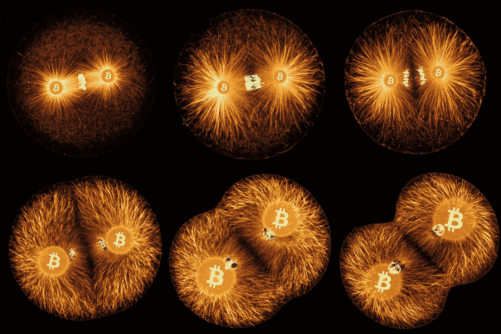

# 作为生命体的比特币

> 原文：<https://medium.com/coinmonks/bitcoin-as-a-living-organism-8860210ba27a?source=collection_archive---------1----------------------->

## ⚠️ 🚨下一次衰退敲门，**买比特币**。🚨 ⚠️

我们在 OpenZeppelin 的朋友创建了一个开源服务，允许开发人员构建类似于 Web2.0 应用程序的 Dapp onboarding。[在这里你可以读到关于它的一切。](/coinmonks/eth-onboarding-solution-90607fb81380)

> T4 每当我觉得需要锻炼的时候，我就躺下来直到它消失。*——*——**保罗·泰瑞😄**

本周故事👇👇

## 生命的证明

比特币是一种新的生命形式的第一个例子。它生活和呼吸在互联网上。它活着是因为它可以付钱给人让它活着。它之所以存在，是因为它提供了有用的服务，人们会付钱给它。它之所以存在，是因为任何人、任何地方都可以运行它的代码副本。它之所以存在，是因为所有正在运行的副本都在不断地相互通信。它之所以存在，是因为如果任何拷贝被破坏了，它就会被迅速丢弃，没有任何大惊小怪或混乱。它之所以存在，是因为它是完全透明的:任何人都可以看到它的代码，并确切地看到它做了什么... [***此处阅读全文***](/@dergigi/proof-of-life-fa28fdc002fe)

由 [Gigi](https://medium.com/u/29f663fdaf68?source=post_page-----8860210ba27a--------------------------------) (在 [Twitter](https://twitter.com/dergigi) 上关注他)

> [直接在您的收件箱中获得最佳软件交易](https://coincodecap.com/?utm_source=coinmonks)

**在 Coinmonks 上发表**

如果你喜欢在 crypto/区块链空间上写教育文章，并且想在 Coinmonks 出版物上发表。只需在**发邮件给我或者 DM 我**[***推特***](https://twitter.com/coinmonks)**

> ***“我们是一个非宣传性和非营利性的教育出版物，如果你喜欢阅读***[*【你也可以把我们*](/coinmonks/monks-need-your-help-7440418d67ec) *】。*****

******暂时就这样，送我❤️，下次再说。******