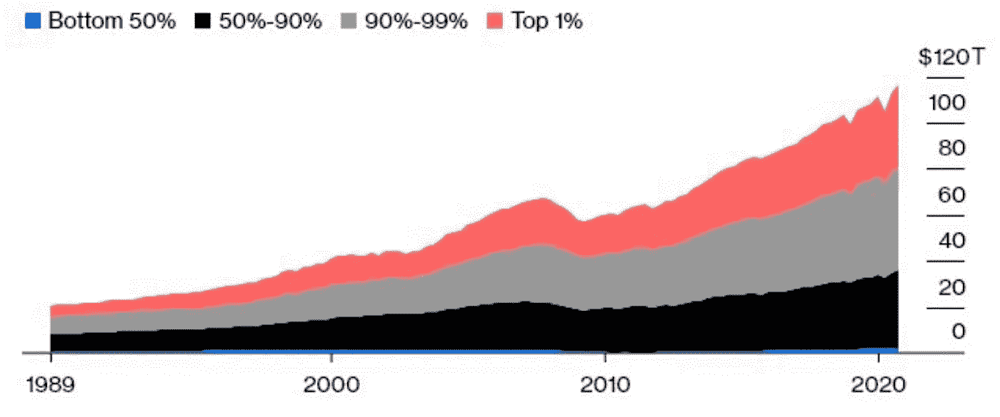
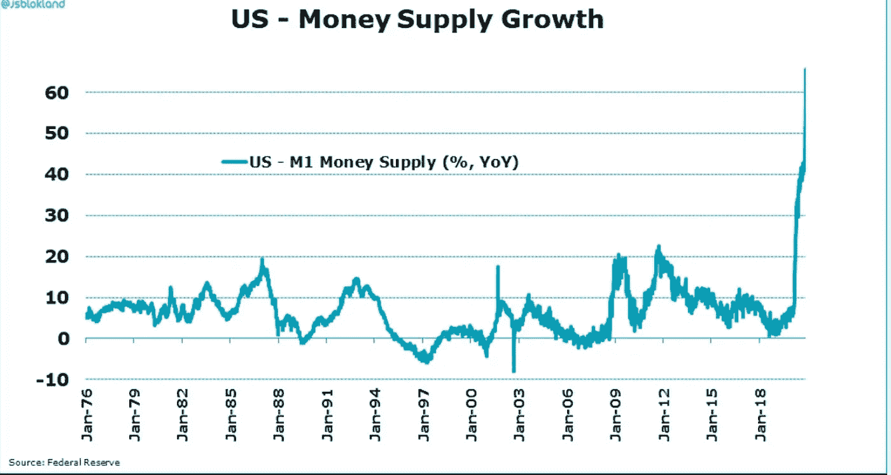
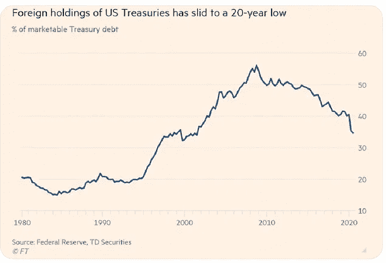
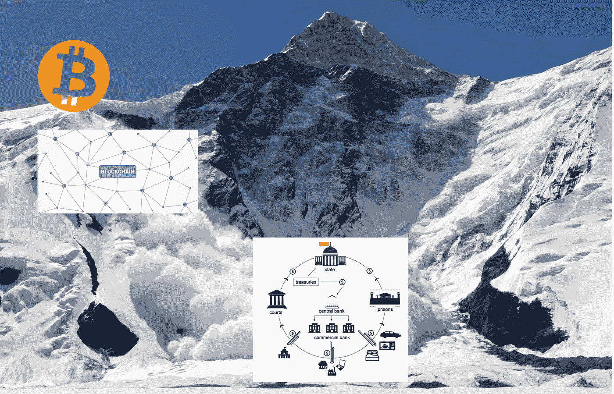

# 比特币是一场社会安全雪崩

> 原文：<https://medium.com/coinmonks/bitcoin-as-a-societal-safety-avalanche-6fae3f30fddd?source=collection_archive---------2----------------------->

[意见帖]如果你设法消除互联网上的所有噪音、美德信号、取消文化、部落民主党与共和党的代理人战争，你会意识到在表面下酝酿的是千年一遇的社会经济分裂。收入不平等正在加速增长，因为美联储的新数据显示，美国 1%的顶层家庭拥有的财富比底层 50%的家庭多 15 倍。与此同时，美联储通过购买垃圾公司的债务，同时以惊人的速度印钞票，进一步加剧了危机。底层 50%人口购买力的下降将放大现有的紧张局势，并导致新封建国家的出现。

MicroStrategy 首席执行官迈克尔·塞勒(Michael Saylor)会告诉你，“通往奴役之路包括加倍努力工作，以赚取指数级贬值的货币。”偏执的“美国梦”——这种观念认为，如果你足够努力，你可以在郊区买得起一栋漂亮的房子，并送你的孩子上大学，这样他们就可以有比你更好的未来——对大多数人来说已经变得遥不可及。自从工业革命兴起以来，第一次有人预测活着的最年轻的一代人[挣得比他们的父辈](https://www.vox.com/2018/6/28/17469080/american-dream-steven-brill-inequality-poverty-tailspin)少。正如塞勒所说，现实情况是，无论你工作多努力，或者冒多大的风险，你都不可能比富人变得更富的速度增长得更快。同样，无论你多么努力，你永远不可能比美联储印钱的速度更快。正在印刷的钞票(2020 年 4 万亿美元！)从两个方面削弱了大多数美国人的购买力。它每年产生 10-15%的实际通货膨胀率(CPI 通货膨胀数字是现代史上最大的谎言)和 2。它不成比例地让少数富人受益，这些富人持有美联储债券购买计划扶持的僵尸公司的股票。这些僵尸公司的商业模式在疫情世界已经过时(旅游、酒店、大石油、高负债银行)，它们无法通过公开市场筹集资金，因为它们不再有经济上可行的业务。

**uU.S. Wealth Distribution 1989–2020** source: Federal Reserve

除了收入不平等问题，美国前所未有的货币供应增长削弱了人们对美元作为全球储备货币的信任。所有这些因素结合在一起，成为雷伊·达里奥所说的[范式转变](https://www.linkedin.com/pulse/paradigm-shifts-ray-dalio/)的催化剂。

世界现在发现自己处于一个熟悉的转折点，这个转折点在历史上一直是人类进步的伟大过滤器。从公元前 2380 年的苏美尔起义到公元前 510 年的罗马革命；从 1789 年的法国大革命到 1917 年的布尔什维克起义，随着社会财富向统治的少数人集中，经济上受压迫的大多数人历史性地起义推翻他们的压迫者。然而，如果没有修正不平等的潜在驱动因素的计划，大多数革命只会导致权力和财富从一个统治少数群体转移到另一个统治少数群体。纵观人类历史，这种粘性循环不仅导致了生命的丧失，也导致了知识、技术、艺术等的丧失——所有这些因素都阻碍了人类开发其集体进化潜力。

那么，如何解决极度的财富不平等呢？首先，用一个全球分散的版本取代我们集中的法定金融基础设施，这个版本不能由一个单一的实体或政府控制或操纵——一个公平的竞争环境。富人和穷人都将从这种积极的金融体系改革中受益，尤其是考虑到另一种选择正在历史的阴影中徘徊。中央集权的政府计划和决策导致了我们今天所看到的极端的经济失衡，因此，我们所面临的问题的解决方案必须来自于中央集权政府计划的某种逆版本。正如阿尔伯特·爱因斯坦所说:“我们不能用创造问题时的思维来解决问题。”

根据定义，比特币是一种有限的、去中心化的数字货币。它不为任何单一实体所拥有或控制，因此超越了所有的物理和地缘政治边界。它是开源的，通过不受限制地访问区块链账本提供了完全的会计透明度。比特币的去中心化性质使其成为金融系统航向修正最可行的候选对象。作为一种干预手段，比特币之于日益加剧的社会经济紧张，就像安全雪崩之于大雪后的滑雪场——比特币是一种炸药，在真正的经济雪崩迫使我们重复历史之前，它会引发对我们系统的蓄意和可控的冲击。比特币本身并不是万灵药，但它提供了一个框架，让我们可以开始为**所有**社会成员建立一个更完美的联盟。没有人知道这是否可行，但这是桌面上最好的(也是唯一的)选择，所以我说值得一试。

百万比特币的问题仍然存在——这个仁慈的天才是谁，他有远见、资源、动机和智慧来创造比特币的概念，作为避免不可避免的社会重置(再次)的一种手段？说不准，我这里是**。**

> **加入 Coinmonks [电报集团](https://t.me/joinchat/EPmjKpNYwRMsBI4p)，了解加密交易和投资**

## **另外，阅读**

*   **[学习以太坊和 Web3 开发](http://blog.coincodecap.com/go/learn)**
*   **最好的[密码交易机器人](/coinmonks/crypto-trading-bot-c2ffce8acb2a)**
*   **[3 商业评论](/coinmonks/3commas-review-an-excellent-crypto-trading-bot-2020-1313a58bec92)**
*   **[Pionex 审查](/coinmonks/pionex-review-exchange-with-crypto-trading-bot-1e459d0191ea)**
*   **[AAX 交易所评论](/coinmonks/aax-exchange-review-2021-67c5ea09330c) |推荐代码、交易费用、利弊**
*   **[Deribit 审查](/coinmonks/deribit-review-options-fees-apis-and-testnet-2ca16c4bbdb2) |选项、费用、API 和 Testnet**
*   **[FTX 密码交易所评论](/coinmonks/ftx-crypto-exchange-review-53664ac1198f)**
*   **[零审核](/coinmonks/ngrave-zero-review-c465cf8307fc)**
*   **[Bybit 交换审查](/coinmonks/bybit-exchange-review-dbd570019b71)**
*   **[3Commas vs Cryptohopper](/coinmonks/3commas-vs-pionex-vs-cryptohopper-best-crypto-bot-6a98d2baa203)**
*   **最好的比特币[硬件钱包](/coinmonks/the-best-cryptocurrency-hardware-wallets-of-2020-e28b1c124069?source=friends_link&sk=324dd9ff8556ab578d71e7ad7658ad7c)**
*   **[密码本交易平台](/coinmonks/top-10-crypto-copy-trading-platforms-for-beginners-d0c37c7d698c)**
*   **[莱杰 nano s vs x](https://blog.coincodecap.com/ledger-nano-s-vs-x)**
*   **[Vauld 审查](https://blog.coincodecap.com/vauld-review)**
*   **最好的[加密税务软件](/coinmonks/best-crypto-tax-tool-for-my-money-72d4b430816b)**
*   **[最佳加密交易平台](/coinmonks/the-best-crypto-trading-platforms-in-2020-the-definitive-guide-updated-c72f8b874555)**
*   **最佳[密码借贷平台](/coinmonks/top-5-crypto-lending-platforms-in-2020-that-you-need-to-know-a1b675cec3fa)**
*   **[莱杰纳米 S vs 特雷佐 one vs 特雷佐 T vs 莱杰纳米 X](https://blog.coincodecap.com/ledger-nano-s-vs-trezor-one-ledger-nano-x-trezor-t)**
*   **[block fi vs Celsius](/coinmonks/blockfi-vs-celsius-vs-hodlnaut-8a1cc8c26630)vs Hodlnaut**
*   **[Bitsgap 评论](/coinmonks/bitsgap-review-a-crypto-trading-bot-that-makes-easy-money-a5d88a336df2)——一个轻松赚钱的加密交易机器人**
*   **为专业人士设计的加密交易机器人**
*   **[共同追踪审查](/coinmonks/cointracking-review-a-reliable-cryptocurrency-tax-software-5114e3eb5737)**
*   **[优霍德勒评论](/coinmonks/youhodler-4-easy-ways-to-make-money-98969b9689f2)**
*   **[埃利帕尔泰坦评论](/coinmonks/ellipal-titan-review-85e9071dd029)**
*   **[SecuX Stone 评论](https://blog.coincodecap.com/secux-stone-hardware-wallet-review)**
*   **[BlockFi 评论](/coinmonks/blockfi-review-53096053c097) |从您的密码中赚取高达 8.6%的利息**
*   **[共同规则审查](https://blog.coincodecap.com/coinrule-review-a-perfect-trading-bot)**
*   **[最佳区块链分析工具](https://bitquery.io/blog/best-blockchain-analysis-tools-and-software)**
*   **[加密套利](/coinmonks/crypto-arbitrage-guide-how-to-make-money-as-a-beginner-62bfe5c868f6)指南:新手如何赚钱**
*   **最佳[加密制图工具](/coinmonks/what-are-the-best-charting-platforms-for-cryptocurrency-trading-85aade584d80)**
*   **了解比特币的[最佳书籍有哪些？](/coinmonks/what-are-the-best-books-to-learn-bitcoin-409aeb9aff4b)**

> **[直接在您的收件箱中获得最佳软件交易](/coinmonks/newsletters/coinmonks)**

****