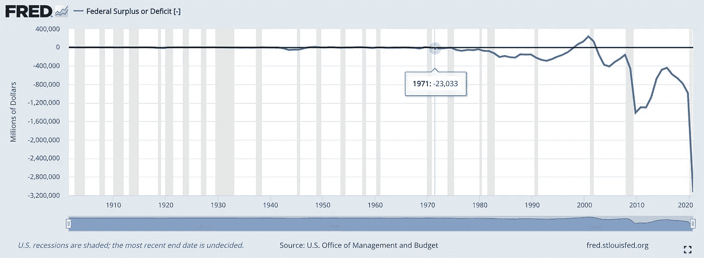

# 比特币作为失败货币体系的解决方案

> 原文：<https://medium.com/coinmonks/bitcoin-as-a-solution-for-failing-monetary-system-a00b9aa27dde?source=collection_archive---------1----------------------->

Photo by [Jan Tinneberg](https://unsplash.com/@craft_ear?utm_source=medium&utm_medium=referral) on [Unsplash](https://unsplash.com?utm_source=medium&utm_medium=referral)

朋友们，

有一段时间，我一直在寻找能够恰当地讲述比特币现象背后整个故事的东西。要做到这一点，我们需要解释当前货币体系的问题，展示它如何让任何经济计算变得几乎不可能，从基本原则出发分析货币，以及比特币是如何适应的。我找不到令我满意的材料，所以我创造了自己的。

以下是我过去几周一直在做的事情。我从我推荐的 3 个播客中做了一些关键的笔记(所有参考资料都在底部)，我添加了一些自己的评论，并把这些都放在一起。我试图将所有的点联系起来，解释为什么当前的货币体系正在失败，以及为什么我认为比特币将取代它。

# **我的结论(TLDR)**

*   在最近几次债务紧缩期间，央行(CB)降低利率以刺激经济(并有效地再膨胀债务泡沫)。今天，我们处于长期债务周期(雷伊·达里奥)的末端——利率约为 0%/负，因此 CB 加速印钞以支持债券市场。
*   这阻止了政府(名义上)债务违约，但造成了大规模资产通胀(较低的贴现率=较高的估值)并加剧了财富不平等。
*   为了避免债务违约，政府需要央行印钱并继续购买债务。为了避免因资产价格上涨而导致社会崩溃(尤其是在美国)，各国央行将需要继续向其公民提供直升机撒钱/UBI。
*   清算日很可能以货币崩溃的形式到来。我认为，目前的美元标准将在未来 10 年内崩溃。
*   因此，投资者拼命寻找稀缺资产。比特币(有着固定的供应量)现在是、将来也将是试图避免价值毁灭的资金的释放阀。最终，自由市场将采用比特币作为价值储存手段和全球储备资产。

# **通货膨胀与通货紧缩——为什么菲亚特系统不起作用？**

> 基于:[与杰夫·布斯](https://open.spotify.com/episode/63BMCEuAn8w1xzEeiJVUCl?si=7RLjST46Qp6peWA-2LG0Xw)、 [A .塞弗迪安](https://twitter.com/saifedean)、 [J .布斯](https://twitter.com/JeffBooth)

通货膨胀是一种自然状态——在自由市场中，企业家只有为社会创造价值(新的、更好的或更便宜的产品和服务)才是成功的。自由市场和技术进步导致更低的价格或相同价格下更多/更好的产品(功能越来越多的手机)。在过去的 20 年里，数字商品加速了通货紧缩(例如手机中的打火机)。

我们正处于债务如此之多，以至于永远无法以实际价值偿还的地步(见下文)。偿还债务需要严厉的紧缩措施和政治自杀，不管是谁提出的。

Source: Reinhart and Rogoff, RETI Japan, Bloomberg, HC estimates

Public debt to GDP — end of 2020, imf.org

After breaking the peg between USD and gold US deficits accelerated. Last year with budget surplus was 2001., Source: U.S. Office of Management and Budget

为了偿还越来越多的债务，我们被迫乘坐“增长轮”——我们需要每年至少 2%的增长率/通货膨胀率。政府不能允许价格下跌，因为那样就没有足够的税收来偿还债务，整个系统就会崩溃。

因此，央行一直在做两件事:

1.  他们不断降低利率，通过鼓励廉价借贷来刺激经济增长
2.  他们印钱支持债务市场:公共(政府)和最近的私人(大公司等)。).

今天，世界更多地通过通货紧缩(更便宜、更高效、更好的产品)而不是通过生产增长(例如，人们租车/使用优步，而不是购买越来越多的汽车)前进，这就是为什么很难获得理想的增长率/通货膨胀率。指数级增长的债务和指数级增长的技术通缩之间的鸿沟正在被印钞所弥合。

但是，需要多少货币宽松政策来应对这种通缩呢？最终我们会陷入恶性通货膨胀。

> 杰夫·布斯关于气候辩论:气候的最大问题是印钞，因为它迫使你在车轮上永远需要越来越多的增长。

大多数发达经济体都存在过度负债(接近或超过 130%的债务/ GDP 标志)的问题，迫使不同的央行贬值货币。这种贬值变得有竞争力:当美元价值下降时，美国的劳动力变得更有竞争力，但相反的是在欧洲，劳动力变得竞争力下降等。

从未有过如此全球性的货币危机。但也从未有过像比特币这样的机会。如果临界质量迁移到比特币，比特币可能会提供软着陆。恶性通货膨胀摧毁了整个生产结构:供应链、公司无法支付工资等等。然而，如果美元是不可行的，你切换到 BTC 履行你的义务，并继续做你的生意。

最终，货币将有两个选择:盯住 BTC，并继续运行；或者不盯住，并崩溃(作为新体系，更快地转移到 BTC)。

# 不可能的经济计算

> **基于:比特币&迈克尔·塞勒—** [**经济计算中的大师级人物**](https://open.spotify.com/episode/1PSu3LdArxkVjkXIllHz92?si=-E9gvWmRT9igpY_Waxh6xQ) **、**[**p . Pysh**](https://twitter.com/PrestonPysh)**、** [**M .塞勒**](https://twitter.com/michael_saylor)

货币供应增长、经济增长与通货膨胀和/或通货紧缩之间存在一种关系。让我们看看三种典型情况:

1.  硬通货环境——今天是理论上的(中央银行不能印钱=有上限供应的钱)。如果固定数量的货币和商品及服务以每年 2%的速度增长，货币将升值=价格将下降(因为越来越多的商品和服务在追逐相同数量的货币)。
2.  如果央行多印 2%的货币，经济以每年 2%的速度增长，国库不会增加，但也不会稀释。这是金本位的旧时代(因为黄金以每年 2%的速度膨胀，而传统上经济以每年 2%的速度增长)。
3.  但是，如果我每年增加 5%的货币量，而经济增速放缓，那么价格就会上涨。

**通货膨胀定义:**你渴望在未来获得的任何一篮子商品、服务或资产的价格增值率。*(一个和父母一起住在地下室的人，如果没有任何愿望，他会有一个不同的篮子，如果他们想有自己的房子，汽车等。；或者，如果他们渴望去医学院，他们的通货膨胀也需要包括它；或者他们是否想得到最好的医疗服务)*

**通货膨胀不是平均分配的:**

*   数字拷贝不会变得更贵(数字音乐、视频、照片)，因为可变成本非常低。那些东西是通货紧缩的。过去十年，我们消费的一半是没有可变成本的纯信息。
*   1-2%的 CPI 与现实没有关系。樱桃采摘，所以从来没有任何通货膨胀。称 CPI 通胀是不正确的，具有误导性。
*   房价每年上涨 4-7%(CPI 不包括它)。你想住在哪里？由于稀缺，理想地段的资产通胀率更高。
*   我想变得富有吗？或者有不错的房产或海滨房产？股票，债券，商业地产(产生收入的东西)？每年产生 100 万美元股息的苹果股票的成本是多少？这一成本在今年(2020 年)12 周内翻倍= 100%的 12 周通胀率。
*   稀缺资产:比特币(2020 年上涨 300%——恶性通货膨胀)，汉普顿的房子+16 周上涨 50%。
*   所有资产的平均水平:20–24%的 M2 货币供应扩张率(美国在 2020 年)。这就是股票市场空前高涨的原因。这就是资本成本。

因为印钞是价格上涨的最大驱动力，所以必须有一个贴现率来评估我们的储蓄或资产的价值是否得到保护(或者更好的是，它们的价值可以用黄金或比特币这样的稀缺资源来衡量——这值得单独列出来)。由于印钞率不容易预测，这种经济计算是极其困难的。重新定义无风险利率是一个很好的起点。

**无风险率:**如果目标是财富保值，那么无风险率就是 M2 货币供给扩张率。根据美联储和欧洲央行的政策，M. Saylor 预计未来 5 年的年增长率为 10-15%。许多估计在政治上是正确的，因为没有人能预测 L 型复苏。我们在金融资产上有 V 型复苏，在主街上有 L 型复苏，但他们称之为 K 型。较小规模的货币扩张需要财政紧缩，但这几乎从未奏效。

预期 15%的货币供应扩张——这是无风险最低回报率，如果你想保护你的财富，你需要击败无风险利率和风险溢价。示例:

*   如果美国债券(最接近无风险的东西)的收益率是 5%，而你明年想买的资产将会贵 15%(后年也是如此。)，那么你每年会损失 10%的价值。4 年后，你一半的财富将被摧毁(相对于这 15%的资本成本)。
*   过去十年:债券收益率为 2-5%，资本成本约为 5-6%(M2 货币供应量每年扩张 5.5%)。如果你降低利率，人们将在收益率的基础上获得资本收益，这就是他们获得资本成本的方式。在过去的十年里，利率从 5%降到了 0%(在美国)。在欧洲和日本——已经是负利率的债券才能保值。我们已经到了极限——如果你不降低利率，债券的价值就会崩溃。有两个问题:1)你不能获得太多的资本收益，2)资本成本增加了两倍。此外，如果你出售它，你只能获得资本收益——如果你持有它直到到期，你只能获得面值。
*   债券目前(2020 年):2%的息票对 15%的预期回报率，你每年损失 13%的价值。
*   商业房地产交易就像债券一样——当利率下降时，价值上升。房租就像优惠券。为了保值，你需要让租金的增长速度快于最低回报率。风险溢价:支付租金的交易方的信誉(商店/剧院被亚马逊、网飞等挤垮)。).
*   现金是一种负债，而不是资产(因为你需要用 M2 货币供应扩张率来贴现它)。

## 个人

为了保值，个人需要用 M2 货币供应扩张率和风险溢价来贴现他们的储蓄。对于一些没有发现比特币的人来说，这将是令人恐惧的，并且打破这个几乎不可能的最低回报率。更糟糕的是——同样的计算方法也适用于工资折旧。简而言之:如果你的央行在某一年多印了 15%的钱，而你的工资增加了 3%，那么你的情况就差了 12%。如果你想知道为什么这么多东西(如住房)比几十年前更难买得起了，这就是原因。

富有的个人玩不同的游戏，因为他们有大量的机会获得廉价的债务。如果你能以你的资产(房地产、股票、艺术品、足球队)为抵押，以每年 2%的利率借到足够的钱，这可以显著降低你的预期回报率。如果你的资产平均每年增长 10%,而你每年只为债务支付 2%,新的一美元债务会让你过得更好(特别是如果你的抵押品不是按市值计价的话)。背负债务也有很大的税收好处。

你越富有，你就越有可能获得债务，而且这种债务越便宜——以至于对那些最富有的人来说几乎是免费的。反之亦然:你越穷，获得的机会就越少，借贷成本就越高。这是加剧财富不平等的重要因素。债务的获取和成本存在巨大差异，因为央行零成本印钞，因此可以零成本放贷，而只有社会富裕阶层才能负担得起游说者、政府关系团队和足够强大的银行关系，以获取这种最廉价的资本。

直升机撒钱和/或 UBI 可能会减缓甚至逆转这一趋势，但原则上，中央计划比自由市场要糟糕得多，货币政策是另一个很好的例子。

## 公司财务战略

作为公司财务主管，你可以做几件事:

*   你可以保留现金，但十年后你会损失 75%的价值。
*   股票、债券、房地产——它们有收益，但不太可能超过风险溢价。仍然可能每年稀释 10%。所有这些都大幅膨胀，而且很难进一步膨胀，因为你无法进一步降低利率。
*   你打算如何让你的公司每年增长 20%来跟上预期回报率？
*   解决方案是比特币——资产比美元增长超过 100%(在美国，如果你持有超过 1 年，就可以免税)。只要你得到最高的税收调整利率，钱就会流向哪里。这是一种正在升值的零息债券。

我们最终会得到僵尸债券、僵尸公司、僵尸房地产——只有央行会买——对社会不再有任何价值的私人资产的国有化(日本银行购买公司债券和股票；欧洲央行和美联储紧随其后)。这将世界不知不觉但始终如一地从自由市场推向中央计划。

“日本没有通货膨胀”——东京的房地产是世界上最贵的。你用工资在东京买公寓的几率有多大？

Photo by [Andrey Kremkov](https://unsplash.com/@spinaldog?utm_source=medium&utm_medium=referral) on [Unsplash](https://unsplash.com?utm_source=medium&utm_medium=referral)

# **钱是什么？比特币简介**

> 基于:[比特币常见误区](https://open.spotify.com/episode/5kSnQa1KZQmF1zbho2mjdP?si=1pgidWFJQkid6oEBmjIrew)、 [P. Pysh](https://twitter.com/PrestonPysh) 、 [R. Breedlove](https://twitter.com/Breedlove22)

市场根据 5 个关键特性来选择一个人:

*   可分性——你可以在不同的尺度上细分和重组它
*   持久性——它会持续一段时间(水果会很糟糕)
*   可识别性——您可以轻松验证其真实性
*   便携性——您可以轻松地在空间中移动它
*   稀缺性——抵抗供给膨胀。有了钱，与钱打交道的每个人都有增加供给的直接经济动机。这使得任何能够增加货币供应量的人都有能力从所有使用货币作为价值储存手段或交换媒介的人那里没收价值。

历史上，自由市场选择最好的工具或技术来满足货币的这五个属性。我们用贝壳、盐、牛；后来的货币金属——与其他技术相比，它们更易分割、更耐用、更易识别、更便于携带，而在这些金属中，黄金是最稀缺的。

如何量化稀缺性？在比特币和贵金属界有一个流行的指标，叫做存量流量比(S2F)——1 除以年通胀率。对于黄金供应来说，通货膨胀率约为 2%，所以 1 / 2% = ~50。在所有贵金属中，黄金的 S2F 比率最高，这也是自由市场选择作为货币的原因。(黄金是一种如此古老的工具，以至于我们忘记了它为什么有用。任何人都可以告诉你黄金是有价值的，但很少有人能说出货币的属性，并告诉你为什么它会被市场选择。

黄金是我们拥有的最好的货币形式(并且使用了五千年)，但是它缺少三个非常重要的属性:

1.  不可分割性(它非常沉重，比如买一杯咖啡你需要金粉)。因此，通过将黄金提取成纸币或硬币，我们能够更深入地细分黄金，并将其用于日常交易。
2.  可识别性——有必要在每笔交易中鉴定黄金并评估其价值。这是不经济的，需要很多时间，需要一定的技术。所以人们发现你可以把黄金集中保管在一个仓库里。这个仓库将提供一个可兑换黄金(如 1 盎司)的证书，所以现在不用在每次交易中评估黄金的价值，你可以信任这个企业的信誉和认证。
3.  便携性——金属非常重，可以跨空间运输，但相关成本很高(需要实际的物流和高度的安全性)。

## 黄金和美元标准

由于这些技术上的缺陷，我们引入了黄金支持的货币。随着时间的推移，这些认证业务变得越来越集中，直到它们成为银行，最终成为中央银行。

一开始是 1:1 的纸币兑换黄金，随着时间的推移，变成了部分储备银行(发行比黄金更多的纸币)。1944 年，我们建立了布雷顿森林体系，其中美元将与黄金挂钩，所有其他货币将与美元挂钩(因此间接而言，它们仍将处于金本位制下)。实际上，美联储成为了世界的中央银行，最终他们印制了比他们的黄金储备更多的货币，这在 1971 年达到了顶峰，当时尼克松取消了美元对黄金的可兑换性。这让我们从自由市场选择的货币——黄金，变成了一种垄断，这种垄断有能力以牺牲其他所有人的利益为代价，让政治上受青睐的少数人受益。这产生了一系列的社会经济后果——自 1971 年以来，货币供应量和全球债务/GDP 飙升，离婚、吸毒、自杀率飙升。

## 菲亚特标准的问题

央行不费吹灰之力创造的无限供给货币必须应对各种挑战:

*   通货膨胀扰乱了价格信号。价格是一个允许我们比较事物的信号，它最好通过零意外通胀的货币来传达。(当我看到香蕉价格上涨时，我不知道这是因为像农场被烧毁这样的真实事件，还是仅仅因为货币供应增加)。它导致资本配置不当。
*   货币供应量的增加降低了预见未来进行经济规划的能力(我们不知道会印多少钱)。
*   法定货币是反罗宾汉的:它偷穷人的钱，给富人。它是从那些依赖货币作为价值储存手段的人手中没收价值，并将其重新分配给那些首先收到新货币的人(见[萨希尔·布鲁姆](https://twitter.com/SahilBloom)的[坎蒂隆效应](https://twitter.com/SahilBloom/status/1309145743756865536?s=20))。这是全球财富不平等加剧背后的一个关键驱动因素。有一种普遍的误解，认为“政府正在刺激经济”——有刺激效应，但它有更长期的负面后果。央行正在没收最脆弱的经济群体的价值:穷人、靠固定收入生活的人、养老金领取者等。把它重新分配给他们认为合适的人。

## 比特币作为新的货币形式

比特币完善了自由市场精选货币的 5 个属性:

1.  可分性——每个比特币可以被分成 100，00 0，00 0 个单位(称为 satoshis/sats ),但代码可以更新，以允许进一步的(无限)可分性。
2.  持久性——比特币是以分布式方式存储的信息；每个运行比特币软件的人都有历史上每笔交易的完整副本。所以即使你删除 99.9%的节点，它仍然存在。整个网络可以从单个节点轻松复制。
3.  可识别性——比特币不可能是伪造的。比特币网络就像一个计算机大军，每台计算机都在检查所有其他计算机的工作，看它们是否遵守协议规则(比如不要增加供应等)。).
4.  便携性——比特币是纯信息，它可以以光速移动。
5.  稀缺性——比特币表现出绝对的稀缺性(要创造 2100 万个单位)——这是任何实物形式的货币都不可能做到的。

比特币是一次性发现，因为自由市场会选择流动性最高的。这就是黄金相对于其他货币金属的情况。

## 比特币 vs 黄金

如果明天每个人都开始开采黄金，它的供应量将会增加。对于比特币，由于被称为“难度调整”的机制，投入挖掘比特币的资本越多，挖掘的难度就越大。因此，增加对比特币开采的投资只会增加网络的安全性——而不会增加供应。

## 比特币打算解决什么问题？

1.  它解决了通货膨胀的问题。有了比特币，我们有史以来第一次拥有了完全可预测且透明的货币供应。随着 2009 年 Satoshi 开采 Genesis 区块，货币供应量从零开始，到 2140 年达到 2100 万。
2.  审查制度。在香港，表达言论自由的人们正因为当地政府对金钱的垄断而失去资金。审查的例子:

*   印度 500 卢比纸币一夜之间熄灭，
*   关闭银行账户，
*   没收金钱，
*   通过通货膨胀使货币贬值。

3.合法垄断。中央银行拥有伪造货币的专有权。他们可以零成本生产货币，以最大价值使用货币，并将所有后果转嫁给被迫使用这些货币的人。比特币正在让世界回归一个更自由的状态，在这个状态下，创新趋于繁荣，贸易限制被取消，财富创造得到改善。一个很好的历史例子是十九世纪的镀金时代，在美国称为镀金时代，在国外称为黄金时代。这是一个前所未有的文化繁荣时期，艺术创作，很多零到一的创新。

通过削减政府资金(你不能印刷比特币)，它迫使政府对其公民的偏好更加负责。随着时间的推移，我们预计税率会更加一致，因为司法管辖区将开始竞争(因为有了比特币，就更容易改变实体存在)。

政府将不得不变得更小，这意味着纳税人将保留更多的价值。

## 误解和障碍

*政府永远不会允许取代法定货币:*在美国，我们有一个最高法院关于比特币等开源软件的先例。参见:90 年代后期的 PGP(隐私技术)案例研究。政府试图将 PGP 归类为弹药，以限制其出口。当被告打印了完整的 PGP 源代码，将它作为物证提出，并说“这是 PGP”(你如何取缔写在一张纸上的这个演讲？).最终，最高法院宣布 PGP 受到第一修正案的保护，即言论自由。同样，比特币是一种开源软件，因此受到第一修正案的保护。就像互联网允许未经许可的信息移动一样，比特币允许未经许可的价值移动。

其次，禁令本身实际上是不可执行的。比特币是一个轻量级的软件客户端，运行在世界各地。没有办法区分谁在运行它，谁没有。你可以试着瞄准采矿作业，但正如我们在中国看到的那样——矿工们只是搬家。他们可以带着他们的小装备，把它们插在别的地方。比特币没有中央权威，没有办公室，没有 CEO。政府可以禁止集中交易，但这些都是纳税实体，所以其他政府总是有动机从事这项业务。互联网发生的事情是，美国采取了无害的方法，正因为如此，我们有了大规模的经济繁荣。政府似乎不想错过下一件大事。

*每个人都可以复制(叉)比特币。*但是你如何向它添加社区呢？这就像你可以下象棋，改变规则，但没有人会和你一起玩。就网络效应而言，其他所有硬币都远远落后于比特币。就好像每个人都想上脸书，因为其他人都已经在那里了；脸书的网络效应只与一个载体有关——用户。然而，比特币具有四方网络效应，极难破坏。它们涉及:

*   持有比特币的人，
*   人们接受它并打算花掉它，
*   采矿网络和
*   开发者(为 it、钱包、交易所等创造生态系统的人。).

*比特币能被黑吗？*比特币是一个去中心化的安全网络。它已经是人类历史上最强大的计算网络，尽管它仍处于起步阶段。比特币是一个永久的蜜罐；有越来越多的动机去黑它，然而没有人接近去黑它。比特币核心软件是一段非常简单的代码，没有太多功能。它只是试图保持 2100 万英镑的绝对稀缺性。由于相对来说没有什么特点，所以没有太多的攻击面。

Photo by [NASA](https://unsplash.com/@nasa?utm_source=medium&utm_medium=referral) on [Unsplash](https://unsplash.com?utm_source=medium&utm_medium=referral)

*比特币不稳定。*比特币目前是资产中的终极风险，但这是因为它正在竞争成为终极风险规避资产，比黄金更难。所以要么什么都没有，要么就是全球储备资产。结果很可能是二元的:这些激励措施和网络效应要么奏效，要么有一只黑天鹅将比特币彻底淘汰。从零到全球储备资产的路径不是线性的。然而，波动性与市值成反比。

波动的答案是头寸规模。投资组合中比特币配置的规模将影响投资组合的整体波动性。如果波动太大，降低仓位。

*金钱需要能够扩张吗？*这就像想要扩大一米来建造更大的房子一样，毫无意义。测量单位需要固定。

*[1]这些都不是理财建议*

## 参考资料:

1)播客 1:杰夫·布斯的《通货紧缩》

演讲人:A. Saifedean，J.Booth

[https://open.spotify.com/episode/5jo3J9hdmcJq09N4u5bojn...](https://open.spotify.com/episode/63BMCEuAn8w1xzEeiJVUCl?si=7RLjST46Qp6peWA-2LG0Xw)

[https://podcasts.apple.com/.../18.../id1403202032...](https://podcasts.apple.com/ca/podcast/18-deflation-with-jeff-booth/id1403202032?i=1000507455122)

2)播客 2:比特币和迈克尔·塞勒——经济计算大师班

发言者:皮什、塞勒

[https://open.spotify.com/episode/1PSu3LdArxkVjkXIllHz92](https://open.spotify.com/episode/1PSu3LdArxkVjkXIllHz92?si=-E9gvWmRT9igpY_Waxh6xQ)

[https://podcasts.apple.com/.../btc005.../id928933489...](https://podcasts.apple.com/us/podcast/btc005-bitcoin-michael-saylor-masterclass-in-economic/id928933489?i=1000503270615)

3)播客 3:比特币的常见误解

演讲者:皮什、布里德洛夫

[https://open.spotify.com/episode/5kSnQa1KZQmF1zbho2mjdP...](https://open.spotify.com/episode/5kSnQa1KZQmF1zbho2mjdP?si=1pgidWFJQkid6oEBmjIrew)

[https://podcasts.apple.com/.../btc001.../id928933489...](https://podcasts.apple.com/nl/podcast/btc001-bitcoin-common-misconceptions-w-robert-breedlove/id928933489?i=1000500156216)

## 延伸阅读:

*   明天的代价:为什么通货紧缩是繁荣未来的关键，杰夫·布斯
*   比特币标准:中央银行的分散化替代方案
*   当货币死亡:魏玛恶性通货膨胀的噩梦
*   万物泡沫:中央银行政策的终结