# 作为泰坦尼克号救生筏的比特币

> 原文：<https://medium.com/coinmonks/bitcoin-as-a-titanic-liferaft-e79d029ca142?source=collection_archive---------2----------------------->

cyberhornets 十多年来策划和设想的循环发展正在实时上演，抓住了大众的想象力和主流媒体的头条新闻:

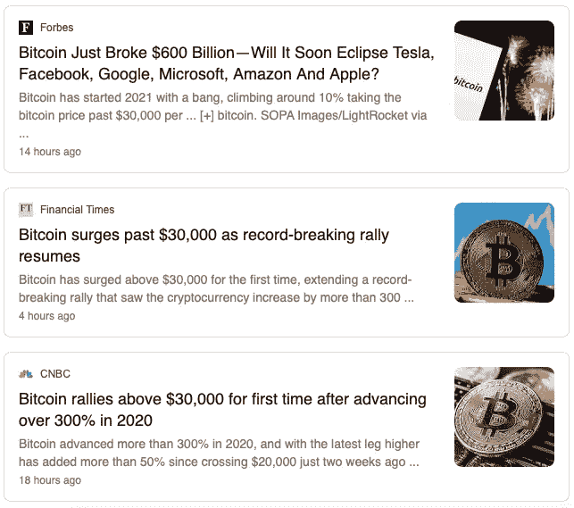

所有这样的标题都很好，很漂亮——看到这些必然会很高兴。虽然它们都不重要。他们都不会以任何显著的方式被载入史册。当我想到比特币的时候，我总是回想起一个标题:

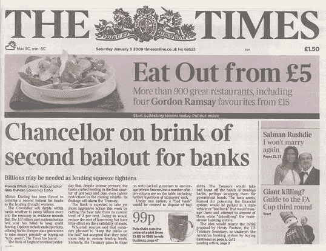

The Rosetta Stone (2009 AD)

在撰写本文时，2021 年 1 月 3 日是比特币的第 12 个生日。这一切都是从这一天开始的，再也不会因为创世纪板块而停止:

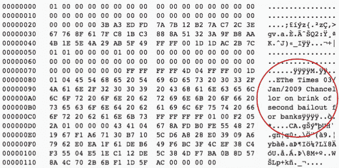

Hashed and mined by Satoshi. The first message on earth to be immutable forever.

从最纯粹的形式来看，比特币链本身没有任何变化。它作为一台全球真理机器不断被挖掘和散列。每隔 10 分钟，电子心脏就跳动一次，没有一次停顿。然而，围绕它的叙述已经发生了显著的变化。这是 cypherpunk 邮件列表中的一个奇特实验，当时是黑暗网络上的边缘货币——现在，它是网络空间中的一艘方舟，以避免淹没在巨大的货币洪流中。

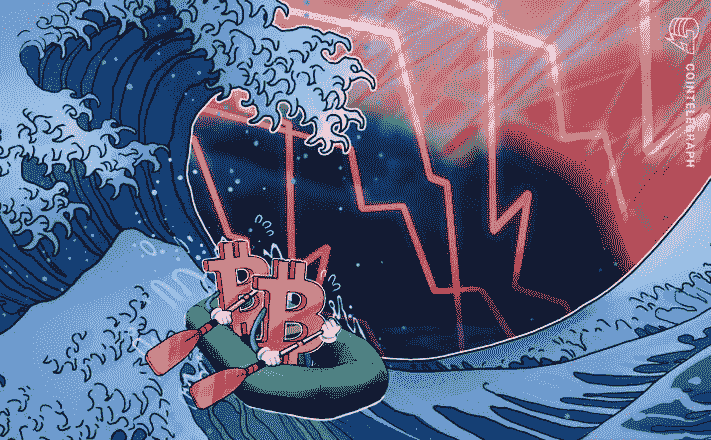

There is always a way out.

那是怎么发生的？为什么数百万人，尤其是像我这样的南半球的人，在这个网络黄蜂的蜂巢中寻求庇护？：

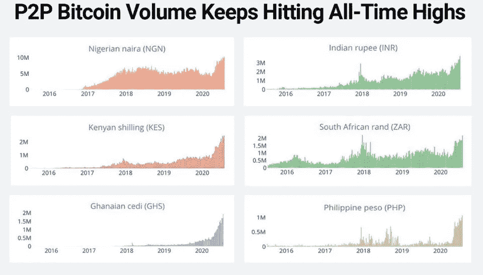

Note: this is from Summer 2020 at 1/3 of the current market prices

我想我们可以把它分解成四个原因，这四个原因与一个众所周知的导致泰坦尼克号悲剧的故事情节非常吻合:贪婪、傲慢、特权和匮乏。

# **1)贪婪:**在崩溃前加速增长——从二月的高峰到三月的低谷

进入 2020 年 2 月，尽管来自东亚的噪音越来越多，称一种奇怪的病毒正在中国的整个城市蔓延，但市场仍然欢欣鼓舞。道琼斯、标准普尔 500 和纳斯达克三大关键指数纷纷亮起绿灯，每隔一天就刷新历史新高:

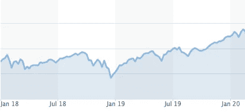

The Titanic, photographed circa 2020 AD

然后冰山撞上了。

It’s all your fault

新冠肺炎被宣布为疫情，市场开始了全速的价格发现——接近尾声。

Hindsight is 20/20

看过这部电影的人会记得船长和他的“老板”的傲慢。让我们早一天到达纽约，头条新闻将是惊人的。回程票价更高！

***Ismay:*** *So you’ve not yet lit the last four boilers?* ***Captain Smith:*** *No, I don’t see the need. We are making excellent time.* ***Ismay:*** *The press knows the size of Titanic. Now I want them to marvel at her speed. We must give them something new to print! This maiden voyage of Titanic must make headlines!* ***Captain Smith:****Mr. Ismay, I would prefer not to push the engines until they’ve been properly run in.* ***Ismay:*** *Of course, I’m just a passenger. I leave it to your good officers to decide what’s best. But what a glorious end to your final crossing if we were to get to New York on Tuesday night and surprise them all! Make the morning papers. Retire with a bang, eh E.J.? Good man.*

# 2)傲慢:“这艘船不会沉”——a·拉·珍妮特《不再有危机》耶伦

我是最后一个认为市场前景黯淡的人。事实上，我经常发现自己提出相反的观点。市场确实大多会上涨。提出任何你喜欢的关于不匹配损益和历史平均值异常的比率。系统中有太多的流动性在寻找收益，任何基金经理都不会关心任何“理由”:

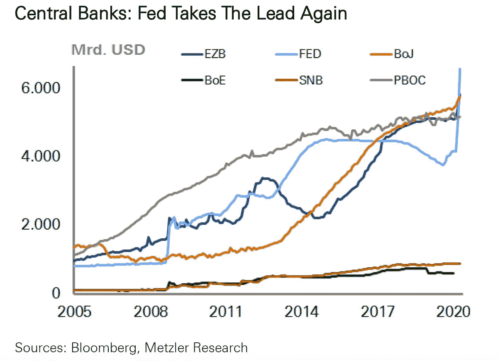

我们生活在负利率的世界里。如果你把精力放在现金上，时间就会倒流。因此，市场现在更多的是价值储存，而不是纯粹的价格发现平台。这里的细微差别是“大部分”——不总是。我们总是会有崩溃。气泡顶部总是会修正。这里的狂妄是假设这是不可能的:

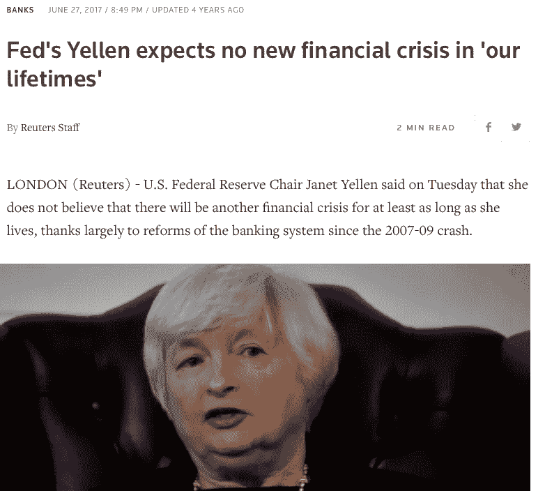

She actually said that.

这种方法总是将印钞视为解决任何问题的灵丹妙药。住房危机？印几万亿。Covid？多打印一些。

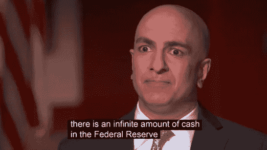

He actually said that.

# 3)特权:全球 K 形复苏——第三类溺水，而第一类放大

如果你持有任何类型的金融资产，2020 年都是相当不错的一年。在超过 10 万亿美元新流动性的支撑下，一切都上涨了。市场甚至没有调整为 v。它更像是一个对号，即使与 2020 年初的水平相比，每个主要资产类别都达到了历史高点:

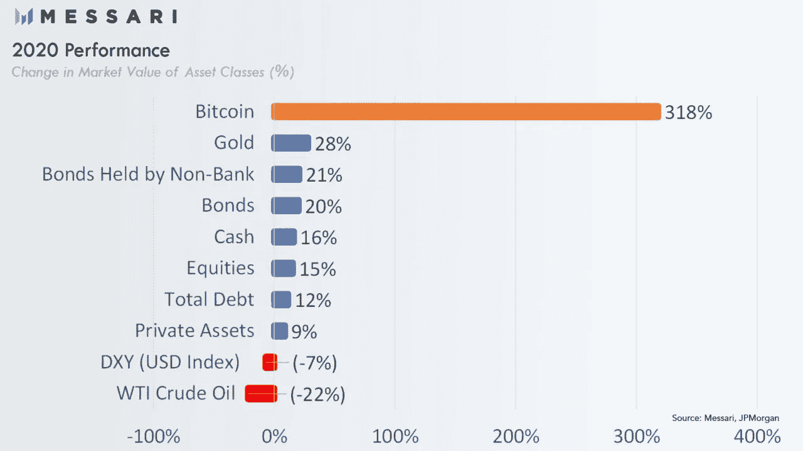

Oil went deep into negative (at one point, literally).

当然，对于那些从今年的混乱中走出来的人来说，没有货币危机。这里的问题是，世界上大多数人不像全球北方的普通工薪阶层那样拥有资产。数十亿人没有接触到特斯拉、亚马逊或 Etsy 的股票，所有这些股票都因其在“新常态”中的定位而增值。对于世界上数十亿人来说，仅仅由于他们的地理位置和当地货币，仍然存在一个能够进入金融市场以保存他们的能量(保持他们的购买力不变)的生存问题。对于南方民众来说，华尔街目前浮夸的复苏就像是半个星球之外的好莱坞故事。美国人可能有理由抱怨他们的货币对欧元和日元贬值了 7%，但我想提供一些观点:

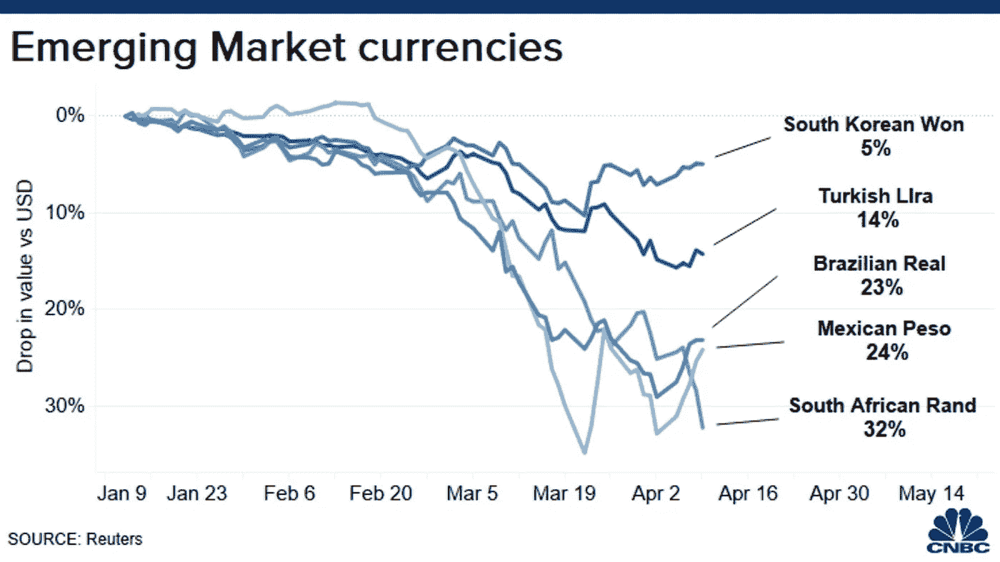

It got worse before it got worse for the emerging markets in 2020

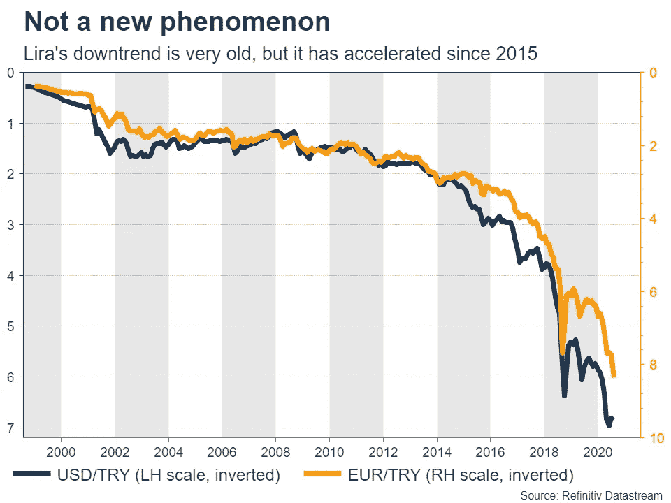

Reminds me of XRP

这不是一个新现象。在过去的几十年里，普通的土耳其人或阿根廷人已经开始接受多工作少收入的现实。但他们不应该。恶性通货膨胀是不好的。还有一个选择。有控制论救生筏可用。

# 4)稀缺性:太多人的救生筏太少——只有 2100 万比特币

在一个阳光明媚的日子里，当 Rose 和她的“一流”随行人员走在甲板上时，她注意到泰坦尼克号上没有足够的救生筏。这种担心很快被船上的董事们认为是不必要的，因为这是一艘不沉的船——谁会需要那些无用的预防措施。生活是美好的，只要晒晒太阳。

类似地，多年来，cyberhornets 一直在教育我们的同行比特币的绝对稀缺性，以及它如何在危机时期提供一种摆脱集中式系统存在风险的方法。对于许多在全球金融领域享有“一流”地位的人来说，很容易将这一令人难以置信的发明视为“宠物石”——谁会需要在分散的网络蜂巢中的某个地方访问虚拟钱包中那些无用的数字密钥。生活是美好的，把积蓄存在银行里就好。然而，现实在过去十年里已经赶上了许多其他人:

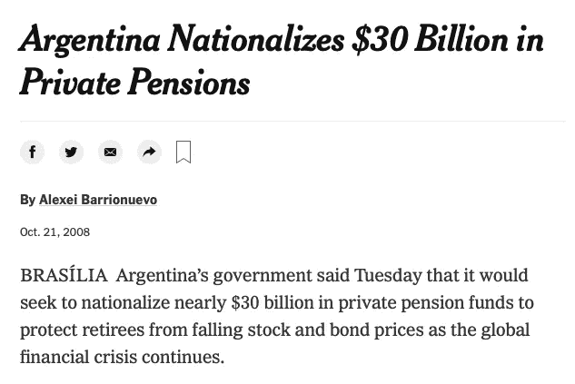

Say adios to your retirement

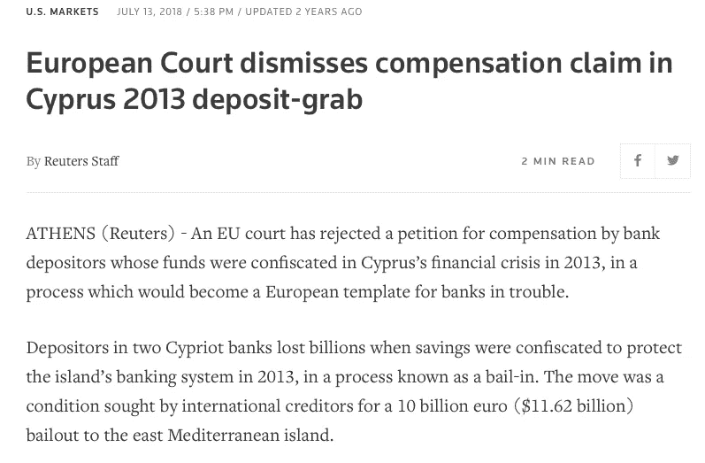

EU is overrated for its “institutionalisation”, as illustrated.

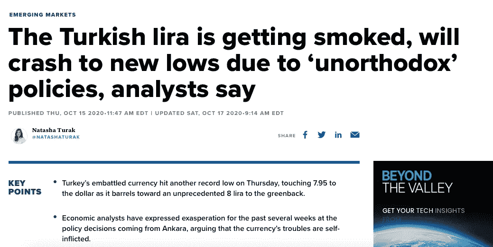

Watching the Turkish Lira/USD chart felt like watching a tech stock melt-up in 2020 — every other day printed a new record level

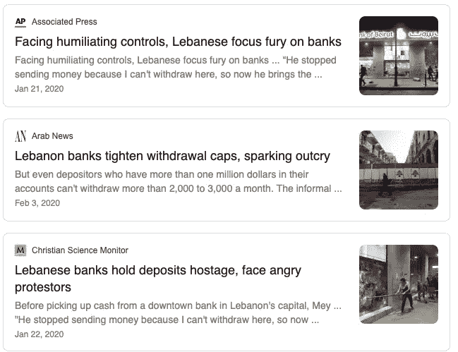

The bank is the owner of the money in your bank account. Not you.

你银行里的钱不是你的。只是欠你的一笔钱。可能会还，也可能不会还。许多人以一种非常不幸的方式意识到了这种监管风险。除了实物黄金，比特币是世界上唯一具有保值功能的资产，没有交易对手风险。您的私人钥匙可以让您随时随地使用您的硬币。不管政治形势如何，也不管中央银行的想法如何。不需要信任就能拿到自己的钱。事实上，南半球的人们一直重视黄金的这种特殊功能——难怪它在土耳其、印度、伊朗、泰国和中国比在加拿大或挪威更受欢迎。黄金不能贬值、国有化，也不能在没有暴力的情况下被没收。

比特币是数字黄金。的确，它比黄金好一百万倍。它更便于携带(试着在行李中放一根金条逃离政权)，通胀率更低(一旦价格上涨，你就无法生产更多)，而且不易破碎。它适应逆境，从混乱中获益。它一天比一天强大，一天比一天聪明。与稳定的分子相反，它是一种像菌丝体一样分散的活生物体。因此，它有着强大的能力来抓住世界各地许多人的想象力和金钱能量。当然，它的美元价格每天都在波动(就像 Global South 的生活一样)，但仔细观察会发现一个不断被采用的故事:

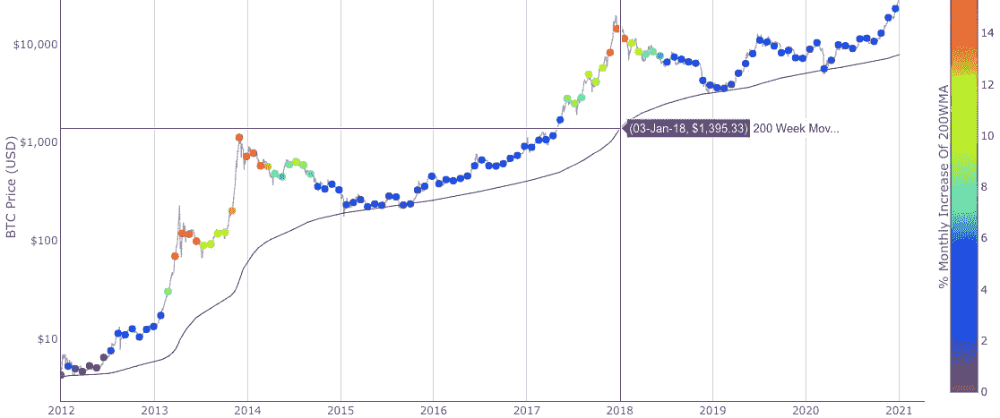

The 200-week moving average of Bitcoin always goes up. Every single day. As much as it is portrayed as a get-rich-quick scheme that bubbles up every 3 or 4 years by the ill-informed mass media, Bitcoin is engineered to be a don’t-get-poor-gradually scheme. Just follow the purple line above.

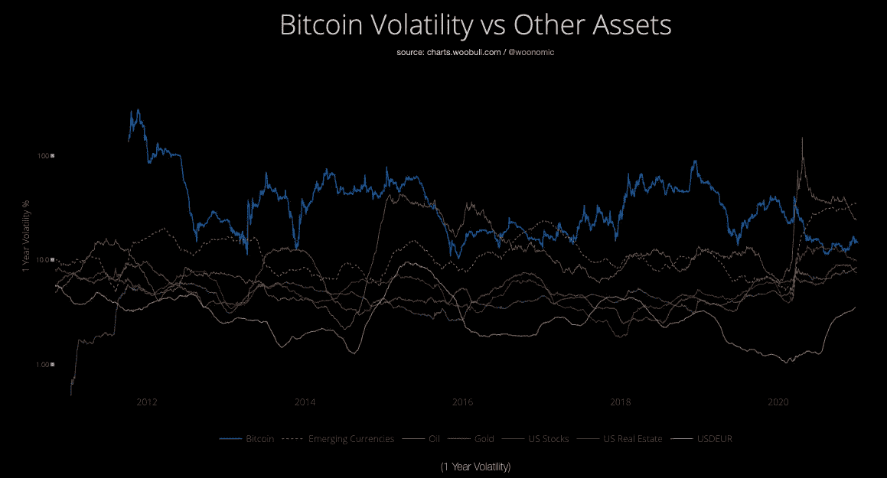

Bitcoin (blue)is has lately been less volatile than emerging market currencies (orange), and note, emerging market currencies are volatile down, Bitcoin is volatile up.

只会有 2100 万艘控制救生筏。每部电影只有一亿个座位。上亿个座位已经被占了:

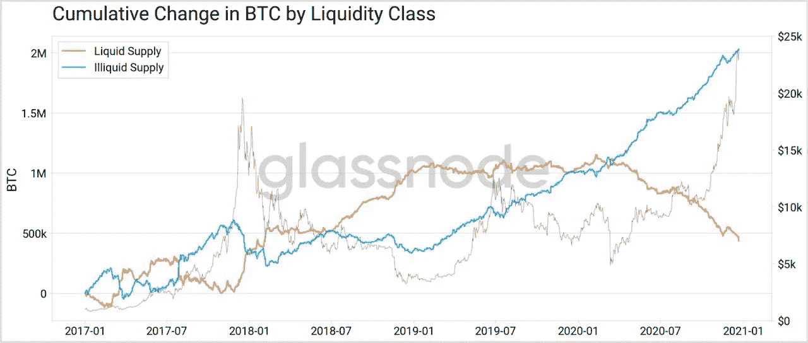

80% of current supply of Bitcoin is not circulating in the market e.g. held by their owners since a long time. As one would probably not trade a liferaft for any offered amount during the sinking of Titanic, people are not willing to let go of their hard-earned access to the cybernetic ark of monetary energy.

普通的塞浦路斯人或黎巴嫩人可能会认输，屈服于崩溃的货币制度——或者他们可能只是在 satoshis 中保存他们的生命能量，抑制他们的焦虑。

随着这一信息传播得越来越广，进入金融市场的机会将更加公平，全球货币崩溃的痛苦将会减轻，未来的 K 形复苏将会得到缓解。

为此，比特币是希望所在。

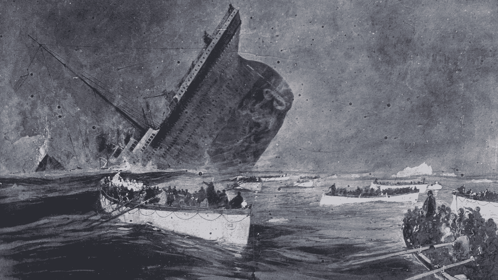

“An unprecedented time.”

## 另外，阅读

*   [学习以太坊和 Web3 开发](http://blog.coincodecap.com/go/learn)
*   最好的[密码交易机器人](/coinmonks/crypto-trading-bot-c2ffce8acb2a)
*   [3 商业评论](/coinmonks/3commas-review-an-excellent-crypto-trading-bot-2020-1313a58bec92)
*   [Pionex 回顾](/coinmonks/pionex-review-exchange-with-crypto-trading-bot-1e459d0191ea)
*   [AAX 交易所评论](/coinmonks/aax-exchange-review-2021-67c5ea09330c) |推荐代码、交易费用、利弊
*   [Deribit 审查](/coinmonks/deribit-review-options-fees-apis-and-testnet-2ca16c4bbdb2) |选项、费用、API 和 Testnet
*   [FTX 密码交易所评论](/coinmonks/ftx-crypto-exchange-review-53664ac1198f)
*   [n 零审核](/coinmonks/ngrave-zero-review-c465cf8307fc)
*   [Bybit 交易所评论](/coinmonks/bybit-exchange-review-dbd570019b71)
*   [3Commas vs Cryptohopper](/coinmonks/3commas-vs-pionex-vs-cryptohopper-best-crypto-bot-6a98d2baa203)
*   最好的比特币[硬件钱包](/coinmonks/the-best-cryptocurrency-hardware-wallets-of-2020-e28b1c124069?source=friends_link&sk=324dd9ff8556ab578d71e7ad7658ad7c)
*   [加密复制交易平台](/coinmonks/top-10-crypto-copy-trading-platforms-for-beginners-d0c37c7d698c)
*   最佳 [monero 钱包](https://blog.coincodecap.com/best-monero-wallets)
*   [莱杰 nano s vs x](https://blog.coincodecap.com/ledger-nano-s-vs-x)
*   [bits gap vs 3 commas vs quad ency](https://blog.coincodecap.com/bitsgap-3commas-quadency)
*   最好的[加密税务软件](/coinmonks/best-crypto-tax-tool-for-my-money-72d4b430816b)
*   [最佳加密交易平台](/coinmonks/the-best-crypto-trading-platforms-in-2020-the-definitive-guide-updated-c72f8b874555)
*   最佳加密贷款平台
*   [莱杰纳米 S vs 特雷佐 one vs 特雷佐 T vs 莱杰纳米 X](https://blog.coincodecap.com/ledger-nano-s-vs-trezor-one-ledger-nano-x-trezor-t)
*   [block fi vs Celsius](/coinmonks/blockfi-vs-celsius-vs-hodlnaut-8a1cc8c26630)vs Hodlnaut
*   Bitsgap 评论——一个轻松赚钱的加密交易机器人
*   为专业人士设计的加密交易机器人
*   [共同追踪审查](/coinmonks/cointracking-review-a-reliable-cryptocurrency-tax-software-5114e3eb5737)
*   [优霍德勒评论](/coinmonks/youhodler-4-easy-ways-to-make-money-98969b9689f2)
*   [埃利帕尔泰坦评论](/coinmonks/ellipal-titan-review-85e9071dd029)
*   [赛克斯·斯通评论](https://blog.coincodecap.com/secux-stone-hardware-wallet-review)
*   [BlockFi 评论](/coinmonks/blockfi-review-53096053c097) |从您的密码中赚取高达 8.6%的利息
*   [Coinrule 审查](https://blog.coincodecap.com/coinrule-review-a-perfect-trading-bot)
*   [最佳区块链分析工具](https://bitquery.io/blog/best-blockchain-analysis-tools-and-software)
*   [加密套利](/coinmonks/crypto-arbitrage-guide-how-to-make-money-as-a-beginner-62bfe5c868f6)指南:新手如何赚钱
*   最佳[加密制图工具](/coinmonks/what-are-the-best-charting-platforms-for-cryptocurrency-trading-85aade584d80)
*   了解比特币的[最佳书籍有哪些？](/coinmonks/what-are-the-best-books-to-learn-bitcoin-409aeb9aff4b)

> [直接在您的收件箱中获得最佳软件交易](/coinmonks/newsletters/coinmonks)

