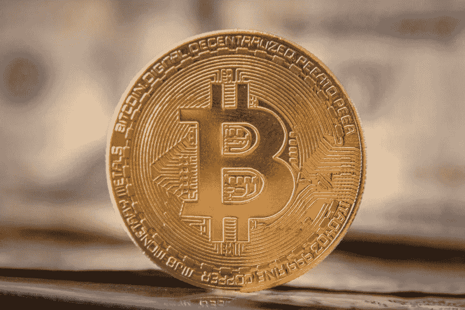

# 比特币是人类繁荣的一种超然的、平等的力量

> 原文：<https://medium.com/coinmonks/bitcoin-as-a-transcendent-egalitarian-force-for-human-flourishing-6265620bf124?source=collection_archive---------1----------------------->

# *财务免责声明*

*本文仅出于教育目的。它不构成投资或财务建议。这是对一个复杂现象的技术性解释，在投入任何财力之前，这需要你自己的自学和深度学习。确定自己的风险/回报承受能力。*

# *读者预设*

这篇文章旨在作为扩展你对比特币理解的渠道，甚至可能有助于你进入众所周知的兔子洞。我相信，写这篇文章的大部分价值来自于压缩和整理已经存在于比特币以太中的最佳信息，这些信息是通过我自己的知识库的棱镜过滤的。这解释了为什么我如此彻底地参考了所依赖的资源，以便你可以将它们加入书签，用于未来的教育阅读。

这篇文章应该是一个跳板，让你为自己对比特币的理解负责。在这个特殊的时刻，我不得不写下这篇文章，因为我担心比特币的故事正被劫持和曲解。比特币有潜力将数十亿人从货币和政治暴政中解放出来，我完全有信心看到这一人类范式转变的进程结出果实。

# **致谢**

我要感谢我的那些朋友，他们提供了编辑评论、校对，并普遍加入了他们细致入微的分析和明智的反馈。

我还想感谢所有的非正统思想家——过去的和现在的——通过他们的写作和公开演讲帮助我了解比特币。

最后，我要感谢中本聪给人类留下的伟大遗产，他们的默默无闻和不为个人喝彩的决定永垂不朽。这是比特币故事固有的一部分。

# **目录**

**1。** **简介**

**2。** **钱是什么？**

**3。** **起源故事**

**4。** **公钥和私钥**

**5。** **技术属性**

***a)*******便携式****

****b)*******耐用*****

*****c)*******可编程******

*****d)*******可验证使用工作证明******

*****e)*******可替换的******

*****f)*******稀缺性******

****6。** **哲学性质****

*****a)*******简政放权******

*****b)*******防审查******

*****c)*******自由与人权******

*****d)*******消除交易对手风险和第三方中介******

*****e)*******随着个人主权而来的是个人责任******

****7。** **比特币的首要功能:价值储存****

****8。** **潜在的次要功能****

*****一.*** ***交换媒介*****

*****二世。*******记账单位******

****9。** **特性传播比特币增长****

*****a)*******网络效应和梅特卡夫定律******

*****b)*******比特币作为宗教******

*****c)*******精英嘲笑******

****10。** **结论——逐渐，然后突然****

****参考文献****

# ****1。简介****

**比特币一旦被发现[【1】](#_ftn1)，既很难被发现，也不可能不被发现。它是一种反熵的、反脆弱的、廉洁的、不可改变的、无许可的、可编程的、抗审查的、抗扣押的、无边界的、不可知论的、平等主义的、假名的和对等的技术形式的能量——像这样的能量，我们这个物种在整个人类历史上从未试验过。**

**我对比特币[【2】](#_ftn2)的理解之旅，潮起潮落；一直很吸引人，但有时很有挑战性。需要时间*‘明白’，*这意味着把它看得比投机性金融投资更远。比特币需要第一原则思维，并要求将自己从普遍的货币假设中解放出来，这些假设是由遗留的政治和金融机构通过几十年的意识形态霸权灌输的。像任何忘却的过程一样，有像比特币的价格图表一样壮观的高峰和低谷。**

> **“困难不在于发展新思想，而在于摆脱旧思想。”——约翰·梅纳德·凯恩斯**

**比特币之所以如此有趣，是因为它涵盖了如此广泛的领域——经济、哲学、政治、心理学、密码学、计算机科学和博弈论——仅举几个例子，并且需要对以下问题进行基本原则思考:**

**钱是什么？**

**我们如何跨越空间和时间传递能量？**

**谁应该控制货币供应？**

**对一个人来说，“自由”意味着什么？**

> **“用比特币储存财富的人被迫通过基本原则进行思考，以理解比特币的特征，否则，从表面上看，比特币似乎与当权派的金钱观相矛盾，最终会强化信念。[**【3】**](#_ftn3)”—帕克·刘易斯，《被解放的资本》**

**大多数人进入比特币的途径是它在相对较短的时间内以法定货币价值引人注目的升值。许多人最初认为这是一个“快速致富”的机会，或者也许他们认为这是一个庞氏骗局。**

**当然，这些论点不能用证伪来反驳。这种预测在未来实现的可能性不是零。如果他们这样做了，几乎肯定不会是因为比特币协议的根本缺陷。这将是因为控制比特币是什么以及可能成为什么的意识形态之战将会失败。尽管比特币依赖于不可改变的、客观的、二进制的数学代码法则，但它需要通过易错的、非理性的、主观的人类思维来适应和接受。**

**一旦一个人开始深入了解比特币的技术基础，他们就会意识到他们正在接触一种范式转换技术，这种技术可能会彻底改变我们居住的世界。这是*“一个随机旁观者与人类理解边缘的问题闲逛的机会，因为在有这么多钱在其中浮动之前，没人关心这些问题*[【4】](#_ftn4)。**

**就理解而言，我的轶事经验和非科学的经验证据 [[5]](#_ftn5) 是，最初欣赏和理解比特币需要大约 40+小时的学习，然后可能需要大约 100+小时才能实现真正的理解——对许多人来说，比特币最大化——可能是粗糙和过于简化的近似。比特币无疑是我接触过的最吸引人的话题之一。我希望这篇文章能为你的智力投入提供一个跳板。**

# ****2。钱是什么？****

> **“比特币或许最好被描述为一场复仇运动，旨在夺回某些发达国家曾经拥有的东西:一个基于金本位的自由和不受约束的银行体系”——Nic Carter[**【6】**](#_ftn6)**

**金钱是能量。**

**想象每一次人类的互动都是能量的交换，这是思维的扩展。你为了给你的身体提供生物生存所需的能量而消耗的食物通常是用法定货币购买的，而法定货币本身是通过你宝贵而有限的时间来牺牲能量而获得的。我们生活在一个受热力学物理定律约束的世界里，第一定律指出*能量不能被创造或毁灭，只能从一种形式转换成另一种形式*。权衡只不过是选择把一个人的精力分配到哪里。**

**人类的进步和繁荣往往在增长的初始阶段与能源使用呈线性关系——这就是为什么中国和印度在向发达国家转型时能源使用量在增加——尽管这种线性关系可以被随后的技术和企业创新抵消。**

**在最早的人类社会，人们之间的贸易是通过物物交换进行的。易货贸易固有的难以置信的低效率极大地限制了贸易的规模和地理范围。基于易货贸易的一个主要缺点是需求的双重重合问题。为了让我获得你的小麦，我必须希望你要求相应数量的我生产的苹果，数量相等，对双方都有利。这种双重需求的巧合非常罕见，而且不会转移到个人交易之外。**

**对金钱更正式的定义可能是，它是一个信息系统，记录和更新谁做了被其他人重视的工作，这样信用就可以普遍化和社会化[【8】](#_ftn8)。从某种意义上来说，比特币提供的解决方案是迄今为止最纯粹的，因为它以代码的形式捕捉这些信息*作为语音*[【9】](#_ftn9)，并在区块链上验证。**

**技术越来越倾向于数字而不是模拟，比特币是我们的货币系统从物理世界分离到比特领域的自然演变，它依赖于数学和代码的不朽定律，而不是任意创建的人类法律和习俗。**

# ****3。起源故事****

**中本聪 2008 年发布的比特币白皮书是一份非同寻常的历史遗物，尤其是如果你不是以现代的后知之明，而是以 2008 年的眼光来阅读的话。它的完美构想是该协议的基础，白皮书中概述的理想是比特币成为今天的力量的原因。**

**Satoshi 继续保持匿名，并退出所有公共活动，这是比特币成为去中心化生命力的最重要贡献之一。任何依靠一个集权的傀儡领导的技术或组织都注定要屈服于个人崇拜。权力腐败，绝对权力绝对腐败。比特币的一大优势是它没有任何傀儡。有个别追随者宣传比特币的理想，但没有人对该协议拥有主权，无论他们多么强大或富有。**

# ****4。公钥和私钥****

**比特币依赖于公钥加密。这意味着比特币所有者被分配了以下两项权利:**

**一个*公钥*——协议用它来证明你拥有比特币；和**

**一个*私钥*——这个生成公钥，充当一种密码，保证个人的比特币只能被安全地访问。不可能通过检查公钥来确定私钥，相反，这当然是一个固有的特征。**

**这种密钥对的生成依赖于基于数学问题的加密算法，称为*单向函数*。有效的安全性要求保持私钥的私密性；公钥可以公开分发而不会危及安全[【10】](#_ftn10)。个人隐私仍然可以通过保持公钥匿名来维护。其他人可以看到特定的公共地址正在向另一个公共地址发送金额，但没有将交易与特定身份相关联的信息[【11】](#_ftn11)。**

**私钥控制对比特币网络的访问，为了转移任何比特币，必须用私钥创建有效的加密签名，然后网络的其余部分对其进行验证。通过持有私钥，消除了交易对手风险，并且保留了对网络的无许可访问。于是有了格言，*“不是你的钥匙，不是你的硬币”*[***【12】***](#_ftn12)*。***

# ****5。技术特性****

> **“比特币不是一系列加密功能，它是一个非常复杂的交互数学和协议系统[**【13】**](#_ftn13)”—尼克·萨伯**

*****一)* *便携式*****

**比特币在网络空间运行，意味着它可以超越时间和空间的物理限制。私钥可以存储在 USB 驱动器上，并可以方便地携带到任何地方。个人甚至可以记住私钥恢复短语，这样他们就不必随身携带任何东西，这在穿越敌对边境或逃离专制独裁者的情况下可能会很有用。**

**价值不菲的比特币几乎可以瞬间在地球两端的人之间传输。尽管法定货币在数字形式上也具有很高的可移植性，但政府监管和资本管制意味着大额价值转移通常需要几天才能完成，或者根本不可能完成。**

**众所周知，传统的商业银行在处理转账和结算请求时速度很慢，而且受到陈旧的周一至周五上午 9 点至下午 5 点工作时间表的限制；相比之下，互联网从不睡觉。这将商务窗口从每周 35 小时扩大到 168 小时(增加了约 5 倍)。**

*****b)* *耐用*****

**比特币不易腐烂，很难没收，也不能轻易销毁(尽管如果保管不当，它可能会被黑客攻击或窃取)。尽管民族国家试图监管比特币的突出事例和恶意行为者多年的攻击，比特币网络仍在继续传播。它经历了无数次事件，许多人预测这些事件将标志着它的灭亡——2014 年的 Mt Gox 失窃，2017 年的比特币现金分叉，各种熊市，2020 年的新冠肺炎疫情，2021 年新疆的 hash rate 中断，埃隆马斯克的推文——以及许多其他事件。**

**比特币体现了林迪效应(Lindy Effect ),该效应观察到一种不易腐烂的技术的未来预期寿命与其当前年龄成正比，这意味着某种东西存活的时间越长，其剩余预期寿命就越长。在林迪效应适用的地方，死亡率*随着时间的推移而降低*。比特币作为一种数字资产和价值储存手段的感知价值只会随着其存在时间超过目前的 12 年历史而继续增加。**

****c)可编程 ****

> **“比特币的本质是，一旦 0.1 版本发布，其核心设计就在它的余生中被固定下来了”[**【14】**](#_ftn14)——中本聪，2010 年 6 月 17 日**

**比特币和互联网都运行于代码之上，代码是一种语言形式。数学是一种客观对应现实根本性质的语言，独立于人的主观性。金钱是一种语言工具，我们用它来表达彼此的价值，并通过空间和时间来传递价值。因此，通过代码作为货币的比特币是我们有史以来发现或创造的最有效和最不可变的货币，任何针对比特币的限制都应该被视为对言论自由的限制。相对于其最初的概念，比特币协议不可篡改的事实提供了其他替代硬币无法比拟的安全性和确定性。**

*****d)* *可验证使用工作证明*****

**比特币所有权可以使用加密签名以数学确定性公开验证。点对点网络的使用避免了阻碍电子支付的“双重消费”问题。运行该软件的计算机被称为节点，负责审查交易，以确保软件的规则得到遵守。使用特殊计算机芯片的节点，称为矿工，然后竞争将这些交易分批成块的权利，这些块每 10 分钟被添加到区块链[【16】](#_ftn16)。节点在很少协调的情况下同时工作，由共识机制强制执行。由此可见，*的网络“在其无结构的简单性中是强健的”*[***【17】***](#_ftn17)*。***

**这些节点竞相解决难以解决但其解决方案易于验证的数学问题[【18】](#_ftn18)。网络通过将事务散列到正在进行的工作证明链中来给事务加时间戳，生成事务的时间顺序的计算记录，在不重做工作证明的情况下，该记录不能被改变。时间戳服务器的工作方式是获取一组要打上时间戳的项目的散列，并广泛发布该散列。每个时间戳的散列中都包含前一个时间戳，形成了一个链，每个额外的时间戳都会加强前一个时间戳。最长的链不仅证明了事件发生的顺序，还证明了它来自最大的中央处理器( **CPU** ))的能力。采矿者通过交易费和大宗交易费获得激励和报酬。这些激励措施让不诚实付出了极高的代价，并确保了网络的完整性。为了修改过去的块，恶意攻击者必须重做该块及其后所有块的工作证明，然后赶上并超过诚实节点的工作[【19】](#_ftn19)。**

**毫无疑问，工作证明有它的缺点。*“让你的网络安全仅仅依靠拥有比对手更多的蛮力计算能力是丑陋的，丑陋到现在和永远需要至少一半的处理能力只是为了避免双重支出*[***【20】***](#_ftn20)*”。记录交易有许多更容易和更简单的方式，但比特币是一个完全建立在繁琐和昂贵的验证基础上的系统，因此它可以消除各方之间的任何信任或责任:它是 100%验证和 0%信任[【21】](#_ftn21)。类似于丘吉尔关于民主的名言，这是最糟糕的验证形式——除了所有其他的。***

*****e)* *可替换的*****

**可替代性是任何交换媒介的要求，这意味着每枚硬币在类型和价值上都与任何其他硬币完全相同，因此是不可区分的、可替换的和可互换的。如果你把一美元换成另一美元，在种类或价值上没有损失或增加(假设这张纸币不是伪钞)。比特币是完全可替换的比特串。**

*****f)* *稀缺*****

**稀缺性也许是价值储存最重要的属性，因为它利用了人类收集稀有物品的天生欲望。一个金钱上的好必须具备**。****

***中本聪最有远见的决策之一是创造 2100 万比特币的永久限量供应。人类以前从未接触过绝对稀缺、完全无弹性的货币能源供应。同时，一个比特币高度可分为 1 亿个单位(小数点后 8 位)，称为 satoshis 或 sats。随着越来越多的人将比特币作为货币标准，这将被证明是有用的。***

***这种有保证的稀缺性是如何实现的？每个区块中释放的比特币数量大约每四年减少一半，以保持总供应量有限，这一事件被称为减半。这给了比特币的拥有者一个已知的总可能供应量的百分比。例如，一个拥有 1 个比特币的人会知道，地球上最多有 2100 万人(不到世界人口的 0.3%)拥有和他们一样多的比特币。***

***这一特征比以往任何时候都更加重要，因为在短期选举周期的刺激下，政府越来越倾向于通过增加货币供应量来解决眼前的问题。世界各国政府的通胀趋势让法定货币的持有者面临储蓄贬值和购买力逐年下降的现实。仅 2020 年一年，所有流通中的美元就有 22%被印刷[【24】](#_ftn24)。这不仅对非富裕阶层产生不成比例的负面影响——因为他们拥有更少或没有资产，这些资产可以对冲通货膨胀——而且是精英内部人士从货币供应的任何增加中获得早期利益，这种现象被称为坎蒂伦效应，因为他们*“接近货币”。****

**这种货币供应的疯狂扩张，在很大程度上是已经在全球占据主导地位的经济意识形态的产物。现代货币理论(“ **MMT** ”)是一种宏观经济理论，将货币概念化为公共垄断，并将失业视为央行过度限制货币供应的证据。虽然通过印刷使货币贬值可能会使一个国家名义上更富裕，出口更便宜，但这并不能使这个国家更加繁荣。**

**MMT 本身被认为是基本凯恩斯经济学的重述，其核心是通过消费者支出不断增加总需求。在大萧条后期、第二次世界大战和战后经济扩张期间，它是发达国家的标准宏观经济模型。比特币体现了奥地利经济学派[【26】](#_ftn26)截然相反的异端思维的原则和理想。**

# ****6。哲学属性****

*****a.*** ***分权*****

> **“传统货币的根本问题是它运转所需的所有信任。必须相信央行不会让货币贬值，但法定货币的历史充满了对这种信任的违背。必须信任银行持有我们的钱，并以电子方式转移，但他们在信贷泡沫的浪潮中贷出这些钱，储备几乎没有一部分。我们必须相信他们会保护我们的隐私，相信他们不会让身份窃贼盗取我们的账户。”—中本聪(2009 年 2 月 11 日)**

**传统的货币和金融体系是建立在一套中央集权和许可的安全原则之上的。这是一个建立在信任基础上的系统，交易对手风险已经成为一个固有的后果[【27】](#_ftn27)。相比之下，比特币建立在一套去中心化、无许可的安全原则之上。于是有了比特币的口头禅，*“不要相信，验证一下”*。**

**比特币在没有任何中央协调的情况下欣欣向荣，正是中央协调的缺失赋予了比特币的命脉；去中心化不仅让比特币发挥作用，也是它从紧张性刺激中获益的原因[【28】](#_ftn28)。自 2009 年成立以来，比特币经受住了无数次攻击和挑战，并因此变得更加强大和更具弹性。用纳西姆·尼古拉斯·塔勒布的话来说，就是*抗脆弱*。**

> **“……激励机制和问责制针对创新进行了优化，并自然而然地推动总体结果不断改善。它不能消除错误，但它确保错误是有生产力的，因为仅仅生存的事实就提供了网络作为一个整体有机会适应威胁并对它们免疫。无论是来自外部冲击还是内部错误，比特币都依赖于无序、紧张性刺激、波动性和随机性，这些共同构成了一个抗脆弱性系统的标志[**【29】**](#_ftn29)”——帕克·刘易斯，《被解放的资本》**

**分散的比特币生态系统反映了人类生物生态系统的节俭、相互依赖和复杂性。比特币分散的权力结构使其不受攻击或单点故障的影响。随着时间的推移，网络变得更加分散，它也变得能够抵抗在先前状态下可能无法生存的威胁，因为它适应了达尔文进化的压力。我们的免疫力依赖于复杂的信息分配和通信网络，比特币网络中的节点类似于体内的神经，在整个系统中实时发送信号，提供有价值的反馈和信息，维持整个系统的活力和完整性。**

*****b.*** ***审查抵制*****

> **“比特币天生是数字的，由运行能够关闭的软件的计算机驱动，这给人一种默认的印象，即比特币天生脆弱。一个计算机网络被拔掉的心理图像产生了一种错觉，即有一天，比特币作为一个系统会突然以某种方式不复存在，而出于同样的原因，情况正好相反。比特币无处不在，不受任何人控制，任何人都可以从任何地方运行开源软件，成千上万的人可以这样做，数千万人依赖它(并且还在增长),这是比特币永久存在的原因。由于没有单点故障，比特币实际上是不可能停止的，因为它是不可能控制的，而且它是一个动态系统，随着时间的推移和越来越多的采用[**【30】**](#_ftn30)”——Parker Lewis，Unchained Capital**

**作为一个分布式对等网络，比特币同时具有*【无处不在】*。如果某些司法管辖区试图实施制裁或监管，抑制在该特定司法管辖区开采或交易比特币的激励，这将刺激其他国家参与博弈论地缘政治，成为数字资产的避风港(尽管事实上互联网本身超越国界，存在于一个无界的世界中)。**

**即使整个政治实体集团合谋集体禁止比特币，个人也有可能在区块链建立自己的节点。中国和印度都采取了实质性行动来遏制比特币的传播。尽管如此，网络作为一个整体继续运行，没有任何缺陷，比特币继续在这两个国家使用。当尼日利亚中央银行在 2021 年 2 月发布通知，警告银行和金融机构禁止为加密货币交易所提供便利支付，并需要识别和关闭与之相关的账户时，尼日利亚的比特币活动水平实际上*增加了*[【31】](#_ftn31)。**

**抵制审查意味着所有人平等参与，因为传统上作为任意歧视依据的特征与比特币协议无关。任何人都可以参与市场，而不需要中央机构的许可。不可知论者、非歧视性的区块链将绕过我们当前体系中的政治游戏和裙带关系。演员格里·克鲁斯指出，当他使用比特币进行交易时，对方并不在乎他的肤色，只在乎他交易的硬币的真实性。有趣的是，我在 Twitter 上看到一个加沙的巴勒斯坦女孩通过编码获得比特币来逃避以色列的封锁。没有对等网络，这是不可能的。**

*****c.*** ***自由与人权*****

> **“作为一种刻意消除任何身份概念的货币，支持持不同政见者的交易一直是比特币的核心。在金融基础设施日益政治化、个人因表达不受欢迎的政治观点而面临失去银行账户或被银行和支付处理商“嘲笑”的风险之际，比特币作为一种不受审查的支付媒介正理所当然地获得使用。[**【32】**](#_ftn32)”—尼克·卡特**

**诺贝尔经济学家保罗·克鲁格曼(Paul Krugman)曾将比特币描述为*“一些没有人真正理解的花哨的技术东西。还没有证据表明它对进行经济交易真的有帮助。其值没有锚点*[***【33】***](#_ftn33)*”。*克鲁格曼生活在一个受宪法保护的自由民主的庇护环境中。他的本币美元在全球占据主导地位，而且相对稳定。他很容易开立银行账户，使用手机应用程序支付账单，或通过投资房地产或股票增加财富，而不用担心被没收。**

**相比之下，比特币越来越多地被用来挑战世界各地的独裁者，保护受压迫和被边缘化的群体，例如:**

*****尼日利亚*****

**2020 年 8 月，旨在促进妇女权利的尼日利亚女权联盟向要求解散反抢劫特别小组(SARS)的抗议者提供帮助，这是一个暴力警察分支。在大范围的#EndSARS 示威游行中，人们被逮捕和杀害。女权联盟在医疗保健、法律援助和丧葬基金方面提供帮助。尼日利亚当地支付平台停止为该组织服务后，转而使用比特币捐款。根据该联盟自己的报告，到 2020 年 10 月，它已经筹集了近 12 BTC(按当时的价格计算约 15.5 万美元)。该报告概述了区块链的资金轨迹，以证明女权联盟对资金的透明使用——这份报告读起来很有意思。**

****白俄罗斯 ****

**2020 年，独裁总统亚历山大·卢卡申科(Alexander Lukashenko)试图通过操纵投票窃取选举来保住权力，抗议活动爆发。这些抗议遭到了暴力镇压和互联网关闭。BYSOL 是一个由一群科技企业家创办的非营利组织，旨在帮助那些因表明自己的政治立场而遭到报复或因抗议而辞去政府工作的人。BYSOL 通过比特币向白俄罗斯的 1000 人分发了超过 230 万美元的捐款。BYSOL 与 By_help 合作，帮助在集会中被捕的人支付法院罚款，并与一个点对点网络诚实的人合作，用户可以直接向需要的人汇款，由志愿者核实。**

*****阿根廷*****

**阿根廷是一个有着 30 年恶性通货膨胀和通货紧缩历史的国家，自 2020 年以来，投资加密货币的用户账户数量增长了 10 倍[【37】](#_ftn37)。各种背景和年龄组的阿根廷人都在参与进来，用一个比索就可以进行投资。**

*****希腊*****

**2015 年，希腊政府拖欠了国际货币基金组织(IMF)的预定债务。作为回应，希腊政府对其公民实施了严格的资本管制，例如€60 对 ATM 取款实行每日限额。借记卡仍被允许用于国内支付，但资金只是从一个被冻结的银行账户转移到另一个账户。因此，许多企业不再接受借记卡，更多的企业要求借记卡比实物现金有更高的溢价。当资本管制宣布时，自动取款机前排起了长队，希腊人争先恐后地抢救他们一生中仅有的一点积蓄。使用信用卡和借记卡在国外支付被禁止，导致希腊人几乎完全被互联网商务拒之门外。这一限制，加上导致希腊人被排除在泛欧货币结算系统之外的控制，意味着希腊企业无法支付进口商品。**

> **“反对者必须被迫解释，在他们看来，人们自由互动有什么问题，为什么真正的善只能来自强迫。”—艾伦·法林顿**

**这几个例子表明，比特币可以作为抵御恶性通货膨胀、压迫性资本控制和全球专制政权的堡垒。通过对等网络赋予个人主权和自主权，它可以解放受压迫和被边缘化的群体。对于生活在国家压制下的活动人士来说，比特币提供了一种通过加密在网络空间保存他们的钱的方式[【39】](#_ftn39)。**

**在享有特权的西方世界，大部分话题都围绕着比特币，认为它是一种投机性投资，但真正的故事在于它在解放人权方面的巨大潜力。这是比特币故事中不为人知的部分。**

> **“比特币是将人类从寡头和暴君手中解放出来的工具，被装扮成一个快速致富的计划。”—海军拉维坎特**

*****d.*** ***消除交易对手风险和第三方中介*****

> **“我们需要的是一种基于密码证明而不是信任的电子支付系统，允许任何两个有意愿的当事人直接相互交易，而不需要可信任的第三方。在计算上无法撤销的交易将保护卖家免受欺诈，而常规的托管机制可以很容易地实现，以保护买家。”—中本聪，比特币白皮书**

**拉丁词 *fiducia —* 是现代词*fiducia*的来源，意思是*信任。信任是确保协议得到履行的最古老的方式之一。然而，随着交易的规模超出直接的一对一抽象级别，信任成为一种较差的执行机制，因为破坏信任的负面影响并不那么明显(尽管这种策略具有博弈论的含义)，特别是如果双方一次性交易的话。***

**因此，我们制定了合同法和其他法定/普通法保护措施，以强制执行公平交易双方之间的协议，作为防止任何一方不诚信的壁垒。这为第三方中介提供的合法和有用的服务创造了一个巨大的市场。这些问题是:**

**a)第三方中介将为此服务收取费用，这在垄断或寡头垄断的条件下可能是敲诈性的，或者对于大多数人来说太贵；和**

**b)双方需要同意并信任第三方中介本身(元考虑)。**

> **“在世界历史上，如果不依靠一个可信任的中介，如银行或政府，就不可能在遥远的民族之间转移价值”——维贾伊·博雅帕蒂[**【40】**](#_ftn40)**

**智能合约等技术已经缓解了对这些第三方中介的需求。它们通过一组条件要求来实现这一点，当这些细节出现时，这些条件要求就会触发自动执行。虽然这些智能合约往往基于以太坊协议运行，该协议在 DeFi 领域有许多令人兴奋的潜在应用，但比特币也通过直接的点对点交易，减少了不同领域对第三方中介的需求。**

> **“金融机构通过将风险隐藏在层层复杂性背后，让人们感到安全。Crypto 将风险放在最突出的位置，并在互联网上大肆宣扬”——Elaine Ou[**【41】**](#_ftn41)**

**这种非中介化的美妙之处在于，金融和银行业将不再处于经济的中心，而是与其他所有行业并列，以一种更具社会和经济价值的方式直接争夺资本。在一个以比特币标准作为储备货币、拥有稳健货币的世界里，银行业将继续充当资产托管人，并提供投资建议，但以一种他们“参与其中”的方式，而不是在当前的体系下，他们打着“T2”“太大而不能倒”的幌子，将损失外包给政府。比特币——尤其是某些领域提倡的储备证明概念——消除了当前所有金融机构潜在的流动性和偿付能力风险。收益的私有化和损失的社会化将被根除。2008 年金融危机后，Satoshi 发布了比特币白皮书，这并非巧合。**

> **“由于比特币是一种数字无记名资产，而非债务工具，其天然的安全保管状态是在金融机构之外。此外，如果没有能力在政治上方便的时候铸造新的比特币，存款保险是不可能的，贷款发放需要事先提供流动资本。因此，未来的中间人将无法保证投资者免受债务人活动造成的损失”。—艾伦·法林顿**

*****e.*** ***随着个人主权而来的是个人责任*****

> **在任何时候，网络参与者都要对自己的错误负最大责任。没有救助[**【43】**](#_ftn43)”—帕克·刘易斯，《被解放的资本》**

**每个参与者都对其持有的比特币的安全性负全部责任。他们可以选择是否信任第三方交易所/托管人，或者通过自我托管直接承担责任，或者选择多签名钱包等混合方法。**

**与法定货币不同，自我保管不需要在床垫下储存现金。相反，它涉及将比特币从第三方交易所转移到离线的冷钱包存储中。这种责任级别的负面风险是，如果出现问题，将没有追索权，因此个人在托管比特币之前进行广泛的尽职调查并了解这些技术是至关重要的。**

# ****7。比特币的主要功能:价值储存****

> **“比特币是一种数字化的、稀缺的价值储存手段[**【44】**](#_ftn44)”——SEC 主席加里·詹斯勒**

**人们一直批评比特币价格的波动性。这预示着波动性本质上是一件坏事。价格——以及价格波动——是一种信息交换机制，提供长期稳定和均衡。随着采用数量级的增加，以及我们朝着完全采用的未来状态前进，今天见证的波动只不过是价格发现的逻辑路径。随着大规模采用，比特币价值的稳定性将随着时间的推移而实现。**

> **“人为抑制波动性的复杂系统往往会变得极其脆弱，而同时又看不到明显的风险。这样的环境最终会经历大规模的爆发，让每个人都措手不及，破坏多年的稳定[**【46】**](#_ftn46)”——纳西姆·尼古拉斯·塔勒布**

**与比特币相反，中央银行管理货币以维持短期稳定[【47】](#_ftn47)，但通过抑制波动性，结构性失衡积累起来，导致潜在的脆弱性和更大的长期系统性冲击，正如过去二十年来越来越经常看到的那样[【48】](#_ftn48)。这种人为稳定环境中尾部风险的累积，最终会导致远比在自然的、达尔文式的增量基础上发生的修正更糟糕的修正。**

> **“在比特币经济中，你用比特币作为抵押品来借房子。在菲亚特经济中，你用房子作为抵押来借菲亚特。这将让许多习惯于通货膨胀金融、从未想过通货紧缩金融的人感到困惑。”——皮埃尔·罗查德**

**将比特币视为一种*加密资产*而非*加密货币*是一个重要的区别。将比特币称为加密货币是一种用词不当的说法，这个术语鼓励了对比特币的*“流行但非常天真的观点*[***【49】***](#_ftn49)*”*认为比特币只是另一种形式的数字现金。**

**大多数央行将本币贬值的目标定在接近每年 2%的通胀率。几年几十年来，这种复合效应造成了严重后果。这样的贬值在日常生活中相对不易察觉，但从更长的时间来看，人们开始意识到这种贬值所代表的盗窃和税收，特别是针对没有资产的普通非富裕阶层。比特币作为一种资产和价值储存手段，消除了系统性货币贬值固有的负面不对称。**

# ****8。潜在的次要功能****

******交换媒介******

**规模和去中心化之间总是有权衡[【51】](#_ftn51)。比特币 1 兆字节的区块限制意味着交易容量目前约为每天 50 万笔交易。使用比特币进行微交易没有意义，主要有两个原因:**

**税务处理——国家税收专员打算如何将比特币交易视为应税事件？目前，大多数人认为比特币是一种需要缴纳资本利得税的资产。**

**微交易的交易成本高得惊人。这未必是一件坏事，因为比特币主要是一种价值资产的长期储存手段，很少被交易，就像黄金不会被用来购买一杯咖啡一样。**

**因此，闪电网络上使用的卫星可能会充当交换功能的媒介。闪电网络是一种允许节点离线运行支付通道的技术，同时仅使用比特币分类账来验证有效余额而非转账，从而显著提高交易能力[【52】](#_ftn52)。如果闪电网络被证明是成功的，它最终可能与 Visa 或 MasterCard 惊人的日交易量相匹敌。**

*****二世。*** ***记账单位*****

**当货币被广泛用作交换媒介时，商品就会以货币来定价。就目前情况而言，我们仍在一个以美元计价的世界中运作。虽然一杯咖啡可能可以用比特币购买，但上面列出的价格并不是真正的比特币价格；而是商家期望的美元价格，按照当前的美元/BTC 市场汇率转换成比特币。如果比特币的美元价格下跌，商家要求的比特币数量将相应增加。只有当商家愿意接受比特币进行支付，而不考虑比特币对法定货币的汇率时，我们才能真正认为比特币已经成为一种交换媒介和记账单位。**

# **9。宣传比特币增长的功能**

*****a.*** ***网络效应与梅特卡夫定律*****

> **“当数百万人买进卖出时:泡沫。当数百万人购买时:革命”——萨希尔·拉文吉亚**

**梅特卡夫定律指出，通信网络的价值与网络用户数量的平方成正比。截至 2021 年 2 月，比特币的用户数量与 1997 年互联网的用户数量大致相当。更重要的是，比特币目前的增长轨迹比同等阶段的互联网更快。如果这种情况持续下去，到 2025 年，T2 将会有 10 亿比特币用户，与 2005 年的互联网用户数量相同。**

**每当新用户加入比特币协议或购买比特币时，他们不仅增加了现有长期参与者(霍德勒)的价值和安全性，还增强了非用户加入网络的可信度和主张。**

*****b.*** ***比特币作为宗教*****

> **“你认为这是一种宗教——一个我们都互相讲述并认同的故事。宗教是我们应该考虑的采纳曲线。这几乎是完美的——只要有人进来，他们就告诉所有人，然后出去布道。然后他们的朋友进来，他们开始传教”——利·卓根**

**比特币的宗教狂热是一个特征，而不是一个缺陷。请记住，每一个机构和系统(包括货币)都是人类想象力集体同意的任意虚构物，除非这个故事被打破。持续时间最长的机构——天主教堂、常青藤大学、美国宪法——是由它们的信徒维系在一起的，这些信徒将(在许多情况下，实际上)为维护该机构的叙事和故事所体现的理想而献身。**

**打破一个僵化的货币范式需要巨大的能量，就像我们发现自己生活在其中一样。只有同等程度的反宗教狂热才能打破这种局面，然而一旦大量的钻石手变成纸手，人们不再为了赚快钱而卖命，游戏就结束了。**

> **“尽管将比特币与宗教相提并论可能会给人一种非理性信仰的感觉，但个体所有者宣扬一种优越的货币商品，以及整个社会以此为标准，都是完全理性的。货币是所有贸易和储蓄的基础，因此采用更好的货币形式对社会所有成员的财富创造有巨大的倍增效益”。—艾伦·法林顿**

*****c.*** ***精英嘲笑*****

> **“比特币的表层为其提供了一种微妙的伪装。学习比特币的头一两个小时引发了大量的诈骗危险信号。对于商业和金融精英来说，这些危险信号是不可能出现的，因为他们已经磨练了自己的启发式能力，能够过滤掉每天筛选出来的大量噪音，以便在他们的职业中发挥作用。在他们整个成年生活中，他们一直被强化在盒子里思考(通常称之为“跳出盒子思考”)。一条新信息出现的几率微乎其微，一两个小时的调查造成的困惑多于答案，并产生几个危险信号，但事实证明这是一项出色的投资。一个典型的雅皮士精英成员在他们第一次调查比特币的价值时，将比特币标记为垃圾，不予理会，因为这个群体认为雅皮士只关注其他雅皮士感兴趣的东西，所以比特币仍然停留在那里**

**比特币由一个不同寻常且令人困惑的个人群体组成:*“世界上一些最聪明的人认为比特币将会繁荣，但一些笨蛋也这么认为*[***【55】***](#_ftn55)*”。*克罗伊斯[【56】](#_ftn56)出色地分析了这个群体，并将其分为他所谓的:**

**A.比特币“月亮主义”——认为比特币即将登月的个人，很大程度上是因为他们认为过去的表现预示着未来的结果；和**

**B.比特币“最大化主义”——个人开始理解在央行印钞的背景下比特币持续上涨的博弈论必然性，通过比特币减半和程序化价格升值沉淀的市场心理的四年期供应冲击的确定性价格机制，以及绝对稀缺的价值资产储存的赢家通吃的影响。**

> **“加密货币:被内部人士高估，被外部人士低估”——Matt Huang**

**克罗伊斯对经过深入研究、非常聪明的比特币狂热分子和(也非常聪明的)精英内部人士的区别在于对系统的信任。精英内部人士是那些知道如何获得最好的信息、最好的教育、最快的了解和接触趋势的人。在他们看来，他们或他们的同行不可能对比特币有如此大的误解。**

> **“我们有一个概念。这是一种新的货币形式。用它买不了多少东西。它的价值波动很大，所以它不是储存财富的好地方。罪犯和政治极端分子对此很感兴趣。哦，顺便说一句……制造它会产生巨大的污染。给我弄点！”[【57】](#_ftn57)—大卫·弗鲁姆**

**对比特币的怀疑是这些发展中最吸引人的方面之一。机构投资者对比特币不屑一顾，随后忍气吞声，向客户提供这种金融产品的例子数不胜数。当独裁政权中数百万人用来和平实现自由的石油美元替代方案和工具受到当权派看门人的嘲弄时，从这些评估中可以提取出许多信号。**

# ****10。结论—逐渐，然后突然****

> **“有几十年什么也没发生；还有几周是几十年发生的时间”——弗拉基米尔·列宁**

**我希望你能更好地理解这一假设，即比特币不仅作为一种货币能源形式实际上更优越，而且它在道德上优于法定货币，因为它有可能将被压迫人民从政治和货币暴政中解放出来。这是一个至关重要的认识，需要在公开讨论中更加强调。**

> **“比特币的存在本身就是一份保险，它将提醒政府，该机构能够控制的最后一个对象，即货币，不再是它们的垄断。这给了我们这群人一份应对奥威尔式未来的保险[**【58】**](#_ftn58)”——纳西姆·尼古拉斯·塔勒布(2018 年 1 月 22 日)**

**不幸的是，在这个领域活动的过多骗子和蛇油销售人员正在对比特币的真实信息造成难以置信的伤害——更不用说关于比特币的恶意文章，尤其是 FUD 关于其所谓的过度能源消耗的文章。因此，我写了这篇文章，试图阐明一些基本知识，并从噪音中提取信号。**

**这种转变并不容易，在主流采用的道路上将会有许多障碍和挑战需要克服。就个人而言，通往理解的旅程是复杂的，但却是值得的。总体而言，好处应该是不言而喻的。用尼克·萨博的话说:**

> **“比特币不容易学，无论是在概念上，还是在建立企业和个人接受它的软件(最好还有安全硬件)方面。在资本管制的环境下尤其如此，传统的比特币交易所和零售支付公司通常在发达国家运营，其前端对消费者友好，可能无法有效运营。为了利用比特币,(人们)将不得不直接使用比特币区块链……一旦学习曲线被超越，特定周期的参与者受到教育，比特币就有巨大的潜力来解决世界上许多其他地方的资本控制问题，这些地方已经实施了为前数字时代设计的此类金融限制[**【59】**](#_ftn59)”。**

**享受这个过程，记住，HODL。**

# ***手记***

**如果你觉得这篇文章有用，并愿意支持我全职撰写比特币的努力，你可以向我的公共地址捐款:**

**3 bq 9 ugjkevqfra 7 qraer 7 tpqtnicllef 1g**

# ****参考文献****

**[【1】](#_ftnref1)[比特币抗脆弱性——被解放的资本(unchained-capital.com)](https://unchained-capital.com/blog/bitcoin-is-antifragile/)**

**[【2】](#_ftnref2)谈论比特币时，一个常见的困惑是大写字母“B”和小写字母“B”的用法。大写“B”的比特币通常与比特币协议和支付网络相关联。带有小写字母“b”的比特币通常与作为货币的比特币相关联。为了清楚起见，我将主要使用“比特币”来指代整个生态系统。**

**[【3】](#_ftnref3)[比特币不太波动——被解放的资本(unchained-capital.com)](https://unchained-capital.com/blog/bitcoin-is-not-too-volatile/)**

**[【4】](#_ftnref4)[以太坊金融旋风之旅——less wrong](https://www.lesswrong.com/posts/nMNi86hgNjaNnh8iu/a-whirlwind-tour-of-ethereum-finance#Should_I_really_send_my_money_to_this_computer_program_)**

**[【5】](#_ftnref5)推特民意调查**

**[【6】](#_ftnref6)[主题— Nic Carter](https://niccarter.info/topics/)**

**伟大的迈克尔·塞勒创造了这个概念，正如塞勒系列丛书[https://www.youtube.com/watch?v=1Ms7ql_S63A&t = 4257s](https://www.youtube.com/watch?v=1Ms7ql_S63A&t=4257s)中所阐述的**

**艾伦·法灵顿[比特币是威尼斯](https://allenfarrington.medium.com/bitcoin-is-venice-8414dda42070)**

**[【9】](#_ftnref9)同上**

**威廉·斯塔林斯(1990 年 5 月 3 日)。 [*密码学与网络安全:原理与实践*](https://books.google.com/books?id=Dam9zrViJjEC) 。普伦蒂斯霍尔。第 165 页。**

**[【11】](#_ftnref11)[https://bitcoin.org/bitcoin.pdf](https://bitcoin.org/bitcoin.pdf)**

**[【12】](#_ftnref12)安托诺普洛斯**

**[【13】](#_ftnref13)[未列举:比特币，叶怎么这么久？](http://unenumerated.blogspot.com/2011/05/bitcoin-what-took-ye-so-long.html)**

**[【14】](#_ftnref14)[https://Satoshi . nakamotoinstitute . org/posts/bitcointalk/126/](https://satoshi.nakamotoinstitute.org/posts/bitcointalk/126/)**

**[【15】](#_ftnref15)克努特·斯万霍尔姆*比特币:通过数学实现主权***

**比特币区块链对每个区块的大小设置了 1 兆字节的限制，这允许它在个人电脑上运行，但限制了它的处理速度。**

**[【17】](#_ftnref17)比特币白皮书[https://bitcoin.org/bitcoin.pdf](https://bitcoin.org/bitcoin.pdf)**

**[【18】](#_ftnref18)Saifedean Ammous，*比特币标准:中央银行的分散化替代方案*(第 218)**

**[【19】](#_ftnref19)比特币白皮书[https://bitcoin.org/bitcoin.pdf](https://bitcoin.org/bitcoin.pdf)**

**[【20】](#_ftnref20)【Gwern.net】比特币越烂越好**

**[【21】](#_ftnref21)Saifedean Ammous，*比特币标准:中央银行的分散化替代方案***

**[【22】](#_ftnref22)[炮轰出来:钱的来历|中本聪研究所](https://nakamotoinstitute.org/shelling-out/)**

**[【23】](#_ftnref23)[看好比特币的理由。随着比特币价格飙升至…| Vijay Boyapati | Medium](https://vijayboyapati.medium.com/the-bullish-case-for-bitcoin-6ecc8bdecc1)**

**[【24】](#_ftnref24)[【9 万亿美元的刺激资金注入:美联储 2020 年的注资将使两个世纪以来创造的美元黯然失色](https://news.bitcoin.com/9-trillion-in-stimulus-injections-the-feds-2020-pump-eclipses-two-centuries-of-usd-creation/)**

**[【25】](#_ftnref25)Saifedean Ammous，比特币标准:中央银行的分散化替代方案(pg。128)**

**[【26】](#_ftnref26)经济学家如卡尔·门格尔、路德维希·冯·米塞斯、弗里德里希·哈耶克、默里·罗斯巴德等人**

**[【27】](#_ftnref27)[玩比特币多头游戏——被解放的资本(unchained-capital.com)](https://unchained-capital.com/blog/playing-the-bitcoin-long-game/)**

**[【28】](#_ftnref28)[比特币抗脆弱性——被解放的资本(unchained-capital.com)](https://unchained-capital.com/blog/bitcoin-is-antifragile/)**

**[【29】](#_ftnref29)[比特币抗脆弱性——被解放的资本(unchained-capital.com)](https://unchained-capital.com/blog/bitcoin-is-antifragile/)**

**[【30】](#_ftnref30)帕克·路易斯，《被解放的资本》[比特币是抗脆弱的——被解放的资本(unchained-capital.com)](https://unchained-capital.com/blog/bitcoin-is-antifragile/)**

**[【31】](#_ftnref31)[https://www . ft . com/content/c 139596 c-92b 7-45b d-88b 9-175d 7881604 f](https://www.ft.com/content/c139596c-92b7-45bd-88b9-175d7881604f)**

**[【32】](#_ftnref32)[比特币异议者:最需要它的人——coin desk](https://www.coindesk.com/bitcoin-protesters-most-influential-2020)**

**[【33】](#_ftnref33)[https://www . business insider . com/Paul-Krugman-says-bit coin-is-a-bubble-2017-12？r=US & IR=T](https://www.businessinsider.com/paul-krugman-says-bitcoin-is-a-bubble-2017-12?r=US&IR=T)**

**[【34】](#_ftnref34)[比特币正在全世界保护人权——Reason.com](https://reason.com/video/2021/02/05/bitcoin-is-protecting-human-rights-around-the-world/)**

**[【35】](#_ftnref35)[https://feministcoalition2020.com/statement-mar-12/](https://feministcoalition2020.com/statement-mar-12/)**

**[【36】](#_ftnref36)[比特币异议人士:最需要它的人——coin desk](https://www.coindesk.com/bitcoin-protesters-most-influential-2020)**

**[【37】](#_ftnref37)[经济低迷助长阿根廷加密热潮(msn.com)](https://www.msn.com/en-us/news/world/economic-downturn-fueling-argentine-crypto-craze/ar-BB1gkrkd)**

**[【38】](#_ftnref38)[未列举:希腊金融乱局；比特币可能有所帮助](http://unenumerated.blogspot.com/2015/07/the-greek-financial-mess-and-some-ways.html)**

**[【39】](#_ftnref39)[比特币正在全世界保护人权——Reason.com](https://reason.com/video/2021/02/05/bitcoin-is-protecting-human-rights-around-the-world/)**

**[【40】](#_ftnref40)[看好比特币的理由。随着一枚比特币的价格飙升至… |作者 Vijay Boyapati | Medium](https://vijayboyapati.medium.com/the-bullish-case-for-bitcoin-6ecc8bdecc1)**

**[【41】](#_ftnref41)[比特币和其他加密货币公开面临风险——彭博](https://www.bloomberg.com/opinion/articles/2019-01-16/bitcoin-and-other-cryptocurrencies-are-open-about-being-at-risk)**

**【unchained-capital.com】【42】[比特币是伟大的定义——被解放的资本](https://unchained-capital.com/blog/bitcoin-is-the-great-definancialization/)**

**[【43】](#_ftnref43)[比特币抗脆弱性——被解放的资本(unchained-capital.com)](https://unchained-capital.com/blog/bitcoin-is-antifragile/)**

**[【44】](#_ftnref44)[SEC 主席加里·詹斯勒:比特币和加密需要更多的投资者保护(cnbc.com)](https://www.cnbc.com/2021/05/07/sec-chairman-gary-gensler-says-more-investor-protections-are-needed-for-bitcoin-and-crypto-markets.html)**

**[【45】](#_ftnref45)[逐渐，然后突然——被解放的首都(unchained-capital.com)](https://unchained-capital.com/blog/dollar-crisis-to-bitcoin/)**

**[【46】](#_ftnref46)黑天鹅**

**欧洲中央银行声明:“我们欧洲中央银行的主要目标是保持物价稳定。”见[https://www.ecb.europa.eu/mopo/html/index.en.html](https://www.ecb.europa.eu/mopo/html/index.en.html)**

**[【48】](#_ftnref48)[比特币抗脆弱——被解放的资本(unchained-capital.com)](https://unchained-capital.com/blog/bitcoin-is-antifragile/)**

**[【49】](#_ftnref49)[未列举:比特币，叶怎么这么久？](http://unenumerated.blogspot.com/2011/05/bitcoin-what-took-ye-so-long.html)**

**[【](#_ftnref50)[https://www.ecb.europa.eu/mopo/html/index.en.html](https://www.ecb.europa.eu/mopo/html/index.en.html)**

**[【51】](#_ftnref51)Saifedean Ammous，*比特币标准:中央银行的分散化替代方案***

**[【52】](#_ftnref52)Saifedean Ammous，*比特币标准:中央银行的分散化替代方案*(第 237)**

**[【53】](#_ftnref53)Willy Woo 灰度链上分析[https://Twitter . com/Woo nomic/status/1356310219215699968/photo/1](https://twitter.com/woonomic/status/1356310219215699968/photo/1)**

**[【54】](#_ftnref54)[https://www . citadel 21 . com/why-the-yuppie-elite-disse-bit coin](https://www.citadel21.com/why-the-yuppie-elite-dismiss-bitcoin)**

**[【55】](#_ftnref55)[https://www . citadel 21 . com/why-the-yuppie-elite-disse-bit coin](https://www.citadel21.com/why-the-yuppie-elite-dismiss-bitcoin)**

**[【56】](#_ftnref56)不是公元前 596 年出生的波斯国王吕底亚**

**[【57】](#_ftnref57)[大卫·弗鲁姆在推特上](https://twitter.com/davidfrum/status/1370386131955691521)**

**[【58】](#_ftnref58)*向比特币标准前进***

**[【59】](#_ftnref59)[未列举:希腊金融乱局；比特币可能会有所帮助](http://unenumerated.blogspot.com/2015/07/the-greek-financial-mess-and-some-ways.html)**

****