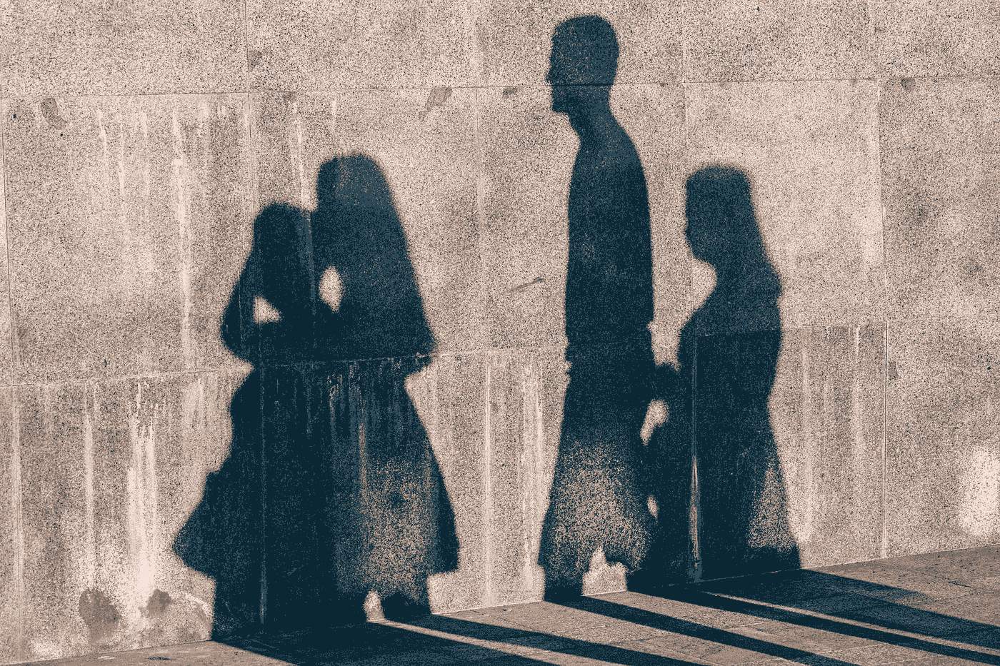
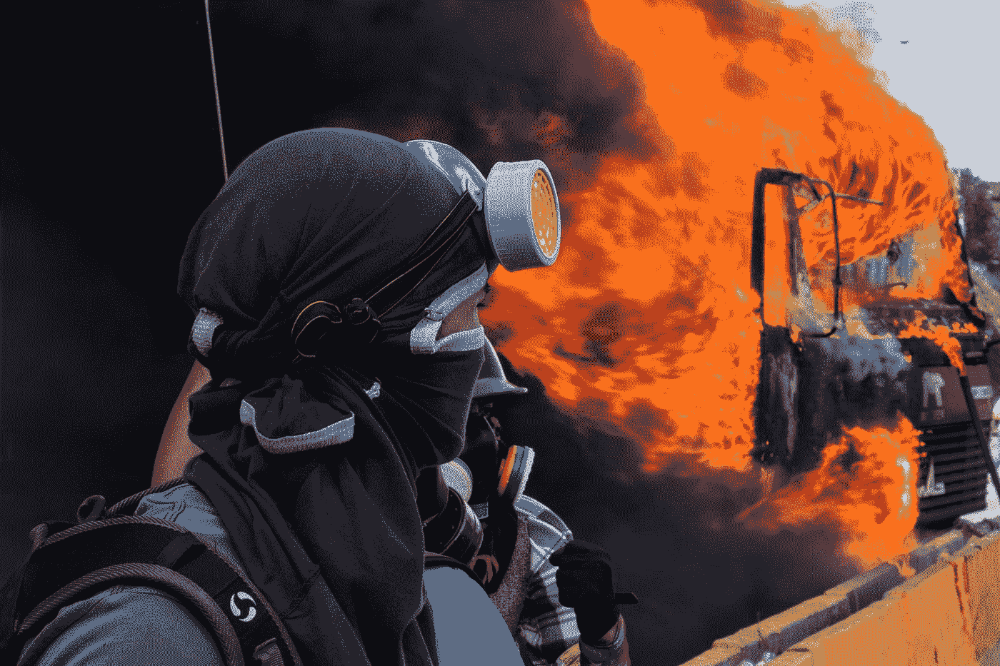
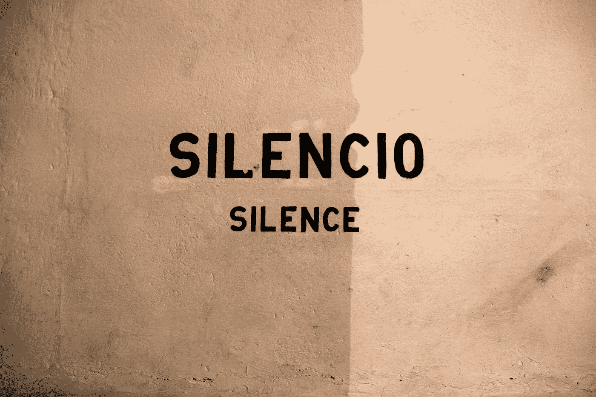

# 比特币是抵御灾难的保险

> 原文：<https://medium.com/coinmonks/bitcoin-as-insurance-against-disaster-a0ca7827ff79?source=collection_archive---------6----------------------->

Photo by [Fancycrave](https://unsplash.com/@fancycrave?utm_source=medium&utm_medium=referral) on [Unsplash](https://unsplash.com?utm_source=medium&utm_medium=referral)

我们生活在一个日益全球化的世界，但大多数人仍然与他们的居住国有着千丝万缕的联系。个人对变幻莫测的政府、经济和更广泛的社会的依赖是一种风险。比特币，或复制其无许可、可转让和有价值功能的东西，可以帮助减少这种依赖。

**防灾保护**

在最极端的情况下，有许多历史先例表明，政治环境变化如此之快，以至于必须立即逃离自己的国家。根据联合国难民署的数据，T2 的难民人数达到创纪录的 6850 万人，每天有 44400 人因冲突而逃离家园。当他们离开时，他们通常只带走他们能携带的东西。

这不是一个新问题。许多人可能认为旧帝国是缓慢发展的事务，但它们以惊人的速度造成了大规模的流离失所。例如，罗马帝国(在和平时期和战争时期，它自己也强行将数百万人迁移到自己的领土上)目睹了匈奴人在短短四年内从巴尔干半岛的胜利一路走向对高卢(现代法国)的入侵。

今天的世界更加安定，但在不到一个世纪的时间里，欧洲数百万人逃离家园，或成为各种可恶的国家政策或全面战争的受害者。许多在 20 世纪 30-40 年代遭受苦难的人从未被允许返回家园，冲突期间国界不断变化。即使他们被允许返回，他们的财富也会在他们不在时被没收或销毁。

没有人应该有任何信心，我们已经过去了这样的事件。90 年代，数十万人被迫逃离科索沃，而卢旺达冲突迫使 200 多万人离开这个国家。此外，目前 60 万罗辛亚人和数百万叙利亚难民要么在国内流离失所，要么在国外寻求庇护。

在这种情况下，逃离你的家是必要的，房地产，贵金属，艺术品，汽车或银行账户可能是无用的。这些资产要么是你无法携带的，要么会被你要逃离的国家或你要进入的国家没收。最富有的人可能会没事；他们有能力将投资转移到国外，并购买援助。但是一般人都会纠结。银行提款可以随时停止。如果你的银行今天倒闭，你能立即带走多少钱？事实上，考虑到目前普通人拥有的储蓄很少，一旦排除信贷，你在银行里还有多少存款？

比特币提供了安全、轻松且无需许可的财富转移能力，这是历史上任何其他工具都无法比拟的能力。强迫流离失所意味着从头开始。比特币可以提供缓刑。

当然，目前的问题是，那些最需要能够将它用于这些目的的人首先无法获得或负担得起它，而西方人可能认为这种情况不太可能降临到他们身上。我们在很大程度上习惯于和平，而不是战争。定居，而不是流离失所。

例如，英国人或美国人的平均寿命是 80 岁。在这样的时间范围内，情况可能会迅速变化；我们距离第二次世界大战不到 80 年。到 2099 年，如果至少有一个我们目前认为“发达”和“安全”的国家*没有发生迫使部分人口逃离的冲突，这是极不可能的。即使在你的有生之年不会发生，在你的孩子或他们的孩子的一生中不会发生的几率有多大？保本应该考虑多代人。*

Photo by [🐣 Luca Iaconelli 🦊](https://unsplash.com/@luxdamore?utm_source=medium&utm_medium=referral) on [Unsplash](https://unsplash.com?utm_source=medium&utm_medium=referral)

**防范局部不稳定的保险**

除了战争，政府或经济运动还有很多方式可以影响财富储存的能力。全球金融危机摧毁了许多人的储蓄和他们持有的资产，尤其是房地产。GFC，很像第二次世界大战，发生了暴乱。当*的一切*都被摧毁时，除了遵循明智的财务和投资建议，你没有太多办法保护自己。

相反，目标应该是尽可能地限制对局部风险的依赖。当这个国家决定投票脱离欧盟时，我相对于其他国家的赚钱能力一夜之间遭受了 10%以上的打击。10%，因为一个意想不到的投票。英国退出欧盟的意外(以及随后的美国大选)突显出，大多数人缺乏预测一个国家近期会发生什么的能力，更不用说预测几十年后的情况了。明智的做法是尽可能减少对居住地的依赖，投资于一篮子国家和货币。

比特币可以在这个篮子中发挥作用，因为它比其他资产更适合防止没收。它是为数不多的未经许可就不能轻易拿走的资产之一，可以被隐藏起来，而且如前所述，可以被跨境拿走。很少有塞浦路斯人会想到他们在金融危机后接受的“剃头”是可能的，直到他们醒来发现自己的钱被冻结了，资本管制被强制执行。很少有委内瑞拉人能够预料到本国货币暴跌的深度以及随后对外汇的限制。在这种情况下，仅仅持有少量比特币就可以成为救命稻草。

这听起来可能有些极端，但在足够长的时间内，为所有可能发生的事情做好准备是明智的。通常在最需要资产的时候，它们最难获得。

Photo by [Andrés Gerlotti](https://unsplash.com/@agerlotti?utm_source=medium&utm_medium=referral) on [Unsplash](https://unsplash.com?utm_source=medium&utm_medium=referral)

**抵制审查的工具**

货币在很大程度上并不是追踪用户或阻止人们使用它的有效工具。向经许可的数字货币的转变实现了这一功能，限制“坏人”不受惩罚地运作的政治和监管举措也实现了这一功能。因此，金钱现在是一种手段，通过它人们可以被压抑。

矛盾的是，当只有银行阻止未经批准的个人时，人们就没那么担心了。直到不久前，大多数银行还没有能力阻止一个意志坚定的人在它们那里开户；其他人缺乏强制执行的意愿。然而，今天支付处理器可以被用来阻止基于互联网的平台，这些平台是现代社会中发生的越来越多的主观原因所不可或缺的。维基解密的例子，突然发现自己无法收到付款，是大多数实体如何容易受到孤立的早期例子。

我不反对私营公司拒绝为某些客户服务，但我反对私营公司在政府的强迫或压力下，拒绝为明确旨在阻止该组织运作的组织服务。有不同政治信仰的人或像维基解密这样的网站不应该被一些害怕负面新闻的支付处理者关闭，或者因为他们受到政府的压力而关闭。

政府总是做出不合逻辑或糟糕的决定，而支付处理商则受制于市场压力，这使得他们支持特定客户无利可图。在足够长的一段时间内，你不知道政府可能会试图阻止什么商品、服务或人员，也不知道什么意识形态可能会突然证明对支付处理商是“危险的”。集中支付天生会受到人为的干扰。世界人口的很大一部分已经生活在专制政权之下。

Photo by [Scott Umstattd](https://unsplash.com/@scott_umstattd?utm_source=medium&utm_medium=referral) on [Unsplash](https://unsplash.com?utm_source=medium&utm_medium=referral)

**一种自我保护的手段**

以上大部分听起来很激烈，但人们往往会忘记人类文明在其存在的大部分时间里是多么不稳定。从足够长的时间来看，认为灾难“永远不会发生在我身上”是不负责任的。这是可能发生的，已经发生了，还会再次发生。比特币可以为那些最脆弱的人提供保护自己的手段。

**全揭**[此处](https://flatoutcrypto.com/about) **。关注我**[**@ flatoucrypto**](https://twitter.com/flatoutcrypto)

> [直接在您的收件箱中获得最佳软件交易](https://coincodecap.com/?utm_source=coinmonks)

