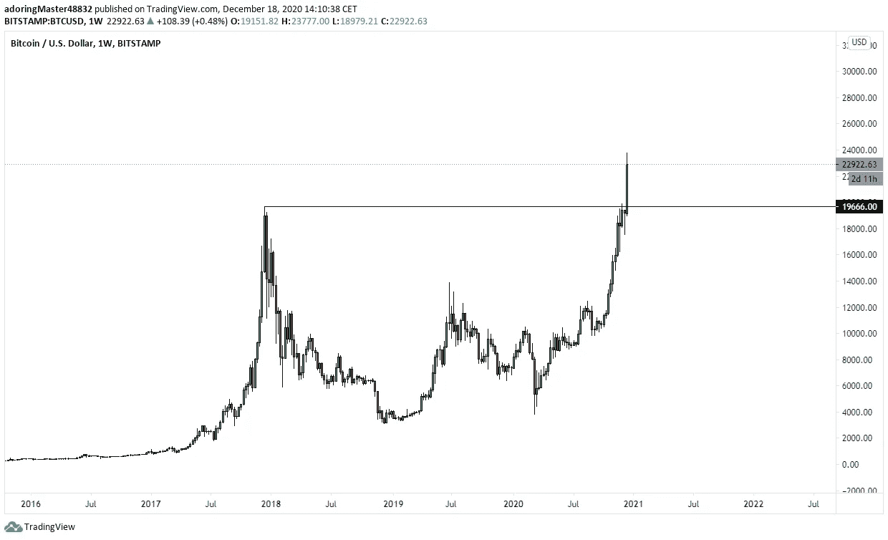

# 比特币 ATH 和下一步行动

> 原文：<https://medium.com/coinmonks/bitcoin-ath-and-next-moves-78ef19ba66f3?source=collection_archive---------1----------------------->

## 第三次才是对的！经过 3 年的漫长等待，在熊市到牛市的市场周期中切换，比特币终于突破了 19900 美元/20000 美元的阻力，达到新高，并探索新的价格范式。

BTC/USD chart