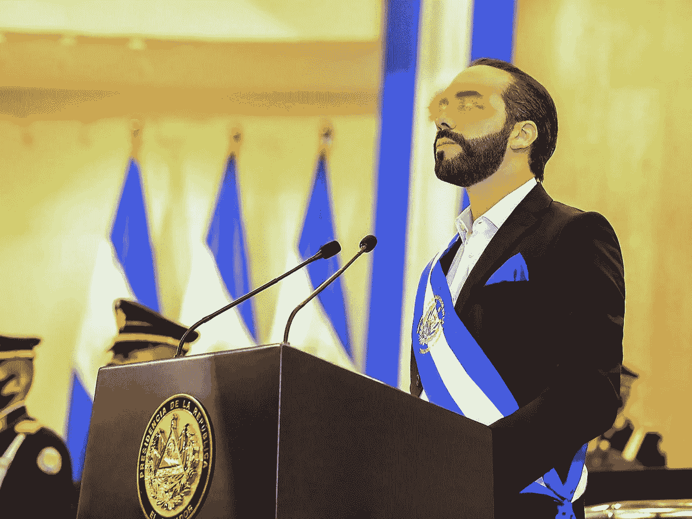

# 超越萨尔瓦多的比特币:挑战与机遇

> 原文：<https://medium.com/coinmonks/bitcoin-beyond-el-salvador-the-challenge-and-the-opportunities-a86b4fc49cd8?source=collection_archive---------4----------------------->

2021 年 6 月 5 日无疑将成为加密货币和全人类历史上的一个日期:萨尔瓦多总统在迈阿密比特币大会期间宣布，他将提出一项法律，使比特币与美元一起成为该国的法定货币。“下周，我将向国会提交一项法案，使比特币成为合法货币，”布克勒说…