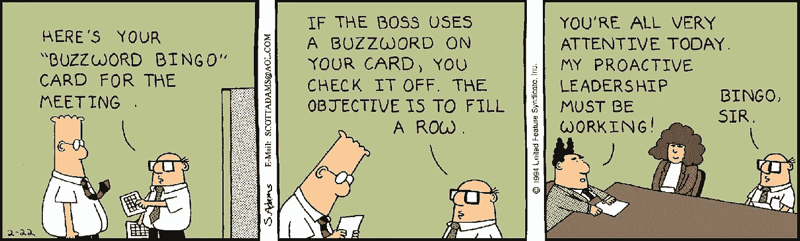

# 比特币？区块链？流行词宾果。

> 原文：<https://medium.com/coinmonks/bitcoin-blockchain-buzzword-bingo-1b6abbf0f1b4?source=collection_archive---------3----------------------->

Scott Adams, Dilbert

我参加了一个旧工作的会议，讨论在我们的软件产品中加入一个新特性的可行性。在讨论了该功能将如何帮助我们的产品，以及它对我们的市场影响意味着什么之后，一位销售团队成员大声说道:“听起来不错！我们有没有办法在那里使用机器学习？”

讨论中的功能将在一个运行在嵌入式计算机上的产品中实现，基本上只是一个微控制器(想想电视遥控器或恒温器)。关键是，在这种情况下，机器学习绝对不可能有所帮助。

我并不是想指责销售团队不理解软件工程，我只是想说明一点，那就是任何站在业务一边的人都喜欢使用热门时髦的新词。当谈到我们如何投资自己的钱或自己的时间时，意识到目前什么被过度炒作是有好处的。

# 比特币不是区块链

我将把重点放在一个非常具体的例子上，即市场炒作出了问题。在过去的十年里，比特币已经从一个软件爱好者从事的小项目发展成为一个不断发展的全球经济体系。许多人自然一直致力于在空间中获利，我不怪他们。我只需要指出很多公司试图传播的谬论，*“比特币正在消亡，区块链才是未来。”*

我相信大多数传播这种宣传的人试图声称，因为比特币是旧软件，自然是时候用新的东西取代它了。就在我们说话的时候，一些新的东西可能正在被他们的公司或赞助商秘密开发。比特币是我迄今为止听说的区块链的最佳用例，而且不仅仅是一点点。我想我还没听说过另一个好主意。(以太坊很有趣，但我并不完全信服)

# 不分散？没意思。

任何加密货币之所以有用，是因为它是去中心化的。如果不是，那么它只是另一个 PayPal 或 Venmo。加密的全部意义在于强化一个理念，即任何政府、个人或实体都无法控制货币。

密码不仅仅需要在网络中分散。他们的发展必须是分散的(尽可能多)。如果一家公司关起门来开发一种加密货币，没有人可以审查代码或做出贡献，那就赶紧跑。

# 开源软件发展缓慢

好的开源开发的缺点是，它都是通过在线协作完成的，很少有人交互或管理结构。这意味着开发时间可能会很长。幸运的是，因为有这么多的眼睛可以看到代码，所以代码的错误要少得多，在架构上也更合理。

Linux

MySQL

Apache

如果你需要例子，看看像 Linux、MySQL 和 Apache 这样的项目。大部分互联网都是使用这些技术运行的！他们之所以被信任，是因为人们可以审查和接触他们。当出现问题时，开发人员不需要打电话给客服，他们可以直接去解决问题。

# 区块链烂透了

好吧，也许这有点苛刻。区块链很可能最终会有几个杀手级用例。我相信最大的一个将是货币，很可能是比特币。

区块链很烂，因为它很少有好的用例。以下是区块链优点的简要概述:

**优点**

*   **抵制审查**——除非持有私人钥匙，否则不能被破坏
*   **分散式** —数据存储在许多设备上，不受同一实体的控制

大概就是这样。不是一个很长的列表，对吗？如果这两个属性在一项技术中不是必需的，那么**没有理由**使用区块链。

**缺点**

*   **慢** —数据需要全网校验。这需要一段时间。这就是为什么比特币遇到了严重的扩展问题，需要复杂的(闪电网络)或硬件密集型(大块)解决方案来解决。
*   **Fat** —在典型的数据库中，数据库管理员尽最大努力确保数据只存储一次(然后可能会进行一两次备份)。区块链将所有数据存储在网络中的每台设备上，这是出于必要。
*   **能源之猪**——比特币网络目前消耗的能量大约相当于智利整个国家的能量。我不认为这是一个大问题，因为我们最终可以用比特币取代所有的菲亚特系统，但不是每个系统都需要这样！[https://digiconomist.net/bitcoin-energy-consumption](https://digiconomist.net/bitcoin-energy-consumption)
*   **复杂** —使用区块链作为数据存储的编程比像典型的数据库系统那样将数据存储到硬盘上要复杂得多。这引入了疯狂的开发开销和技术债务。

我不是说不要花时间研究区块链。请吧。我只是想鼓励业余爱好者或投资者不要被*“区块链好，比特币坏”*的预言所愚弄。唯一这样说的人是那些不真正理解它如何运作的人，或者那些积极试图利用市场获利的人。

祝你好运，我一直在学习，所以请在下面评论你的问题或担忧！

# 捐赠

BTC:BC 1 qvw 0 ytfntx 6 zs 0 lfs ruem 6 xwj 0 mewng 523 ktatp

ETH:0x3d 737324 ed 6 AC 204 a 809d 17 BC 4807 c 6 D2 a 05d 6 ed

BCH:qz 5j 4 ypu 4 wf 2 x 3960 elyxz 4 vk 0 z 2 p 9 lag FH 52 xq 59

nano:xrb _ 1 IPD MX 5 CK 6 fw C1 hkt 3 fg 631 z 6 tw jo 9 e 5m 6 e 9 db enm 65 sb B3 e 4 HGM D1 ygxnq 3

# 来源

https://www . lullabot . com/articles/new-and-shiny-vs-good-old-software