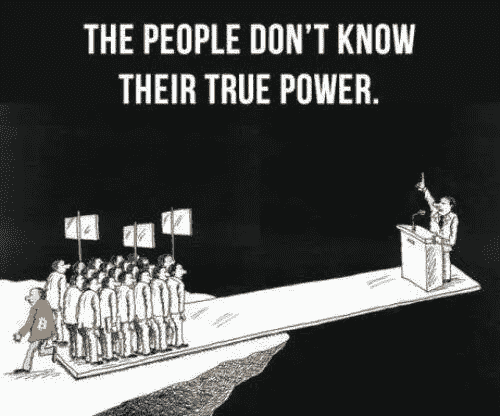

# 比特币破 3.8 万美元，你在考虑买吗？

> 原文：<https://medium.com/coinmonks/bitcoin-broke-38-000-are-you-thinking-of-buying-7c8f0f69949a?source=collection_archive---------5----------------------->

[Source](https://www.reddit.com/r/Bitcoin/comments/kry3r9/had_enough_yet_withdraw_your_consent_use_bitcoin/)

难以置信的比特币破 38000 美元！你现在还持有一些比特币，还是打算购买一些 BTC？

我知道你在担心什么，你害怕一旦你现在买了 BTC 就会亏损，你也不想错过一旦 BTC 继续加油的机会！

> BTC 上的🗣Laddering 买卖对你来说是个不错的选择。

您可以下达许多 BTC 买卖订单。一旦价格上涨，你可以卖出一些 BTC 来赚取一些利润，一旦下跌，你可以买入一些 BTC 来降低平均成本。

> 你可以阅读[这篇文章](/coinmonks/gain-112-profits-the-best-btc-trading-strategy-helps-you-avoid-the-most-emotional-common-28046be31138)了解更多详情。如果您有任何问题，请加入我们的[电报组](https://t.me/joinchat/EPmjKpNYwRMsBI4p)。