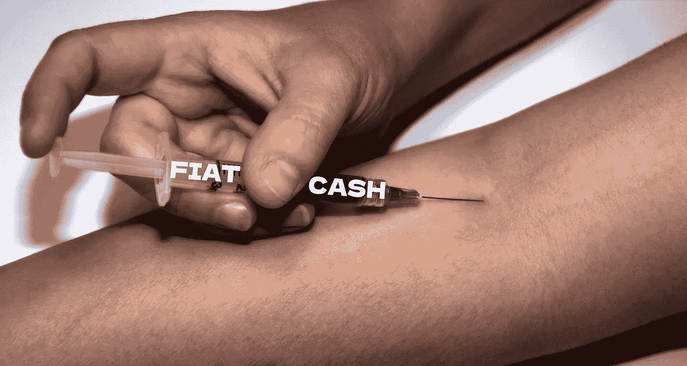

# 比特币可以帮助你戒掉毒瘾

> 原文：<https://medium.com/coinmonks/bitcoin-can-help-you-beat-your-addiction-55800015e538?source=collection_archive---------10----------------------->

## 理解时间偏好和硬钱是关键

与普遍的看法相反，加密货币不仅用于购买毒品；下面的推文讲述了另一个故事。这些人戒了毒，是因为比特币出现在了他们的生活中。

Source: Twitter screenshots | Edit: Cryptic Liberation

## 那么比特币是怎么做到的呢！？

要理解这一点，必须探究两个关键概念。这些都是时间偏好和辛苦钱。

**什么是时间偏好？**

> “时间的稀缺迫使人类在一生中的所有时刻都要在各种选择之间做出选择。每一个决定都是以另一个机会为代价的。”Saifedean Ammous 博士

没有人能选择他们想要多少时间。买卖时间根本不是一个选项。然而，对我们来说，有些时间似乎比其他时间更有价值。离我们最近的时间段似乎比另一个遥远的未来更重要。

时间偏好越高，对未来的重视程度越低。相反，它越低，当前的决策及其对未来的影响就越重要。

瘾君子对时间的偏好高得离谱。瘾君子对他们的未来看不到太多希望，所以所有的偏好都给了当下。甚至上一笔钱都花在了下一次修复上。

因为未来的生存无法保证，所以现在的需求总是优先于未来的需求。例如，解决饥饿感(或退缩)比解决预期的未来饥饿更重要。

在一个先进的社会，时间偏好降低是因为获得了能保证生存的商品。比如房子，工作，冰箱，汽车，保暖的衣服。

这就是为什么金钱是降低时间偏好的重要工具。我们可以保存它，因为它让我们能够提供未来所需的东西。

> “随着时间偏好下降，资本积累增加，生产率提高，收入增加，时间偏好进一步下降”。Saifedean Ammous 博士

这是一个积极向上的螺旋。这就是我们应该致力于减少焦虑，增加日常生活中的存在感。

这使我们能够自由地生活，探索我们的潜力，并作为个体发展。

## **比特币如何降低时间偏好**

**硬通货与软通货**

我们所知道的最硬的货币是黄金，至少曾经是。它很难生产，它保持它的价值。

软货币容易引发通货膨胀。以前的货币，就像贝壳一样，在科技使得大量获取变得容易时，就失去了所有的价值。

金本位制非常重要，因为只有在黄金的支持下，货币才能被印刷出来。这给了人们省钱的动力。不幸的是，随着它的取消，货币大幅贬值，失去了过去的购买力。

黄金供应量每年增加约 2%，而法定货币最多膨胀约 7%。

通常情况下，菲亚特的供应量每年增长 10%以上，当恶性通货膨胀来袭时，它会彻底摧毁购买力。这导致了更高的时间偏好，造成了社会的普遍衰落。随着生存模式取而代之，以前持有的价值观和道德准则失效了。

黎巴嫩、委内瑞拉、津巴布韦和其他国家在过去已经看到了这一点。

消费者在月初跑去购买食品杂货，因为他们的货币在月底会变得一文不值！

> "在恶性通货膨胀的经济体中，果树在冬天被砍倒当柴烧。"Saifedean Ammous 博士

比特币恢复了为未来储蓄的激励，因为它保持了购买力，并随着时间的推移而增加。变得优秀、提前计划和延迟满足的动机增加了。随着储蓄再次变得有利可图，吸毒或贩毒变得不再那么有吸引力。

## **为什么通货膨胀？为什么没有金本位制？**

人民财富的增加使得人口繁荣。因此，我们可以创业，提高生产力，追寻我们的梦想，不仅对世界产生影响，甚至改变世界。

人类历史上没有哪个政治精英真正关心过普通人。对他们来说，我们是牛。

农民最不希望的事情就是他的动物开始改变他作为国王的农场周围的事情。

你明白了。让人民保持贫困就是确保现有的权力结构保持不变。

富裕的人口变得太有创造力，对控制太挑剔，因为他们有时间考虑除了生存以外的其他事情。

从本质上讲，精英们按下印刷按钮，就可以随意膨胀容易引发通胀的中央集权货币。

人为的通货膨胀等于抢劫，让精英阶层无异于小罪犯。或者穿着西装的高度老练的暴徒。

你同意吗？

## 结论

*   获得硬钱减少了时间偏好。
*   硬通货的例子有黄金和比特币。
*   软货币的例子是失去所有价值的贝壳和石灰石。
*   较低的时间偏好导致更文明的行为，并能激励上瘾者戒烟。
*   通货膨胀总是导致更高的时间偏好，因为它使所有货币贬值。
*   黄金的通货膨胀率很低。比特币不受通胀影响。

感谢大家的阅读和鼓掌！你可以通过[给我买杯咖啡](https://ko-fi.com/denniswestphal)让我继续写作。

另请阅读:[这就是银行扣押你的钱作为人质的方式，以及该如何应对。](/coinmonks/banks-are-holding-your-money-hostage-87b8ef14dd04)

如果您想要无限制地访问所有媒体内容，请随意[使用我的附属链接](/@crypticliberation/membership)。每月 5 美元，我会收到一半。

你也可以[在推特](https://twitter.com/Cryptoliberator)上关注我或者在[电报](https://t.me/Mannish_Boy)上联系我……

万事如意！

> 加入 Coinmonks [电报频道](https://t.me/coincodecap)和 [Youtube 频道](https://www.youtube.com/c/coinmonks/videos)了解加密交易和投资

## 也阅读

 [## 杠杆代币[多头代币]终极指南

### 杠杆化令牌是具有杠杆化风险敞口的 ERC20 令牌，不考虑保证金、要求、管理…

medium.com](/coinmonks/leveraged-token-3f5257808b22)  [## 最佳加密交易所| 2021 年十大加密货币交易所

### 加密货币交易所的加密交易需要了解市场，这可以帮助你获得利润。之前…

blog.coincodecap.com](https://blog.coincodecap.com/crypto-exchange)  [## 2021 年最佳加密借贷平台| 6 大比特币借贷平台

### 获得比特币和其他加密货币的最佳贷款利率

medium.com](/coinmonks/top-5-crypto-lending-platforms-in-2020-that-you-need-to-know-a1b675cec3fa)  [## 2021 年最佳免费加密交易机器人

### 2021 年币安、比特币基地、库币和其他密码交易所的最佳密码交易机器人。四进制，位间隙…

medium.com](/coinmonks/crypto-trading-bot-c2ffce8acb2a)  [## 最佳 4 个加密交易信号电报通道

### 这是乏味的找到正确的加密交易信号提供商。因此，在本文中，我们将讨论最好的…

medium.com](/coinmonks/best-crypto-signals-telegram-5785cdbc4b2b)  [## 5 个最佳社交交易平台[2021] | CoinCodeCap

### 困惑于社交交易和副本交易哪个平台最好？本文将带您了解各种…

blog.coincodecap.com](https://blog.coincodecap.com/best-social-trading-platforms)  [## BlockFi 评论 2021:利弊和利率| CoinCodeCap

### 今天，我们提出了一个全面的 BlockFi 评论，这是一个成立于 2017 年的加密贷款平台，拥有其…

blog.coincodecap.com](https://blog.coincodecap.com/blockfi-review)  [## 如何在印度购买比特币？2021 年购买比特币的 7 款最佳应用[手机版]

### 如何使用移动应用程序购买比特币印度

medium.com](/coinmonks/buy-bitcoin-in-india-feb50ddfef94)  [## 加密税务软件——五大最佳比特币税务计算器[2021]

### 不管你是刚接触加密还是已经在这个领域呆了一段时间，你都需要交税。

medium.com](/coinmonks/best-crypto-tax-tool-for-my-money-72d4b430816b)  [## 存储比特币的最佳加密硬件钱包[2021] | CoinCodeCap

### 编辑描述

blog.coincodecap.com](https://blog.coincodecap.com/best-hardware-wallet-bitcoin)  [## Pionex 评论 2021 |免费加密交易机器人和交换

### Pionex 是为交易自动化提供工具的后起之秀。Pionex 上提供了 9 个加密交易机器人…

medium.com](/coinmonks/pionex-review-exchange-with-crypto-trading-bot-1e459d0191ea)