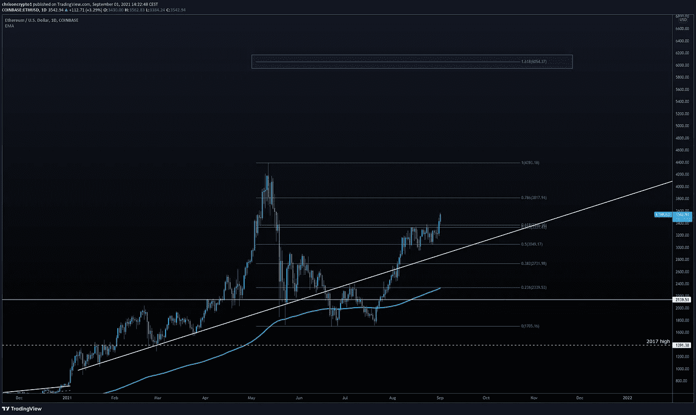
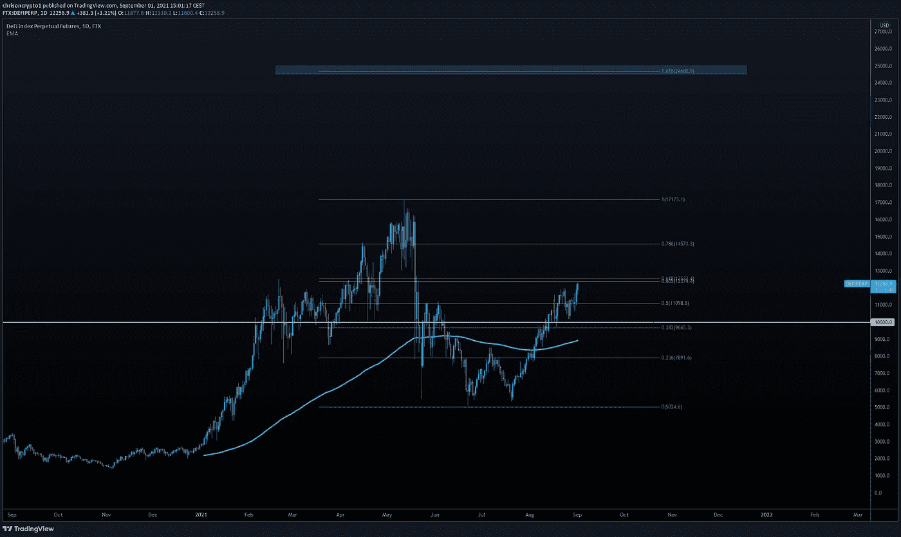

# 比特币产生的资金比国际货币基金组织保持偿付能力的时间还要长

> 原文：<https://medium.com/coinmonks/bitcoin-can-produce-blocks-longer-than-the-imf-can-remain-solvent-b22ebf69bf9f?source=collection_archive---------4----------------------->

令国际货币基金组织(IMF)不快的是，萨尔瓦多雷选择了比特币，而不是从国际企业集团那里获得繁琐的敲诈性贷款。与此同时，随着比特币在 50，000 美元关口附近停滞不前，替代币已经蓬勃发展。国王加密会跟随以太坊达到新的局部高点还是比特币会破坏聚会？

咱们挖吧。

## 国际货币基金组织警告不要将密码作为法定货币

国际货币基金组织(IMF)警告称，比特币和[莱特币](https://chrisoncrypto.com/blog/f/litecoin-eyes-220-after-promising-rebound)等加密货币是私人发行的资产，充满风险。

国际货币基金组织指出，广泛使用加密技术将威胁“宏观经济稳定”，并可能损害金融完整性。然而，就传统金融而言，不清楚该机构指的是哪种诚信。国际货币基金组织是在谈论由美联储和欧洲中央银行进行的回购操作吗？

**查看** [全文点击这里](https://chrisoncrypto.com/blog/f/imf-warns-against-crypto-as-legal-tender-fearing-the-worst) **！**

# 技术上来说

## 比特币获利回吐被市场吸收？

比特币大约在 5 万美元以下，考验着大家的耐心。目前，市场的注意力和资本正流向其他地方，但这可能会在某个时候迅速改变。

BTC/美元在 49，000 美元阻力和 46，000 美元支撑位之间徘徊。在周一的新闻简报中，我们报道了关注价格标签是否打破的兴趣水平。

尽管需要谨慎，但 BTC/美元最近表现落后，被以太坊的强劲买盘勉强拉高。如果 50，000 美元被清除，天空是蓝色的，直到. 786 纤维 57，000 美元。

到那时，谁也说不准短期内会发生什么。在我看来，随着价格接近历史高点，我们应该预料到流动性紧张。

## 以太坊爆发

ETH/USD 正在运行。在撰写本文时，乙醚已经取得了更高的高点 3560 美元以上，并似乎达到新的历史高点。

最后一个顶部阻力位于 3800 美元。除此之外，ETH/USD 的天空是蓝色的，等待下一次大的地毯拉。

以太坊可以说有自己的故事和催化剂来推动这次反弹。它是 NFT 泡沫的主要受益者，记录了更高的连锁活动，这反过来又增加了因 [EIP-1559](https://chrisoncrypto.com/blog/f/ethereum-developers-defend-popular-eip-1559-upgrade) 造成的费用消耗。

这是一个合理的说法，要记住，超越并不一定意味着脱钩。如果 BTC/美元以任何有意义的方式回撤，乙醚几乎肯定会被拖累。

尽管如此，仍有理由保持乐观，因为上次 ETH/USD 表现优于 BTC/USD 导致 altcoin 全面上涨(直到 BTC 崩溃)。

看起来，市场将再次与某些另类投资者玩音乐椅游戏，每个人都在主要的水泵上尝试，直到资本流向下一个被炒作的资产。

## DeFi 指数显示实力

与此同时， [FTX](https://ftx.com/#a=13411220) DeFi 指数在突破 10，000 美元后也表现强劲。

您可以在此查看指数[的计算和权重。](https://ftx.com/#a=13411220)

假设比特币不会爆炸，那么 12400 美元(. 618)之后的下一个阻力位将停留在 14500 美元(. 786 fib)。正如[电报频道](https://t.me/chrisoncryptochannel)所指出的，一些已经成为这些市场条件受益者的替代币包括 XMR/USD、COMP/USD、AAVE/USD 和许多其他货币，如 Solana。像莱特币这样的恐龙币也提供了有利可图的机会，目前还在以慢动作继续上演。任何人都不会对年底前 1000 美元的长期贷款感到意外。

也就是说，如果比特币崩溃，这场派对可能会嘎然而止。在比特币突破 50，000 美元之前，这种系统性风险不能被低估，拥有资金投入抛售从来都不是一个坏策略。

公牛领路。

回头见。

**加入** [电报](https://t.me/chrisoncryptochannel) **频道，实时更新&设置！
关注我** [推特](https://twitter.com/ChrisOnCrypto1) **&** [多嘴多舌](https://gab.com/chrisoncrypto) **下面还有我的社交门户。**

[https://www.paypal.com/donate?hosted_button_id=C9VRLGTBHQX2N](https://www.paypal.com/donate?hosted_button_id=C9VRLGTBHQX2N)

# 阅读更多:[国际货币基金组织警告不要将密码作为法定货币，担心出现最坏的情况](https://chrisoncrypto.com/blog/f/imf-warns-against-crypto-as-legal-tender-fearing-the-worst)

[http://www.chrisoncrypto.com/](http://www.chrisoncrypto.com/)

你也可以用比特币支持我！
BTC 地址:**3 eydseypjhn 68 axkncuqbb 7 ebqcxrejamr**

最诚挚的问候，
**克里斯托弗·阿塔尔德**
克里斯对加密的创始人
贡献者[www.cityam.com](https://www.cityam.com)
直接接通:[电报](https://t.me/chrisoncrypto)

*最初发布于*[*https://mailchi . MP*](https://mailchi.mp/3c502c4806b2/bitcoin-can-produce-blocks-longer-than-the-imf-can-remain-solvent?e=[UNIQID])*。*

> 加入 [Coinmonks 电报频道](https://t.me/coincodecap)，了解加密交易和投资

## 另外，阅读

*   [尤霍德勒 vs 考尼洛 vs 霍德诺特](/coinmonks/youhodler-vs-coinloan-vs-hodlnaut-b1050acde55a) | [Cryptohopper vs 哈斯博特](https://blog.coincodecap.com/cryptohopper-vs-haasbot)
*   [币安 vs 北海巨妖](https://blog.coincodecap.com/binance-vs-kraken) | [美元成本平均交易机器人](https://blog.coincodecap.com/pionex-dca-bot)
*   [如何在印度购买比特币？](/coinmonks/buy-bitcoin-in-india-feb50ddfef94) | [WazirX 评论](/coinmonks/wazirx-review-5c811b074f5b) | [BitMEX 评论](https://blog.coincodecap.com/bitmex-review)
*   [比特币主根](https://blog.coincodecap.com/bitcoin-taproot) | [Bitso 评论](https://blog.coincodecap.com/bitso-review) | [排名前 6 的比特币信用卡](/coinmonks/bitcoin-credit-card-bc8ab6f377c6)
*   [如何在 FTX 交易所交易期货](https://blog.coincodecap.com/ftx-futures-trading) | [OKEx vs 币安](https://blog.coincodecap.com/okex-vs-binance)
*   [如何在势不可挡的域名上购买域名？](https://blog.coincodecap.com/buy-domain-on-unstoppable-domains)
*   [印度加密税](https://blog.coincodecap.com/crypto-tax-india) | [金融评论](https://blog.coincodecap.com/altfins-review) | [Prokey 评论](/coinmonks/prokey-review-26611173c13c)
*   [Blockfi vs 比特币基地](https://blog.coincodecap.com/blockfi-vs-coinbase) | [BitKan Review](https://blog.coincodecap.com/bitkan-review) | [币安 Review](/coinmonks/binance-review-ee10d3bf3b6e)