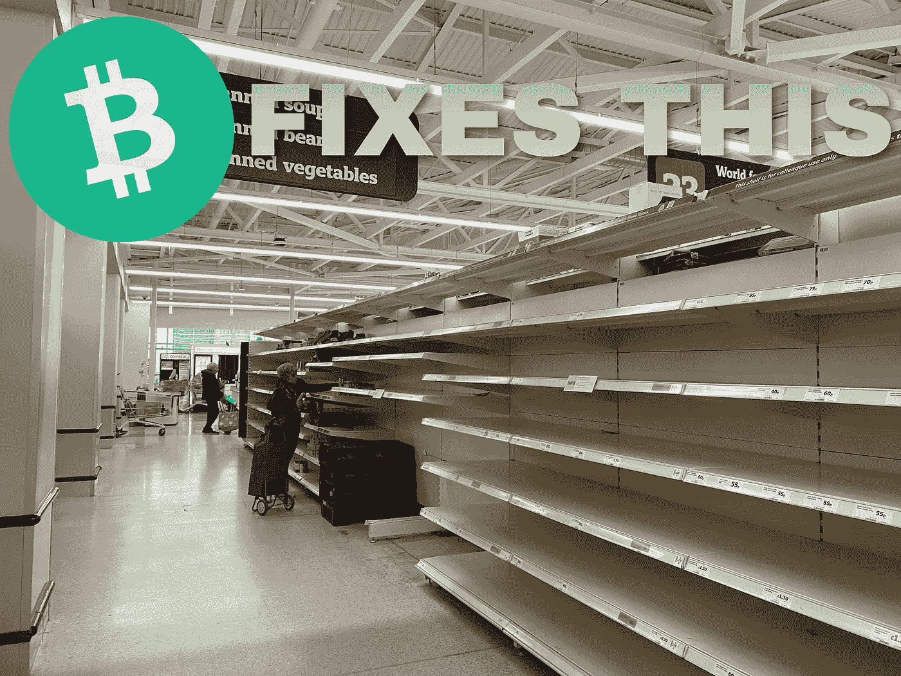
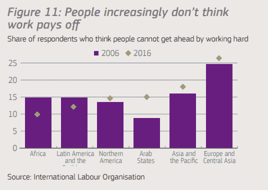
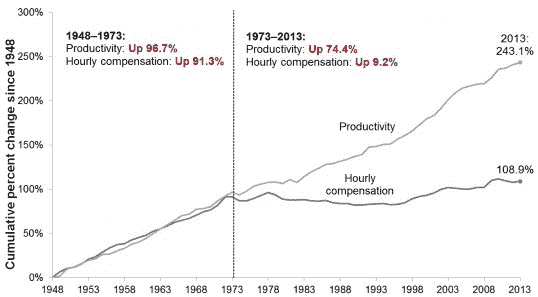
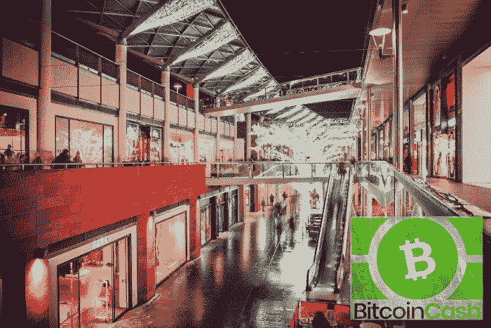

# 比特币现金，滞胀的对冲

> 原文：<https://medium.com/coinmonks/bitcoin-cash-a-hedge-to-stagflation-c6e5aab40eec?source=collection_archive---------10----------------------->

比特币现金的每个人都明白，从长远来看，它有潜力实现伟大。

最初使用比特币并进行 8MB 区块更新(目前区块大小为 32MB)的社区都是早期比特币的采用者和开发者，他们的愿景是让比特币成功成为 **货币**。

**比特币就是金钱**，但是有另外一个团体有着不同的计划。

凭借压倒性的资源和奸诈的策略，这个团队欺骗了公众，让他们认为可伸缩性没有成为极端个人特权的表现重要。

Blockstream 取得了控制权，因为它加强了与 bitcointalk 和 bitcointalk 所有者的“金融”关系。一些人遵循这种方法，而另一部分人决定继续扩大比特币，给我们带来比特币现金。

**如今的比特币现金是有效的比特币。**

在薄薄的面纱和对去中心化损失的模糊争论之下，比特币没有在链上发展，而是私下试图创造不成功的复杂的第二层作为“扩展解决方案”。

短期价格波动意义不大，比特币现金被广泛采用还需要一段时间。

比特币现金的目的是获得广泛采用，但它也包含可以应对各种经济灾难的功能。许多经济学家发现，下一个可能是滞胀。

# 经济的真正危险——滞胀

*Source:* [*Twitter*](https://twitter.com/CNBC/status/1457592991942684672) *(*Stagflation started trending)

公众受够了银行里无休止且不断升级的财富贬值，士气低落。

预计全球失业率将会上升，尤其是如果出现类似 2008 年的衰退。

但是还有另一个事实。公众越来越担心就业没有回报。

[Source](https://espas.secure.europarl.europa.eu/orbis/sites/default/files/generated/document/en/Ideas%20Paper%20Future%20of%20work%20V02.pdf)

## 工资停滞

几十年来工资被压低，收入不平等加剧的结果。工资可能比前几十年更高，但购买力却更低。

[*Source*](https://aflcio.org/sites/default/files/migrate/files/Five-Causes-of-Wage-Stagnation-in-the-United-States.jpg)

生产率提高了，但工资补偿远未达到对员工努力的公平补偿。

这是最近主导西方经济的社团主义的结果，当纳税人被迫为“太大而不能倒”的大型银行和公司的首席执行官的不端行为和财务管理不善买单时，这种影响就会增加。

## 货币需求

如今，公众需要货币的某些特性:

**i)稳定且不膨胀的货币**

**二)资金控制**

像欧元和美元这样的法定货币已经无法维持低水平的通货膨胀。此外，所有经济体的债务都在增加，并引发了对衰退恶性循环的担忧。

## 滞胀

高失业率和高通货膨胀率相结合的经济衰退。最终的经济灾难。衰退可能达到的最坏结果。

然而，公众可以选择对抗这种事件，并进入一个平行的支付网络，一个安全稳定并能为金融崩溃提供庇护的网络。

这是比特币现金。一个强大的 P2P 网络，没有第三方要求，不会受到经济衰退或法定货币通胀的影响。

## 比特币现金是完美的治疗方法

比特币现金所具有的特性，在今天的其他加密货币或普通货币中很少见到。它已经实现了可伸缩性，只需稍加修改就可以在全球范围内采用。它代表了完美的现代数字现金网络，不应该掉以轻心。

*   **快速&可靠，交易成本低**

比特币现金凭借其强大的网络和低廉的即时交易费用(不到 0.01 美元)，在金融不确定性较高的时候，尤其是在经济滞胀的情况下，可能成为一股需要重新认识的力量。

*   **供应有限，稀缺&低通胀**

比特币现金的固定限额是 2100 万枚流通硬币。目前，每年流通的新硬币都是在 1.8%的通胀水平下开采的，而这一通胀水平每四年减半。

任何形式的法定通货膨胀都会立即被比特币现金的流入所抵消。

*   **安全**

比特币现金具有最高的安全性，其网络由哈希力量支持，可以验证挖掘过程中的交易。分散的挖掘过程保护网络免受恶意参与者的攻击，并防止攻击、黑客或破坏。

*   **所有选区的权力下放**

在区块链，权力下放是一项要求，可以带来各种好处。虽然，一些加密货币通过声称去中心化来躲避公众，但有某一方甚至只是几个人控制行动、发展的过程，并在决策过程中操纵共识。

比特币现金基本上是自主的。没有仁慈的独裁者或私人公司来管理发展。那些想要控制网络的人被绝大多数人排除在外，他们以最有利于比特币现金的方式行事。

*   **钱为民所用**

其目的是让比特币现金在全球范围内普及，并从法定货币管理不善的破坏性影响中恢复经济。它是供公众大量使用的资金，而不仅仅是精英阶层在波动中寻找敞口的投资工具。

就在疫情开始的时候，比特币现金及其志愿使命已经帮助了全球数十万人，并通过各种举措提高了采用水平。 **Noise.cash、** **read.cash、**、 **flipstarter** 活动以及各种**入职任务**创造了一个接收**比特币现金自愿捐赠**的整体经济。

## 比特币现金可以减轻经济灾难的影响

高税收和过多的新资金涌入一个经济体将产生破坏性影响，并带来滞胀担忧。

与法币购买力崩溃相对应的是比特币现金。这是一种公众可以以低交易成本(低于 0.01 美元/tx)和闪电般的交易速度使用的货币，有助于简化交易，特别是对于快速消费品行业(即超市、零售商等)。).

最近，许多政府正计划对秘密收入征税，作为寻找弥合政府债务缺口的方法的总体战略。

然而，政府没有意识到一件事。这个概念是要进入一个远离法定奴隶制的现代分散经济。如果对他们的利润征收 20%的税，一些交易者可能会停止交易。然而，向加密货币经济的转型作为一场运动同样强劲。

比特币现金是摆脱菲亚特系统所有弊端的一种简单方法，接受网络不断扩大。

# 结论

*Source:* [*Unsplash*](https://unsplash.com/photos/s9rsYu-BYNo), modified

我预计**主要电子商务运营商**和**多家在线服务**将迅速采用比特币现金进行支付。

这种预期在财务上是准确的，因为比特币现金正在增加其用户基础和交易数量，并在链上采用。

**大型零售商错过了**超过 30 万潜在客户的庞大用户群**。任何首席执行官或分析师都不应忽视这一事实。**

这应该是一个双赢的局面，第一家拥有数百个销售点、采用比特币现金作为支付方式的在线或实体零售商将会捅马蜂窝。

**任何商家都可以直接接受比特币现金，无需第三方或中介。**

不需要二级层或者私人公司，他们分走一部分费用，增加消费品成本。接受比特币现金将降低零售商的成本，提高盈利能力，增加销售，也有助于在一定程度上稳定价格。

今天，所有使用比特币现金的人都很难找到他们所在地的商家、企业、超市和服务机构来消费他们的比特币现金。

如果有零售商接受比特币现金，为什么会有人想使用银行并浪费价值(第三方费用)？

如今，比特币现金的大多数用户决定卖给菲亚特，将资金电汇到他们的银行，这是一个需要几天时间并包括电汇费用的程序，然后用菲亚特购买消费品。

最近情况发生了变化。人们现在为 crypto 工作，他们肯定**也喜欢使用它。我觉得这是值得任何像亚马逊这样的地区性或国际性零售公司考虑的。**

我们今天谈论的是一个真实且不断增长的用户群，尤其是比特币现金。不仅仅是投资者，还有区块链 P2P 支付网络的真正用户。

Follow me on: ● [ReadCash](https://read.cash/@Pantera) ● [NoiseCash](https://noise.cash/u/Pantera99) ● [Medium](/@panterabch) ● [Hive](https://hive.blog/@pantera1) ● [Steemit](https://steemit.com/@pantera1) ●[Vocal](https://vocal.media/authors/pantera) ● [Minds](https://www.minds.com/pantera99/) ● [Twitter](https://twitter.com/Panterabch) ● [LinkedIn](https://www.linkedin.com/in/panterabch/) ● [email](https://read.cash/@Pantera/localcryptos-p2p-exchange-is-now-offering-bitcoin-cash-trading-06637230#bad-link)

**备注:**

> *免责声明:本内容中发布的所有材料均用于娱乐和教育目的，并符合公平使用准则。无意侵犯版权。如果您是或代表本文所用材料的版权所有者，并且对所述材料的使用有疑问，请发送* [*电子邮件*](https://read.cash/@Pantera/cryptouknowns-battlegrounds-the-crypto-battle-royal-part-i-0ca762da#bad-link) *。*

***支持内容创作者。***

如果你喜欢这个故事，就订阅吧！

*原载于*[*https://read . cash*](https://read.cash/@Pantera/bitcoin-cash-a-hedge-to-stagflation-c13c40f8)*。*

> 加入 Coinmonks [电报频道](https://t.me/coincodecap)和 [Youtube 频道](https://www.youtube.com/c/coinmonks/videos)了解加密交易和投资

## 另外，阅读

*   [南非的加密交易所](https://blog.coincodecap.com/crypto-exchanges-in-south-africa) | [BitMEX 加密信号](https://blog.coincodecap.com/bitmex-crypto-signals)
*   [MoonXBT 副本交易](https://blog.coincodecap.com/moonxbt-copy-trading) | [阿联酋的加密钱包](https://blog.coincodecap.com/crypto-wallets-in-uae)
*   [雷米塔诺评论](https://blog.coincodecap.com/remitano-review)|[1 英寸协议指南](https://blog.coincodecap.com/1inch)
*   [MoonXBT vs Bybit vs 币安](https://blog.coincodecap.com/bybit-binance-moonxbt) | [Arbitrum:第二层解决方案](https://blog.coincodecap.com/arbitrum)
*   [买 PancakeSwap(蛋糕)](https://blog.coincodecap.com/buy-pancakeswap)|[matrix export Review](https://blog.coincodecap.com/matrixport-review)
*   [最佳免费加密信号](https://blog.coincodecap.com/free-crypto-signals) | [YoBit 评论](/coinmonks/yobit-review-175464162c62) | [Bitbns 评论](/coinmonks/bitbns-review-38256a07e161)
*   [OKEx 回顾](/coinmonks/okex-review-6b369304110f) | [Kucoin 交易机器人](/coinmonks/kucoin-trading-bot-automate-your-trades-8cf0ca2138e0) | [期货交易机器人](/coinmonks/futures-trading-bots-5a282ccee3f5)
*   [AscendEx Staking](https://blog.coincodecap.com/ascendex-staking)|[Bot Ocean Review](https://blog.coincodecap.com/bot-ocean-review)|[最佳比特币钱包](https://blog.coincodecap.com/bitcoin-wallets-india)
*   [霍比评论](https://blog.coincodecap.com/huobi-review) | [OKEx 保证金交易](https://blog.coincodecap.com/okex-margin-trading) | [期货交易](https://blog.coincodecap.com/futures-trading)
*   [比特币基地赌注](https://blog.coincodecap.com/coinbase-staking) | [Hotbit 评论](/coinmonks/hotbit-review-cd5bec41dafb) | [KuCoin 评论](https://blog.coincodecap.com/kucoin-review)
*   [最佳加密交易信号电报](/coinmonks/best-crypto-signals-telegram-5785cdbc4b2b) | [MoonXBT 评论](/coinmonks/moonxbt-review-6e4ab26d037)