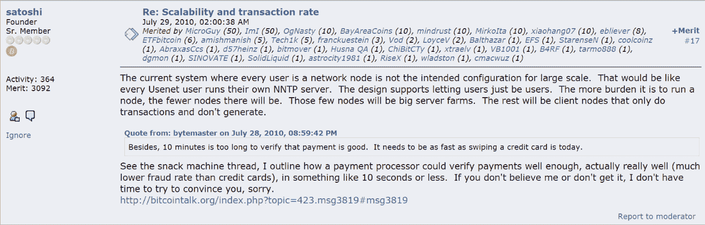

# 比特币现金:排除万难

> 原文：<https://medium.com/coinmonks/bitcoin-cash-against-all-odds-b67ff8c1901b?source=collection_archive---------5----------------------->

*Image from:* [*Pixabay*](https://pixabay.com/photos/sparta-spartan-warrior-soldier-5233217/)*, by* [*EyeShotYou*](https://pixabay.com/users/eyeshotyou-14703491/) *(modified)*

比特币现金在过去的一年里取得了令人兴奋的发展，特别是在与之前的社区处理内部问题后，这些社区离开并创建了 BSV 和 BCHABC(现在的 Ecash)等衍生产品。

在存在的短短四年里，比特币现金经历了两场内战，也失去了一些投资者的支持，这些投资者不得不选择支持哪一方，转而追随 BCH 的福克斯。

然而，这并没有改变什么，比特币克服重重困难，像凤凰一样从灰烬中重生。

***视频演职员表:*** [***比特币现金播客***](https://www.youtube.com/channel/UCsrDsJnHFnkMnJhEslofyPQ) ***(阅读。*现金链接)**

自 2020 年最终分裂以来，比特币(BCH)再次找到了自己的路。它开始了一个重建过程，现在每个人都齐心协力朝着共同的目标前进。在所有支持者的压倒性支持下，比特币现金成为最高效、安全和分散的网络。

# 比特币现金对抗权力、恐吓和压倒性资源

The El Salvador Parliament under Bukele’s administration — [*Source*](https://pbs.twimg.com/media/EtyfYokWYAIKBMX.jpg)

比特币现金社区由高技能、高智商的个人组成，他们有着清晰的愿景，明白区块链的成功至关重要。效率的提高和出现的新机会对于扩大新领域的采用同样重要。

如今，大多数从事比特币现金工作的人都是比特币的早期使用者。这些人不仅关心比特币的价格上涨，还意识到可扩展性问题以及小块如何限制比特币的成功几率。

# 比特币:一种点对点的电子现金系统

*Source* [*Bitcoin.com*](https://www.bitcoin.com/bitcoin.pdf)

这也是 Satoshi 对比特币的设想。成为一种被广泛采用的货币，其规模将达到 Visa/Mastercard 的采用水平。金融中心总是遥不可及，没有可信任的第三方，远离既定金融系统的集中认知。

比特币是关于货币和国家的分离。

自从区块流恶意劫持比特币品牌以来，腐败且即将过时的金融机构找到了新的竞争对手。比特币现金是由早期采用者、开发者和矿工形成的，他们希望看到比特币作为一个强大的支付网络取得成功。

*Source Bitcointalk: “*[*Scalability and transaction rate*](https://bitcointalk.org/index.php?topic=532.msg6306#msg6306)*”*

*Source Bitcointalk: “*[*[PATCH] increase block size limit*](https://bitcointalk.org/index.php?topic=1347.msg15139#msg15139)*”*

*Source Bitcointalk: “*[*[PATCH] increase block size limit*](https://bitcointalk.org/index.php?topic=1347.msg15366#msg15366)*”*

仅仅是几行代码和比特币社区爆发的一场内战就让小型拦截器取得了胜利(与 Satoshi 和比特币早期的大多数人所设想的相反)。

根据 Blockstream，比特币不能在链上扩展。然而，比特币现金证明了这总是一个编造的借口，以削弱比特币，并促进侧链的流动性和 LN(闪电网络)的解决方案。

这是一场漫长的一边倒的辩论，在 2017 年以一把叉子结束，创造了比特币现金。

# 虚伪和信息控制

BTC 社区的一部分只是重复着块状流宣传机器灌输给他们的谎言。Bitcointalk，Bitcoin.org，Cointelegraph，比特币杂志，都在使用操纵策略来审查建设性的批评，只推广来自 BTC 领导层高层的叙述，Blockstream。

当前 BTC 最大主义者社区的一部分人确实相信，Satoshi 的意图不是创造一种数字货币，而是一种数字资产，以对冲通胀、衰退或任何其他经济困难。

Satoshi 确实预见到了这一点，但是是以货币的形式。Satoshi 为所有人创造了比特币，而不仅仅是那些现在已经成长为新 BTC 主义者的基金经理。

比特币允许每个人不受限制地参与。2010 年，当维基解密捅了马蜂窝时，它成了对当权派的威胁。

*Source Bitcointalk: “*[*dfg*](https://bitcointalk.org/index.php?topic=2216.msg29237#msg29237) *— (original post was deleted)”*

Satoshi 希望比特币在被政府标准视为有争议的组织采用之前，能够在当局的监控下存在更多年。然而，维基解密在 2010 年 12 月开始接受比特币，这是比特币发挥作用的第一个证据。这是一种绕过中央金融机构(Visa/Mastercard、银行转账、Paypal)和基金倡议的方法，这些倡议因向世界揭示真相而受到审查和迫害。

比特币成为第一个在线自由市场，当然价格操纵和交易也是该系统的一部分，但大型参与者希望从比特币中获得一些最初无法获得的东西。

*   受管制的环境
*   监管机制
*   KYC/反洗钱合规部
*   审查/限制的能力
*   金融中心将在监管者的监督下履行上述所有职责

这就是比特币被驯服的方式，但也削弱了它的链，失去了使其成为金融颠覆者的基本特征。

## 答案是比特币现金

[*Source*](https://pixabay.com/photos/spartan-army-sun-dusk-roman-3696073/)

比特币现金不遵循基金和银行设定的规则。它不弯腰，不乞求法规，不解散人民。

这是比特币，但不是 Blockstream 想要的。它是最初的比特币，代码发生了变化，Satoshi 和早期采用者希望从比特币中看到这一点。

尽管困难重重，比特币现金正在彻底改变金融系统，增加采用率，并通过最近的侧链开发(SmartBCH)对 Defi 的投资者产生吸引力。

它赋予大众反对腐败和审查的权力，也是金钱和国家分离的唯一希望。它是在链上扩展，产生的第二层不是一个要求，而是一个扩展已经很广阔的视野的附加物。

真正的自由是通过比特币以比特币现金的形式实现的。

比特币是自由，喜欢与否，**比特币现金就是比特币**。

**跟我上:***●*[*read cash*](https://read.cash/@Pantera)*●*[*noise cash*](https://noise.cash/u/Pantera99)*●*[*Medium*](/@panterabch)*●*[*Hive*](https://hive.blog/@pantera1)*●*[*steem it*](https://steemit.com/@pantera1)*●*

如果你喜欢这篇文章，别忘了订阅并点赞！

*最初发布于*[*https://read . cash*](https://read.cash/@Pantera/bitcoin-cash-against-all-odds-c432ddad)*。*

> 加入 Coinmonks [电报频道](https://t.me/coincodecap)和 [Youtube 频道](https://www.youtube.com/c/coinmonks/videos)了解加密交易和投资

## 另外，阅读

*   [网格交易机器人](https://blog.coincodecap.com/grid-trading) | [Cryptohopper 审查](/coinmonks/cryptohopper-review-a388ff5bae88) | [Bexplus 审查](https://blog.coincodecap.com/bexplus-review)
*   [7 个最佳零费用加密交易平台](https://blog.coincodecap.com/zero-fee-crypto-exchanges)
*   [分散交易所](https://blog.coincodecap.com/what-are-decentralized-exchanges) | [比特 FIP](https://blog.coincodecap.com/bitbns-fip)
*   [用信用卡购买密码的 10 个最佳地点](https://blog.coincodecap.com/buy-crypto-with-credit-card)
*   [加密复制交易平台](/coinmonks/top-10-crypto-copy-trading-platforms-for-beginners-d0c37c7d698c) | [如何在 WazirX 上购买比特币](/coinmonks/buy-bitcoin-on-wazirx-2d12b7989af1)
*   [CoinLoan 点评](https://blog.coincodecap.com/coinloan-review)|[Crypto.com 点评](/coinmonks/crypto-com-review-f143dca1f74c) | [火币保证金交易](/coinmonks/huobi-margin-trading-b3b06cdc1519)
*   [Bookmap 评论](https://blog.coincodecap.com/bookmap-review-2021-best-trading-software) | [美国 5 大最佳加密交易所](https://blog.coincodecap.com/crypto-exchange-usa)
*   最佳加密[硬件钱包](/coinmonks/hardware-wallets-dfa1211730c6) | [Bitbns 评论](/coinmonks/bitbns-review-38256a07e161)
*   [新加坡十大最佳加密交易所](https://blog.coincodecap.com/crypto-exchange-in-singapore) | [购买 AXS](https://blog.coincodecap.com/buy-axs-token)
*   [投资印度的最佳加密软件](https://blog.coincodecap.com/best-crypto-to-invest-in-india-in-2021) | [WazirX P2P](https://blog.coincodecap.com/wazirx-p2p)
*   [加拿大最佳加密交易机器人](https://blog.coincodecap.com/5-best-crypto-trading-bots-in-canada) | [库币评论](https://blog.coincodecap.com/kucoin-review)
*   [用于 Huobi 的加密交易信号](https://blog.coincodecap.com/huobi-crypto-trading-signals) | [HitBTC 审查](/coinmonks/hitbtc-review-c5143c5d53c2)
*   [如何在 FTX 交易所交易期货](https://blog.coincodecap.com/ftx-futures-trading) | [OKEx vs 币安](https://blog.coincodecap.com/okex-vs-binance)
*   [OKEx vs KuCoin](https://blog.coincodecap.com/okex-kucoin) | [摄氏替代品](https://blog.coincodecap.com/celsius-alternatives) | [如何购买 VeChain](https://blog.coincodecap.com/buy-vechain)
*   [币安期货交易](https://blog.coincodecap.com/binance-futures-trading)|[3 comas vs Mudrex vs eToro](https://blog.coincodecap.com/mudrex-3commas-etoro)
*   [如何购买 Monero](https://blog.coincodecap.com/buy-monero) | [IDEX 评论](https://blog.coincodecap.com/idex-review) | [BitKan 交易机器人](https://blog.coincodecap.com/bitkan-trading-bot)
*   [尤霍德勒 vs 考尼洛 vs 霍德诺特](/coinmonks/youhodler-vs-coinloan-vs-hodlnaut-b1050acde55a) | [Cryptohopper vs 哈斯博特](https://blog.coincodecap.com/cryptohopper-vs-haasbot)
*   [顶级付费加密货币和区块链课程](https://blog.coincodecap.com/blockchain-courses) | [币安评论](/coinmonks/binance-review-ee10d3bf3b6e)
*   [MXC 交易所评论](/coinmonks/mxc-exchange-review-3af0ec1cba8c) | [Pionex vs 币安](https://blog.coincodecap.com/pionex-vs-binance) | [Pionex 套利机器人](https://blog.coincodecap.com/pionex-arbitrage-bot)
*   [如何在印度购买比特币？](/coinmonks/buy-bitcoin-in-india-feb50ddfef94) | [WazirX 评论](/coinmonks/wazirx-review-5c811b074f5b) | [BitMEX 评论](https://blog.coincodecap.com/bitmex-review)
*   [印度加密交易所](/coinmonks/bitcoin-exchange-in-india-7f1fe79715c9) | [比特币储蓄账户](/coinmonks/bitcoin-savings-account-e65b13f92451)
*   [币安费用](/coinmonks/binance-fees-8588ec17965) | [Botcrypto 审查](/coinmonks/botcrypto-review-2021-build-your-own-trading-bot-coincodecap-6b8332d736c7) | [Hotbit 审查](/coinmonks/hotbit-review-cd5bec41dafb)
*   [我的加密副本交易经验](/coinmonks/my-experience-with-crypto-copy-trading-d6feb2ce3ac5) | [AAX 交易所评论](/coinmonks/aax-exchange-review-2021-67c5ea09330c)
*   [Bybit 融资融券交易](/coinmonks/bybit-margin-trading-e5071676244e) | [币安融资融券交易](/coinmonks/binance-margin-trading-c9eb5e9d2116) | [Overbit 审核](/coinmonks/overbit-review-9446ed4f2188)
*   [有哪些交易信号？](https://blog.coincodecap.com/trading-signal) | [比特斯坦普 vs 比特币基地](https://blog.coincodecap.com/bitstamp-coinbase)
*   [ProfitFarmers 点评](https://blog.coincodecap.com/profitfarmers-review) | [如何使用 Cornix 交易机器人](https://blog.coincodecap.com/cornix-trading-bot)
*   [加密货币储蓄账户](/coinmonks/cryptocurrency-savings-accounts-be3bc0feffbf) | [YoBit 评论](/coinmonks/yobit-review-175464162c62)