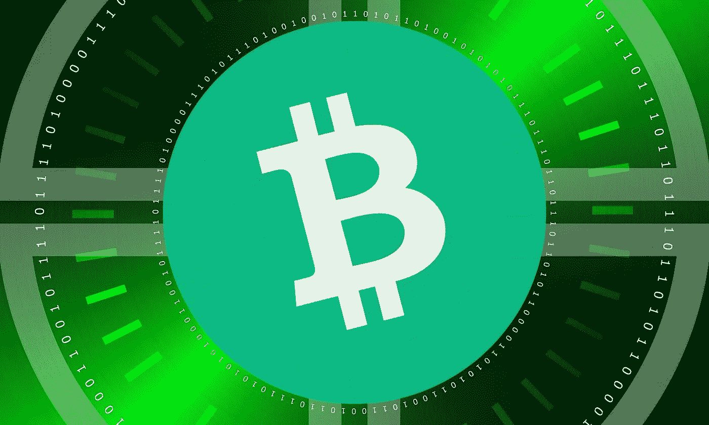
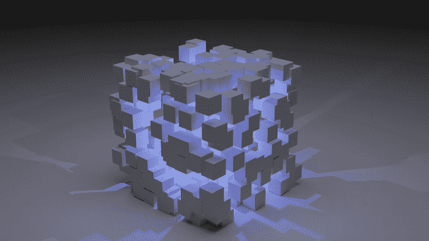

# 比特币现金和现代工业革命

> 原文：<https://medium.com/coinmonks/bitcoin-cash-and-the-modern-industrial-revolution-68e3238f71df?source=collection_archive---------13----------------------->

在这些充满可怕的预测、不确定性和困惑的痛苦时刻，隧道的尽头仍有光明。

这一希望源于技术进步和现代工业和数字革命，它将孕育各种新思想并保持企业家精神，同时改善我们的生活条件、消除贫困并平等地增加全球财富。

二十年前，互联网还不发达。网络泡沫破裂，主流新闻将互联网报道为泡沫。然而，推动进步的是技术、创新和企业家。

一场新的工业革命(第四次)正在开始。这场革命将伴随着各个领域的一系列进步，为我们的经济和生活条件提供巨大的潜力。

区块链网络和比特币现金将在快速经济改革和技术革命的光明未来中发挥作用。

# 第四次工业革命与数字经济

到 2020 年，各种技术将达到预示人类进入现代的程度:

*   高级机器人技术
*   人工智能
*   物联网
*   3D 打印
*   遗传工程
*   虚拟现实/增强现实&元宇宙
*   生物技术与长寿
*   纳米技术
*   区块链网络

所有这些不同的技术不会以同样的速度发展，研究中的困难可能不会帮助它们像预期的那样发展。更多潜在的技术可以出现，并为新的工业革命做出贡献。

# 区块链

[*Source*](https://unsplash.com/photos/UxDU0Gg5pqQ)

区块链是一个公共分类账，加密安全，为金融网络提供了一个消除中介的机会。区块链要求去中心化，否则他们只是运行在服务器上的数据库。分散化为这些网络提供了防篡改能力，并消除了审查制度。集中式区块链具有有限的用例。

从理论上讲，它们在治理中的应用通过提高透明度减少了腐败。虽然，有理由认为一些政府的目的是阻止这一领域的创新。

区块链的广泛能力适用于我们经济和社会的几乎所有宏观经济方面。

## 比特币(BTC)和比特币(BCH)

比特币(BTC)和比特币现金从创世纪区块开始，一直到 2017 年 8 月，共享着相同的比特币历史。

比特币社区在如何对比特币进行缩放的问题上存在分歧，这场辩论导致了 2017 年的分叉。比特币(BTC)的方法不允许可扩展性，但有利于运行在比特币之上的第二层网络(如 LN 和 Liquid)的发展。

比特币现金是遵循比特币白皮书愿景，主要通过增加区块大小(目前为 32MB)来升级比特币的比特币，在去中心化或安全性方面没有任何牺牲。

比特币现金(BCH)是一个可扩展的分散式区块链，旨在满足作为 P2P 电子现金网络的大规模采用。

没有任何一个机构能够控制比特币现金网络或交易，也没有任何第三方参与其中。交易是 P2P 的，即时的(0-conf)，费用很低(通常低于 0.01 美元)。

这是一个具有成本效益的网络，可以在财务上互连所有现有技术，这些技术将需要每天执行数十亿次微交易，因为现代工业自动化了流程。

虽然各种加密货币声称每秒执行数百万次交易，但这些网络总是缺乏分散因素，并且运行在一种不构成安全区块链的方法中。

与其他区块链货币相比，比特币现金在不牺牲分散性和安全性的情况下实现了可扩展性。

## 智能合同

智能合同有望应用于金融和工业活动的所有领域。提供智能合约的平台将在特定标准下被各行业挑选出来，这些标准将推动行业发展，提高生产率，并提供公平的金融环境。

随着技术的飞速发展，做出 10 年的预测是极其困难的。

随着 smartBCH 的发展，比特币现金生态系统已经扩大了它的使用案例，现在已经不仅仅是加密货币的金融方面。

# 最后

[*Source*](https://cdn.pixabay.com/photo/2020/02/03/00/12/fiber-4814456__340.jpg)

技术发展速度很快，很难做出 10 年的预测，并声称某个网络将继续发展并增加其效用。

加密空间是巨大的，有数千种加密货币，然而，在过去的 3-4 年里，我们可以声称**比特币现金**是一个网络**公认的**，它能够以即时的速度提供低成本交易。

除去纯粹的投机，只看基本面和潜力，比特币现金是表现最好的区块链网络。SmartBCH 允许比特币现金进入一个充满现代金融机会的世界。

*在以下网站写作:●*[*read cash*](https://read.cash/@Pantera)*●*[*noise cash*](https://noise.cash/u/Pantera99)*●*[*Medium*](/@panterabch)*●*[*Hive*](https://hive.blog/@pantera1)*●*[*Steemit*](https://steemit.com/@pantera1)*●*[*声乐*](https://vocal.media/authors/pantera)

> **免责声明**:本内容中发布的所有材料均用于娱乐和教育目的，并符合**公平使用**的准则。无意侵犯版权。如果您是或代表本文所用材料的版权所有者，并且对所述材料的使用有疑问，请发送 [**电子邮件**](https://read.cash/@Pantera/cryptouknowns-battlegrounds-the-crypto-battle-royal-part-i-0ca762da#bad-link) 。

***支持内容创作者。***

如果你喜欢这个故事，就订阅吧！

*最初发布于*[*https://read . cash*](https://read.cash/@Pantera/bitcoin-cash-and-the-modern-industrial-revolution-91ab0dd2)*。*

> 加入 Coinmonks [电报频道](https://t.me/coincodecap)和 [Youtube 频道](https://www.youtube.com/c/coinmonks/videos)了解加密交易和投资

## 另外，阅读

*   [最好的卡达诺钱包](https://blog.coincodecap.com/best-cardano-wallets) | [Bingbon 副本交易](https://blog.coincodecap.com/bingbon-copy-trading)
*   [印度最佳 P2P 加密交易所](https://blog.coincodecap.com/p2p-crypto-exchanges-in-india) | [柴犬钱包](https://blog.coincodecap.com/baby-shiba-inu-wallets)
*   [8 大加密附属计划](https://blog.coincodecap.com/crypto-affiliate-programs) | [eToro vs 比特币基地](https://blog.coincodecap.com/etoro-vs-coinbase)
*   [最佳以太坊钱包](https://blog.coincodecap.com/best-ethereum-wallets) | [电报上的加密货币机器人](https://blog.coincodecap.com/telegram-crypto-bots)
*   [交易杠杆代币的最佳交易所](https://blog.coincodecap.com/leveraged-token-exchanges)
*   [5 大最佳社交交易平台](https://blog.coincodecap.com/best-social-trading-platforms) | [瓦济克斯 NFT 印度](https://blog.coincodecap.com/wazirx-nft-india)
*   [10 本关于加密的最佳书籍](https://blog.coincodecap.com/best-crypto-books) | [英国 5 个最佳加密机器人](https://blog.coincodecap.com/uk-trading-bots)
*   [ko only 回顾](https://blog.coincodecap.com/koinly-review) | [Binaryx 回顾](https://blog.coincodecap.com/binaryx-review)|[Hodlnaut vs CakeDefi](https://blog.coincodecap.com/hodlnaut-vs-cakedefi-vs-celsius)
*   [比斯勒评论](https://blog.coincodecap.com/bitsler-review)|[WazirX vs coin switch vs coin dcx](https://blog.coincodecap.com/wazirx-vs-coinswitch-vs-coindcx)
*   [赢取注册奖金——10 大最佳加密平台](https://blog.coincodecap.com/earn-sign-up-bonus)
*   [7 大副本交易平台](https://blog.coincodecap.com/copy-trading-platforms) | [买币点评](https://blog.coincodecap.com/buycoins-review)
*   《XT.COM 评论》|
*   [SmithBot 评论](https://blog.coincodecap.com/smithbot-review) | [4 款最佳免费开源交易机器人](https://blog.coincodecap.com/free-open-source-trading-bots)