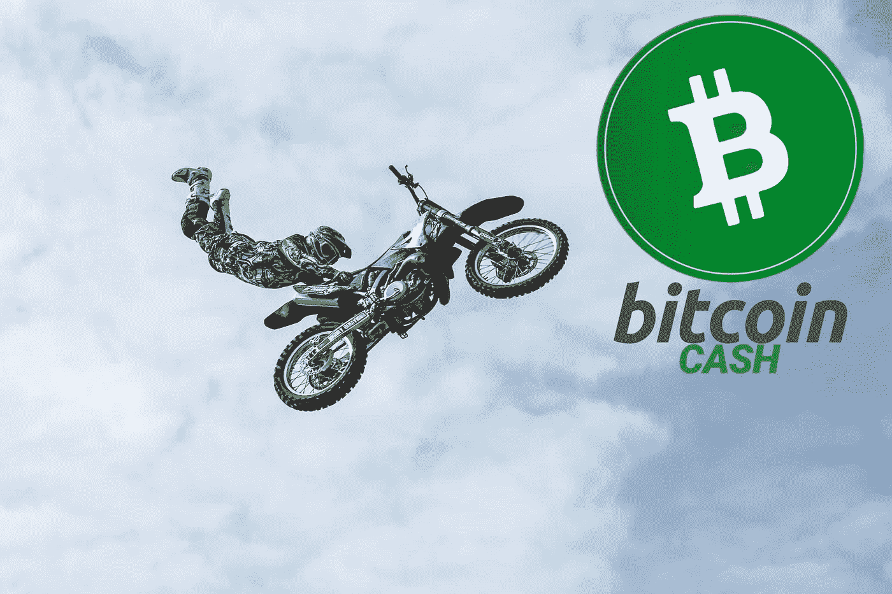
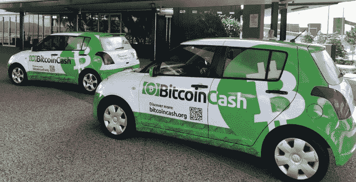
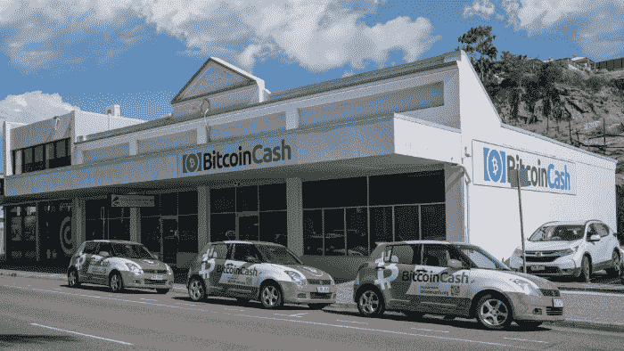

# 年底比特币现金 5000 美元！

> 原文：<https://medium.com/coinmonks/bitcoin-cash-at-5-000-by-the-end-of-the-year-9750297bea7f?source=collection_archive---------3----------------------->

好吧。我知道，这是一个点击诱饵标题。也许我不应该有这样一个标题，但在这里，我已经发表了，在这篇文章的其余部分，我将不得不解释我的推理。

我不能肯定地宣布比特币现金将达到 5000 美元，尤其是在这么短的时间内，但我想集中讨论几个事实，解释为什么我和更多比特币现金的投资者预计 BCH 的价格将在今年年底前达到历史最高水平。

这些预测往往是无效的，所以我不会建议投资太多，但我总是主张支持比特币现金，并解释为什么我认为比特币被低估，并被压制在低于其公平市场价值的水平。

加密货币市场关乎梦想，而这些梦想往往会成真。早期投资者现在是百万富翁，有些人甚至达到了亿万富翁的地位。抓住机会是我们抓住成功的方式。

> 看，如果你有一次机会，或者一次机会
> 
> **抓住你曾经想要的一切——一瞬间**
> 
> **你会抓住它吗？还是顺其自然？**

-阿姆《迷失自我》简介

# 极端的预测？

*Image Source:* [*Reddit*](https://www.reddit.com/r/btc/comments/8goiqt/not_as_cool_as_the_philippine_jeepney_but_still/)

当然，5000 美元的 BCH 可能只是我的预期，但也是我们所有比特币现金社区期待/希望发生的事情。

如今比特币现金的价格约为 650 美元。

要达到 5000 美元，BCH 将需要上涨 7，692%。它能成功吗？

比特币现金可以像许多其他甚至没有工作网络的硬币一样运行。

我们看到卡达诺的价值爆炸速度有多快。它已经克服了市值的限制，目前在加密货币指数中排名第三。

卡尔达诺除了承诺什么也没给。没有人使用 Cardano，因为它还没有准备好，然而，投资者正在向这种资产注入资金，看看如果它达到“现成产品”的状态，它会变成什么。

如今，卡达诺的总市值为 680 亿美元。

## 最先进的区块链

与此同时，比特币现金的市值仅为 120 亿美元。

比特币现金拥有最先进的区块链网络，以近乎零费用和零交易延迟令人难以置信地运行。侧链(SmartBCH)的发展正在将 DeFi 和 Dapps 引入比特币现金生态系统，世界各地有数百项倡议推广比特币现金，作为失败的菲亚特实验的替代方案。

与以太坊和 BTC 相比，比特币现金在每个网络功能上都优于它们。比起卡尔达诺现在的状态，连讨论都没有。

与任何其他加密货币不同，比特币现金已经被网络采用，每年都有成千上万的新用户加入。BTC、瑞士联邦理工学院和 BCH 之间也存在巨大差异。

## 用户群增长

BCH 的区块链费用允许用户群的保留。比特币现金区块链的开发者知道费用永远不是问题，他们的网站也不会突然失去所有的流量。这一直是每个试图使用 BTC 或瑞士联邦理工学院作为支付选项的网站的问题。每个以太坊游戏，Dapp，赌博应用程序，或者使用 ETH 的网站，当网络被超过它所能处理的时候都会受到影响。

BTC 和瑞士联邦理工学院没有扩大规模，但比特币现金是解决方案。如果我是一名开发人员，想添加一种支付方式，为什么我会使用以太坊或 BTC 呢？

你知道有多少惊人的想法因为联邦理工学院的费用而不得不停止运作吗？他们搬进了 BSC，但这也不是他们将呆的地方。BSC 不会比现在发展得更快。BSC 只是 Tron 2.0。这不是区块链的未来。

会发出噪音。现金或阅读。现金在以太坊上运行成功了吗？这会是一个巨大的失败。查看 Publish0x 如何处理费用以及为什么要阅读。如今，现金处于更有利的战略地位。

当你有一个顶级的区块链完美的工作，表现比其他任何东西都好，那么我认为这个头衔是有效的。

当这个网络正在经历新用户激增并转化为粉丝的时候，那么这就是对比特币现金在当前价格下极其便宜的又一次验证，是一个难得的机会。价格可能会在下跌时走低，但我观察到的是当低于 1000 美元时会有一个很长的积累区。在正确的市场条件下，这些动态通常会推动加密货币价格呈指数级增长。

# 最终注释

Bitcoin Cash City HQ — North Queensland

现在…太多作家，YouTubers 等等。，将声称他们的内容不包含投资建议，而内容的整个结构推动他们的观众做出投资决定。

这篇文章是财务建议，我甚至不能考虑说相反的话。

我不会撒谎，也不会告诉你这不是投资建议。我们投资 crypto 是为了钱，但我们也选择投资那些比其他公司更好的公司。

这不是一个短期的建议，因为 BCH 可能不会在 12 月达到 5000 美元，但从更长的时间来看，在 600 美元买入 BCH 不会造成损失，除非你亏本卖出。

既然其他加密货币爆发出新的历史新高，那么比特币现金肯定应该是下一个这样做的货币，因为它应该在加密指数中占据更高的位置。这才合理。

即使整个市场进入长达两年的熊市，BCH 仍将是每个投资者的重中之重，也是一个巨大的机会。如果它下跌更多，它仍然会回来，再次达到至少 600 美元。然而，等待价格再次达到 300 美元可能被证明是一个错误，因为市场随时可能开始新的牛市。

这正是我们对我们的分析和内容所做的。我们研究、预测并解释我们的期望。交易者阅读图表，试图解释他们看到的东西。当我为了更好的基本面离开交易时，我开始投资。当我投资的时候，我也希望有人能给我更多更好的建议。

所以，把这篇文章当做理财建议吧。但是，我不是控制你资金的人。这将是你的手这样做。

*原载于*[*https://read . cash*](https://read.cash/@Pantera/bitcoin-cash-at-5000-by-the-end-of-the-year-1a7c645b)*。*

> 加入 [Coinmonks 电报频道](https://t.me/coincodecap)，了解加密交易和投资

## 另外，阅读

*   [什么是融资融券交易](https://blog.coincodecap.com/margin-trading) | [成本平均法](https://blog.coincodecap.com/dca)
*   [BigONE 交易所评论](/coinmonks/bigone-exchange-review-64705d85a1d4) | [电网交易机器人](https://blog.coincodecap.com/grid-trading)
*   [3 商业评论](/coinmonks/3commas-review-an-excellent-crypto-trading-bot-2020-1313a58bec92) | [Pionex 评论](/coinmonks/pionex-review-exchange-with-crypto-trading-bot-1e459d0191ea) | [Coinrule 评论](/coinmonks/coinrule-review-2021-a-beginner-friendly-crypto-trading-bot-daf0504848ba)
*   [莱杰 vs n rave](/coinmonks/ledger-vs-ngrave-zero-7e40f0c1d694)|[莱杰 nano s vs x](/coinmonks/ledger-nano-s-vs-x-battery-hardware-price-storage-59a6663fe3b0) | [币安评论](/coinmonks/binance-review-ee10d3bf3b6e)
*   [Bybit Exchange 审查](/coinmonks/bybit-exchange-review-dbd570019b71) | [Bityard 审查](https://blog.coincodecap.com/bityard-reivew) | [CoinSpot 审查](https://blog.coincodecap.com/coinspot-review)
*   [3 commas vs crypto hopper](/coinmonks/3commas-vs-pionex-vs-cryptohopper-best-crypto-bot-6a98d2baa203)|[赚取加密利息](/coinmonks/earn-crypto-interest-b10b810fdda3)
*   最好的比特币[硬件钱包](https://blog.coincodecap.com/best-hardware-wallet-bitcoin) | [BitBox02 回顾](/coinmonks/bitbox02-review-your-swiss-bitcoin-hardware-wallet-c36c88fff29)
*   [BlockFi vs 摄氏](/coinmonks/blockfi-vs-celsius-vs-hodlnaut-8a1cc8c26630) | [Hodlnaut 点评](/coinmonks/hodlnaut-review-best-way-to-hodl-is-to-earn-interest-on-your-bitcoin-6658a8c19edf) | [KuCoin 点评](https://blog.coincodecap.com/kucoin-review)