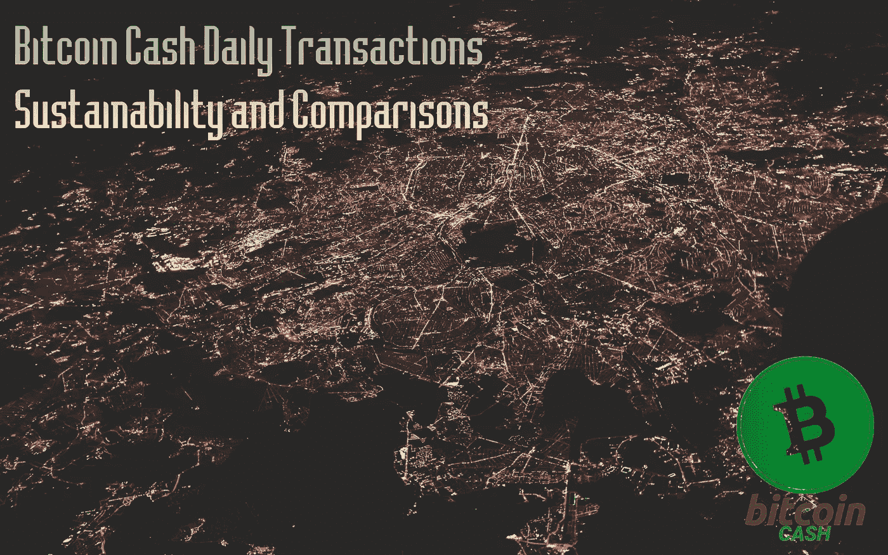
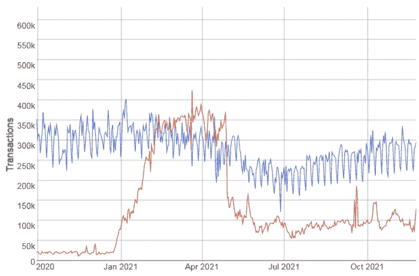
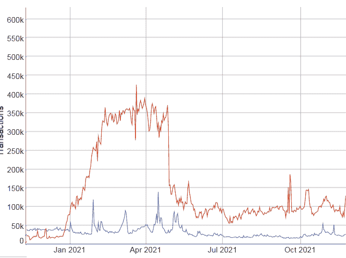
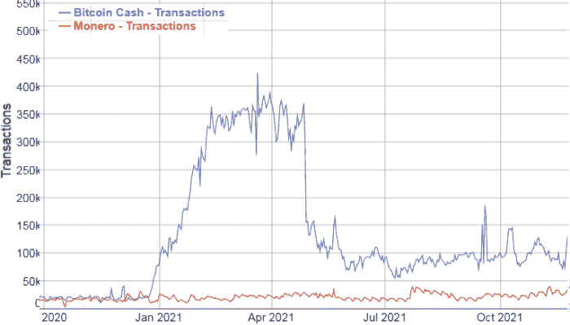
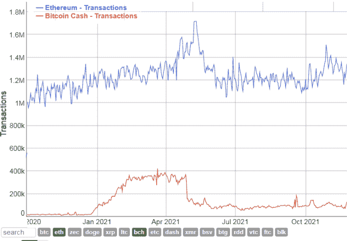

# 比特币现金日常交易——可持续性和比较

> 原文：<https://medium.com/coinmonks/bitcoin-cash-daily-transactions-sustainability-and-comparisons-898da10ef8b5?source=collection_archive---------16----------------------->

从 hashrate 到增加的用户群，比特币现金的表现优于大多数其他加密货币，但它缺乏一个决定性的市场因素来超越其他货币(或许这样更好)。这个因素就是**炒作**。

[CheapLightning](https://twitter.com/cheaplightning) ，在[最近的一个视频](https://www.youtube.com/watch?v=rTs-zge2hTQ)中完美地解释了这一点 [BitcoinCashPodcast](https://read.cash/@BitcoinCashPodcast) 称之为**反炒作**！这是一个有趣的术语，但它完美地解释了一个事实，即比特币现金社区是由高质量的专业人士组成的，而不是贪婪的投机者。

比特币现金没有“价格上涨”的说法，尽管每个人都很高兴看到自己的工作和表现受到加密市场的赞赏。比特币现金不是炒作而是行动，这是我理解的要点。

当然，在加密市场上投机的数十亿美元更喜欢炒作，所以他们偶尔会推出 Solana，Cardano，Luna，Doge，Shiba Inu 和其他各种缺乏基本面和长期潜力但擅长广告和营销的网络。

和 2017 年一样，同样的投机者泵出了 IOTA、TRON、XVG，还有几十家。我甚至不记得这些名字了，因为几个月后它们就变得不为人知了。

比特币现金在开采和开发方面是分散的，其散列率是除 BTC 之外最高的。比特币现金的用户群和商户接受度也在扩大。比特币现金的网络稳定性毋庸置疑，而我们最近甚至目睹了排名前 5 的区块链(Solana)离线 17 小时。

每日比特币现金交易的总数是其用户群增加的直接证明。比特币现金对其用户有利，因此更多的用户正在加入。在分散的网络中，即时的交易速度和持续的低交易费用是很少见的。每日交易是另一个看涨指标，解释了比特币现金用户群的扩大和网络效应的增加。

# (区块链)交易的数量

## BCH 对 BTC

[*Source*](https://bitinfocharts.com/comparison/transactions-btc-bch.html#3y)

在近两个月的时间里，比特币现金的日交易总量超过了 BTC。交易数量增加的一个原因是 noise.cash，以及向成千上万的用户分配微小费。

Noise.cash 后来引入了批处理，减少了每天的交易数量，但它仍然是一个充满希望的地方，平均每天约有 15 万笔交易。

然而，交易量并没有像许多批评者预期的那样，下降到 2021 年 1 月之前的水平。比特币现金交易在 2021 年平均高出约 400%(粗略估计，没有计算)，看起来这是比特币现金网络效应的强烈看涨信号。

## BCH 对总督

Red: Bitcoin Cash, Blue: Dogecoin, [*Source*](https://bitinfocharts.com/comparison/transactions-btc-bch.html#3y)

显然，比特币现金赢了这一场。

然而 Doge 如今风靡一时，大肆宣传。加密货币社区必须为此感谢一个人:埃隆·马斯克。这家伙不知何故发现了 Dogecoin 的实用性，完全忽略了其他各种在所有指标上都优于 Doge 的区块链网络。

## BCH 对莫内罗

[*Source*](https://bitinfocharts.com/comparison/transactions-bch-xmr.html#3y)

Monero 的增长持续缓慢，虽然 2020 年与 BCH 的交易量相似，但今年的情况明显发生了变化。

虽然，Monero 的用例不同，但比特币现金也提供了一些类似的[隐私增强机制](https://news.bitcoin.com/6-privacy-enhancing-tools-that-place-bitcoin-cash-transactions-ahead-of-the-pack/)(即 cashfusion)。不可否认，Monero 是这一类别的领导者，但它有不同的目标群体(目前)。

## BCH vs 以太坊

[**Source**](https://bitinfocharts.com/comparison/transactions-eth-bch.html#3y)

BCH 目前每天来自以太坊和 XRP 的交易数量较少。虽然，有了 SmartBCH，在第二层执行的交易数量也越来越多，并代表比特币现金交易。

比特币现金在保管加密交换方面存在问题。许多顶级加密交易所在接受存款前要求 15-20 次确认。这是比特币现金用户不应在托管交易所持有任何 BCH 的另一个原因。比特币基地、北海巨妖和更多国家一直对比特币现金持敌对态度，支持 BTC 最大化主义者，因为他们想让他们的“富裕”客户满意。

一些可疑的 crypto (BTC)作者告诉他们的观众，比特币现金交易时间需要两三个小时，这是错误的信息或不充分研究的结果**。**

比特币现金消除了早期鲸鱼的特权。随着 0-确认比特币现金享受即时交易。

BSV 似乎从第一天起就经历了交易数量的激增。尽管如此，BSV 的这一数据与现实不符，也没人当真。BSV 是一个集中的网络**，它之前被攻击了 51%多次**。BSV 投资者承担了他们不理解的风险(在我看来)。尽管如此，我不能否认 BSV 社区的大多数人比 BTC 的最大化主义者更了解比特币。然而，我看不到中央集权的区块链网络的未来。BSV 看起来像是 IBM 区块链的廉价替代品。IBM 区块链现在在哪里？**权力下放事关重大**(在所有区块链选区，不仅仅是采矿业)。

自今年初以来，BCH 的交易增长是有机的。而这是最伤害比特币现金厌恶者的地方。我记得甚至一个主要的 Blockstream dev (Gregory Maxwell)也失去了理智，声称交易是假的。然而，这是一个分散的网络，而不是像 BSV 那样只在一家公司内部运作的试验网。

比特币现金在交易速度和成本方面都优于 Doge。如果在两者之间进行选择，没有人会选择 Dogecoin 进行交易。逻辑表明，比特币现金的使用与大多数替代品不同。

# 最后

比特币现金有着不同的口头禅，而不是“价格上涨”。比特币现金是对世界的服务。

这与投机者在菲亚特套现的同时大肆宣传并向投资者提供不切实际的期望无关。

**用例增加，网络的效用增加！**价格只会随着需求的增加而上涨。

比特币现金正在解决现实生活中的问题，并向数字经济领域扩张。

它已经是一个比特币缩放解决方案，现在，随着 SmartBCH 它也为以太坊提供了一个扩展解决方案。

以太坊总是在如何进行的问题上自相矛盾。维塔利克给出了信号，并使用了大量的试验和错误，以找到一种方法。虽然最后一次转移到 PoS 似乎有负面影响，需要包括一个燃烧过程来维持以太坊。反正以太坊的用户群现在没了。除了 DeFi，大多数开发人员停止了其他工作。以太坊的大部分用户已经永远地放弃了它。

公众可以被操纵一段时间，但不是永远。在现代数字经济中，任何具有类似根本性缺陷的网络都将被忽略，变得无关紧要。

现代要求即时交易和微不足道的费用。比特币现金在不牺牲去中心化的情况下提供了这一点。

Writing at the following websites: ● [ReadCash](https://read.cash/@Pantera) ● [NoiseCash](https://noise.cash/u/Pantera99) ● [Medium](/@panterabch) ● [Hive](https://hive.blog/@pantera1) ● [Steemit](https://steemit.com/@pantera1) ●[Vocal](https://vocal.media/authors/pantera) ● [Minds](https://www.minds.com/pantera99/) ● [Twitter](https://twitter.com/Panterabch) ● [LinkedIn](https://www.linkedin.com/in/panterabch/) ● [email](https://read.cash/@Pantera/localcryptos-p2p-exchange-is-now-offering-bitcoin-cash-trading-06637230#bad-link)

**备注:**

> **免责声明**:本内容发布的所有材料均用于娱乐和教育目的，并符合合理使用准则。无意侵犯版权。如果您是或代表本文所用材料的版权所有者，并且对所述材料的使用有疑问，请发送[电子邮件](https://read.cash/@Pantera/cryptouknowns-battlegrounds-the-crypto-battle-royal-part-i-0ca762da#bad-link)。这篇文章或我发表的任何文章都不是金融建议，但包含与投资研究相关的信息。

***支持内容创作者。***

如果你喜欢这个故事，就订阅吧！

*原载于*[*https://read . cash*](https://read.cash/@Pantera/bitcoin-cash-daily-transactions-sustainability-and-comparisons-f6204b54)*。*

> 加入 Coinmonks [电报频道](https://t.me/coincodecap)和 [Youtube 频道](https://www.youtube.com/c/coinmonks/videos)了解加密交易和投资

## 另外，阅读

*   [网格交易机器人](https://blog.coincodecap.com/grid-trading) | [Cryptohopper 审查](/coinmonks/cryptohopper-review-a388ff5bae88) | [Bexplus 审查](https://blog.coincodecap.com/bexplus-review)
*   [7 个最佳零费用加密交易平台](https://blog.coincodecap.com/zero-fee-crypto-exchanges)
*   [分散交易所](https://blog.coincodecap.com/what-are-decentralized-exchanges) | [比特恩斯 FIP](https://blog.coincodecap.com/bitbns-fip) | [皮奥克斯评论](https://blog.coincodecap.com/pionex-review-exchange-with-crypto-trading-bot)
*   [用信用卡购买密码的 10 个最佳地点](https://blog.coincodecap.com/buy-crypto-with-credit-card)
*   [最好的卡达诺钱包](https://blog.coincodecap.com/best-cardano-wallets) | [Bingbon 副本交易](https://blog.coincodecap.com/bingbon-copy-trading)
*   [印度最佳 P2P 加密交易所](https://blog.coincodecap.com/p2p-crypto-exchanges-in-india) | [柴犬钱包](https://blog.coincodecap.com/baby-shiba-inu-wallets)
*   [8 大加密附属计划](https://blog.coincodecap.com/crypto-affiliate-programs) | [eToro vs 比特币基地](https://blog.coincodecap.com/etoro-vs-coinbase)
*   [最佳以太坊钱包](https://blog.coincodecap.com/best-ethereum-wallets) | [电报上的加密货币机器人](https://blog.coincodecap.com/telegram-crypto-bots)
*   [交易杠杆代币的最佳交易所](https://blog.coincodecap.com/leveraged-token-exchanges) | [购买弗洛基](https://blog.coincodecap.com/buy-floki-inu-token)
*   [3 commas vs Pionex vs Cryptohopper](https://blog.coincodecap.com/3commas-vs-pionex-vs-cryptohopper)|[Bingbon Review](https://blog.coincodecap.com/bingbon-review)
*   [加密复制交易平台](/coinmonks/top-10-crypto-copy-trading-platforms-for-beginners-d0c37c7d698c) | [如何在 WazirX 上购买比特币](/coinmonks/buy-bitcoin-on-wazirx-2d12b7989af1)
*   [CoinLoan 审核](https://blog.coincodecap.com/coinloan-review)|[Crypto.com 审核](/coinmonks/crypto-com-review-f143dca1f74c) | [火币保证金交易](/coinmonks/huobi-margin-trading-b3b06cdc1519)
*   [最佳网上赌场](https://blog.coincodecap.com/best-online-casinos) | [币安评论](/coinmonks/binance-review-ee10d3bf3b6e) | [BitMEX 评论](https://blog.coincodecap.com/bitmex-review)