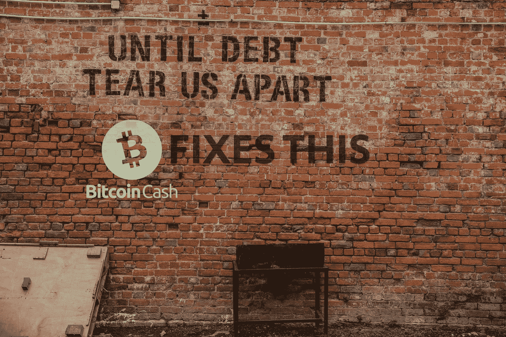

# 比特币现金解决了这个问题！

> 原文：<https://medium.com/coinmonks/bitcoin-cash-fixes-this-a7598f6fdf85?source=collection_archive---------5----------------------->

有一句话在社交媒体和论坛上流传多年:

**“比特币修复了这一点”。**

我不完全确定这句话对比特币的影响，可能在早年它包含了更多的意义。我以前见过这种情况，从 2014 年开始，如果我没记错的话，甚至可能更早。

我第一次遇到这句流行语时，它并不像人们想象的那样吸引人。我发现一个 Twitter 的有影响力的人使用了完全愚蠢的流行语和表达方式，所以看起来不太好。

Source: Twitter

我们今天到处都能找到这个短语，它解释了比特币将如何修复破碎的金融系统，也解释了它将如何修复一切。从 BLM 抗议和美国的种族问题到寻找疾病的治疗方法和停止战争。

这或许有些道理，因为如果金融体系以一种更加分散的方式运作，我们本可以避免一些悲剧。

然而，随着事情的发展，以及 Blockstream 对扩展的立场，很明显，BTC 只是一个致富的工具，而不是摆脱中介、监督和干预的自由。

# 99.9%的投资者可以轻易没收 BTC

现在，至少在我这边，我第一次发现比特币的时候，还是回到 2013 年。然而，这是在一个巨大的抛物线运行的顶端，以 BTC 在一年内获得 1000 倍的回报而告终。一直有大玩家进入，许多人在 2013 年前就已经获得了投资财富。

2017 年(我加入的时候)我们相信的是比特币便宜又快。纪录片很少，YouTubers 很少，我们可以用来提取信息的媒体就更少了。

我记得比特币人群有多热情，但也发现大多数“霍德勒”在同一年年底离开 BTC 时有多失望。

在开发闪电的比特币核心开发团队的领导下，比特币推动了一场变革，催生了 BTC 最大化主义者，他们永远只是一群交易员或巨大的 BTC 鲸鱼，他们只关心价格和他们的特权，不会通过修改代码来实现作为货币的普遍采用。

比特币现金解决了 BTC 没有解决的问题。基本上，今天这条信息描述的是比特币现金，而不是 BTC。

这是比特币现金是比特币的另一个原因，但让我们看看这条“比特币解决了这个问题”的消息，它似乎对 BTC 有利，但主要是描述比特币现金。

*Source:* [*Twitter*](https://twitter.com/ToneVays/status/1454122900185915403)

99.9%的 BTC 投资者把他们的资产放在中央交易所和保管钱包里，而 BTC 有 99.9%是可以没收的。对于那些早期以 Tone Vays(我认为是 2013 年)的身份进入比特币的人来说，它曾经是 Vays 所描述的那样。

为什么维斯躺在这里？因为他声称 BTC 是唯一具有他所谓的不可限制特征的“资产”。

Tone Vays，今天有成千上万的加密货币具有相同的功能。这不是 BTC 独有的现象。BTC 最大主义的短视遮蔽了他们的判断力。

此外，在 BCH，大多数用户持有带有私人钥匙的非保管钱包，作为存取资金的唯一途径。正如我之前说过的，今天 99.9%的 BTC 投资者只是拥有一个用户名和一个作为中介的托管集中服务的密码。

解决这个问题的是比特币现金，而不是 BTC。

绝大多数 BTC 用户不要把他们的 BTC 移出他们的保管世界。

比特币现金的情况正好相反，因为它是一个支持个人所有权、方便交易的网络。

BTC 仍然对鲸鱼的特权持保留态度。

# 总之，BCH 是通货膨胀的对冲

BCH 作为一种货币，不仅可以更好地对冲通货膨胀，而且如果在通货膨胀的经济体中大量采用(甚至与法定货币并行)，它肯定会有助于缓解通货膨胀水平和维持经济复苏的计划。

BTC 只有第二层充当这种角色，因为主链被控制比特币核心的区块流开发者故意削弱了。

一种比通货膨胀的法币表现更好的货币，能够维持价值，并且可以像现金一样方便地用于交易，既便宜又快捷。

BTC 乌鸦队目前过于兴奋的 LN，似乎在萨尔瓦多被拒绝作为一种支付方式。换一个复杂的支付系统是没有意义的，不管怎样，这个支付系统可能工作，也可能不工作。

LN 在萨尔瓦多与 Chivo 或 Strike 钱包一起使用，这与使用电子银行服务的政府监督类似。

[*Source*](https://twitter.com/Panterabch/status/1455371243918594055)

比特币现金是修复遭受更高通胀水平的经济体系的最佳选择，因为它具备健全货币的所有必要特征。

Follow me on: ● [ReadCash](https://read.cash/@Pantera) ● [NoiseCash](https://noise.cash/u/Pantera99) ● [Medium](/@panterabch) ● [Hive](https://hive.blog/@pantera1) ● [Steemit](https://steemit.com/@pantera1) ●[Vocal](https://vocal.media/authors/pantera) ● [Minds](https://www.minds.com/pantera99/) ● [Twitter](https://twitter.com/Panterabch) ● [LinkedIn](https://www.linkedin.com/in/panterabch/) ● [email](https://read.cash/@Pantera/localcryptos-p2p-exchange-is-now-offering-bitcoin-cash-trading-06637230#bad-link)

**备注:**

> *免责声明:本内容中发布的所有材料均用于娱乐和教育目的，并符合合理使用准则。无意侵犯版权。如果您是或代表本文所用材料的版权所有者，并且对所述材料的使用有疑问，请发送* [*电子邮件*](https://read.cash/@Pantera/cryptouknowns-battlegrounds-the-crypto-battle-royal-part-i-0ca762da#bad-link) *。*

***支持内容创作者。***

如果你喜欢这个故事，就订阅吧！

*原载于*[*https://read . cash*](https://read.cash/@Pantera/bitcoin-cash-fixes-this-c4f68813)*。*

> 加入 Coinmonks [电报频道](https://t.me/coincodecap)和 [Youtube 频道](https://www.youtube.com/c/coinmonks/videos)了解加密交易和投资

## 也阅读

 [## 最佳加密交易所| 2021 年十大加密货币交易所

### 编辑描述

blog.coincodecap.com](https://blog.coincodecap.com/crypto-exchange)  [## 2021 年 10 大最佳加密贷款平台| CoinCodeCap

### 编辑描述

blog.coincodecap.com](https://blog.coincodecap.com/crypto-lending)  [## 2021 年最佳免费加密交易机器人

### 2021 年币安、比特币基地、库币和其他密码交易所的最佳密码交易机器人。四进制，位间隙…

medium.com](/coinmonks/crypto-trading-bot-c2ffce8acb2a)  [## 最佳 4 个加密交易信号电报通道

### 这是乏味的找到正确的加密交易信号提供商。因此，在本文中，我们将讨论最好的…

medium.com](/coinmonks/best-crypto-signals-telegram-5785cdbc4b2b)  [## BlockFi 评论 2021:利弊和利率| CoinCodeCap

### 编辑描述

blog.coincodecap.com](https://blog.coincodecap.com/blockfi-review)  [## 如何在印度购买比特币？2021 年购买比特币的 7 款最佳应用[手机版]

### 如何使用移动应用程序购买比特币印度

medium.com](/coinmonks/buy-bitcoin-in-india-feb50ddfef94)  [## 加密税务软件——五大最佳比特币税务计算器[2021]

### 不管你是刚接触加密还是已经在这个领域呆了一段时间，你都需要交税。

medium.com](/coinmonks/best-crypto-tax-tool-for-my-money-72d4b430816b)  [## 存储比特币的最佳加密硬件钱包[2021] | CoinCodeCap

### 编辑描述

blog.coincodecap.com](https://blog.coincodecap.com/best-hardware-wallet-bitcoin)  [## Pionex 评论 2021 |免费加密交易机器人和交换

### Pionex 是为交易自动化提供工具的后起之秀。Pionex 上提供了 9 个加密交易机器人…

medium.com](/coinmonks/pionex-review-exchange-with-crypto-trading-bot-1e459d0191ea)