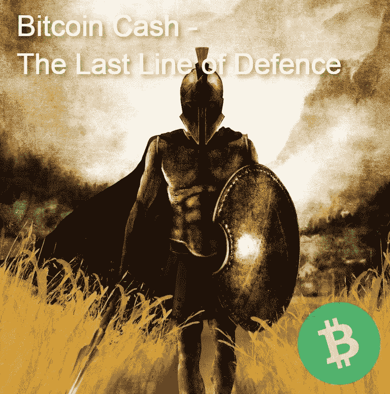
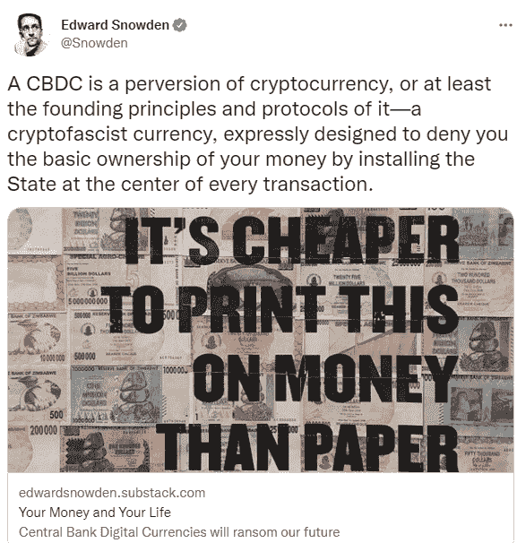

# 比特币现金是抵御即将到来的 CBDCs 入侵的最后一道防线

> 原文：<https://medium.com/coinmonks/bitcoin-cash-is-the-last-line-of-defence-against-the-upcoming-cbdcs-invasion-3edc97db224f?source=collection_archive---------12----------------------->

*Image from:* [*Pixabay*](https://pixabay.com/illustrations/spartan-warrior-shield-armor-4016133/) *, by* [*dejankrivokapic*](https://pixabay.com/users/dejankrivokapic-11699803/) *(modified)*

CBDCs 或央行数字货币是我们可能需要考虑的不可避免的东西。中国已经将自己的 CBDC 扩展到更多的地区，我们应该期待中国境内的所有交易很快都将使用数字人民币进行。

CBDCs 将经济金融生活的绝对控制权交给主管政府。由于每一笔金融交易都将受到监控，甚至私人银行也对 CBDCs 表示担忧。

今天的中国实行某种金融模式，这种模式是以共产主义治理和实验资本主义为基础的。然而，一切都受到政府的干预，我们见证了今年马云和他的[突然消失](https://www.forbes.com/sites/georgecalhoun/2021/06/24/what-really-happened-to-jack-ma/)的事件。

中国也许是一个最好的例子，说明 CBD 对任何社会或经济都是一种威胁。CBDC 本质上不仅仅是一种工具，而是政府手中的一种危险武器。对财富的监督和控制将是绝对的，只会帮助政府内部的极端分子控制金融生活。

政府变得越来越大，今天的资本主义已经变成了企业社会主义体系，纳税人不得不用他们的财富来弥补失败企业的错误和过度的政府支出。

小企业的经营规则与那些“大到不能倒”的企业不同。

CBDC 将加剧商业世界的不平等。那些将业务与“大”政府联系在一起的企业总是受到青睐和提拔。

对民众而言，采用 CBDC 意味着无法控制资金。有了 CBDCs，政府将能够在瞬间查封账户，阻止交易，并在宏观层面上即时调控货币流通水平。

将金融体系的绝对控制权交给一小撮管理政府的人，是一个应该引起所有人关注的问题。

# CBDCs 在政治上是正确的——政府反对非托管分散金融

*Source:* [*Twitter*](https://twitter.com/Snowden/status/1446850805223591938)

数字现金，数字货币或数字货币。当有人想避免使用加密货币这个词时，就使用数字货币这个词。

当然，这个术语包括任何可以用作货币的东西，也包括网上银行、PayPal、Google cards、任何数字钱包等等。( [Investopedia](https://www.investopedia.com/terms/d/digital-money.asp) )。

加密货币通常用这样一个术语来描述，以避免使用“crypto”一词，虽然它展示了术语 cryptography，但在其希腊语起源的清晰翻译中，它的意思是(作为一个动词)，隐藏，覆盖。虽然这个词有各种各样的用法，但它通常意味着某物被遮住或隐藏起来而不被人看见。

[**密码学**](https://www.kaspersky.com/resource-center/definitions/what-is-cryptography) 是一门利用高等数学对数据进行加密和解密的科学。“加密货币”一词是“加密货币”的组合或简称，因为它们可以使用各种加密方法来操作。

“加密货币”一词是一个被误解的词。它经常与投机、犯罪、黑暗的网络市场和非法交易联系在一起。“加密”是指政府无法承担自由运行的资金，但政府更愿意将其置于监管之下。

对于政府来说，加密货币对金融机构来说是一种风险。在高度集中的网络控制下，一切都会变得更好，资金容易受到审查和[民事没收](https://en.wikipedia.org/wiki/Civil_forfeiture_in_the_United_States)。

金钱意味着自由，世界上的每一个人都努力工作，聪明地为他们和他们所爱的人创造更好的生活条件。

这是导致繁荣和更好生活条件的唯一和最终目标。尽管如此，我们没有自己的钱，系统总是被操纵。

或许，在了解了所有这些之后，就可以理解为什么某些个人支持 CBD，以及他们与中央银行和政府的关系有多好。

# 比特币现金是经济自由

> 经济自由不仅仅是一个企业家精神和繁荣昌盛的商业环境。经济自由对人类发展的各个方面都有着深远的影响，**经济自由增强了人们的力量，释放了强大的选择和机会的力量，滋养了其他自由，并提高了整体生活质量。**
> 
> *资料来源:《12 项经济自由:持续进步和繁荣的政策》(* [*链接*](https://www.heritage.org/index/pdf/2021/book/2021_IndexofEconomicFreedom_CHAPTER02.pdf) *)*

自比特币诞生以来，它有着各种各样的含义和说法。所有早期使用比特币的人都发现，比特币反映了他们的意识形态。

左翼和右翼活动家、自由主义者、记者、政治异见者都获得了比特币的机会。它成为人们的声音，我们今天有这样的人，那些足够早进入比特币的人，他们现在有更多的权力，他们的声音被听到。

以小块大小进行的比特币部分，认为代码的任何改变都是对他们特权的威胁。

看到了吧，我们不能跳过比特币的前 8 年，只认为比特币现金是 2017 年开始的。比特币现金区块链的起源块是由 Satoshi 创造的。

比特币现金的历史与 BTC 共享，直到那一刻，BCH 没有被排除在链条之外，它继续实现变革，这将导致比特币实现大规模采用，而没有第三方作为扩展解决方案。

BTC 方面声称 LN 将是比特币的助推器，然而，许多年后，LN 被发现只有在集中保管服务下才能正常工作。

在网络拥塞的时候，LN 和 BTC 区块链一样没用。

这样一来，BTC 就成了精英们的玩具。它只在交易所和华尔街期货市场交易，但没有人使用它。

萨尔瓦多将会惨败。不会有任何收养，因为这不是这个国家的人民改变他们的财政支出的意愿。强行换成新的货币政策是行不通的。

# 最后

平心而论，这不仅仅是比特币现金一家的事情。许多加密货币正在提供与比特币现金类似的解决方案，然而，只有少数项目继续实现经济(或金融)自由的信息。

除了比特币现金， **Monero** 和 **ZCash** 成为一些最重要的替代品。加密货币应该有一定的标准，作为一个分散的金融网络，没有个人或金融中心的控制。

比特币现金提供了一个私人组织和政府无法触及的分散网络。这就是比特币的工作原理，但 BTC 的主要缺点是无法扩展。比特币现金没有这个弱点。

它以分散现金的方式运作，2100 万 BCH 的固定供应量创造了一个价值储存特征，这一特征是基于硬币的效用而非价格投机的 T4。

比特币现金是硬通货，它赋予个人所有权。

Follow me on: ● [ReadCash](https://read.cash/@Pantera) ● [NoiseCash](https://noise.cash/u/Pantera99) ● [Medium](/@panterabch) ● [Hive](https://hive.blog/@pantera1) ● [Steemit](https://steemit.com/@pantera1) ●[Vocal](https://vocal.media/authors/pantera) ● [Minds](https://www.minds.com/pantera99/) ● [Twitter](https://twitter.com/Panterabch) ● [LinkedIn](https://www.linkedin.com/in/panterabch/) ● [email](https://read.cash/@Pantera/localcryptos-p2p-exchange-is-now-offering-bitcoin-cash-trading-06637230#bad-link)

***支持内容创作者。***

如果你喜欢这个故事，就订阅吧！

*原发布于*[*https://read . cash*](https://read.cash/@Pantera/bitcoin-cash-is-the-last-line-of-defence-against-the-upcoming-cbdcs-invasion-ba019662)*。*

> 加入 Coinmonks [电报频道](https://t.me/coincodecap)和 [Youtube 频道](https://www.youtube.com/c/coinmonks/videos)了解加密交易和投资

## 也阅读

*   [Stormgain 回顾](https://blog.coincodecap.com/stormgain-review) | [Bexplus 回顾](https://blog.coincodecap.com/bexplus-review) | [币安 vs Bittrex](https://blog.coincodecap.com/binance-vs-bittrex)
*   [Bookmap 评论](https://blog.coincodecap.com/bookmap-review-2021-best-trading-software) | [美国 5 大最佳加密交易所](https://blog.coincodecap.com/crypto-exchange-usa)
*   [如何在 FTX 交易所交易期货](https://blog.coincodecap.com/ftx-futures-trading) | [OKEx vs 币安](https://blog.coincodecap.com/okex-vs-binance)
*   [如何在势不可挡的域名上购买域名？](https://blog.coincodecap.com/buy-domain-on-unstoppable-domains)
*   [印度的秘密税](https://blog.coincodecap.com/crypto-tax-india) | [altFINS 审查](https://blog.coincodecap.com/altfins-review) | [Prokey 审查](/coinmonks/prokey-review-26611173c13c)
*   [布洛克菲 vs 比特币基地](https://blog.coincodecap.com/blockfi-vs-coinbase) | [比特坎评论](https://blog.coincodecap.com/bitkan-review) | [币安评论](/coinmonks/binance-review-ee10d3bf3b6e)
*   [Coldcard 评论](https://blog.coincodecap.com/coldcard-review) | [BOXtradEX 评论](https://blog.coincodecap.com/boxtradex-review)|[unis WAP 指南](https://blog.coincodecap.com/uniswap)
*   [阿联酋 5 大最佳加密交易所](https://blog.coincodecap.com/best-crypto-exchanges-in-uae) | [SimpleSwap 评论](https://blog.coincodecap.com/simpleswap-review)
*   购买 Dogecoin 的 7 种最佳方式
*   [美国最佳加密交易机器人](https://blog.coincodecap.com/crypto-trading-bots-in-the-us) | [经常性回顾](https://blog.coincodecap.com/changelly-review)
*   [A-Ads 审查](https://blog.coincodecap.com/a-ads-review) | [Bingbon 审查](https://blog.coincodecap.com/bingbon-review) | [Mudrex 投资](https://blog.coincodecap.com/mudrex-invest-review-the-best-way-to-invest-in-crypto)