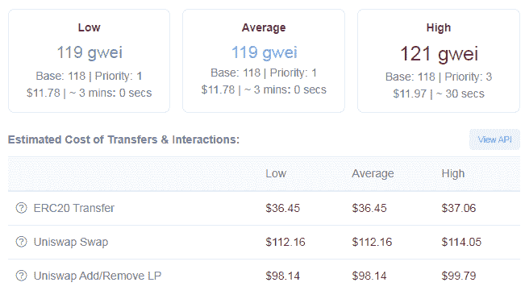
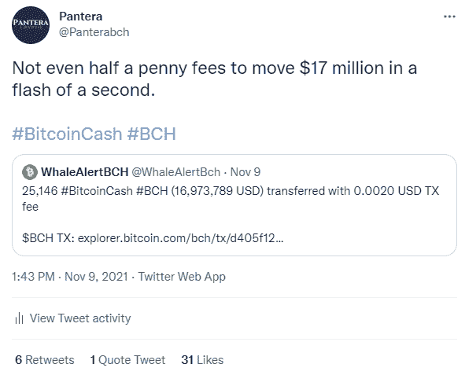

# 比特币现金以一贯的低费用尊重用户群

> 原文：<https://medium.com/coinmonks/bitcoin-cash-respects-the-userbase-with-consistent-low-fees-7129d662200a?source=collection_archive---------15----------------------->

***Image Source:*** [***Pixabay***](https://pixabay.com/illustrations/new-york-skyline-night-scene-new-974432/)

市值和粉丝数量排名前两位的加密货币比特币-($BTC)和以太坊($ETH)容易收取极高的费用，因为开发人员无法充分应对可扩展性问题。

以太坊的费用最近再次飙升，每笔交易高达数百美元。以太坊开发者，就像他们的比特币核心同行一样，无法理解这些网络总体形象的潜在重要性。

[*Source*](https://etherscan.io/gasTracker)

自 2017 年比特币拆分之前，比特币现金的地位就很稳固。比特币社区的这一部分的目的是继续进行改变，使比特币可扩展，并能够达到大规模采用。

有各种各样的加密货币网络应用低费用和高交易速度，尽管它们中的大多数为了实现这一点而减少了安全性集中化等其他特征。比特币现金没有在任何事情上妥协，只是遵循理性，设法规模化。

# 为世界需要的服务

使用比特币现金发送和接收资金是即时的，费用只有几分之一便士。第一次使用 BCH 时，每个人都会对它印象深刻。

资产的价格可能会继续上涨，但这不适用于费用，因为 BCH 费用机制将始终保持在低于 1 美分的低水平。

比特币现金还经常被证明能够以极低的费用在瞬间转移大量资金。

一部售价仅为 50 美元的智能手机，让一个生活在困境中的人实现了向一个不受地方或地区事件影响的经济体的转型。虽然恶性通货膨胀可以打击疲软的经济，但它无法触及一个在严格规则下运行、包含有限货币单位供应的强健的普遍网络。

有了比特币现金，现代社会如今可以自行解除银行业务。将比特币现金作为数字现金，可以对抗通胀的恐惧。我并不认为这是一种投资，而是向更好的货币体系过渡。一个不会为了迎合政府和操纵者的一时冲动而膨胀的世界。

比特币现金是不稳定的，因为价格受交易和自由普遍市场的影响。

大多数基于 BTC 逻辑的网络正遭受长时间的高速。这些网络无法处理更多用户是 2017 年市场崩溃的主要原因，也是 2021 年 5 月市场崩溃的次要原因。

以太坊(Ethereum)和比特币(Bitcoin)兴高采烈地宣传极高的交易费用，与此同时，这些网络的用户大量外流，并迁移到其他运转更好的区块链。无论前两种加密货币的投机因素如何，公众都可以超越短期，从逻辑上分析哪里有潜力，哪种加密在财务上适合他们。

这些网络之上的发展失去了对公众的吸引力，所以所有的计划是转移到一个更便宜的替代方案。今天可以在以太坊上构建的东西，在 SmartBCH、Polygon、BSC 等上也是一样的。接下来，其他价值变得很重要，比如分权水平和社区。

# 最后

比特币现金是消费者、零售商、企业和开发者的最佳选择之一。虽然数字世界仍有 1%的全部潜力，但对于当前加密经济的许多参与者来说，这可能还不可见。

然而，如果认为无法扩大规模不会成为这些网络消亡的不利因素，那就太天真了。

高昂的费用影响了大多数以太坊用户，许多人早已放弃使用这个网络。

以太坊的收费已经到了敲诈的程度，这简直是疯狂。比特币核心(实现)也支持高收费，还有人关注。

比特币现金是全世界的加密货币。它了解用户的需求，并通过提供一个支付网络来满足他们的需求，该网络只收取很少的消费费用，而且几乎可以即时交易。

Follow me on: ● [ReadCash](https://read.cash/@Pantera) ● [NoiseCash](https://noise.cash/u/Pantera99) ● [Medium](/@panterabch) ● [Hive](https://hive.blog/@pantera1) ● [Steemit](https://steemit.com/@pantera1) ●[Vocal](https://vocal.media/authors/pantera) ● [Minds](https://www.minds.com/pantera99/) ● [Twitter](https://twitter.com/Panterabch) ● [LinkedIn](https://www.linkedin.com/in/panterabch/) ● [email](https://read.cash/@Pantera/localcryptos-p2p-exchange-is-now-offering-bitcoin-cash-trading-06637230#bad-link)

**备注:**

> **免责声明**:本内容发布的所有材料均用于娱乐和教育目的，并符合合理使用的准则。无意侵犯版权。如果你是或代表本文所用材料的版权所有者，并且对所述材料的使用有问题，请发送[电子邮件](https://read.cash/@Pantera/cryptouknowns-battlegrounds-the-crypto-battle-royal-part-i-0ca762da#bad-link)。这篇文章或我发表的任何文章都不是金融建议，但包含与投资研究相关的信息。

***支持内容创作者。***

如果你喜欢这个故事，就订阅吧！

*原发布于*[*https://read . cash*](https://read.cash/@Pantera/bitcoin-cash-respects-the-userbase-consistent-low-fees-e2ed34cc)*。*

> 加入 Coinmonks [电报频道](https://t.me/coincodecap)和 [Youtube 频道](https://www.youtube.com/c/coinmonks/videos)了解加密交易和投资

## 也阅读

 [## 最佳加密交易所| 2021 年十大加密货币交易所

### 编辑描述

blog.coincodecap.com](https://blog.coincodecap.com/crypto-exchange)  [## 2021 年 10 大最佳加密贷款平台| CoinCodeCap

### 编辑描述

blog.coincodecap.com](https://blog.coincodecap.com/crypto-lending)  [## 2021 年最佳免费加密交易机器人

### 2021 年币安、比特币基地、库币和其他密码交易所的最佳密码交易机器人。四进制，位间隙…

medium.com](/coinmonks/crypto-trading-bot-c2ffce8acb2a)  [## 最佳 4 个加密交易信号电报通道

### 这是乏味的找到正确的加密交易信号提供商。因此，在本文中，我们将讨论最好的…

medium.com](/coinmonks/best-crypto-signals-telegram-5785cdbc4b2b)  [## 5 个最佳社交交易平台[2021] | CoinCodeCap

### 编辑描述

blog.coincodecap.com](https://blog.coincodecap.com/best-social-trading-platforms)  [## BlockFi 评论 2021:利弊和利率| CoinCodeCap

### 编辑描述

blog.coincodecap.com](https://blog.coincodecap.com/blockfi-review)  [## 如何在印度购买比特币？2021 年购买比特币的 7 款最佳应用[手机版]

### 如何使用移动应用程序购买比特币印度

medium.com](/coinmonks/buy-bitcoin-in-india-feb50ddfef94)  [## 加密税务软件——五大最佳比特币税务计算器[2021]

### 不管你是刚接触加密还是已经在这个领域呆了一段时间，你都需要交税。

medium.com](/coinmonks/best-crypto-tax-tool-for-my-money-72d4b430816b)  [## 存储比特币的最佳加密硬件钱包[2021] | CoinCodeCap

### 编辑描述

blog.coincodecap.com](https://blog.coincodecap.com/best-hardware-wallet-bitcoin)  [## Pionex 评论 2021 |免费加密交易机器人和交换

### Pionex 是为交易自动化提供工具的后起之秀。Pionex 上提供了 9 个加密交易机器人…

medium.com](/coinmonks/pionex-review-exchange-with-crypto-trading-bot-1e459d0191ea)