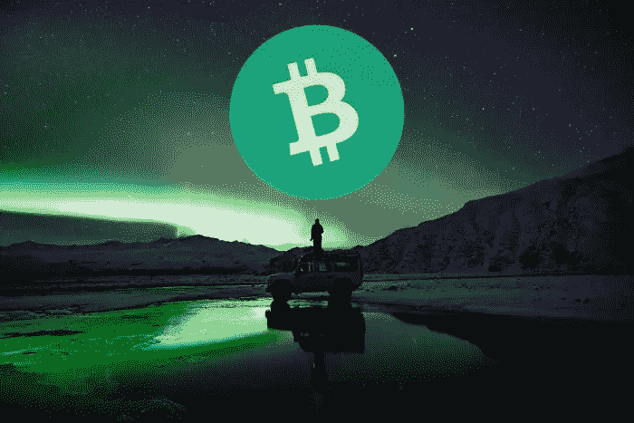

# 比特币现金——向新经济过渡

> 原文：<https://medium.com/coinmonks/bitcoin-cash-transition-to-a-new-economy-6434e6ed2efc?source=collection_archive---------11----------------------->

***Image Source:*** [*Unsplash*](https://unsplash.com/photos/8I49k45G-3A) *(modified)*

加密货币远远不仅仅是投机和日常价格波动。

这是一个正在形成的现代经济。有人称之为金融的未来，大多数人已经明白这是货币的未来。

是的，当价格上涨时，我们欣喜若狂，看着我们的钱包变得更值钱(以法定价值计算)。虽然，我们也可能不得不考虑菲亚特有一天将不再存在的事实，或者也许它不会像几个世纪以来那样指导我们的生活。

我记得几十年前的故事，以及我的祖父母如何持有黄金英镑来保护他们的财富。对于那些经历过二战和随后的经济衰退的人来说，这很常见。

他们在战争时期饱受恶性通货膨胀之苦，他们都知道法定货币不可信。总有一天通货膨胀会让它变得一文不值。

当他们年轻时，他们遭受贫穷，有些人甚至挨饿。他们购买的英国黄金英镑是一种价值储存手段，但不可分割，也不被食品杂货所接受。每个人的价值都是他们日常需求的一百倍。他们不得不把它们藏在床垫里，或者晚上埋在没人会发现的地方。

以任何形式持有实物黄金总是一种危险。保护黄金是一种负担，当一个人需要出售黄金时，情况会变得更糟。想象一下，你拥有财富，但在需要的时候却无法兑现。这几乎算不上价值储存。

基本上，他们持有价值储存手段，但也不能用黄金来养活自己、穿衣服或庇护自己。他们必须去一个黄金交易所，卖掉黄金，拿到法定货币，然后在一天内迅速花光，因为下一次，价格会翻倍。所有这一切都冒着有人潜伏并发现哪些家庭持有黄金的危险，只是为了将这一信息传递给小偷以获取报酬。

我的祖父母持有黄金作为价值储存手段，但没有任何东西作为交换手段。

时代在变，但战争、金融灾难和需要帮助的人仍在我们身边。在这种情况下，货币贬值很快。银行倒闭，恶性通货膨胀出现。即使在西方社会，高税收和高失业率也正在扼杀经济的生产部分。

一个现代化的全球货币体系可能会改变这种状况，减轻数百万人的痛苦。一种新经济的引入，在这种新经济中，灾难的影响至少对幸存者来说要小一些。

现代分散资金，脱离政府的控制是至关重要的。高交易速度和低费用势在必行。

**比特币现金**今天，它带来了最现代化的网络，具备所有这些可用的功能，并已准备好大规模采用。

# 新经济

我昨天和一个亲戚交谈，他知道我是一个加密迷。

这是我的一个表兄，他理解完全控制我们的资金的概念。尽管如此，她仍然认为加密是一种投机性的金融工具，直到最近她还持否定态度。

最初，她认为我从事加密工作只是为了钱，这个事实曾经是真的。我不知道比特币是什么，我从 2017 年年中开始从事加密交易，但在 2018 年的某个时候才开始进一步研究。

即使 BTC 费用在 2017 年底达到平均 50 美元，我仍然认为这只是暂时的。我的意思是，我觉得一个被认为是革命性的网络不可能有如此严重的缺陷。

在与我的表弟进行了长时间的讨论后，最后一部分是关于政府想要在我的国家实施的秘密税收。

***“政府将对密码征税……对此你能做什么？”*** 她问。

我不知道“我的”政府会有这样的想法。这是我所期待的，也是我在思考如何按照美国秘密税法的例子来应用它。

政府认为那里有钱，现在它想对受监管的中央交易所的加密交易征税。任何交易(买、卖等)..)将意味着一定比例的税收将被扣除。

这是典型的政府敲诈。但不管怎样，我回答说，

”*如果是这样，那我就不用上税了！*

这种税通常是针对每一笔交易的，在强制性 KYC 的集中交易中。我不再交易了。

我也不打算卖掉 crypto 然后退出银行。嗯，对于这一部分，我不能确定，但我希望我不需要。

“我掌握着我资金的钥匙，不是银行，也不是其他任何人。

我不会逃税，我只是不会再去银行提款。

我接着说最后一句话:

***“计划是进入加密经济，而不是反过来*** ”。

我表哥终于明白了我的意思。

那时一切都变得清晰了。**短期的波动和投机不会触动那些长期处于这种状态的人**。

她在和一个与几年前完全不同的人交谈，而不仅仅是一个受短期利润驱动、整天看价格图表的人。

有些人确实从 crypto 中赚了大钱，但我不是其中之一，因为我承担了不同的风险，并且从一开始就没有理解全部的潜力。

我现在是那些相信加密货币将达到最终超过法定交互需求的采用水平的人之一。

流入 crypto 的资金今天可能主要是投机性的，但明天，只有 10%的投资者将开始使用他们的 crypto 基金。

# 首先，他们嘲笑你，然后他们禁止，然后他们征税——最后

一如既往，国家会试图攫取我们的部分财富。

我不是说总有解决的办法。在一些国家，加密货币投资的申报是强制性的。

我不再认为这是一项投资，而主要是向现代支付系统的过渡。

对持有的加密货币征税将是一个严重的错误，因为届时政府将不得不对所有个人储蓄征税。我不确定这以前是否在任何地方发生过(尽管我可能是错的)。

当加密货币利润返还给银行时，他们也会乐意征税。然而，钱的路线通常是反过来的。反正这是计划。

就目前而言，我是 crypto 的投资者，因为我没有用我的加密货币钱包购买的方法。

今天早上买“弗雷多西诺”时，我很想用比特币现金，但我不好意思问这个。也许下次我会。我钱包里有 2 欧元，所以我根本没讨论这个问题。我周围还没有接受 BCH 的商人，但在不久的将来会有。

如今的比特币现金几乎零手续费，即时交易。与其他加密货币相比，这一优势使其成为顶级交易手段和价值储存手段。这是一种你可以确保永远不会失去的钱，而有限的供给和低通胀支撑着它的价值。

向零售商接受的快速、廉价和分散的加密货币的加密经济转型为期不远。

保管钱包和集中式加密货币(如 USDT、USDC 等。)将不起作用。集中化不是进步，而是一直以来都有着集中化失败的同一个银行系统。

我在这篇文章中提到了比特币现金，但我发现许多加密货币都有坚实的基础，可以为世界共同努力。目的是发现什么能为公众服务，而不是如何从使用网络的人身上榨取最多的费用。可悲的是，创造一种服务于大多数人需求的产品的意义却避开了两大加密货币。

Follow me on: ● [ReadCash](https://read.cash/@Pantera) ● [NoiseCash](https://noise.cash/u/Pantera99) ● [Medium](/@panterabch) ● [Hive](https://hive.blog/@pantera1) ● [Steemit](https://steemit.com/@pantera1) ●[Vocal](https://vocal.media/authors/pantera) ● [Minds](https://www.minds.com/pantera99/) ● [Twitter](https://twitter.com/Panterabch) ● [LinkedIn](https://www.linkedin.com/in/panterabch/) ● [email](https://read.cash/@Pantera/localcryptos-p2p-exchange-is-now-offering-bitcoin-cash-trading-06637230#bad-link)

***支持内容创作者。***

如果你喜欢这个故事，就订阅吧！

*原发布于*[*https://read . cash*](https://read.cash/@Pantera/bitcoin-cash-transition-to-a-new-economy-00993e94)*。*

> 加入 Coinmonks [电报频道](https://t.me/coincodecap)和 [Youtube 频道](https://www.youtube.com/c/coinmonks/videos)了解加密交易和投资

## 另外，阅读

*   [印度的秘密税](https://blog.coincodecap.com/crypto-tax-india) | [altFINS 审查](https://blog.coincodecap.com/altfins-review) | [Prokey 审查](/coinmonks/prokey-review-26611173c13c)
*   [区块链 vs 比特币基地](https://blog.coincodecap.com/blockfi-vs-coinbase) | [比特坎评论](https://blog.coincodecap.com/bitkan-review) | [币安评论](/coinmonks/binance-review-ee10d3bf3b6e)
*   [Coldcard 评论](https://blog.coincodecap.com/coldcard-review) | [BOXtradEX 评论](https://blog.coincodecap.com/boxtradex-review)|[uni swap 指南](https://blog.coincodecap.com/uniswap)
*   [阿联酋 5 大最佳加密交易所](https://blog.coincodecap.com/best-crypto-exchanges-in-uae) | [SimpleSwap 评论](https://blog.coincodecap.com/simpleswap-review)
*   购买 Dogecoin 的 7 种最佳方式
*   [iTop VPN 审查](https://blog.coincodecap.com/itop-vpn-review) | [曼陀罗交易所审查](https://blog.coincodecap.com/mandala-exchange-review)
*   [美国最佳加密交易机器人](https://blog.coincodecap.com/crypto-trading-bots-in-the-us) | [经常性回顾](https://blog.coincodecap.com/changelly-review)
*   [A-Ads 审查](https://blog.coincodecap.com/a-ads-review) | [Bingbon 审查](https://blog.coincodecap.com/bingbon-review) | [Mudrex 投资](https://blog.coincodecap.com/mudrex-invest-review-the-best-way-to-invest-in-crypto)
*   [最好的卡达诺钱包](https://blog.coincodecap.com/best-cardano-wallets) | [Bingbon 副本交易](https://blog.coincodecap.com/bingbon-copy-trading)
*   [印度最佳 P2P 加密交易所](https://blog.coincodecap.com/p2p-crypto-exchanges-in-india) | [柴犬钱包](https://blog.coincodecap.com/baby-shiba-inu-wallets)
*   [8 大加密附属计划](https://blog.coincodecap.com/crypto-affiliate-programs) | [eToro vs 比特币基地](https://blog.coincodecap.com/etoro-vs-coinbase)
*   [最佳以太坊钱包](https://blog.coincodecap.com/best-ethereum-wallets) | [电报上的加密货币机器人](https://blog.coincodecap.com/telegram-crypto-bots)
*   [交易杠杆代币的最佳交易所](https://blog.coincodecap.com/leveraged-token-exchanges)