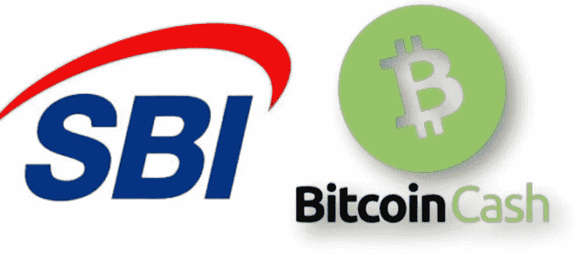
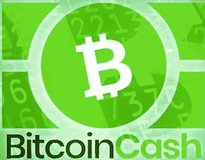

# 比特币现金被 SBI 银行选为日本首个加密基金

> 原文：<https://medium.com/coinmonks/bitcoin-cash-was-selected-by-sbi-bank-for-the-first-crypto-fund-in-japan-36ffde9395a8?source=collection_archive---------11----------------------->

SBI 是日本银行业的金融巨擘。它还对加密货币表现出兴趣，成为 XRP (Ripple)的一个有影响力的投资者。

这家金融巨头现在已经选择了五种包含比特币现金的加密货币，并向个人散户投资者提供这些货币( [*【彭博】*](https://www.bloomberg.com/news/articles/2021-09-02/first-crypto-fund-in-japan-targets-long-term-retail-investors))。

SBI 选择的加密货币有**比特币现金**、**以太坊**、 **BTC** 、 **XRP** 、**莱特币**。

投资组合多样化是投资中的一项关键战略，加密货币行业的市值和交易量已经增长到足以成为投资银行战略的一部分。

SBI 的目标是散户投资者，因为该基金的最低投资额为 100 万日元(合 9，100 美元)。

# 比特币现金一直是金融机构的首选

SBI 选择比特币现金并不令人意外。它是加密领域的顶级品牌之一，已被大多数提供加密货币投资的金融机构纳入其中。

机构和散户投资者可以从监管投资服务中获得比特币现金，如:

*   [***灰度***](https://read.cash/@Pantera/grayscale-bitcoin-cash-bchg-9dc489ba) ***，***
*   [***摩根大通***](https://read.cash/@Pantera/jpmorgan-allows-access-to-retail-investing-in-bitcoin-cash-c82844b4)
*   *[***21 只股票——欧洲 ETP***](https://read.cash/@Pantera/bitcoin-cash-etp-in-europe-abch-01effa54)*

*像 **PayPal** 这样的老牌支付服务商总是将比特币现金作为他们选择的加密货币中的首选。*

*它是首批包含加密货币的加密交易所之一，几乎 99%的交易所都提供该选项。*

*比特币现金有一个不可忽视的 [**海量品牌名称**](https://read.cash/@Pantera/bitcoin-cash-unmatched-brand-awareness-ab7f3d4c) 。*

*作为一种投资选择，它是目前最不受重视的加密货币。它的价格受到抑制，投资者应该优先考虑，因为它的采用、网络效应和发展的基本面在竞争对手中是最强的。*

**

# *电子现金和非理性密码市场*

*我们最近看到 ECash(以前的 BitcoinCashABC)令人难以置信地增长了 10 倍，总市值达到 60 亿美元。*

*这是一种不合理的价格上涨，与 ECash 的基本面、发展或采用无关。我们已经看到加密货币仅仅通过营销就进入了前 10 名的不当位置。一些加密货币仍然没有工作的主网，一些甚至仍在开发他们的测试网。然而，他们已经达到了数百亿美元的极端估值。*

*当把标准设得太高时，应该会有结果。*

*比特币现金带来的结果是不断发展，真正的共识，并作为一个现代金融网络走向大规模采用。*

*随着开发人员在 SmartBCH 等侧链上工作，将比特币现金与以太坊连接起来，并为以太坊 DeFi 的高费用问题提供解决方案，BCH 正在该领域提供其强大的网络。*

**

# *结论*

**

*投资者现在再次在没有研究的情况下投入资金。与银行有联系的秘密基金经理正在推动某个议程，而不考虑技术和基本面。*

*可悲的是，大多数散户和机构投资者都像羊群一样涌向任何“抽水”的东西，而不知道比特币现金等其他选择将主导交易领域，并已经作为以太坊的有力竞争者扩展到 DeFi。*

*强大的网络交易时间为零，费用几乎为零，是支持开发人员在侧链上创建 DeFi、增强强大的分散金融和创建额外基础设施以促进数字经济发展的完美环境。*

*现代金融将需要权力下放和自主网络。闪电网络或 Liquid layer-2 解决方案与此相去甚远，并且**所有当前的 LN 开发都基于受监管的 KYC/AML 合规钱包和集中式 LN 中心，这些中心将在某些限制条件下监督交易**(政府干预和控制)。*

*比特币现金实现了链上扩展，不需要受监管的金融中心作为中介来运营。*

**

*资源:*

*   *****:***[***日本首只针对长期散户投资者的加密基金***](https://www.bloomberg.com/news/articles/2021-09-02/first-crypto-fund-in-japan-targets-long-term-retail-investors) ***。*****
*   ***Bitcoin.com:* [***日本金融巨头 SBI 推出加密货币好玩***](https://news.bitcoin.com/japans-financial-giant-sbi-cryptocurrency-fund/)**

**写作上:*●*[***read cash***](https://read.cash/@Pantera)*●*[***noise cash***](https://noise.cash/u/Pantera99)*●*[***Medium***](/@panterabch)*●*[***蜂巢***](https://hive.blog/@pantera1) *●* **●*[***Twitter***](https://twitter.com/Panterabch)*●*[***LinkedIn***](https://www.linkedin.com/in/panterabch/)**●*[***Reddit***](https://www.reddit.com/user/PanteraBCH)****

***原发布于*[*https://read . cash*](https://read.cash/@Pantera/bitcoin-cash-was-selected-by-sbi-bank-for-the-first-crypto-fund-in-japan-049ea9b7)*。***

> **加入 [Coinmonks 电报频道](https://t.me/coincodecap)，了解加密交易和投资**

## **也阅读**

*   **[在美国如何使用 BitMEX？](https://blog.coincodecap.com/use-bitmex-in-usa) | [BitMEX 评论](https://blog.coincodecap.com/bitmex-review)**
*   **[最佳免费加密信号](https://blog.coincodecap.com/free-crypto-signals) | [YoBit 评论](/coinmonks/yobit-review-175464162c62) | [Bitbns 评论](/coinmonks/bitbns-review-38256a07e161)**
*   **[OKEx 回顾](/coinmonks/okex-review-6b369304110f) | [Kucoin 交易机器人](/coinmonks/kucoin-trading-bot-automate-your-trades-8cf0ca2138e0) | [期货交易机器人](/coinmonks/futures-trading-bots-5a282ccee3f5)**
*   **[AscendEx Staking](https://blog.coincodecap.com/ascendex-staking)|[Bot Ocean Review](https://blog.coincodecap.com/bot-ocean-review)|[最佳比特币钱包](https://blog.coincodecap.com/bitcoin-wallets-india)**
*   **[霍比评论](https://blog.coincodecap.com/huobi-review) | [OKEx 保证金交易](https://blog.coincodecap.com/okex-margin-trading) | [期货交易](https://blog.coincodecap.com/futures-trading)**
*   **[比特币基地跑马圈地](https://blog.coincodecap.com/coinbase-staking) | [Hotbit 评论](/coinmonks/hotbit-review-cd5bec41dafb) | [KuCoin 评论](https://blog.coincodecap.com/kucoin-review)**
*   **[最佳加密交易信号电报](/coinmonks/best-crypto-signals-telegram-5785cdbc4b2b) | [MoonXBT 评论](/coinmonks/moonxbt-review-6e4ab26d037)**
*   **[Coinswitch 俱吠罗评论](/coinmonks/coinswitch-kuber-review-1a8dc5c7a739) | [电网交易机器人](https://blog.coincodecap.com/grid-trading) | [比特币基地收费](/coinmonks/coinbase-fees-831e77d4f2c5)**
*   **[Bitget 回顾](https://blog.coincodecap.com/bitget-review) | [双子 vs 区块链](https://blog.coincodecap.com/gemini-vs-blockfi) | [OKEx 期货交易](https://blog.coincodecap.com/okex-futures-trading)**
*   **[OKEx vs KuCoin](https://blog.coincodecap.com/okex-kucoin) | [摄氏替代品](https://blog.coincodecap.com/celsius-alternatives) | [如何购买 VeChain](https://blog.coincodecap.com/buy-vechain)**
*   **[币安期货交易](https://blog.coincodecap.com/binance-futures-trading)|[3 comas vs Mudrex vs eToro](https://blog.coincodecap.com/mudrex-3commas-etoro)**
*   **[如何购买 Monero](https://blog.coincodecap.com/buy-monero) | [IDEX 评论](https://blog.coincodecap.com/idex-review) | [BitKan 交易机器人](https://blog.coincodecap.com/bitkan-trading-bot)**
*   **[币安 vs 比特邮票](https://blog.coincodecap.com/binance-vs-bitstamp) | [比特熊猫 vs 比特币基地 vs Coinsbit](https://blog.coincodecap.com/bitpanda-coinbase-coinsbit)**
*   **[如何购买 Ripple (XRP)](https://blog.coincodecap.com/buy-ripple-india) | [非洲最好的加密交易所](https://blog.coincodecap.com/crypto-exchange-africa)**
*   **[非洲最佳加密交易所](https://blog.coincodecap.com/crypto-exchange-africa) | [胡交易所评论](https://blog.coincodecap.com/hoo-exchange-review)**
*   **[eToro vs robin hood](https://blog.coincodecap.com/etoro-robinhood)|[MoonXBT vs by bit vs Bityard](https://blog.coincodecap.com/bybit-bityard-moonxbt)**
*   **[Stormgain 回顾](https://blog.coincodecap.com/stormgain-review) | [Bexplus 回顾](https://blog.coincodecap.com/bexplus-review) | [币安 vs Bittrex](https://blog.coincodecap.com/binance-vs-bittrex)**
*   **[Bookmap 评论](https://blog.coincodecap.com/bookmap-review-2021-best-trading-software) | [美国 5 大最佳加密交易所](https://blog.coincodecap.com/crypto-exchange-usa)**
*   **[如何在 FTX 交易所交易期货](https://blog.coincodecap.com/ftx-futures-trading) | [OKEx vs 币安](https://blog.coincodecap.com/okex-vs-binance)**
*   **[如何在势不可挡的域名上购买域名？](https://blog.coincodecap.com/buy-domain-on-unstoppable-domains)**
*   **[印度的秘密税](https://blog.coincodecap.com/crypto-tax-india) | [altFINS 审查](https://blog.coincodecap.com/altfins-review) | [Prokey 审查](/coinmonks/prokey-review-26611173c13c)**
*   **[布洛克菲 vs 比特币基地](https://blog.coincodecap.com/blockfi-vs-coinbase) | [比特坎评论](https://blog.coincodecap.com/bitkan-review) | [币安评论](/coinmonks/binance-review-ee10d3bf3b6e)**