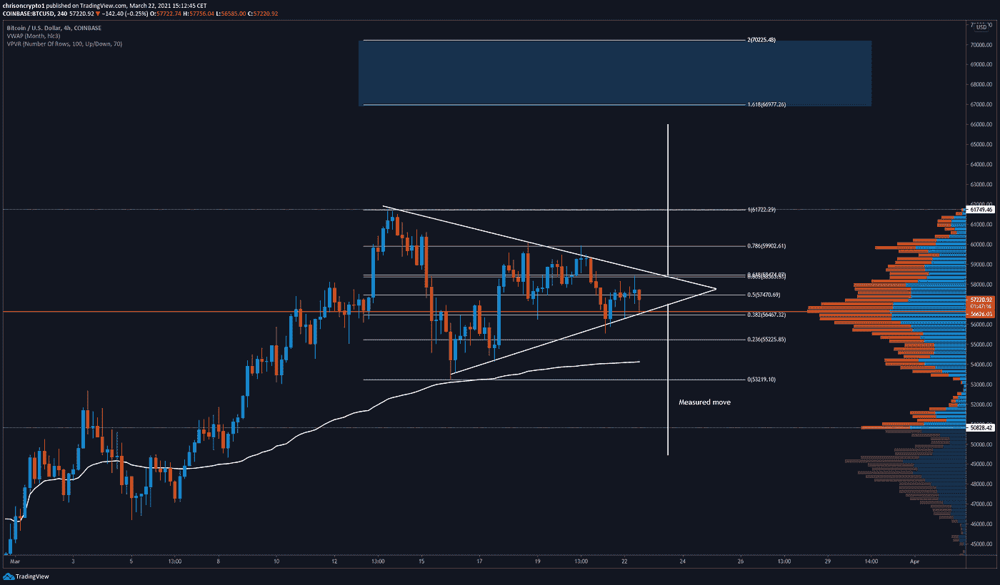
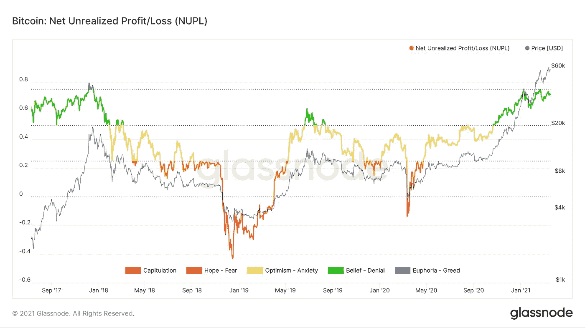
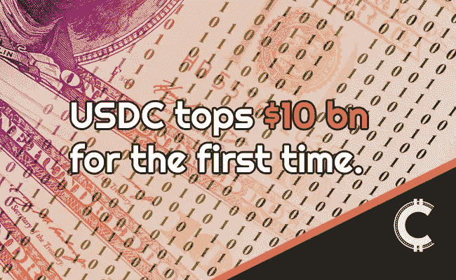

# 比特币在一个区间内波动，为大突破做准备！

> 原文：<https://medium.com/coinmonks/bitcoin-coils-up-within-a-range-in-preparation-for-a-major-breakout-5db46784c535?source=collection_archive---------2----------------------->

目前，共有 600 亿美元的美元资产在流动，其中 USDT 和 USDC 占据了行业中使用最广泛的法定加密资产的最大份额。与此同时，比特币的决策时间很快就要到了，因为它可能会陷入一场迫在眉睫的爆炸性走势。

我们来挖一下。

# USDC 首次超过 100 亿美元的供应量

美元硬币(USDC)供应量首次超过 100 亿美元，按市值计算达到了 Tether 供应量的 1/4。

Block 最近的 stablecoin research [报告](https://www.theblockcrypto.com/post/97769/stablecoins-bridging-the-network-gap-between-traditional-money-and-digital-value-brought-to-you-by-gmo-trust)显示，比特币基地和 Circle 成立的财团 CENTRE 于 2018 年 9 月首次发布了 USDC，获得了 4500 万美元的额外资金，以进一步开发该项目。

USDT 和 USDC 一起构成了法定加密资产的最大份额，它们的采用正随着收益率驱动的金融产品(由[瑞士堡和其他](https://join.swissborg.com/r/christEDW2)提供)而加速。总的来说，USDC 用于北美时区，而 Tether 继续主导亚太地区。

**查看** [完整故事点击](https://chrisoncrypto.com/blog/f/usd-coin-circulating-supply-surpasses-10-billion) **！**

***在发布时获取此分析。*** [***加入邮件列表***](https://chrisoncrypto.com/) ***！***

# 技术上来说

## 36 小时后 BTC 越狱？

比特币正在窄幅整理，可能会在未来 36 小时内做出决定性的举动。

根据下图，价格已经在交易量加权平均价格(VWAP)指标之上交易，该指标通常被交易者和投资者用作被动投资基准。简而言之，VWAP 是一种资产在交易期限内的平均交易价格。

除了在 VWAP 上方找到支撑之外，BTC/美元在 VPVR(成交量曲线)表示的控制点上方交易。控制点是交易量最大的点，它是价格关注的重要支撑位或阻力位。

此外，许多交易者和分析师指出了 4 小时时间框架中的三角旗结构，随着该结构的成熟，价格会出现对称的较低高点和较高低点。

从技术上来说，这是一面看涨的三角旗，通常暗示着看涨的延续。在这种情况下，BTC/美元的目标是 66，000 美元及以上。相反，可能性较小的情况(根据标准技术分析)表明，一旦确认故障，价格标签为 49，000 美元。

**要观看的关卡**

*   超过 58，417 美元的 4 小时收盘价表明将向 66，000 美元-70，000 美元移动。
*   低于 56，461 美元的 4 小时收盘价(或 55，530 美元的日均线)表明回调到 50，000 美元到 49，000 美元。

## **最后的想法**

各种看涨和看跌的观点都强烈支持这两种情况。然而，现实是，没有人知道未来，但一个人可以为任何发生的事情做准备，并有信念，无论发生什么。

也就是说，[连锁数据](https://twitter.com/santimentfeed/status/1373746353801678850)继续显示，在这些价格水平下，鲸鱼仍在积累，这意味着数百万富翁和数十亿美元的基金想要比特币，并认识到其随着时间的推移大幅升值的潜力。为了让鲸鱼继续积累比特币，它们需要其他人出售。一旦大玩家对他们的投资组合配置和进场价格满意，价格就更有可能上涨。

尽管如此，如果比特币掉头向下，出现“80%修正”的“新熊市”的呼声有 100%的可能性会变得很强烈。我一分钟都不认为这样的电话会被批准，原因如下:

1.  链上数据，如净未实现利润/亏损图没有过热(这是几个指标之一，如 mvrv-z 得分)。
2.  比特币尚未从 20 周指数移动平均线(EMA)反弹。第一次触及这个价位时，价格可能会反弹。
3.  交易所的 BTC 余额持续下降(即总体而言，鲸鱼正在积累比特币，并将其从交易所转移到私人存储中)。
4.  像 Square 和特斯拉这样的机构不会买入卖出 10%的移动。他们将持有成千上万的比特币，如果不是更多的话，因为未来他们将拥有世界货币协议和价值储存的一部分——风险/回报是天文数字。
5.  以太坊还没有变成抛物线，这进一步证明了这个周期还没有结束。请记住，瑞士联邦理工学院是成为未来金融市场基础层的领跑者。

我可以继续。一些分析师会滔滔不绝，创造一个完整的单词沙拉，基本上是告诉你价格会上涨或下跌，并在那里停下来——但现实是，一个糟糕的计划总比没有计划好。如果你没有计划，你的分析是没有价值的，因为在最激烈的时刻，你会表现得像一个手无寸铁的平民——这不是我们在这里做的。我们预测、计划和支配。

因此，没有理由担心价格是否会下降。现在是时候根据你的目标调整这两种情况下的风险敞口了——从长远来看，用多余的资金低价买入或利用强势从来都不是一个坏主意。

既然趋势没有改变，那么更高的价格是更有可能的(直到他们没有改变)。

公牛领路。

下次再见。

**加入** [电报](https://t.me/chrisoncryptochannel) **频道进行实时更新！
关注我** [推特](https://twitter.com/ChrisOnCrypto1) **&** [多嘴多舌](https://gab.com/chrisoncrypto) **下面还有我的社交门户。**

[https://www.paypal.com/donate?hosted_button_id=C9VRLGTBHQX2N](https://www.paypal.com/donate?hosted_button_id=C9VRLGTBHQX2N)

# 阅读更多信息:美元硬币流通供应量超过 100 亿美元

[https://chrisoncrypto.com/blog/f/usd-coin-circulating-supply-surpasses-10-billion](https://chrisoncrypto.com/blog/f/usd-coin-circulating-supply-surpasses-10-billion)

[http://www.chrisoncrypto.com/](http://www.chrisoncrypto.com/)

你也可以用比特币支持我！
**BTC** 地址:**3 eydseypjhn 68 axkncuqbb 7 ebqcxrejamr**

最诚挚的问候，
T21 克里斯托
克里斯托
上的加密创始人[www.cityam.com](https://www.cityam.com)上的
直接接通:[电报](https://t.me/chrisoncrypto)

*最初发布于*[*https://mailchi . MP*](https://mailchi.mp/569d1cacf3e5/bitcoin-coils-up-within-a-range-in-preparation-for-a-major-breakout?e=[UNIQID])*。*

> 加入 coin monks[Telegram group](https://t.me/joinchat/EPmjKpNYwRMsBI4p)学习加密交易和投资

## 另外，阅读

*   [什么是融资融券交易](https://blog.coincodecap.com/margin-trading)
*   最好的[密码交易机器人](/coinmonks/crypto-trading-bot-c2ffce8acb2a) | [网格交易](https://blog.coincodecap.com/grid-trading)
*   [3 商业评论](/coinmonks/3commas-review-an-excellent-crypto-trading-bot-2020-1313a58bec92) | [Pionex 评论](/coinmonks/pionex-review-exchange-with-crypto-trading-bot-1e459d0191ea) | [Coinrule 评论](/coinmonks/coinrule-review-2021-a-beginner-friendly-crypto-trading-bot-daf0504848ba)
*   [AAX 交易所评论](/coinmonks/aax-exchange-review-2021-67c5ea09330c) | [德里比特评论](/coinmonks/deribit-review-options-fees-apis-and-testnet-2ca16c4bbdb2) | [FTX 交易所评论](/coinmonks/ftx-crypto-exchange-review-53664ac1198f)
*   [n 零复习](/coinmonks/ngrave-zero-review-c465cf8307fc) | [Phemex 复习](/coinmonks/phemex-review-4cfba0b49e28) | [PrimeXBT 复习](/coinmonks/primexbt-review-88e0815be858)
*   [Bybit Exchange 审查](/coinmonks/bybit-exchange-review-dbd570019b71) | [Bityard 审查](/coinmonks/bityard-review-7d104239be35) | [CoinSpot 审查](https://blog.coincodecap.com/coinspot-review)
*   [3 commas vs crypto hopper](/coinmonks/3commas-vs-pionex-vs-cryptohopper-best-crypto-bot-6a98d2baa203)|[赚取加密利息](/coinmonks/earn-crypto-interest-b10b810fdda3)
*   最好的比特币[硬件钱包](/coinmonks/the-best-cryptocurrency-hardware-wallets-of-2020-e28b1c124069?source=friends_link&sk=324dd9ff8556ab578d71e7ad7658ad7c) | [BitBox02 回顾](/coinmonks/bitbox02-review-your-swiss-bitcoin-hardware-wallet-c36c88fff29)
*   [莱杰 vs n rave](/coinmonks/ledger-vs-ngrave-zero-7e40f0c1d694)|[莱杰 nano s vs x](/coinmonks/ledger-nano-s-vs-x-battery-hardware-price-storage-59a6663fe3b0)
*   [密码本交易平台](/coinmonks/top-10-crypto-copy-trading-platforms-for-beginners-d0c37c7d698c)
*   [CoinLoan 审核](/coinmonks/coinloan-review-18128b9badc4) | [YouHodler 审核](/coinmonks/youhodler-4-easy-ways-to-make-money-98969b9689f2) | [BlockFi 审核](/coinmonks/blockfi-review-53096053c097)
*   最好的[加密税务软件](/coinmonks/best-crypto-tax-tool-for-my-money-72d4b430816b) | [硬币追踪评论](/coinmonks/cointracking-review-a-reliable-cryptocurrency-tax-software-5114e3eb5737)
*   最佳[加密借贷平台](/coinmonks/top-5-crypto-lending-platforms-in-2020-that-you-need-to-know-a1b675cec3fa) | [杠杆代币](/coinmonks/leveraged-token-3f5257808b22)
*   [BlockFi vs Celsius](/coinmonks/blockfi-vs-celsius-vs-hodlnaut-8a1cc8c26630)|[Hodlnaut 回顾](/coinmonks/hodlnaut-review-best-way-to-hodl-is-to-earn-interest-on-your-bitcoin-6658a8c19edf)
*   [Bitsgap 审核](/coinmonks/bitsgap-review-a-crypto-trading-bot-that-makes-easy-money-a5d88a336df2) | [Quadency 审核](/coinmonks/quadency-review-a-crypto-trading-automation-platform-3068eaa374e1) | [Bitbns 审核](/coinmonks/bitbns-review-38256a07e161)
*   [埃利帕尔泰坦评论](/coinmonks/ellipal-titan-review-85e9071dd029) | [赛克斯斯通评论](/coinmonks/secux-stone-hardware-wallet-review-15-discount-coupon-2020-7577032faa6e)
*   [本地比特币审核](/coinmonks/localbitcoins-review-6cc001c6ed56) | [加密货币储蓄账户](https://blog.coincodecap.com/cryptocurrency-savings-accounts)
*   最佳[区块链分析](https://bitquery.io/blog/best-blockchain-analysis-tools-and-software)工具| [赚比特币](/coinmonks/earn-bitcoin-6e8bd3c592d9)
*   [加密套利](/coinmonks/crypto-arbitrage-guide-how-to-make-money-as-a-beginner-62bfe5c868f6)指南| [如何做空比特币](/coinmonks/how-to-short-bitcoin-568a2d0b4ae5)
*   最佳[加密制图工具](/coinmonks/what-are-the-best-charting-platforms-for-cryptocurrency-trading-85aade584d80) | [最佳加密交易所](/coinmonks/crypto-exchange-dd2f9d6f3769)
*   [如何在印度购买比特币？](/coinmonks/buy-bitcoin-in-india-feb50ddfef94) | [WazirX 评论](/coinmonks/wazirx-review-5c811b074f5b)
*   [印度比特币交易所](/coinmonks/bitcoin-exchange-in-india-7f1fe79715c9) | [比特币储蓄账户](/coinmonks/bitcoin-savings-account-e65b13f92451)
*   [CoinDCX 评论](/coinmonks/coindcx-review-8444db3621a2) | [加密保证金交易交易所](https://blog.coincodecap.com/crypto-margin-trading-exchanges)

> [在您的收件箱中直接获得最佳软件交易](/coinmonks/newsletters/coinmonks)

