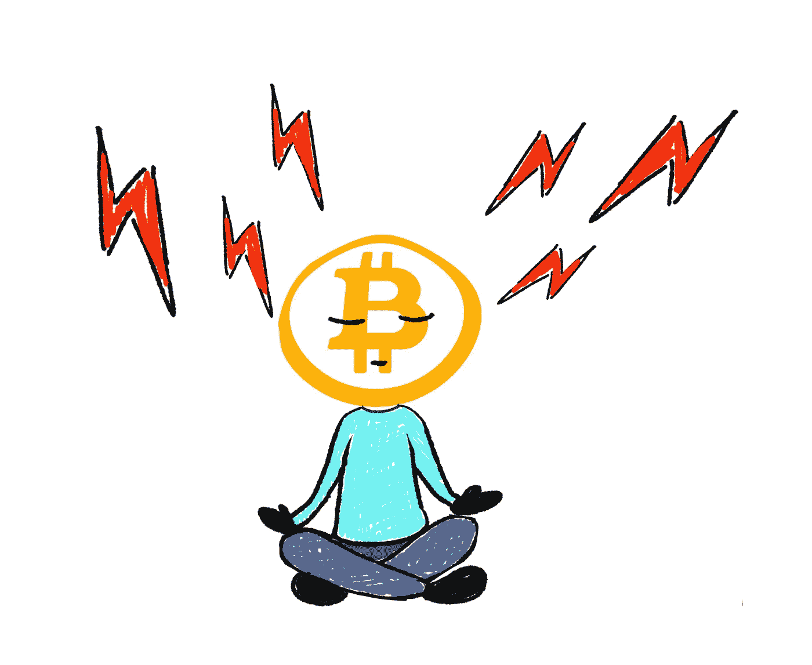
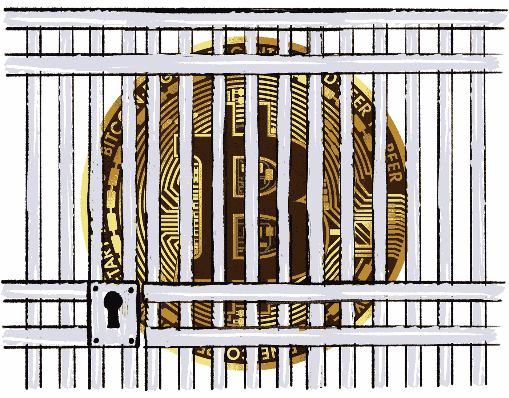
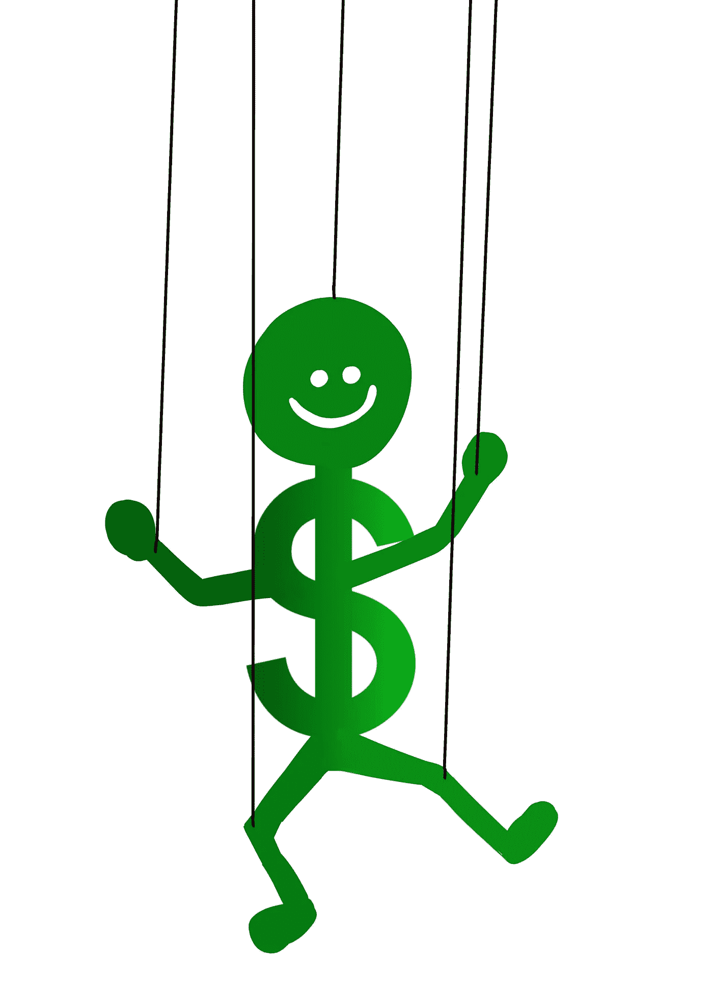
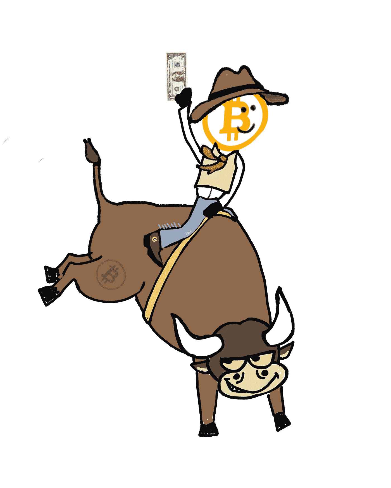
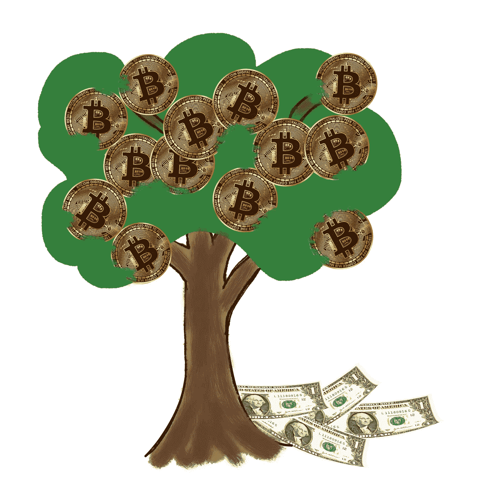
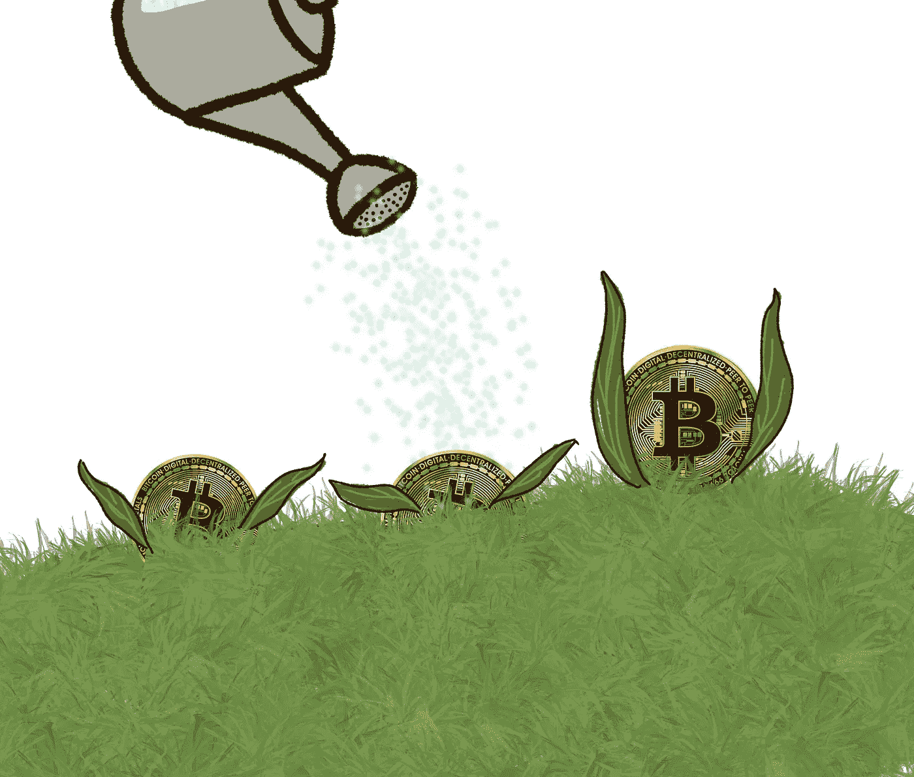
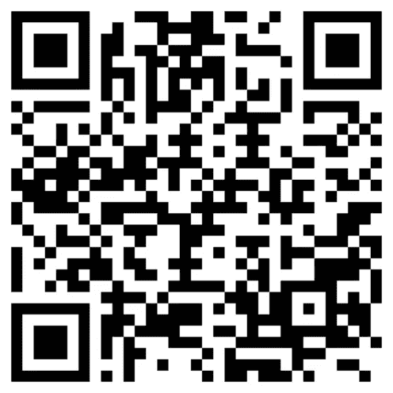

# 比特币:常见的误解

> 原文：<https://medium.com/coinmonks/bitcoin-common-misconceptions-593bd22357d?source=collection_archive---------5----------------------->

## 尽你最大的努力去忽略这些噪音

A Bitcoin State of Mind **(drawing by the author)**

比特币或许是最具争议的资产，针对它的明显无情的错误信息运动简直势不可挡。人们对此如此警惕也就不足为奇了。在这里，我希望帮助消除至少一些最常见的误解传播的媒体和误传或恶意行为者在权力和影响的地位。

> **“你有敌人吗？为什么，这是每个人的故事，谁做了一件伟大的事情或创造了一个新的想法。是云在所有发光的东西周围打雷。名声必定有敌人，正如光明必定有蚊蚋。不要为此烦恼；不屑。让你的心灵保持平静，就像让你的生活保持清晰一样。”**

~维克多·雨果，1845 年

现在我将陈述每一个最**常见的误解**(在我看来)，然后用我的**论据反驳它们**。有许多内容丰富、写得很好的资源贯穿全文(也列在“来源”下面)，我强烈建议您全部阅读。不要让蚊蚋遮住你的视线。

# **“比特币是庞氏骗局”**

美国证券交易委员会将庞氏骗局定义为“用从新投资者那里收集的资金支付现有投资者的投资欺诈。庞氏骗局的组织者经常承诺投资你的钱，并产生高回报，几乎没有风险。但在许多庞氏骗局中，欺诈者并不投资这些钱。相反，他们用它来支付那些较早投资的人，并可能为自己保留一些。

由于几乎没有合法收入，庞氏骗局需要源源不断的新资金才能生存。当招募新投资者变得困难时，或者当大量现有投资者套现时，这些计划往往会崩溃 **(Investor.gov，2019)** 。"

比特币是开源的，去中心化的。随着需求和采用的增加，网络上的价值也在增加，价格反映了这一点。区块链对所有人都是透明的，可以在几乎任何个人电脑上运行，以执行比特币协议，并进一步增加网络的安全性和分散性。正如 [Satoshi 的比特币白皮书](https://bitcoin.org/bitcoin.pdf)中明确概述的那样，它是作为**数字稀缺和货币集中控制问题的解决方案而创建的。比特币背后没有个人或团体试图恶意卷走更多买家，以“回报更早的投资者”。比特币作为一种价值储存手段，作为有史以来最难的货币技术，作为法定货币的可行替代品，带来了真正不可复制的价值——特别是对更加公开压迫的国家**的个人而言。庞氏骗局什么也没带来，称比特币为比特币充其量是懒惰。****

# **“比特币存在泡沫。”**

当投资者(以及央行通过信贷扩张)将资产价格推高至远高于其“内在价值”时，泡沫就产生了。当人们对资产失去信心时，它们就会爆裂；当新投资者不再认为价格合理时；或者由于市场的恐惧 **(Kenton，2018)** 。说“比特币存在泡沫”意味着其价格目前高于其内在价值，但没有人确切说出其内在价值是多少。比特币仍然是一种年轻的资产，并将继续增长，这是由它现在不可阻挡的网络效应推动的，因为越来越多的人了解到它不可改变的最高价值主张——再次，作为价值储存手段；作为对传统金融体系的对冲；也是通往真正财务自由的捷径。内在价值的本质可能是高度主观的，特别是对于不产生现金流的资产，但对于比特币来说，从网络上获得的货币能量的累积潜力来考虑可能是有用的*(CPME)。*

*我相信我们可以从比特币的 CPME 推断出它的内在价值。这个数字可能大约是它达到稳定点的价格。例如，如果比特币的市值与其同类硬通货黄金(约 12 万亿美元)相当(不考虑金属市场操纵)，我们可以预计每枚比特币的价格将超过 50 万美元。黄金在这里是一个合乎逻辑的比较，因为它是硬通货市场潜在规模的粗略指南——它是比特币之前最难存在的货币。从更广泛的角度来看这一价值，我得出了一个先验的结论，即**比特币肯定没有泡沫，**而且实际上交易价格有很大折扣(即使我们对 CPME 的估计仍然保守)。如果我们想象比特币达到全球储备货币地位，那么目前对未来价值的折价就更加可观。我必须说，价格预测很少是准确的，甚至是有帮助的，但在这种情况下，提供了一些非常需要的背景。*

*有些人说“比特币存在泡沫”，只是因为他们出于无知认为比特币“太贵了”。然而，他们忽略了硬通货的一个非常重要的方面:它的高度可分性。每个比特币可以被 1 亿个 satoshi 整除——这甚至比美元更容易被整除。如果你能买得起一粒米，那么你现在就能拥有一小部分比特币。与普遍看法相反，你不必全额购买比特币。*

*你经常听到人们将比特币与郁金香狂热或互联网股票相提并论，但与这些不同的是，比特币在每次市场崩盘后都反复复苏，并在其 13 年的历史中继续达到新的采用水平 **(Timi Ajiboye 等人，2019 年，第 85-86 页)**。趋势是上升的，而**这里的教训很简单:hodl。***

*没有比短视和高度时间偏好投资更容易亏损的方法了。后退一步，从整体上评估这幅图(Spitznagel，2013) 。*

# ***“比特币对环境有害。”***

**

***All of this energy** is going toward securing a network which serves to **bank the unbanked**, and to give **a way to build wealth for countless people living under oppressive government**, constantly living in fear that their money could be stolen physically or through devastating supply inflation **(drawing by the author)***

*这可能是所有话题中最有争议的话题，但也是我最感兴趣的话题。我们经常听到这种针对比特币的争论，但是**我们当前的通货膨胀货币体系对环境‘有益’吗？如果不是，那么系统带给我们的价值值不值？**我认为肯定不是。当央行向市场注入流动性，并通过信贷扩张人为压低利率时(结果暗中窃取了我们的购买力)，商品和服务的消费就会不自然地增加。这种市场扭曲向参与者发出了错误的价格信号，并不适当地推动了生产。当系统失去动力时，央行必须向其注入越来越多的货币来维持运转。干预主义和货币干预创造了一个总是需要更多货币才能生存的世界 **(Spitznagel，2013，第 197-202 页)——**一个看似永无止境的死亡通胀螺旋，毫无疑问已经造成了可怕的环境和社会后果。这是一个旨在以牺牲大多数人的利益为代价，让少数人受益的系统——我们认为这是必要的，因为我们被告知这是唯一的选择。*

*法定货币没有供应限制，并且完全由中央货币政策控制，由于缺乏替代方案，它只能通过强制手段向“人民”(固定收入者、储户，尤其是那些资产贫乏者)提供它所能提供的价值。这个体系的真正价值不可否认地流向了富人(那些资产丰富的人)，流向了掌权者——进一步充实他们的口袋，并以我们为代价资助无休止的战争。‘为了少数人的利益，牺牲多数人的利益’应该是他们的座右铭。*

*计算货币通胀的环境成本绝非易事，但不言而喻，成本是巨大的。战争是无法控制的通货膨胀的主要动力之一，它对环境有着毁灭性的影响(更不用说无数生命的无谓损失了)。仅美国国防部就是世界上最大的石油消费国，也是世界上最大的温室气体排放国之一**(让桑，2019)** 。战争导致二氧化碳排放增加，对景观和动物生命的毁灭性破坏，空气和土壤污染，等等 **(Weir，2020)** 。没有货币通胀，战争根本不可能发生。“获得发动全面战争所需的材料需要政府支出和贸易赤字，其规模在金本位制度下是不可能的，在金本位制度下，货币供应和信贷由黄金储备水平决定。随着黄金离开欧洲以支付进口物资，那里将会发生信贷紧缩，以至于经济崩溃将不可避免，战争也不可能进行 **(Duncan，2005 年，第 54-55 页)**。对于战争来说，货币供应的膨胀是一种不可避免的灾难(毫不夸张)。*

*[根据剑桥替代金融中心](https://cbeci.org/)的数据，比特币的消费量约为 **143 TWh** (截至 2021 年 5 月)，约占全球发电量的 0.5%——超过了阿根廷等小国。中国在 2019 年消耗了大约 **6500 TWh** ，各州大约为 **4000** 。你可能认为比较抽象的功耗数字没有什么价值，你是对的。然而，它强调了许多人似乎忽视的一个非常重要的问题。**单看功耗几乎不能说明什么**…功耗是一种浪费吗？能量的来源是什么？消费给世界带来了什么价值，值得吗？*

*比特币有许多高价值的使用案例。由于利润率和运营流动性较低，矿商有动力转向可用的最便宜的电力。这往往会导致矿工到更偏远的地方，那里有以前无法获得或不方便的能源。这意味着**采矿实际上是将能源货币化，否则能源会被浪费掉**。将多余的能量(产生的能量超过所需或可以储存起来以备后用的能量)转化为比特币！**采矿过程中使用的几乎 75%的能源来自可再生资源**(即环境成本相对较小的能源)，如太阳能、风能，全球至少 60%来自水电。这是对进一步生产这些可再生能源的一个巨大的、通常被低估的激励。比特币采矿正在推动可再生能源领域的进一步创新和生产，但你不会在新闻上听到这些 **(Timi Ajiboye et al .，2019，PP . 89–91)**。*

*对于我们这些生活在相对自由的国家的人来说，出于环境考虑(和其他 fud)而避开比特币可能很容易，只需耸耸肩“它不值得花费精力”，但对许多人来说，这是通往财务自由以及随后的个人自由的唯一途径。*

# ***所有这些能源都将用于保护一个网络，该网络为无银行账户的人提供银行服务，并为无数生活在压迫性政府下的人提供一种建立真实、不可没收的财富的方法，这些人一直担心他们的钱可能会被盗走或通过毁灭性的供应通胀被盗** (Saifedean Ammous，2018 年，第 200-205 页)**。***

*工具产生更好的工具，每一次技术革新都会带来更大的能源需求。通货紧缩推动了地球上生活质量的不断提高和改善**(布斯，2020)** 。请发表这些反对比特币言论的人也放弃他们的汽车、洗衣机、冰箱、电脑和手机。拒绝人们使用这些工具就是拒绝生活本身，而遗留的金融体系及其支持者正在这样做([)，并且在做这件事的时候使用了更多的能量！](https://www.coindesk.com/whats-the-carbon-footprint-of-fiat-money))。技术正在推动世界变得更少工作、更快乐，这对环境来说可能是一个巨大的福音——如果我们让它发生的话*

# ***“比特币将被政府禁止。”***

*虽然政府可以对比特币进行定罪或监管，但他们无法阻止人们使用比特币。他们能希望做的最好的事情是成功地执行一次一致攻击，并最终不可挽回地诋毁网络的声誉(这当然不能保证)。为了做到这一点，攻击者必须控制和维持大部分的哈希速率，然后他们可以“只影响最近的块，并在创建未来的块时造成拒绝服务中断 **(Antonopoulos 和 O'reilly Media，2018 年，第 270-273 页)**然而，他们无法“窃取比特币，在没有签名的情况下使用比特币，重定向比特币，或以其他方式改变过去的交易或所有权记录……一个资金充足的攻击者可以通过同时收集采矿硬件，危害池运营商，并通过拒绝服务攻击其他池来攻击比特币的共识 **(Antonopoulos，第 270-273 页)**，但这需要大量的资金和资源才能实现(随着哈希能力的指数增长，这变得越来越困难)；利润回报将不复存在；袭击发生后，比特币网络可能会变得更加强大。*

*政府有尽一切努力阻止或限制任何威胁其中央控制的行为的记录——比如美国总统富兰克林·罗斯福在 1933 年签署的禁止在美国境内囤积黄金的第 6102 号行政命令。但是让我们记住:**历史上没有法定货币幸存** ( [在这里阅读这篇有趣的文章](https://news.bitcoin.com/how-fiat-money-fails-deconstructing-the-governments-paper-thin-promise/#:~:text=Fiat%20money%20has%20a%20surprisingly,assets%20like%20gold%20have%20survived.))。人民选择的硬通货占了上风。*

**

*Lock me up and throw away the key — it’s already too late to stop what I’ve started **(drawing by the author)***

***比特币没有单点故障**。像互联网一样，像所有分散的网络一样，它不能简单地被关闭。*

> *我不相信在我们把这些东西从政府手中拿走之前，我们还会有一大笔钱，也就是说，我们不能粗暴地把它们从政府手中拿走，我们所能做的就是通过某种狡猾的迂回方式引进一些他们无法阻止的东西*

*~弗里德里希·哈耶克**，** 1984*

***那个‘东西’可能只是比特币……***

# ***“比特币是给罪犯用的。”***

*你不能否认比特币没有被犯罪分子利用——这是有据可查的。但这仍然是一个完全没有争议的问题。任何东西都可能被犯罪分子利用——从互联网、电话、加密货币、厨房用具，以及最突出的……法定货币！你有没有听到有人呼吁禁止电话或互联网，因为罪犯使用它们(可能，但你明白我的意思)？实际上，**最大的金融犯罪是由受监管的金融机构实施的。阅读更多关于一些最著名的银行丑闻[这里](https://www.fool.com/slideshow/5-biggest-bank-scandals-past-5-years/?slide=2)和[这里](https://www.dw.com/en/deutsche-banks-biggest-scandals/a-54979535)，然后问:**“为什么他们能够支付罚款(可能少于所获利润)，然后照常营业？”办公室里的又一天。*****

*联合国毒品和犯罪办公室估计，每年通过我们“高度监管”的银行系统洗钱的金额高达 2.4 万亿美元，而这还只是我们了解到的情况。可以肯定地说，犯罪分子(最明显的是我们的银行)更喜欢法定刑。比特币……没那么多。*

> *“洗钱的目标是创造一个无法追踪的交易链，因此，由于比特币区块链的设计目的是拥有所有交易的不可磨灭的公开记录，这使得‘洗钱’变得更加困难……椭圆和 Chainanalysis 等[区块链分析]公司的技术也非常复杂。他们可以很好地追踪(钱包)地址，这也使执法更容易 **(Silva，2019)** 。*

*~ coin routes 首席执行官戴夫·韦斯伯格*

**

*And for the banks the money dances — out of your pocket and into theirs **(drawing by the author)***

# ***“那所有的山寨币呢？”***

*去到[coinmarketcap.com](https://coinmarketcap.com/)，你会发现列出了数千种加密货币。是什么让比特币如此特别？这些币都是在和比特币竞争吗？*

*让我们首先简要地谈一谈好的储值手段的主要特征:**持久性、便携性、可替代性、可验证性、可分性、稀缺性和抗审查性**。比特币是有史以来最完美的货币技术，它的“完美构想”故事是将这一切联系在一起的纽带。没有可以想象的替代方案。深入探究这些特征超出了本文的范围，但我强烈建议你读一读 Vijay Boyapati 的精彩文章《看好比特币》(如果你还没有读的话)。*

***硬数字货币必须去中心化，不受第三方影响**。比特币的创造者，笔名中本聪，从未被确认过，也可能永远不会被确认(现在已经超过 10 年了)。Satoshi 创建了世界上第一个用于分散式对等网络的协议，该协议创建了**共识，而不需要中央机构来提供信任**。现在没有人，甚至造物主，能改变这一点。这种创造的纯粹性，或者说“无原罪”很难复制 **(Edstrom，2019，第 164-165 页)**。*

*一名据称与 Nakamoto 密切合作的程序员多次试图改变块大小，但都无济于事，因为没有达成共识，所以没有进行更改。这就是比特币的魅力:真实、无情、不变的民主。一个不可信的网络正在逼近 1 万亿美元的货币能量！随着它的发展，它变得越来越安全——就硬数字货币而言，越大越好，因为许多较小的加密货币更容易受到一致攻击。*

*比特币作为一种硬数字货币取得了成功，这完全是因为它的优点。它没有营销团队(除了投资者)，没有首席执行官，没有幕后的人。**它解决了一个问题，人们看到了这一点，并为此提出了需求**。大多数山寨币更像是科技公司，开发令人兴奋的区块链新产品，拥有营销团队和首席执行官。它们不是硬钱，大多数也不想成为硬钱。在这些网络上发行的许多代币都面临着困扰法定货币的同样问题，比如中央控制和无限制的供给膨胀(Dogecoin 就是一个不幸的例子)。然而，错误的观念仍然存在，认为这些替代币与比特币直接竞争。*

*说以太坊或 Doge 与之竞争，就相当于说 Costco 在和 Square 竞争，或者说苹果在和 Delta 竞争(在这一点上，如果苹果确实进入了航空业务，也不会太令人惊讶，但你明白我的意思)。是的，它们都是公司，但它们并不都是专注于消费电子和软件的科技公司。这就是苹果的用途。*

*央行和政府在历史上一直反对威胁或破坏其控制的替代货币。杰米·戴蒙(Jamie Dimon)和沃伦·巴菲特(Warren Buffet)等银行附属机构如此公开反对比特币和加密技术，任何人都不会感到惊讶。背后有众所周知的创造者/程序员的山寨币很容易成为政府不可避免的审查或强制的目标。比特币有自己的代言人，但不依赖任何代言人。总的来说，代用币存在着领导集权或分类账集权的问题。*

*硬通货不需要不断的节制，也不需要背后专门的团队。它独立，不立则倒。在金钱游戏中，**龙总是赢**。*

**

*The Bitcoin dragon devours all in his path **(drawing by the author)***

*这并不是说替代硬币没有一些有趣的用例，但对于硬数字货币来说，根本没有竞争。黄金作为硬通货经受住了时间的考验是有原因的。它只是具有使其成为高级价值储存手段的必要特征，结果它消耗了价值近 12 万亿美元的货币能量。[如果你还没有看过，你应该看看迈克尔·塞勒和弗兰克·朱斯特拉之间精彩的“黄金 vs 比特币”辩论。](https://www.youtube.com/watch?v=coHC_9ApBdg) Altcoins 可能会被证明为世界上的其他目的服务，但如果它们试图与比特币之龙**竞争，它们将无法生存。***

*为了取代比特币成为数字硬通货，必须存在一种更硬、更安全的货币，然后它必须足够硬和安全，以保证比特币的价值转移到它身上。这是不可思议的。比特币价值近 1 万亿美元，从未被黑客攻击或泄露过。你会把你的比特币财富转移到另一个不太安全的区块链，还是把它放在人类历史上最安全的网络上？您会将这一价值押在一个可能出现单点故障的更加集中的区块链上吗？为什么要用有史以来最难抵御审查的货币技术来换取一种较弱的技术呢？正如迈克尔·塞勒所说，这是“卖赢家买输家”。*

# ***“央行发行数字货币将杀死比特币。”***

*最近，我们都听到了很多关于 CBD 的讨论，但是它们到底是什么样子还不清楚。无论如何，无论法定货币采取何种形式，同样的问题将会持续存在，而且只会恶化。“有了 CBDC，美联储可以以数字直升机货币的形式直接向人们发行第二层货币 **(Nik Bhatia，2021，第 137 页)**”——听起来像是通往普遍基本收入和绝对全球主义威权主义的便捷途径。*

*央行永远不会心甘情愿地放弃对货币的控制权。相反，我认为完全数字化的法令会从人民手中夺走更多的控制权和隐私，赋予中央银行和政府无所不知的货币权力。这只会让人想起技术官僚的反乌托邦形象。*

**

*The government & the people — which is which? **(drawing by the author)***

*让央行和政府玩他们的权力游戏吧。CBDCs 只会被添加到与比特币“竞争”的 altcoins 的洗衣清单中。越来越多的人开始质疑法定货币和货币干预主义，我希望这一趋势将继续下去。*

> *“比特币是抗脆弱的，因为它在美元金字塔内的全球货币混乱中蓬勃发展，并且能够抵御来自不屑一顾的官僚实体的威胁、诽谤和立法。比特币的简单事实是，没有人控制它。它已经成为有史以来第一种不受政府约束、普遍可用的数字货币。出于这些原因，纯数字领域的所有货币都将面临 BTC 价格发现 **(Nik Bhatia，第 145 页)***

*格雷欣法则指出**‘劣币驱逐良币’**。比特币(好的)将继续被积累和持有，而 CBDCs(坏的)只会加剧这一点——一场获取世界上最稀缺和安全的数字资产的竞赛。*

# ***“比特币波动太大，不适合作为价值储存手段，只适合投机者。”***

*如果你害怕波动，并且患有近视，那么比特币可能不适合你。如果我们缩小一下，我们可以看到比特币是过去十年中表现最好的资产——每年升值 150 %- 200 %(相比之下，标准普尔 500 指数在过去 10 年的年平均回报率为 13.6%**。波动性将继续成为其快速增长的一部分，因为投机者以弱势手为代价进出交易。没有中央权力机构来控制或维持价格稳定，因此波动性只是与生俱来。***

# ***以下是你的选择:存波动性大、购买力提升潜力大的比特币；或者拯救法定货币，没有波动性，并保证失去购买力。相对于菲亚特，一切都变得更贵，而比特币则更便宜。选择权在你。***

******

***The Bitcoin bull **(drawing by the author)*****

# *****“比特币没有任何东西支持，也没有内在价值。”*****

***根据定义，iat 货币只有在政府认定的情况下才有价值。他们在贸易和纳税中强制使用它，这是我们使用它的唯一原因。它不是因为其优越的货币属性而被选中的，在一个真正自由的市场中也不会有一席之地。***

***当人们用这个论点反对比特币时，它显示了对我们当前金融体系的普遍缺乏了解。在后金本位时代，政府发行的货币可以无限创造。 [**事实上，仅在 2020 年，估计有 22%的美元被创造出来，其中 M2 在过去 10 年翻了一番**](https://fred.stlouisfed.org/series/WM2NS) **！**然而，比特币具有终极稀缺性，其代码中不可磨灭地写着通胀时间表。不同于由力量和对发行它的政府的信任支持的法定货币，比特币得到了人们的自由支持，并受到越来越多的货币能量的支持。当你购买(或者更恰当地说，兑换成比特币)时，你实际上是在一个由不可变的代码组成的网络中保护你的货币能量，这个网络具有完全的透明度，是有史以来最安全的。***

***当你在未来听到人们用这种观点反对比特币，而他们拒绝听从理性时，我建议尝试一下我个人最喜欢的应对机制之一:只要闭上眼睛，重复“我不在这里”。***

# *****“比特币没有隐私。”*****

***鉴于最近 BIP 0341(比特币改进提案)的实施，这是一个特别相关的话题，该提案是一份提议改变核心比特币技术的文件。)***

*****比特币不是匿名的**(这再次让整个‘比特币是给罪犯用的’的论点变得相当愚蠢)。最近的殖民管道黑客攻击和随后联邦调查局追回 BTC 赎金就是明证。通过足够的侦查工作，追踪交易的源头是可能的。不容易，但是可以做到。***

*****如果我们在隐私方面将比特币与当前的支付提供商和银行进行比较**，比特币有一些明显的好处，源于它的去中心化性质。首先，它消除了对第三方信任的需要，从而消除了单点故障。不管你喜不喜欢，掌握我们个人数据的商家和机构经常出售或分享给第三方。例如， [PayPal 在此](https://www.paypal.com/ie/webapps/mpp/ua/third-parties-list)披露，它与全球数百家第三方共享消费者数据(包括姓名、地址、电话号码、出生日期、IP 地址、银行账户信息和购买情况),其中包括美国银行、摩根大通、益百利、Equifax、苹果、脸书以及欧洲消费者中心网络等政府机构。他们也完全有权根据政府和/或他们自己的标准审查他们认为不值得交易的人的交易。更不用说你的数据和资金被这些机构中的坏人窃取的可能性(尽管很小)。比特币不存在这些担忧。***

***比特币社区充满了才华横溢的开发人员，他们致力于在网络之上构建升级和层，以使网络更好、更强、更安全(就像 Taproot 一样)。这是**自组织和分散式网络蓬勃发展的原因之一**。***

# ***比特币是一个启动的网络，正如一些人试图阻止互联网一样，**抵抗将再次被证明是徒劳的**。***

******

***Like the great oak tree, Bitcoin stands triumphantly in the face of all who opposes it — ever-supported and strengthened by its ubiquitous network of roots, and imbibing every ray of sunshine that happens upon it **(drawing by the author)*****

***说到升级，最新的 BIP 0341 可能会(无缝地)改变一切。它需要一些技术上的理解才能完全掌握，但这并不是欣赏它的必要条件。使用更复杂功能(如智能合约)的比特币交易对任何人来说都是可见的，但 taproot 将有效地隐藏所有移动部分，从而使它们与其他类型的交易无法区分。换句话说，内部的复杂性被掩盖了，只是以对等交易的形式出现。更新中还包括 Schnorr 签名，它通过加密方式从多个密钥中生成简短而安全的单个签名，使多个发件人地址彼此无法区分(称为签名聚合)。 **Taproot 与 Schnorr 签名相结合，将带来重大的隐私改进，同时使交易更加数据高效(每块更多交易)，并且更便宜**。如果你有兴趣了解更多关于这次升级的信息，我建议你从[这篇来自币安](https://academy.binance.com/en/articles/what-is-taproot-and-how-it-will-benefit-bitcoin)的简短但内容丰富的文章开始，或者访问[安德里亚斯·安东诺普洛斯的 YouTube 频道](https://www.youtube.com/c/aantonop/videos)。***

***除此之外，如果你担心比特币的隐私，那么你至少应该同样担心商业支付处理商和银行的隐私，他们对账本和你的个人数据保持集中控制。***

# *****“比特币太复杂了。”*****

***所有新事物都需要时间来理解，像比特币和加密货币这样全新的东西自然需要更长的时间来理解。此外，我们使用和依赖许多东西，却不了解它们是如何工作的。以我们的法定“货币”为例。根据这项研究，几乎 30%的美国人仍然相信美元是由黄金支撑的！你认为有多少人了解部分准备金银行是如何运作的——我们当前金融体系的核心？有多少人知道内燃机是如何工作的，但是却依靠它来谋生？或者他们的个人电脑或智能手机如何工作？这就是我们有财务顾问、机械师和技术人员的原因。**开车不需要成为机械师，涉足比特币也不需要成为电脑程序员。*****

# *****“你现在进入比特币太晚了。”*****

***这是一般投资中常见的误解。5 年前你投资苹果或亚马逊股票是不是太晚了？你当时投资黄金是不是也太晚了？认为你对某项投资“为时已晚”意味着你认为采纳已经达到其全部潜力，没有更多增长空间，或者该资产目前处于泡沫之中。我认为这更多的是一个视角和时间偏好的问题，而**不耐烦的投资最有可能导致亏损和后悔。*****

******

***Bitcoin is only 13 years old — it still has its whole life in front of it…and Bitcoin lives **forever (drawing by the author)*****

***比特币的市值目前接近 7000 亿美元。客观来看，黄金和白银的市值分别约为**、12 万亿**和**、1.5 万亿**。数千年来，黄金和白银一直被用作价值储存资产，但比特币是一种可行的，并且在许多方面都是金属的高级替代品。如果比特币达到黄金的市值，其价格将超过 50 万美元(如前所述)。还是那句话，只是想一想。***

*****忽略 fud 和短期价格运动**，关注事实。链上指标([可在此研究](https://studio.glassnode.com/metrics?a=BTC&m=addresses.ActiveCount))向我们展示了采用率和散列率呈上升趋势，因此网络变得越来越安全([什么是散列率，为什么它如此重要？](https://www.coindesk.com/what-does-hashrate-mean))。***

> *****“比特币是一群为智慧女神服务的网络黄蜂，以真理之火为食，在一堵加密能量墙的背后，以指数方式变得越来越聪明、越来越快、越来越强”*****

***~Michael Saylor，MicroStrategy 的首席执行官***

***作为一个题外话:我坚信时机的考虑对任何成功的投资策略都是至关重要的，我个人使用平均成本。这包括通过每天、每周或每月购买适当数量的比特币(占你收入或总配置目标的百分比)，缓慢但有条不紊地建立头寸。这有助于消除等式中棘手的时间因素，并使事情变得简单。在场外有一些现金来利用沿途的下跌也是有帮助的！***

# ***为什么这些误解仍然存在？***

***许多富人和有影响力的人有明显的经济和社会动机来维持现状。银行和银行投资者依赖于围绕我们遗留的金融体系建立的基础设施，可以理解他们会保护这一体系。大多数高净值个人在当前体系中拥有既得利益，比特币对这一体系及其产生的收入构成了直接威胁。***

***当媒体来源或高调人物宣传或贬低任何东西(不仅仅是比特币)时，我们必须质疑他们的动机。他们是完全透明和真实的，还是有其他利益(财务或其他)？正如纳西姆·塔勒布在*游戏中的皮肤* : **中所写的，“不要告诉我你的想法，告诉我你的投资组合中有什么。”*****

***沃伦·巴菲特，比特币的憎恨者:“加密货币基本上没有价值，它们不产生任何东西。他们不繁殖，他们不能给你寄支票，他们什么都不能做，你所希望的是以后有人会出现并为他们付给你更多的钱，但是那个人有问题。就价值而言:零。”(美国消费者新闻与商业频道，2020 年 2 月)***

*****他的投资组合中超过 30%是金融服务业。他的第二大持股是美国银行，占其投资组合的 10.8%(截至 2020 年 8 月 4 日)*****

***杰米·戴蒙(Jamie Dimon)，比特币的憎恨者:“我不关心比特币。我对它没有兴趣。”(华尔街日报首席执行官理事会峰会，2021 年)。***

***除了是摩根大通(美国四大银行中最大的一家)的董事长兼首席执行官，他还是其最大的股东之一。***

***痛恨比特币的珍妮特·耶伦(Janet Yellen):“从比特币被使用的程度来看，我担心它经常被用于非法金融。这是一种效率极低的交易方式，处理这些交易所消耗的能量是惊人的。”(美国消费者新闻与商业频道采访《纽约时报》DealBook 会议，2021 年)***

***她担任过美联储的主席。***

***行动胜于雄辩，投资组合也是如此。了解比特币的事实，每当你听到相反的信息时，在质疑自己之前先质疑来源。或许有比看上去更多的东西。***

******

*****我这里接受比特币:bc1q 55 ycpyt 5 MK 2g cypdtzve 7m 4 dgmelrkafjgr 26t*****

*****来源:*****

1.  ***Hugo v .(1997 年)。Choses vues/Classique:1849–1885 年。巴黎:加利马尔。***
2.  ***Investor.gov(2019)。庞氏骗局| Investor.gov。【在线】可在:[https://www . investor . gov/protect-your-investments/fraud/types-fraud/Ponzi-scheme 查阅。](https://www.investor.gov/protect-your-investments/fraud/types-fraud/ponzi-scheme.)***
3.  ***Saifedean Ammous (2018)。*比特币标准:中央银行的分散化替代方案*。新泽西州霍博肯:约翰·威利父子公司，第 200-205 页。***
4.  ***中本聪(2008 年)。*比特币:一种点对点的电子现金系统*。【bitcoin.org 在线】*。上市地点:[https://bitcoin.org/bitcoin.pdf.](https://bitcoin.org/bitcoin.pdf.)****
5.  ****让桑河(2019 年)。*美国军方是世界上最大的石油消费国，因此也是世界上最大的温室气体排放国之一*。[在线]能源需求——可持续能源——罗德·让桑。可在:[https://energy in demand . com/2019/06/22/us-military-is-worlds-single-large-consumer-of-oil-as-a-result-one-the-worlds-top-green-gas-emitters/获取。](https://energyindemand.com/2019/06/22/us-military-is-worlds-single-largest-consumer-of-oil-and-as-a-result-one-of-the-worlds-top-greenhouse-gas-emitters/.)****
6.  ****韦尔博士(2020 年)。*战争如何破坏环境？*【在线】CEOBS。可在:[https://ceobs.org/how-does-war-damage-the-environment/.](https://ceobs.org/how-does-war-damage-the-environment/.)****
7.  ****邓肯河(2005 年)。*美元危机:原因、后果、对策。新加坡；英国新泽西州奇切斯特霍博肯:j .威利父子公司，第 54–55 页。*****
8.  ****Timi Ajiboye，Buenaventura，l .，Gladstein，a .，Liu，l .，Lloyd，a .，Machado，a .，Song，j .和 Vranova，A. (2019)。*比特币小书:为什么比特币对你的自由、财务和未来至关重要*。加州雷德伍德城:2100 万本书，第 89-91 页。****
9.  ****Spitznagel，M. (2013 年)。*资本之道:投资扭曲世界的奥地利学派*。新泽西州霍博肯:威利。****
10.  ****圣翁热，P. (2021)。 *St. Onge:法定货币的碳足迹是多少？*【在线】CoinDesk。可从以下网址获取:[https://www . coin desk . com/whats-the-carbon-footprint-of-fiat-money](https://www.coindesk.com/whats-the-carbon-footprint-of-fiat-money)【2021 年 7 月 3 日获取】。****
11.  ****西肯顿(2018)。*泡*。[在线] Investopedia。可在:[https://www.investopedia.com/terms/b/bubble.asp.](https://www.investopedia.com/terms/b/bubble.asp.)****
12.  ****布斯，J. (2020)。*明天的价格:为什么通货紧缩是未来繁荣的关键。斯坦利出版社。*****
13.  ****比特币新闻。(2019).*法定货币如何失败:解构政府纸一样薄的承诺——经济学比特币新闻*。[在线]可在:[https://news . bit coin . com/how-Fiat-money-fails-解构政府-纸薄-承诺/#:~:text = Fiat % 20 money % 20 has % 20a % 20 surprise](https://news.bitcoin.com/how-fiat-money-fails-deconstructing-the-governments-paper-thin-promise/#:~:text=Fiat%20money%20has%20a%20surprisingly)[2021 年 6 月 30 日访问]。****
14.  ****联合国毒品和犯罪问题办事处(UNODC)。(2011).*估计毒品贩运和其他跨国有组织犯罪产生的非法资金流动*。[在线]可在以下网址查阅:[https://www . uno DC . org/documents/data-and-analysis/Studies/Illicit _ financial _ flow _ 2011 _ web . pdf .](https://www.unodc.org/documents/data-and-analysis/Studies/Illicit_financial_flows_2011_web.pdf.)****
15.  ****Welle (www.dw.com)，*德意志银行最大的丑闻| DW | 20.09.2020* 。[在线]DW.COM。可在:[https://www . dw . com/en/Deutsche-banks-biggles-a-54979535 查阅。](https://www.dw.com/en/deutsche-banks-biggest-scandals/a-54979535.)****
16.  ****杂色傻瓜。(未注明)。*过去 5 年中最大的 5 起银行丑闻*。【在线】可在:[https://www . fool . com/slide show/5-biggest-bank-wells-past-5-years/？slide=2。](https://www.fool.com/slideshow/5-biggest-bank-scandals-past-5-years/?slide=2.)****
17.  ****医学博士席尔瓦(2019)。*比特币洗钱是一种典型的愚蠢犯罪*。[在线]石英。可在:[https://qz . com/1761343/bit coin-money-laiming-is-a-classically-dumb-crime/。](https://qz.com/1761343/bitcoin-money-laundering-is-a-classically-stupid-crime/.)****
18.  ****埃德斯特罗姆，A. (2019)。为什么要买比特币:今天投资明天的钱。加州洛杉矶:反周期媒体，第 164–165 页。****
19.  ****尼克·巴蒂亚(2021)。*分层货币:从黄金、美元到比特币、央行数字货币*。尼克·巴蒂亚，第 137 页****
20.  ****币安学院。(2021).*什么是直根，对比特币有什么好处*。[在线]可从以下网址获取:[https://academy . binance . com/en/articles/what-is-taproot-and-how-it-will-benefit-bit coin](https://academy.binance.com/en/articles/what-is-taproot-and-how-it-will-benefit-bitcoin)【2021 年 7 月 2 日获取】。****

****本网站提供的信息仅用于教育目的。该信息也不提供任何法律、税务、财务或其他建议，也不应被解释为如此。请向你自己的专业顾问咨询这方面的建议。过去的表现可能不代表未来的结果。****

*******2021 版权所有 TeachLearnBTC.com 保留所有权利。*******

> ****加入 Coinmonks [电报频道](https://t.me/coincodecap)和 [Youtube 频道](https://www.youtube.com/c/coinmonks/videos)了解加密交易和投资****

## ****也阅读****

**** [## 5 个最佳社交交易平台[2021] | CoinCodeCap

### 困惑于社交交易和副本交易哪个平台最好？本文将带您了解各种…

blog.coincodecap.com](https://blog.coincodecap.com/best-social-trading-platforms)  [## BlockFi 评论 2021:利弊和利率| CoinCodeCap

### 今天，我们提出了一个全面的 BlockFi 评论，这是一个成立于 2017 年的加密贷款平台，拥有其…

blog.coincodecap.com](https://blog.coincodecap.com/blockfi-review)  [## 如何在印度购买比特币？2021 年购买比特币的 7 款最佳应用[手机版]

### 如何使用移动应用程序购买比特币印度

medium.com](/coinmonks/buy-bitcoin-in-india-feb50ddfef94)  [## 加密税务软件——五大最佳比特币税务计算器[2021]

### 不管你是刚接触加密还是已经在这个领域呆了一段时间，你都需要交税。

medium.com](/coinmonks/best-crypto-tax-tool-for-my-money-72d4b430816b)  [## 9 个 2022 年最值得购买的密码| CoinCodeCap

### 2021 年对于加密货币、比特币、NFT 或不可替代代币、元宇宙等等来说是很棒的一年。这一年…

blog.coincodecap.com](https://blog.coincodecap.com/crypto-to-buy-in-2022)  [## 存储比特币的最佳加密硬件钱包[2021] | CoinCodeCap

### 保管您的数字资产很容易，但找到正确的存储方式却是一项繁琐的任务。在线钱包有一个风险…

blog.coincodecap.com](https://blog.coincodecap.com/best-hardware-wallet-bitcoin)  [## Pionex 评论 2021 |免费加密交易机器人和交换

### Pionex 是为交易自动化提供工具的后起之秀。Pionex 上提供了 9 个加密交易机器人…

medium.com](/coinmonks/pionex-review-exchange-with-crypto-trading-bot-1e459d0191ea)  [## 2022 年密码交易员的三大电报渠道

### 加密信号是来自专业交易者的交易想法，以特定的价格或价格买卖特定的加密货币

medium.com](/coinmonks/top-3-telegram-channels-for-crypto-traders-in-2021-8385f4411ff4)  [## 2022 年 5 个最佳免费加密投资组合追踪器

### 加密投资组合追踪器是作为一个解决方案创建的，既费时又令人困惑的家务提供一个…

blog.coincodecap.com](https://blog.coincodecap.com/free-crypto-portfolio-trackers) 

> 交易新手？在[最佳加密交易](/coinmonks/crypto-exchange-dd2f9d6f3769)上尝试[加密交易机器人](/coinmonks/crypto-trading-bot-c2ffce8acb2a)或[复制交易](/coinmonks/top-10-crypto-copy-trading-platforms-for-beginners-d0c37c7d698c)****