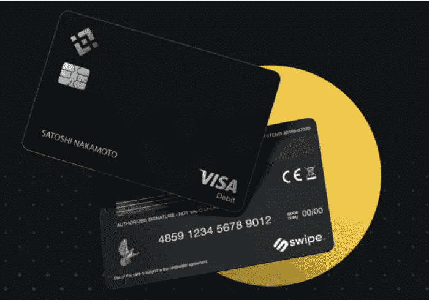
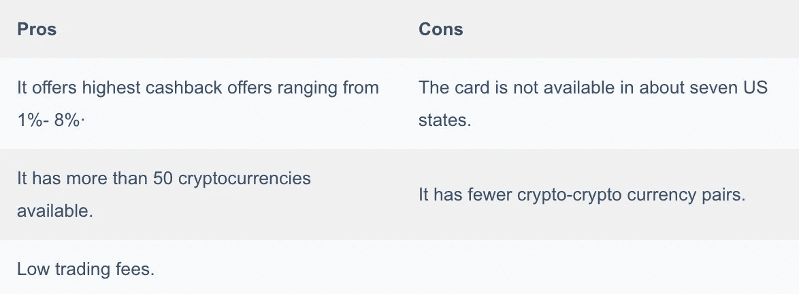

# 前 6 名比特币借记卡——2022 年最佳比特币信用卡

> 原文：<https://medium.com/coinmonks/bitcoin-credit-card-bc8ab6f377c6?source=collection_archive---------3----------------------->

如果你是新用户，或者打算购买新的比特币卡，那么你来对地方了。本文将回顾不同类型的比特币借记卡。比较它们的特性、安全性、优点等。这六大比特币借记卡中的。

# 总结(TL；博士)

*   像传统的 Visa / Mastercard 一样，比特币加密卡也允许我们进行在线、离线和国际购买。
*   [比特币基地卡](https://blog.coincodecap.com/coinbase-card-review)是一种 Visa 支持的借记卡，可将多种加密货币转换为当地货币。
*   [比特币基地](https://blog.coincodecap.com/go/coinbase)允许你根据你的比特币余额消费，就像任何其他传统的借记卡一样。
*   [币安卡](https://blog.coincodecap.com/binance-card-review)自 2020 年 3 月就已经出现，但它是在 2020 年 12 月 15 日左右宣布并开始在欧洲经济区发货的。
*   要获得一张 MCO 签证卡，你必须开始强制性地赌 6 个月的 CRO 代币。赌注是一个购买和保存 CRO 代币的过程。Crypto.com 币是 CRO 代币。
*   [Nexo 万事达卡](https://blog.coincodecap.com/nexo-card-review)还为您购买的所有商品提供 2%的返现，不管数量多少。
*   [Bitpay.com 卡](https://blog.coincodecap.com/bitpay-card-review)是一种预付万事达卡。这张 [Bitpay](https://blog.coincodecap.com/go/bitpay) 卡目前只对美国居民开放。

我们对比了六大比特币卡的一些标准特性。

# 前六名比特币借记卡

在这篇博客中，我们回顾了排名前六的比特币借记卡。以下是六张最好的比特币卡列表。

1.  [比特币基地卡](https://blog.coincodecap.com/go/coinbase-card)
2.  [币安卡](https://blog.coincodecap.com/go/binance-card)
3.  MCO 卡片
4.  [Nexo 卡](https://blog.coincodecap.com/go/nexo-card)
5.  [Bitpay](https://blog.coincodecap.com/go/bitpay) 卡

# 1.比特币基地卡片

[比特币基地卡](https://blog.coincodecap.com/coinbase-card-review)是全球最大的加密交易平台之一[比特币基地](https://blog.coincodecap.com/go/coinbase)的 Visa 支持卡。你可以在任何接受 visa 卡的商店使用这张卡。你可以用它来购买密码和自动取款机提款。除了夏威夷，它在美国所有的州都有。您必须从比特币基地卡应用程序激活您的[比特币基地卡](https://blog.coincodecap.com/go/coinbase-card)，或者通过访问卡设置>呼叫支持从应用程序拨打您当地的支持号码。

## 比特币基地卡功能

*   [比特币基地](https://blog.coincodecap.com/go/coinbase)是一种 Visa 支持的借记卡，可以将多种加密货币转换为当地货币。
*   比特币基地卡允许你根据你的比特币余额消费，就像任何其他传统的借记卡一样。
*   每次购物可获得高达 4%的返现
*   比特币基地卡用户必须有一个[比特币基地](https://blog.coincodecap.com/go/coinbase)账户才能刷卡
*   使用[比特币基地](https://blog.coincodecap.com/go/coinbase)应用程序，你可以很容易地从钱包中选择任何你想购买的密码。

## 比特币基地卡费用

对于购买，每日限额为 10，000 英镑，国际用户的 ATM 取款限额为 500 英镑。对于美国用户，每日消费限额为 2500 美元，ATM 取款限额为 1000 美元。美国用户没有发卡或交易费用，尽管海外用户必须支付 4.95 英镑和 2.9%的费用

## 比特币基地卡安全

他们通过顶级的安全措施保护你的[比特币基地卡的](https://www.coinbase.com/card)信息和凭证，包括两步认证步骤。如果卡被盗，您可以通过网站或应用程序立即冻结您的卡。它有银行级别的 AES-256 加密。此外，所有比特币基地员工都要接受背景调查。

## 比特币基地卡客户支持

你可以通过比特币基地官方网站上的帮助中心来澄清你的疑问。帮助中心在支持部分。

各种问题都有很多现成的答案。您可以在给出的电子邮件文本框中写下您的疑问。

## 比特币基地卡手机应用程序

有一个功能齐全、用户友好的移动应用程序来管理您的卡，跟踪您的支出和余额。在 [play store](https://play.google.com/store/apps/details?id=com.coinbase.android&hl=en_US&gl=US) 和 [app store](https://apps.apple.com/us/app/coinbase-buy-sell-bitcoin/id886427730) 都有。

## 比特币基地卡:利弊

我们在下面列出了使用比特币基地卡的一些优点和缺点。

要了解更多，请阅读我们的[比特币基地卡评论](https://blog.coincodecap.com/coinbase-card-review)。

# 2.币安卡片

[币安](https://blog.coincodecap.com/go/binance)于 2019 年 9 月推出，并迅速成为全球交易量最大的[加密货币交易所](https://blog.coincodecap.com/go/crypto-exchange)。[币安卡](https://blog.coincodecap.com/go/binance-card)会使用你钱包里的资金(你[币安](https://blog.coincodecap.com/go/binance)账户上的余额)。

## 币安卡功能

*   据其官网介绍，凭借[币安 Visa 卡](https://blog.coincodecap.com/binance-card-review)，你可以在全球超过 6000 万家商户兑换和消费你喜欢的加密货币。
*   该卡支持 BNB ( [币安](https://blog.coincodecap.com/go/binance)币)、BUSD(币安美元)、BTC ( [比特币](https://blog.coincodecap.com/a-candid-explanation-of-bitcoin))、ETH(以太坊)、SXP(刷卡)。它还支持欧元法定货币。
*   返现比例从 1%到 8%不等，取决于你持有的 BNB 代币。
*   [币安卡](https://blog.coincodecap.com/go/binance-card)免费申请，需要和币安钱包挂钩。

## 币安卡费用

没有月费。没有发行费。没有最低存款限额。只要您的币安帐户中有余额，该卡将保持连接，您可以使用该卡。还有每日最高消费限额:每天 8700 欧元。

## 币安卡安全

该网站以“睡个好觉”为口号，声明币安最高的安全标准保护我们所有的币安卡资金。您收到的任何资金都保存在一个独立的账户中，以便在康迪斯金融服务有限公司(信用卡的正式发行人)破产的情况下，他们将保护您的资金免受债权人的索赔。

## 币安卡客户支持

如有任何疑问，您可以联系币安支持系统。该支持以消息气泡的形式提供，您可以在网站的右上角找到它。

## 币安卡手机应用程序

有一款手机应用程序可用于币安卡的安卓系统和 T2 的 iOS 系统。在这里您可以查看您的所有消费、卡交易等。该卡还带有交易推送通知。这意味着每次你用你的[币安卡](https://blog.coincodecap.com/binance-card-review)购物，你都会在你的币安手机应用上收到推送通知。

## 币安卡:利弊

我们在下面列出了使用币安卡的一些优点和缺点。您可以快速浏览下表，然后再做决定。

欲知详情，请阅读我们的[币安卡评论](https://blog.coincodecap.com/binance-card-review)。

# 3.Nexo 卡

Nexo 是一种基于万事达卡的加密借记卡。这是唯一一张允许您在不出售所持加密货币的情况下消费的卡。

Nexo 是一个可信的自动化贷款平台，于 2017 年推出。 [Nexo 卡](https://blog.coincodecap.com/nexo-card-review)直接链接 Nexo 账户，无需银行即可存取资金，方便取款。如果您使用 [Nexo 卡](https://blog.coincodecap.com/go/nexo-card)付款，您可以获得价值 5%的返现奖励。

## Nexo 卡功能

您可以通过 Nexo 应用程序访问 Nexo 卡的所有功能。下面列出了这些功能。

*   如果您的卡被盗或丢失，只需轻轻一点，您就可以冻结或解冻它。
*   您可以接收和管理您的 Nexo 卡交易的所有通知。
*   您可以选择创建虚拟 Nexo 卡，以实现更安全的网上购物。
*   您可以轻松查看您的个人识别码，并随时在最近的自动柜员机上更改它。
*   你可以享受 2%的购物返现。
*   你可以用当地货币付款。

## Nexo 卡费用

您可以随时自由提取加密货币。Nexo 不收取任何费用。当您从 exchange wallet 向您的 Nexo 帐户进行交易时，您只需支付经纪费。他们不收任何交易费用。像传统的储蓄账户一样，Nexo card 的[加密储蓄账户](https://blog.coincodecap.com/cryptocurrency-savings-accounts)也收取合理的更少费用。此外，账户维护不收取任何费用。

## Nexo 卡安全性

据 [nexo.io 网站](https://blog.coincodecap.com/go/nexo)报道，nexo 平台配备了军用级 256 位加密和欺诈 m 24/7 全天候监控机制。Nexo 采取这一步骤是为了确保客户的资金和交易安全。

## Nexo 卡客户支持

有一个 24/7 支持团队随时准备为您提供帮助。您可以通过电子邮件将您的疑问发送至 [support@nexo.io](mailto:support@nexo.io) 。

在 Nexo 卡的官网上，接下来。您可以在网站右上角的蓝色语音气泡中进行实时聊天。您可以在 nexo.io 卡网站“帮助部分”的“请求”文本框中输入您的疑问。

## Nexo Card 移动应用程序

Nexo Wallet 应用程序可在 [Google play 商店](https://play.google.com/store/apps/details?id=com.nexowallet&hl=en_US&gl=US)和[苹果商店](https://apps.apple.com/us/app/nexo-crypto-banking-account/id1455341917)购买。然后你必须在应用程序中创建一个帐户，并订购该卡。创建账户时，你必须在应用程序中准确回答几个问题。您可以通过移动或桌面平台使用 Nexo 应用程序。

## Nexo 卡:利弊

我们在下面列出了使用 Nexo 卡的一些优点和缺点。您可以快速浏览下表，然后再做决定。

要了解更多信息，请阅读我们的 [Nexo 卡评论](https://blog.coincodecap.com/nexo-card-review)。

# 4.比特币支付卡

Bitpay 是一个[加密支付网关](https://blog.coincodecap.com/best-bitcoin-payment-processors)平台，成立于 2011 年。 [Bitpay 卡](https://blog.coincodecap.com/bitpay-card-review)根据 Bitpay 平台是一种主预付卡。它的主要目的是帮助我们弥合真实货币和虚拟货币之间的差距。我们可以用 Bitpay.com 卡进行线下和线上交易，也可以在自动取款机上取款。大都会商业银行发行 2020 年 6 月推出的 Bitpay 卡。但是你只能在美国境内使用比特币支付卡。当你提供必要的个人资料和文件进行验证时，他们会给你一个钱包。然后，你可以通过 Bitpay 应用程序订购一张 Bitpay Master 卡，并开始使用该卡进行加密支付。

## Bitpay 卡功能

*   Bitpay 在将我们的卡内余额从比特币充值为法定货币时，不收取任何转换费。此外，汇率具有竞争力。
*   这张卡是给那些想在密码上生活和消费的人的。
*   使用这种 Bitpay 加密借记卡，您可以在全球任何地方消费和支付账单。无论是在网上或使用个人识别码，或只是做一个自动柜员机提款。
*   除了 [Bitpay 卡](https://blog.coincodecap.com/bitpay-card-review)，还可以使用 Bitpay 钱包 app 管理和消费比特币。也可以在那里把比特币兑换成美元，用 Bitpay 卡支付。

## 比特币支付卡费用

没有每月维护费。要获得一张比特币支付卡，我们必须支付 10 美元。换卡也要支付同样的 10 美元。当你用你的 Bitpay.com 卡从自动取款机上取钱的时候，他们会向你收取 2 美元的费用。他们将在美国境外收取 3%的货币转换费。但是不收取装载费。

## 比特币支付卡安全性

Bitpay.com 应用程序的这一增强的安全功能有一个 EMV 芯片，可以帮助您锁定您的卡并控制您的消费方式。

## 比特币支付卡客户支持

在 bitpy.com 网站的“帮助”部分，有许多现成的问卷和许多常见问题列表。可以参考他们。

## 比特币支付卡手机应用

通过邮件收到您的 Bitpay 卡后，激活该卡会更容易。在 [Bitpay 应用](https://play.google.com/store/apps/details?id=com.bitpay.wallet&hl=en_US&gl=US)中，转到“卡”部分。然后，单击“激活”图标。它将出现在屏幕的右上角。然后你必须在 [Bitpay 应用](https://apps.apple.com/us/app/bitpay-buy-crypto/id1149581638)中输入一些他们要求的信息。最后，您必须为您的卡创建一个 PIN。

## 比特币支付卡:利弊

我们在下面列出了使用 Bitpay 卡的一些优点和缺点。您可以快速浏览下表，然后再做决定。

要了解更多，请阅读我们的 [Bitpay 卡评论](https://blog.coincodecap.com/bitpay-card-review)。

# 5.Crypto.Com 卡，MCO 卡

Crypto.com[Visa 卡](https://blog.coincodecap.com/go/crypto-com)是[Crypto.com](https://blog.coincodecap.com/go/crypto-com)的预付金属卡。Crypto.com(前摩纳哥)是一家总部位于香港的初创企业，于 2017 年推出。MCO Visa 卡免费提供，你不需要支付任何运费或安装费用。但要想免费享受 Crypto.com MCO 签证卡的好处，你必须在 Crypto.com App 上投入一定数量的 CRO 代币，为期 6 个月。应用内有多种钱包可供选择；根据您的货币交易选择一个。

## MCO 卡功能

有五种不同的 Crypto.com MCO Visa 卡——午夜蓝、红宝石钢、翡翠绿/皇家靛蓝、冰白色/磨砂玫瑰金和黑曜石黑:每张卡为用户提供一套优惠。在图中给出的表格中检查它们。

*   根据您的卡的类型，功能会有所不同。如果你有一张主卡或进入卡，免费的午夜蓝将只获得你所有消费的 1%的返现。
*   每张卡都为 Spotify、网飞和亚马逊 Prime 等账户提供一定比例的折扣。大多数 MCO Visa 卡在 Expedia 和 Airbnb 上提供大约 10%的旅游折扣。
*   MCO 给予 1- 8%不等的返现。虽然回扣很高，但你仍然要按月领取工资。
*   有些好处只有在你不断下注的情况下才能得到。但是你可以免费进入休息室。但 Spotify、网飞、Expedia、亚马逊 Prime 和 Airbnb 等账户的其他折扣将会取消。为了从 Visa 卡中获得最大的好处，你必须下注。

## MCO 卡费用

Crypto.com MCO 签证是一种非常实惠的信用卡。它不收任何保险费，你也不需要支付月租费。你的消费没有佣金。你也不需要设定最高或最低存款额。最高 200 美元，您无需支付任何 ATM 取款费。但是超过 200 美元，你要付 0.2%的费用。它不收取任何外币交易费用。

## MCO 卡安全

Crypto.com 提供高达 25 万美元的联邦存款保险公司保险。它遵循严格的安全措施和协议，确保我们的资金、用户数据和网站安全。它拥有 100%的客户资金冷藏钱包和双因素认证(2FA)。Cryto.com 还与领先的钱包提供商之一 the Ledger 合作。

## MCO 卡客户支持

如果您有任何疑问或疑问，可以通过 Crypto.com“支持”部分的实时聊天选项来解决。在同一个支持页面上，有一排文章。阅读这些文章来消除您的疑虑，并深入了解 MCO 卡和“Crypto.com”网站。

## MCO 卡手机应用程序

你需要安装 Crypto.com 应用程序才能查看你的 Crypto.com 帐户。你可以在安卓和 T2 的 IOS 设备上下载。

## MCO 卡:利弊

我们在下面列出了使用 MCO 卡的一些优点和缺点。您可以快速浏览下表，然后再做决定。

要了解更多，请阅读我们的 [MCO 维萨卡评论](https://blog.coincodecap.com/mco-card-review)。Crypto.com 提供了很多产品，如 [NFT 平台](https://blog.coincodecap.com/crypto-com-nft-platform)和[密码交易所](https://blog.coincodecap.com/go/crypto-exchange)，要了解更多，请阅读我们的[Crypto.com 评论](https://blog.coincodecap.com/crypto-com-review)。

# 最佳比特币借记卡:结论

凡事都有利弊。不过 Nexo 卡在价格区间上有一个低费卡。它允许你在不支付密码的情况下消费。另一方面，[币安](https://blog.coincodecap.com/go/binance-card)和 [BlockFi](https://blog.coincodecap.com/go/blockfi-credit-card) 卡提供最佳的返现和奖励，每月从 1.5%到 3.5%不等。此外， [MCO 卡](https://blog.coincodecap.com/go/mco-visa-card)是另一个受欢迎的选择，因为它支持 90 多种加密货币。并且[比特币基地卡](https://blog.coincodecap.com/go/coinbase-card)允许在需要时自动兑换货币。Bitpay 卡是最适合美国公民的卡，因为它可以在美国 50 个州使用。选择最适合您的比特币需求和消费的卡。

# 常见问题

**我如何知道我是否在** [**BlockFi 信用卡**](https://blog.coincodecap.com/go/blockfi-credit-card) **的等候名单上？**

注册后，当您在电子邮件中收到确认链接时，您就会知道了。或者你也可以登录 app.blockfi.com，点击顶部的促销横幅。如果你看到“你在名单上！”页面上，然后你就一切就绪了。如果没有，你可以点击“上榜”选项申请上榜。

**bit pay 卡安全吗？**

Bitpay.com 卡是安全的，是一个安全的选择。你可以通过你的签名和密码来保护你的比特币支付卡。Google 认证器还提供双因素认证(2FA)。Bitpay 卡也不与任何个人银行信息或其他金融账户挂钩。

**[**MCO 签证卡**](https://blog.coincodecap.com/go/mco-visa-card) **合法吗？****

**MCO 是 Crypto.com 提供的一种 Visa 卡服务。Crpto.com 是一个加密货币和支付平台，提供高达 25 万美元的 FDIC 保险。MCO 已经采取了这一步骤，向客户保证他们的钱得到了很好的保护。**

****Nexo 万事达卡匿名吗？****

**不，Nexo 万事达卡不是匿名的。为了访问 Nexo.io 卡的服务，用户必须强制通过 Nexo 平台的整个身份验证过程。**

**我在哪里可以使用比特币基地卡？**

**比特币基地是一种加密签证卡。所以，你可以在任何接受 Visa 卡的地方使用它。您可以使用它进行线下、在线和内部购买。**

**你能在币安交易法定货币吗？**

**不，你不能用币安卡交易或存入法定货币。你必须已经有一些加密货币，你可以存入币安卡开始交易。**

*   **最好的[密码交易机器人](/coinmonks/crypto-trading-bot-c2ffce8acb2a)**
*   **[MCO 卡评论|加密金属 Visa 卡评论](https://blog.coincodecap.com/mco-card-review)**
*   **【2022 年最佳比特币支付处理器**
*   **[Nexo 卡评 2021:它是最好的加密卡吗？](https://blog.coincodecap.com/nexo-card-review)**
*   **币安卡评论:这是最好的加密卡吗？【2022】**
*   **[比特币基地卡评 2022:最佳加密借记卡](https://blog.coincodecap.com/?p=8686)**