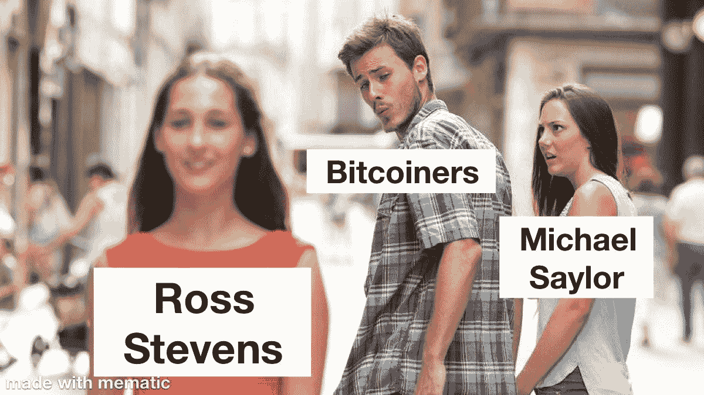

# 罗斯·斯蒂文斯进入了 BTC 的吉加查德区

> 原文：<https://medium.com/coinmonks/bitcoin-debunked-97792adc58d5?source=collection_archive---------2----------------------->

罗斯·史蒂文斯在 Microstrategy 公司的比特币企业大会上投下硬币。下面完整视频。如果你没有一个小时可以消耗，我用 5 分钟总结一下。

## “比特币不波动”

有一种误解认为比特币是波动的，美元是稳定的。一英镑(银)开始时与银的比率是 1:1。今天是 174:1。一磅白银一点没变，一英镑贬值了近 100%。是比特币在变还是美元在变？认识到不同之处。

> “我们终于有了一个由规则而非统治者管理的货币体系”

## 最终结算:“比特币是有史以来第一个电子无记名工具”

比特币交易和在星巴克刷你的 VISA 卡不一样。VISA 引入了两家银行之间的交易对手风险。银行需要 2 到 3 天来结算。比特币交易在几分钟内达到最终结算。把苹果比作苹果。

## 误解:比特币挖矿浪费。“比特币是丰富、清洁、廉价能源的最大催化剂。”

“能源问题从来就不是生产问题。能源问题一直是引导损失……这里有一个见解:随着比特币价格的上涨，比特币采矿将是人类历史上最有利可图的能源利用方式，无需位于人类定居点附近。”

最大的城市都集中在海港周围，因为海洋为商业运输提供了最大的能源回报。“我们开发了化石燃料，但现在化石燃料正在杀死我们……我们正在把能源(化石燃料)转移到有人的地方。在一个绿色能源的未来，我们可能会让人们转向能源……能源是繁荣……我们第一次对可再生能源产生了巨大的吸引力，其动机是盈利，而不是政府补贴。

Example of converting stranded energy into money.

## “仅仅拥有比特币就是赌注。”

“机构希望做得更多很快，美国人将能够接受以比特币支付的收入年金、薪水或存款利息，所有这些都以比特币支付。”

“比特币去风险化了……几年前的话题是‘比特币归零的可能性有多大？’基督教走向零的几率有多大？“那次谈话已经结束了。他的客户在 2020 年购买的比特币超过了 2013 年至 2019 年的总和。Stone Ridge“预计(客户)在未来两年的购买量将超过此前 8 年。"

## 第一章:比特币资产

比特币以前不存在，现在它在这里。这 10 年巩固了比特币作为有史以来创造的最好的货币的地位，吸引了数百万用户，万亿字节，品牌和教育。主要目的是购买和持有比特币这种资产。

## 第二章:比特币网络

继续以比特币为资产，将比特币加入网络。想象一下下面的场景:你在纽约，想通过国际银行间汇款给你在意大利的朋友 1000 美元。他们是如何免费、即时地做到这一点的？

**答案:用比特币闪电网。**

1.  Strike 从您的纽约银行账户中取出美元，并将其记入借方。
2.  Strike 与 NYDIG 合作，进行了 1000 美元的比特币交易。
3.  Strike 使用闪电网络将比特币零费用压缩到米兰。
4.  它击中了意大利的另一个外汇交易所，然后 NYDIG 将比特币转换成欧元。
5.  Strike 将欧元存入您朋友的银行账户。

上面的例子怎么可能？

*   “有史以来第一次，我们拥有了一个电子无记名资产和一个开源的货币网络，它们可以在世界任何地方、任何时间实现现金终结，并在您关心的任何货币对中实现流动性。”
*   “关键:比特币的波动性这种资产无处可寻，因为我们不是因为比特币作为资产的属性而使用它，而是因为它作为开源货币网络的属性而使用它。”

洞察力:即使是银行也从比特币网络中受益，因为比特币消除了他们的交易对手风险。

顺便说一句，这是它实际看起来的样子…

Livestreaming dollars to euros via Bitcoin lightning network

**现在想得更大**

*   想象一下 18 万亿美元的全球进出口行业，以及即时和免费的国际结算。
*   想象一下 2000 亿美元的全球信用卡行业，即时最终结算和零商户费用。
*   想象一下，6800 亿美元的全球汇款行业瞬间实现零费用。

为什么这些行业及其客户会选择速度更慢、成本更高的方案呢？互联网以更快、更便宜、更好的方式消费了整个垂直市场。比特币是货币的互联网。现在明白了吗？

我们今天所知的比特币(资产)是买入并持有的同义词。比特币网络以比特币的底层信任属性重塑全球金融。人类受到货币流通速度和结算速度的限制。

> *“你是否持有比特币的决定后果很严重。”*