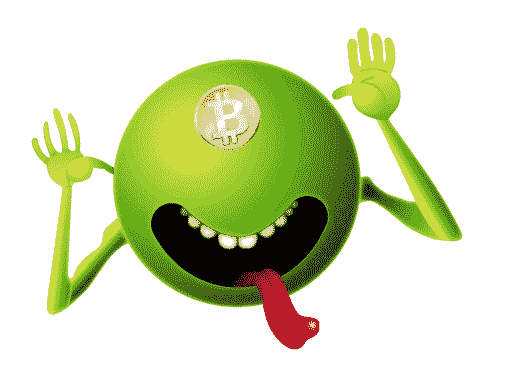
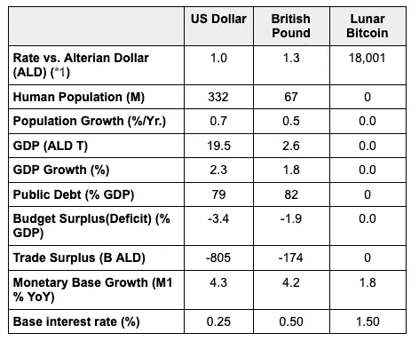

# 比特币:“数字黄金”还是“月球货币”？

> 原文：<https://medium.com/coinmonks/bitcoin-digital-gold-or-lunar-currency-e39e8d992b5f?source=collection_archive---------5----------------------->

作为对“什么是比特币？”问题:用不到 24 个词来说，“这是数字黄金”是很难超越的，“黄金”是一个普遍理解的可靠的价值储存手段的隐喻，但它远不止于此。“数字”具有现代性、普遍性和合理性的内涵(源自计算机逻辑)。具有六千年历史价值的稀有黄金被用来装饰和包裹社会上为数不多的更珍贵的东西，如钻石、国王的头颅和圣人的骨头。因此，它吸收了几千年来他们的一些神圣和精神品质。“数字黄金”在深层次上起作用，因为它结合了这两种相反但互补的联系。

但是对于那些认为黄金只是原子序数 79 的元素的外星人来说，他们会如何看待比特币呢？我是这样把它想象成一条财经新闻的。

> 牵牛星银河银行(Galactic Bank of Altair)今天宣布，其新兴市场外汇交易平台已开始覆盖地球货币。虽然这一消息普遍令地球爱好者感到高兴，但该银行将月球比特币(BTC)与美元和英镑(英镑)一起纳入的决定令人费解。
> 
> 美国的佛罗里达州和南加州多年来一直是大型外籍人士社区的家园，因此纳入美元是必然的。吉尔福德(英格兰)，一个美丽、著名而又危险的银河系最受欢迎的目的地，给当地货币英镑增添了魅力，从而确保了它的地位。
> 
> 然而，比特币的纳入及其作为地球卫星月球国家货币的标签让专家们摸不着头脑。我们采访的一位专家在挠头时猜测，或许该银行的外汇分析师、该报告的作者奥德·诺斯伦博士误解了“比特币之于月球”这样的常用短语，认为它实际上是“月球货币”。我们的专家不同意自己的观点，他说诺斯伦博士不是会犯这种错误的“绿色实习生”(只对了一半)，如果他的另一半大脑看看下面的经济数据表，他会理解这个决定。

Sources: [CIA World Factbook](https://www.cia.gov/library/publications/the-world-factbook/docs/rankorderguide.html), [OECD](https://data.oecd.org/). Latest available data.

**1:按照官方汇率，1 奥特兰金元(ALD)相当于 1000 亿美元，但是，在调整了相对论调整后的时空内实际兑换这两种货币的利率差异后，实际汇率是 1 美元兑换 1000 亿奥特兰金元，所以 1:1 似乎是一个不错的平均值。*

> 我们的记者采访了两位月球居民:85 岁的 E. A .普雷斯利和 33 岁的 s .中本聪，了解他们对这一消息的反应。
> 
> 中本聪女士本身是一位退休的经济学家，她说，月球上无与伦比的稳定的经济和政治气候使其成为地球资产的理想避风港。“这里没有政府拿走你的钱，”她说，“即使有，他们也不会费心，因为没什么可花的。”
> 
> 普雷斯利先生也退休了，他似乎对谈论月球的气候感到困惑，但还是很有帮助地加上了“Wop-bop-a-loom-a-boom-bam-boom tutti frutti”显然这是一句来自他的家乡参宿七的谚语，翻译过来就是“长着两撇小胡子的蜜蜂永远会有最大的帽子。”

## 但是说真的…

将 BTC 作为一种国家货币来考虑，即使是作为一种与平面经济相联系的货币，可能会有所帮助。(我知道你可以用 BTC 在布拉格交税，用 T2 在布拉格买一杯咖啡，还有其他一些事情，其中很多都是合法的，但是它越来越不可能像它的创造者那样被用作广泛的交易媒介。)有意。)

人们普遍认为，不存在像股票或债券那样对比特币进行估值的好方法，但事实上，菲亚特也存在同样的问题，银行的外汇分析师也没有抱怨。他们明白，估值永远是相对的:一个经济体相对于另一个经济体的基本吸引力*的变化将影响其货币的相对价值*。在其他条件不变的情况下，欧元区通胀抬头的迹象将导致欧元相对于美元贬值，也相对于 BTC 贬值。**

“黄金”可以代替上一段中的“比特币”,但它不是一种货币。正如 Nic Carter 最近指出的，一个原因是它不像 BTC 那样标准化和天生的货币准备就绪。

另一个重要原因是，BTC 现在提供了一个利率，但是，虽然夏洛克可能已经能够“制造一种贫瘠的金属”，但你典型的黄金投资者以某种形式持有它，最有可能直接或间接支付只是为了储存它。利率实际上已经为零很长时间了，以至于许多人已经忘记了利率确实很重要。当全球利率上升时，这种区别将变得更加明显。

## 结论

比特币是闪亮的新东西，人们仍在研究它是什么，有什么用。像这样的隐喻是一种很好的方式，但它们只能捕捉主题的某些方面，否则它们就不是隐喻，而“月球货币”是另一种观点。

> 当银河银行的合规部门——一个庞大到占据了自己的行星系统的组织——要求审查这份有争议的报告时。该部门倾向于派遣一艘积极进取的星际巡洋舰，而不是通过温和的消极进取的电子邮件来跟进这种请求，因此惊慌失措的员工急忙做出回应。
> 
> 经过审查，诺斯伦博士的报告全文如下:

向道格拉斯·亚当斯道歉，他可能会喜欢比特币的概念。

> 加入 Coinmonks [电报集团](https://t.me/joinchat/EPmjKpNYwRMsBI4p)，了解加密交易和投资

## 另外，阅读

*   什么是[闪贷](https://blog.coincodecap.com/what-are-flash-loans-on-ethereum)？
*   最好的[密码交易机器人](/coinmonks/crypto-trading-bot-c2ffce8acb2a) | [网格交易](https://blog.coincodecap.com/grid-trading)
*   [3 商业评论](/coinmonks/3commas-review-an-excellent-crypto-trading-bot-2020-1313a58bec92) | [Pionex 评论](/coinmonks/pionex-review-exchange-with-crypto-trading-bot-1e459d0191ea) | [Coinrule 评论](https://blog.coincodecap.com/coinrule-review-a-perfect-trading-bot)
*   [AAX 交易所评论](/coinmonks/aax-exchange-review-2021-67c5ea09330c) | [德里比特评论](/coinmonks/deribit-review-options-fees-apis-and-testnet-2ca16c4bbdb2) | [FTX 交易所评论](/coinmonks/ftx-crypto-exchange-review-53664ac1198f)
*   [n ave 零点回顾](/coinmonks/ngrave-zero-review-c465cf8307fc) | [Phemex 回顾](/coinmonks/phemex-review-4cfba0b49e28) | [PrimeXBT 回顾](/coinmonks/primexbt-review-88e0815be858)
*   [Bybit Exchange 审查](/coinmonks/bybit-exchange-review-dbd570019b71) | [Bityard 审查](https://blog.coincodecap.com/bityard-reivew) | [CoinSpot 审查](https://blog.coincodecap.com/coinspot-review)
*   [3 commas vs Cryptohopper](/coinmonks/3commas-vs-pionex-vs-cryptohopper-best-crypto-bot-6a98d2baa203)|[赚取加密利息](/coinmonks/earn-crypto-interest-b10b810fdda3)
*   最好的比特币[硬件钱包](/coinmonks/the-best-cryptocurrency-hardware-wallets-of-2020-e28b1c124069?source=friends_link&sk=324dd9ff8556ab578d71e7ad7658ad7c) | [BitBox02 回顾](/coinmonks/bitbox02-review-your-swiss-bitcoin-hardware-wallet-c36c88fff29)
*   [总账 vs n 平均](https://blog.coincodecap.com/ngrave-vs-ledger) | [总账 nano s vs x](https://blog.coincodecap.com/ledger-nano-s-vs-x)
*   [密码拷贝交易平台](/coinmonks/top-10-crypto-copy-trading-platforms-for-beginners-d0c37c7d698c) | [比特码拷贝交易](https://blog.coincodecap.com/bityard-copy-trading)
*   [Vauld Review](https://blog.coincodecap.com/vauld-review)|[you hodler Review](/coinmonks/youhodler-4-easy-ways-to-make-money-98969b9689f2)|[BlockFi Review](/coinmonks/blockfi-review-53096053c097)
*   最好的[加密税务软件](/coinmonks/best-crypto-tax-tool-for-my-money-72d4b430816b) | [硬币追踪评论](/coinmonks/cointracking-review-a-reliable-cryptocurrency-tax-software-5114e3eb5737)
*   最佳[加密借贷平台](/coinmonks/top-5-crypto-lending-platforms-in-2020-that-you-need-to-know-a1b675cec3fa) | [杠杆代币](/coinmonks/leveraged-token-3f5257808b22)
*   [莱杰 Nano S vs 特雷佐 one vs 特雷佐 T vs 莱杰 Nano X](https://blog.coincodecap.com/ledger-nano-s-vs-trezor-one-ledger-nano-x-trezor-t)
*   [block fi vs Celsius](/coinmonks/blockfi-vs-celsius-vs-hodlnaut-8a1cc8c26630)|[Hodlnaut Review](https://blog.coincodecap.com/hodlnaut-review)
*   [Bitsgap 审查](https://blog.coincodecap.com/bitsgap-review) | [Quadency 审查](/coinmonks/quadency-review-a-crypto-trading-automation-platform-3068eaa374e1) | [Bitbns 审查](https://blog.coincodecap.com/bitbns-review)
*   [埃利帕尔泰坦评论](/coinmonks/ellipal-titan-review-85e9071dd029) | [赛克斯斯通评论](https://blog.coincodecap.com/secux-stone-hardware-wallet-review)
*   [DEX Explorer](https://explorer.bitquery.io/ethereum/dex)|[w](https://explorer.bitquery.io/graphql)|[local bitcoins 评论](https://blog.coincodecap.com/localbitcoins-review)
*   最佳[区块链分析](https://bitquery.io/blog/best-blockchain-analysis-tools-and-software)工具| [赚比特币](https://blog.coincodecap.com/earn-bitcoin)
*   [加密套利](/coinmonks/crypto-arbitrage-guide-how-to-make-money-as-a-beginner-62bfe5c868f6)指南:新手如何赚钱
*   最佳[加密制图工具](/coinmonks/what-are-the-best-charting-platforms-for-cryptocurrency-trading-85aade584d80) | [最佳加密交易所](/coinmonks/crypto-exchange-dd2f9d6f3769)
*   [如何在印度购买比特币](https://blog.coincodecap.com/buy-bitcoin-app-india)？
*   [印度比特币交易所](/coinmonks/bitcoin-exchange-in-india-7f1fe79715c9) | [比特币储蓄账户](https://blog.coincodecap.com/bitcoin-savings-account)
*   了解比特币的[最佳书籍有哪些？](/coinmonks/what-are-the-best-books-to-learn-bitcoin-409aeb9aff4b)

> [直接在您的收件箱中获得最佳软件交易](/coinmonks/newsletters/coinmonks)

