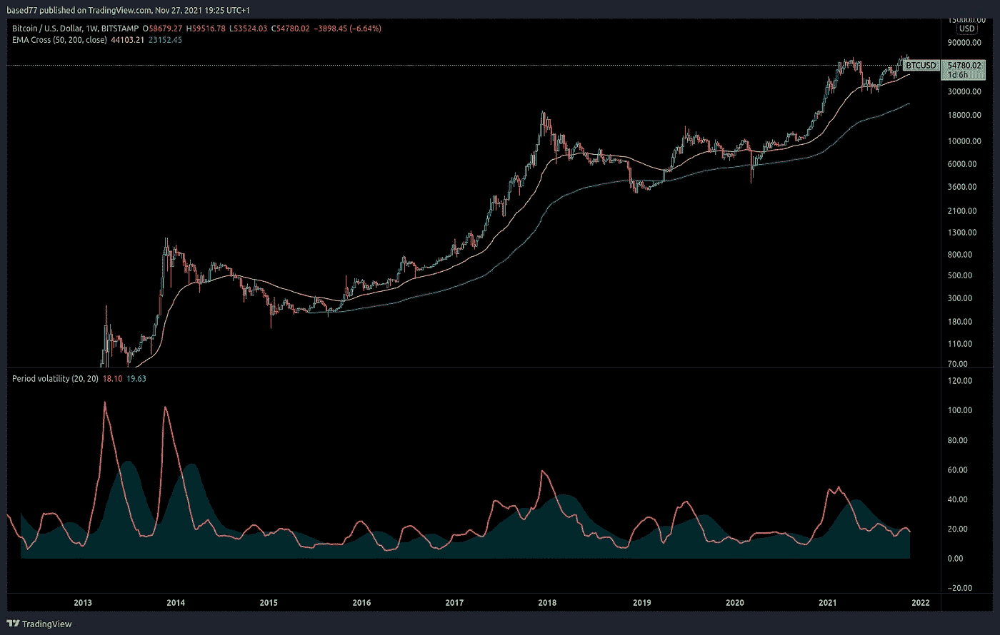
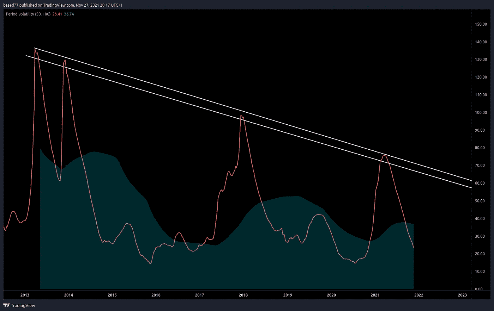
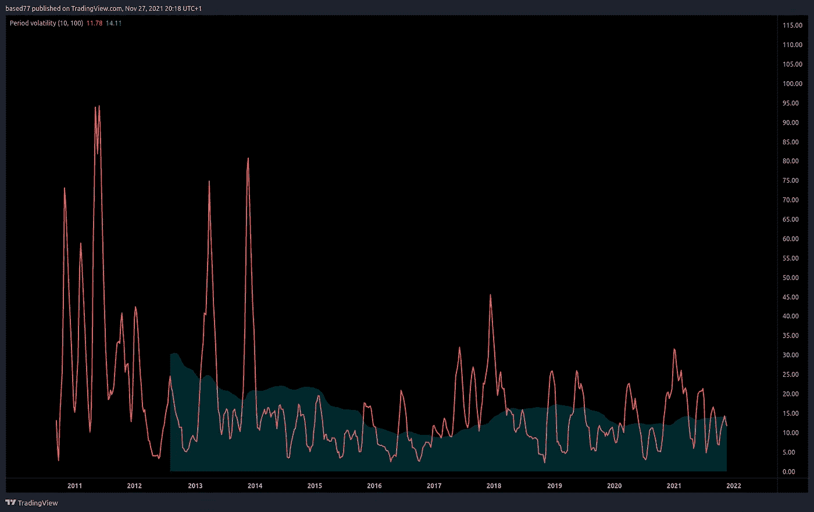

# 比特币——波动性递减。市场周期技术分析。

> 原文：<https://medium.com/coinmonks/bitcoin-diminishing-volatility-market-cycle-technical-analysis-edd40e7baf3f?source=collection_archive---------6----------------------->

在这个故事中，我想涵盖一些比特币市场周期的技术分析，并试图得出一些有助于导航加密货币市场的结论。

# **波动性递减**

我在之前的 medium 上讲了很多关于波动性的内容。在交易中，波动性是衡量风险和机会的标准。多年来，比特币/美元对的波动性正在下降，我马上会展示这一点。这对交易者来说意味着两件事。

1.  比特币是一种更安全的资产，下行风险更小。
2.  比特币不会产生像过去那样高的回报。

这是指波动性下降的趋势是否会像 BTC/美元交易历史开始以来那样持续下去。

我在这里谈到了如何测量波动性。这里我也会使用类似的方法，比如一段时间内的*标准差*。

我在 TradingView 上创建了一个简单的 pine 脚本指标来帮助衡量波动性。您也可以使用 ADX、BBWP 或其他指标来获得类似的结果。我的指标输出一条线，是一段时间内的标准差除以同期的移动平均线。应用于 BTCUSD 图表时，结果如下:

50 week period volatility

10 week period volatility

如上图所示，波动性的下降趋势非常明显。我们可以估计每 300 周或 6、25 年下降约 33%，但这可能不同于测量其他时期或使用不同的波动性指标。

这意味着我们不应该指望下一轮牛市会跟随前一轮牛市的回报。例如，在上次牛市中，比特币从 200 美元左右飙升至 2 万美元，涨幅达 100 倍。我们不能指望 BTC 从 3200 美元涨到 320000 美元，因为它上次就是这样做的。波动性下降意味着比特币无法像以前那样快速流动。

在熊市中可能也是如此。比特币在上次熊市中下跌了约 84%。如果波动性下降的趋势继续下去，我们可以预计它将不会再有这样的下跌。这意味着与 4、8 年前相比，比特币是一种相对更安全的投资资产。

 [## 杠杆代币[多头代币]终极指南

### 杠杆化令牌是具有杠杆化风险敞口的 ERC20 令牌，不考虑保证金、要求、管理…

medium.com](/coinmonks/leveraged-token-3f5257808b22) 

# 让我们更进一步…未来的波动会是怎样的？

更高的流动性意味着更低的波动性。越多的市场参与者愿意以给定的价格交易比特币，就越难改变价格。如果比特币将继续以这种速度被采用，那么未来将会有很多市场参与者就不是胡乱猜测了。如果是这样的话，波动性将继续降低——这是每个繁荣市场的自然过程。

假设波动性的下降将保持不变。2013 年，50 周波动峰值约为 136%。2017 年，这一比例为 96%，今年 2 月达到 75%的峰值。如果这一趋势继续下去，2030 年的波动峰值将在 18%左右。

这意味着在 50 周的时间内，平均而言，价格可能不会偏离这一时期的平均水平超过 18%。现在，我们只在无聊的熊市中看到这种波动，在未来，这可能是反弹和崩盘的情况。总体平均波动性甚至可能更低。

# 比特币——终极货币？

> “嗯，比特币太不稳定了，它不可能是一种货币”~每个人

他们可能是对的。目前，比特币作为支付工具客观上是一种劣质货币。将来可能会变成一个。这方面的主要障碍是它相对于其他货币和资产的高度波动性。

比特币解决了这个问题。它会自我修复——因为它的用户和采纳者数量越多(一直在增加),市场上的流动性就越大。流动性越多，波动性就会越低。这不是什么古怪而疯狂的理论。从创世街区和第一 BTC 交易所开始，我们就看到了这种情况。

流动性增加->波动性降低->随着比特币风险降低而被更多采用->流动性增加-> …等等。

可能会有一天，比特币拥有如此多的用户和人们用它来评估事物，以至于比特币本身将成为货币。比特币波动率会被认为是 0。所有货币价值将以比特币衡量，所有其他资产以比特币衡量…

我猜比特币波动的故事将到此结束。让我们看看它是否发挥出来。

> 在这里和推特上关注我:【https://twitter.com/basedcrypto77 
> 
> 加入 Coinmonks [电报频道](https://t.me/coincodecap)和 [Youtube 频道](https://www.youtube.com/c/coinmonks/videos)了解加密交易和投资

## 另外，阅读

*   [加拿大最佳加密交易机器人](https://blog.coincodecap.com/5-best-crypto-trading-bots-in-canada) | [赌注加密](https://blog.coincodecap.com/staking-crypto)
*   [如何在印度购买比特币？](/coinmonks/buy-bitcoin-in-india-feb50ddfef94) | [WazirX 审查](/coinmonks/wazirx-review-5c811b074f5b)
*   [非洲最佳加密交易所](https://blog.coincodecap.com/crypto-exchange-africa) | [胡交易所评论](https://blog.coincodecap.com/hoo-exchange-review)
*   [eToro vs robin hood](https://blog.coincodecap.com/etoro-robinhood)|[MoonXBT vs Bybit vs Bityard](https://blog.coincodecap.com/bybit-bityard-moonxbt)
*   [Stormgain 回顾](https://blog.coincodecap.com/stormgain-review) | [Bexplus 回顾](https://blog.coincodecap.com/bexplus-review) | [币安 vs Bittrex](https://blog.coincodecap.com/binance-vs-bittrex)
*   [Bookmap 评论](https://blog.coincodecap.com/bookmap-review-2021-best-trading-software) | [美国 5 大最佳加密交易所](https://blog.coincodecap.com/crypto-exchange-usa)
*   [如何在 FTX 交易所交易期货](https://blog.coincodecap.com/ftx-futures-trading) | [OKEx vs 币安](https://blog.coincodecap.com/okex-vs-binance)
*   [如何在势不可挡的域名上购买域名？](https://blog.coincodecap.com/buy-domain-on-unstoppable-domains)
*   [印度的秘密税](https://blog.coincodecap.com/crypto-tax-india) | [altFINS 审查](https://blog.coincodecap.com/altfins-review) | [Prokey 审查](/coinmonks/prokey-review-26611173c13c)
*   [Blockfi vs 比特币基地](https://blog.coincodecap.com/blockfi-vs-coinbase) | [比特坎评论](https://blog.coincodecap.com/bitkan-review) | [币安评论](/coinmonks/binance-review-ee10d3bf3b6e)
*   [Coldcard 评论](https://blog.coincodecap.com/coldcard-review) | [BOXtradEX 评论](https://blog.coincodecap.com/boxtradex-review)|[unis WAP 指南](https://blog.coincodecap.com/uniswap)
*   [阿联酋 5 大最佳加密交易所](https://blog.coincodecap.com/best-crypto-exchanges-in-uae) | [SimpleSwap 评论](https://blog.coincodecap.com/simpleswap-review)