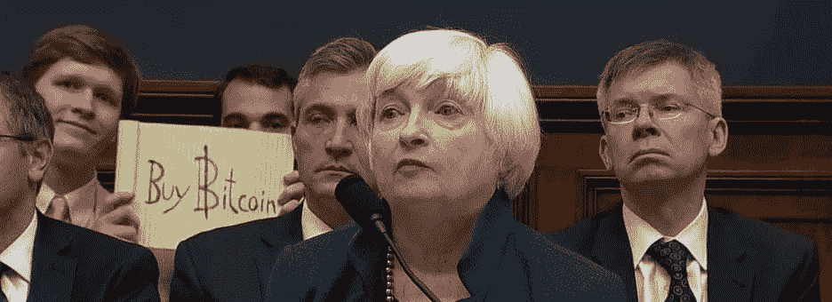
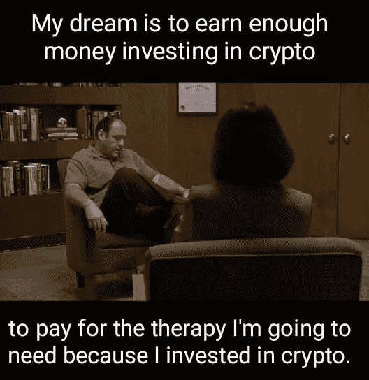
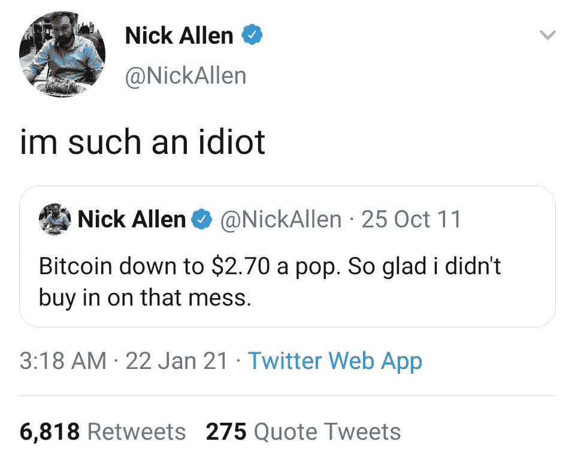
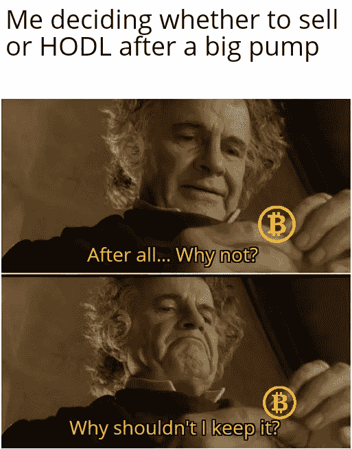

# 比特币“双重消费”FUD |法国央行试用数字货币

> 原文：<https://medium.com/coinmonks/bitcoin-double-spend-fud-french-central-bank-trials-digital-currency-dc03f8664595?source=collection_archive---------8----------------------->

Buy Bitcoin

## 购买比特币的机构| Blockrock 拥抱加密

*   上周， [BitMEX Research](https://twitter.com/BitMEXResearch) [发推文](https://twitter.com/BitMEXResearch/status/1351855414103715842?s=20)称，他们的 [ForkMonitor](https://forkmonitor.info/nodes/btc) 在比特币区块链获得了双倍消费。这让社交媒体上的许多人感到担忧，然而，比特币协议正是为其设计的。点击阅读全文[。](https://insights.deribit.com/market-research/was-there-a-bitcoin-double-spend-on-jan-20-2021/)
*   在纳斯达克上市的马拉松专利集团购买了价值 1.5 亿美元的比特币，作为该公司国库储备的一部分。点击阅读全文[。](https://www.theblockcrypto.com/post/92378/nasdaq-marathon-patent-group-buys-bitcoin-btc-treasury-reserves)

## [Bitsgap](https://blog.coincodecap.com/go/bitsgap) 交易报价:

> "市场是一种把钱从没有耐心的人身上转移到病人身上的工具."—沃伦·巴菲特

> 如何在牛市中 [**赚更多的利润**](/coinmonks/how-to-make-more-profits-in-the-bull-market-with-leveraged-token-f0e6328dab04)

## [Pionex](http://blog.coincodecap.com/go/pionex)

试试专业的加密交易所 Pionex，它有免费的加密交易机器人，可以让你的交易自动化。阅读我们的 [Pionex 评论](/coinmonks/pionex-review-exchange-with-crypto-trading-bot-1e459d0191ea)，查看我们的 [**最佳加密交易机器人**](/coinmonks/crypto-trading-bot-c2ffce8acb2a) 名单。

## 最新消息📰

*   2021 年 1 月 20 日是否发生了[比特币双消费](https://insights.deribit.com/market-research/was-there-a-bitcoin-double-spend-on-jan-20-2021/)？
*   [秘密犯罪总结](https://blog.chainalysis.com/reports/2021-crypto-crime-report-intro-ransomware-scams-darknet-markets):2020 年，诈骗和暗网市场的收入占主导地位，但勒索软件是更大的故事
*   来源:哈佛、耶鲁、布朗捐赠基金已经购买比特币至少一年了
*   迈克·诺沃格拉茨的银河数码[将推出以太坊](https://decrypt.co/55366/galaxy-digital-ethereum-funds)基金
*   [法国央行](https://www.coindesk.com/french-central-bank-trials-digital-currency-for-interbank-settlement)试用数字货币进行银行间结算
*   [反洗钱](https://www.tandfonline.com/doi/full/10.1080/25741292.2020.1725366):全球最低效的政策实验？一起，我们可以解决它
*   [贝莱德](https://www.coindesk.com/blackrock-give-two-funds-go-ahead-to-invest-in-bitcoin-futures)批准两只基金投资比特币期货
*   比特币如何帮助中产阶级用户度过疫情
*   [克雷格·赖特发出法律威胁后，数十家网站发布了](https://www.btctimes.com/news/dozens-of-sites-host-whitepaper-following-legal-threats)比特币白皮书
*   签名银行[从加密客户处获得 100 亿美元存款](https://www.coindesk.com/signature-bank-crosses-10b-in-deposits-from-crypto-customers)
*   灰度可能已经为另外 5 个潜在的加密信任奠定了基础

> *报税季即将到来，使用最好的* [***加密报税软件***](/coinmonks/best-crypto-tax-tool-for-my-money-72d4b430816b) *来申报你的加密报税吧。*

[source](https://www.reddit.com/r/CryptoCurrency/comments/l3bpc3/what_will_you_spend_your_profits_on/)

> BlockFi 首次推出加密奖励信用卡。在日常购物中获得 1.5%的比特币奖励。现在加入等候名单。

## 好的读物📑

*   [问题](https://plan99.net/~mike/satoshi-emails/thread1.html)关于比特币| 2009 年迈克·赫恩向聪问关于比特币的问题
*   [固定收益协议](https://messari.io/article/fixed-income-protocols-the-next-wave-of-defi-innovation)——下一波 DeFi 创新
*   [以太坊](https://jjmstark.medium.com/the-year-in-ethereum-2020-98123e5f160d) 2020 年
*   [解读比特币&权力的五大轴心](/coinmonks/understanding-bitcoin-the-5-axes-of-power-43e1fa7597ac)
*   [不信任](https://fs.blog/2021/01/mistrust/)的高价
*   早期的 MtGox 支付？没有，多亏了 CoinLab
*   [设计](https://jaygraber.medium.com/designing-decentralized-moderation-a76430a8eab)分散适度
*   [展望未来](https://a16z.com/2021/01/25/doubling-down-marketing-update-new-media/)
*   [技术市场](https://www.michaeldempsey.me/blog/2020/12/10/where-technology-markets-venture-capital-go-from-here/)风险投资会从这里走到哪里
*   [评估博弈](/@jbrukh/appraisal-games-and-the-nft-liquidity-problem-904afe6bc7af)与 NFT 流动性问题
*   指数基金的消亡以及 SOLO 投资的诞生
*   比特币价值的真正源泉
*   Token 分布模型的[演化](https://blog.coinlist.co/the-evolution-of-token-distribution-models/)
*   [DeFi](https://newsletter.banklesshq.com/p/defi-will-eat-corporate-debt) 将吞噬企业债务
*   [我们的网络](https://ournetwork.substack.com/p/our-network-issue-55)覆盖 Opyn、KeeperDAO、Uniswap 和 verage。
*   渴望[全面改革 V2](https://thedefiant.io/yearn-overhauls-fee-structure-in-v2/)收费结构
*   重大[区块链/加密](/mycrypto/2020-in-review-major-blockchain-crypto-security-incidents-6c5ced8dc81e)安全事件
*   技术[停滞](https://rootsofprogress.org/technological-stagnation)
*   Uniswap [是 algo stablecoins 无法保持钉住的原因](https://sabretoothsg.medium.com/uniswap-is-the-reason-why-algo-stablecoins-cant-maintain-the-peg-and-how-to-fix-it-91e9f7f93d4f)以及如何修复它
*   [比特币 2021](/coinmonks/bitcoin-2021-rally-or-crash-scam-or-cycle-the-4th-wave-is-here-82f79595e951) :骗局还是周期？第四次浪潮正在发生
*   没有人知道政府能借多少钱
*   Cantillon 效应 2.0 :比特币是世界上第一种真正公平的货币
*   加密[资金流动](https://rektcapital.substack.com/p/crypto-money-flow-cycle)周期
*   区块链平台的非类型化[对比](/coinmonks/unhyped-comparison-of-blockchain-platforms-679e122947c1)
*   [开采了多少黄金](https://www.gold.org/about-gold/gold-supply/gold-mining/how-much-gold)？
*   现在任何人都可以成为基金经理

> *买一个* [***硬件钱包***](/coinmonks/the-best-cryptocurrency-hardware-wallets-of-2020-e28b1c124069)*[*保护你的加密货币*](/coinmonks/how-to-prevent-cryptocurrency-hacking-and-theft-from-your-wallet-65c8ff767766) *。**

**

*[Source](https://www.reddit.com/r/Bitcoin/comments/kmof53/the_8_laws_of_bitcoin_updated/)*

## *开发商*

*   *以太坊的[开发者指南](https://snakecharmers.ethereum.org/a-developers-guide-to-ethereum-pt-2/)。2*
*   *[制作](https://secureum.substack.com/p/making-defi-safu-secureum-3) DeFi SAFU*
*   *中本聪:一个新的比特币轻客户端*
*   *量化[区块链可提取价值](https://arxiv.org/pdf/2101.05511.pdf):森林有多黑？*
*   *Eth2 的[状态](https://blog.ethereum.org/2021/01/20/the-state-of-eth2-january-2021/)2021 年 1 月*
*   *[Blockstream Green](https://blockstream.com/2021/01/25/en-blockstream-green-bitcoin-wallets-now-using-checksequenceverify-timelocks/) :比特币钱包现在使用 CheckSequenceVerify 时间锁*
*   *[补丁雕刻](https://people.kernel.org/monsieuricon/patches-carved-into-developer-sigchains)到开发者信号链中*
*   *[智能合约解读](/coinmonks/smart-contract-read-acryptos-venus-protocol-strategy-2ac9c90fad0a):埃及人的金星协议策略*
*   *[账户协调员](https://billyrennekamp.medium.com/account-coordinator-a-proposal-for-the-future-of-wallets-9fc54032a202):关于钱包未来的提议*
*   *定义[汇集](/starkware/defi-pooling-1332ddebff21)*
*   *[油费吸](https://mintable.medium.com/gas-fees-suck-mint-nfts-without-a-transaction-on-mintable-8d54b85a471c) —在 Mintable 上没有交易的 mint NFTs！*
*   *IPFS [在勇敢中支持](https://brave.com/ipfs-support/)*
*   *[使用烛台交易比特币](/coinmonks/trading-bitcoin-using-candlesticks-103244734e6e)*
*   *[同步](https://blockstream.com/2021/01/22/en-lnsync-getting-your-lightning-node-up-to-speed-quickly/):让你的闪电节点快速加速*
*   *[外部未知函数的自动综合](https://fv.ethereum.org/2021/01/18/smtchecker-and-synthesis-of-external-functions/)*

> *想成为一名以太网和 **Web3 开发者**？[从这里开始](http://blog.coincodecap.com/go/learn)。*

## *多方面的*

*   *块菌测试中的 ERC20 令牌传输可视化*
*   *[翻转](https://www.blockchaincenter.net/flippening/)(以太坊 vs 比特币)*

## *播客和视频💽*

*   *MIT 区块链[视频讲座](https://ocw.mit.edu/courses/sloan-school-of-management/15-s12-blockchain-and-money-fall-2018/video-lectures/)*
*   *主权违约掉期市场作为比特币公允价值的代理*

**

*[source](https://www.reddit.com/r/CryptoCurrency/comments/l33hni/dont_be_an_idiot/)*

## *加密交易和折扣🔖*

*   *注册参加[**by bit**](/coinmonks/bybit-exchange-review-dbd570019b71)exchange，赢取高达 625 美元的奖金。*
*   *在 [**Bityard**](https://blog.coincodecap.com/go/bityard) 获得 258 美元的交易费折扣*
*   *试用 [**Coinrule**](https://webapp.coinrule.io/coupon/coinmonks-7-25-3-e2bf6c60e795407381edf98d1a174ac2?fp_ref=coincodecap) ，使用 [**此链接**](https://webapp.coinrule.io/coupon/coinmonks-7-25-3-e2bf6c60e795407381edf98d1a174ac2?fp_ref=coincodecap) 可获得 7 天免费试用和 3 个月 25%优惠。*

## *产品评论和其他加密软件📙*

*   *[Bityard 审查](https://blog.coincodecap.com/bityard-reivew)*
*   *[Vauld 审查](https://blog.coincodecap.com/vauld-review)*
*   *[莱杰 vs 特雷佐](/coinmonks/ledger-nano-s-vs-x-battery-hardware-price-storage-59a6663fe3b0)*
*   *[区块链审查](/coinmonks/blockfi-review-53096053c097)*
*   *[AAX 交易所评论](/coinmonks/aax-exchange-review-2021-67c5ea09330c)*
*   *[bits gap vs 3 commas vs quad ency](/coinmonks/bitsgap-vs-3commas-vs-quadency-must-read-2021-cdc1a40cf31d)*
*   *Cryptohopper vs HaasBot*
*   *密码复制交易机器人*
*   *[总账 vs 平均](https://blog.coincodecap.com/ngrave-vs-ledger)*
*   *从你的密码中赚取 12%的利息*

*想让我们展示你的产品吗？请通过 [Twitter @coinmonks](https://twitter.com/coinmonks) 联系我们*

**

## *乔布斯👷*

*   *MetaMask 正在招聘工程师。在这里使用。*
*   *[DevOps 工程师](https://remoteok.io/remote-jobs/100451-remote-devops-engineer-district0x)，0x 区，远程*
*   *[生态系统开发者](https://jobs.lever.co/3box/ec1093c5-ed31-483c-b1b3-49b07bd0bd2e)，3 盒，远程*
*   *[位于 mStable 的 BD](https://angel.co/company/mstable/jobs/1096364-business-development-manager)*
*   *[动作设计师](https://cryptocurrencyjobs.co/design/kraken-digital-asset-exchange-motion-designer/) —北海巨妖*
*   *[全栈工程师](https://cryptocurrencyjobs.co/engineering/zapper-full-stack-engineer/) —扎珀*
*   *[高级前端工程师](https://cryptocurrencyjobs.co/engineering/uma-senior-front-end-engineer/) —乌玛*
*   *SigmaPrime，[区块链安全工程师](https://blog.sigmaprime.io/blockchain-security-engineer.html)*
*   *0x 寻找各种类型的[开发人员](https://0x.org/about/jobs)和一名[抹茶营销经理](https://boards.greenhouse.io/0x/jobs/4923909002)*
*   *小道消息位正在寻找一位[技术编辑/撰稿人](https://jobs.lever.co/trailofbits/8bf936ff-b86c-462e-80b2-4d58004bc68d) & [安全工程师](https://jobs.lever.co/trailofbits/4f459855-3299-462f-9e73-299a840d5baf)*
*   *Nexus Mutual: [在欧洲时区经历了稳健发展](https://angel.co/company/nexus-mutual-1/jobs/967538-smart-contract-engineer)*

## *在 Coinmonks 上发布*

*如果你喜欢在 crypto/区块链空间上写教育文章，并且想在 Coinmonks 出版物上发表。只需在**发邮件给我或者 DM 我**[***推特***](https://twitter.com/coinmonks)***