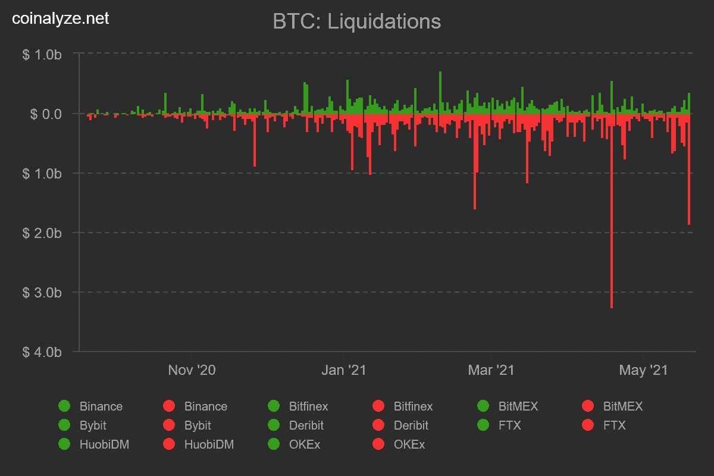
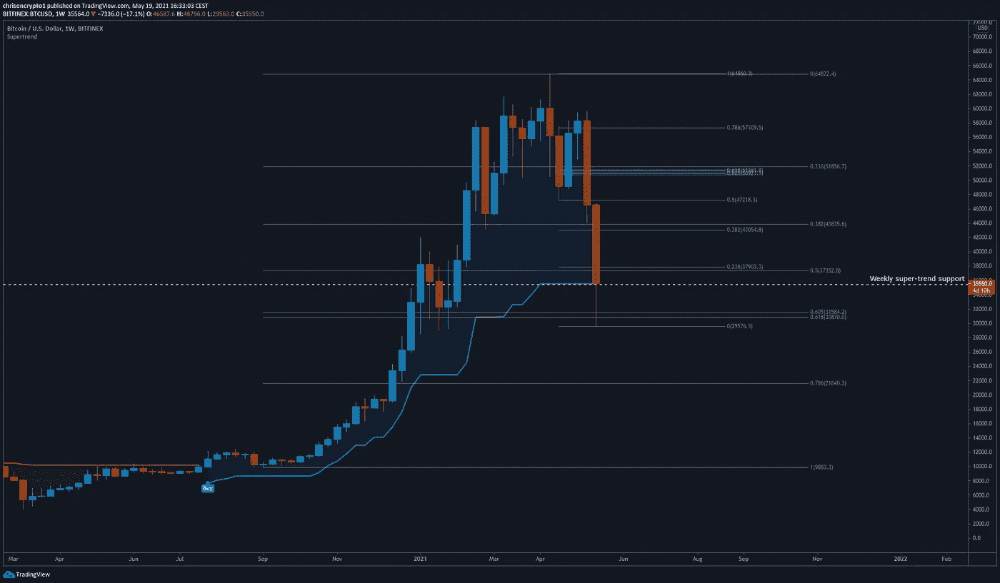
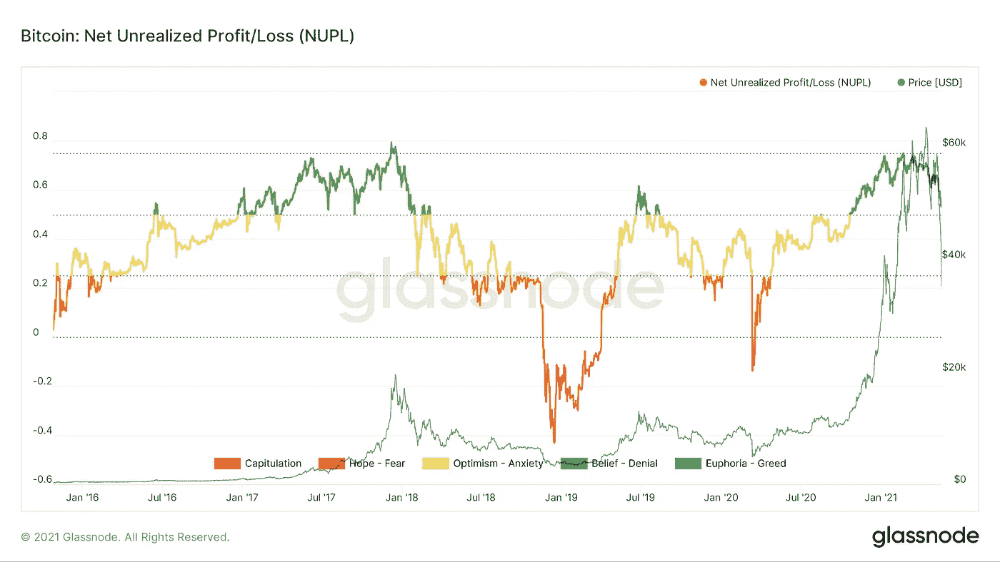
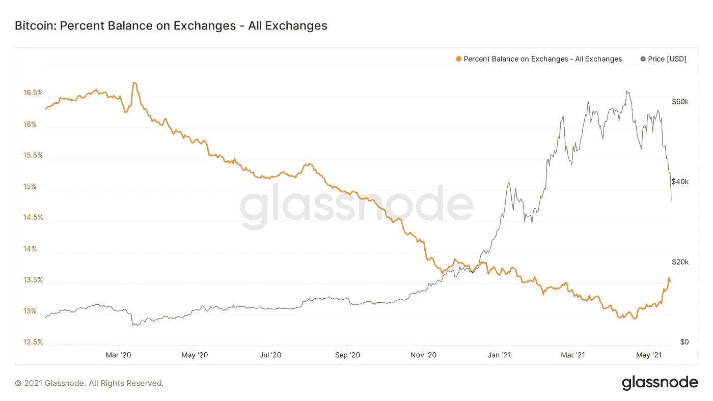
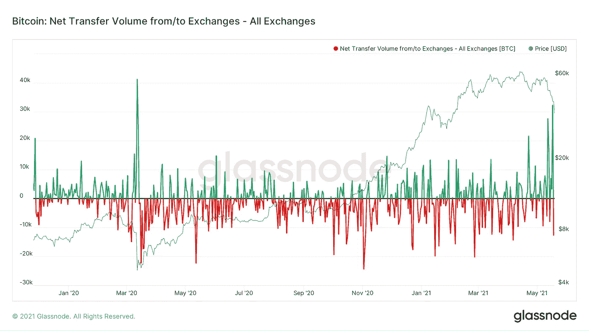
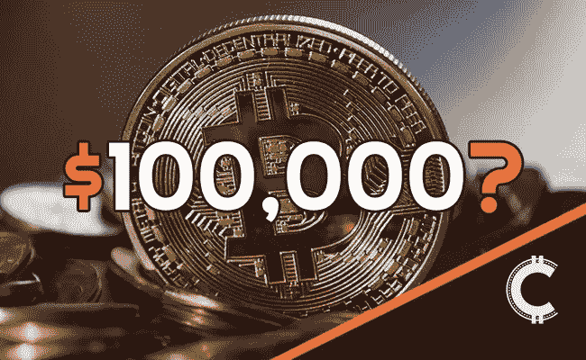

# 比特币 35 天下跌 54%。牛市结束了吗？

> 原文：<https://medium.com/coinmonks/bitcoin-drops-54-in-35-days-is-the-bull-market-over-a04b4e48f7d?source=collection_archive---------5----------------------->

今天，整个加密货币市值缩水数十亿美元，这将成为比特币历史上最可怕的一天。更重要的是，今天的事件让人质疑这波牛市是否已经戛然而止，同时也提醒我们为什么会在这里。

我们来挖一下。

# 管理的灰色资产降至 410 亿美元

自 5 月 13 日以来，灰度公司(AUM)管理的数字资产总价值已下降逾 110 亿美元，至 412.7 亿美元。

加密市场的最新调整已经导致 AUM T2 管理的数字资产大幅下降。该公司现在拥有价值 412.7 亿美元的加密 AUM，低于 2021 年 3 月 13 日的 531 亿美元。

**查看** [全篇点击这里](https://chrisoncrypto.com/blog/f/banking-system-consumes-twice-more-energy-than-bitcoin) **！**

***获取本新闻稿。*** [***加入邮件列表***](http://www.chrisoncrypto.com/subscribe) ***！***

# 技术上来说

## 密码市场翻身

今天持有比特币的每个人都应该得到一枚奖章，一枚荣誉徽章。比特币今天下跌了 32%，在 35 天内下跌了 54%，在几个小时内完全翻到了自 1 月初以来从未见过的水平(29480 美元)。这种前所未有的抛售水平导致了级联清算事件，令人想起 2020 年 3 月的黑色星期四，仅清算价值 20 亿美元的比特币多头。

此次暴跌也大于 2017 年牛市中典型的间歇性抛售(35%-45%)，并令人质疑比特币今年是否会恢复到历史高点。

在大屠杀结束时，BTC/美元能够在 29，480 美元的. 618 纤维水平找到支撑，在撰写本文时恢复到 37，100 美元。一旦尘埃落定，悲观情绪消散，回归均值是有可能的。

即使趋势已经改变，均值反转也是正常的。在这种情况下，20 周均线(在撰写本文时为 45，800 美元)是中期指标，它将提供对未来可能性的技术洞察。正如之前的[新闻简报](https://mailchi.mp/311cd5b8f56b/legacy-banking-consumes-twice-as-much-energy-as-bitcoin)中提到的，所有的目光都集中在周线收盘上。

## 净未实现利润/损失标志着潜在的本地底部

比特币是否准备好迎接熊市的一个线索是净未实现损益指标。

净未实现利润/亏损是相对未实现利润和相对未实现亏损之间的差额。这个指标也可以通过从市值中减去实现的市值，然后除以市值来计算。在之前的牛市中，只要比特币在 0.5-0.7 的区域内运行，它就会保持宏观看涨趋势，显示出 0.8 以上的严重过热迹象。

在这个阶段，这个环比指标表明 BTC/美元还没有到达周期顶部，尽管刚刚发生了戏剧性的事件。

## 长期持有者购买北斗七星

与此同时，交易所的比特币余额开始上涨，表明“霍德勒”开始在公开市场抛售比特币。虽然这通常是一个不好的迹象，但来自 Glassnode 的[数据](https://studio.glassnode.com/metrics?a=BTC&category=Distribution&chartStyle=column&m=supply.SthSum&s=1463531891&u=1621211891&zoom=1825)显示，短期持有者(最近的参与者)目前正在亏本抛售硬币，直接进入长期买家的手中。

这一趋势提供了对回调是否是一个更大的时间框架牛市的一部分的洞察，因为弱手(新参与者)投降，而强手重新开始积累更便宜的硬币。到目前为止，需求还没有抵消这股新供应的洪流，但长期买家(钱包)正在迅速介入。

当我们放大 BTC 交易所的资金流入时，也可以观察到这种恐慌性抛售的论点，这种流入达到了相当于 2020 年 3 月 covid 抛售的显著高点。

总体而言，外汇流入达到 32724 美元 BTC，可能是最近一轮回调的原因之一。与此同时，长期买家的反应几乎与恐慌的卖家完全相反。

## 一场精心策划的危机？

尽管本地触底的迹象很强烈，但比特币仍在接近熊市区域的位置徘徊，因为外部事件似乎是凭空出现的。事实上，当前的价格走势与一系列引发问题的事件不谋而合:恐慌是人为策划的吗？通常，我会说指责新闻是一种应对机制，但仍然值得注意的是这些事件，所有这些事件都发生在错误的时刻(或正确的时间，取决于你站在哪一边)。

*   5 月 13 日:埃隆马斯克(Elon Musk)表示，比特币的能源使用是“疯狂的”,关于司法部和国税局对币安进行调查的消息不胫而走。
*   5 月 18 日:中国“禁止”金融支付平台在其业务中使用加密货币(也是循环新闻)。

这些观察与比特币的基本面没有关系，但提醒人们，每个人在玩这个游戏时都会使用他们拥有的工具。

## 不是单行道

最后，一句忠告。比特币和加密货币不是通向无限的单行道。即使你是出于正确的原因进来的，也很容易忘记比特币仍然是一个相对较小的市场(不到 1 万亿美元)，并且正在与整个全球金融体系进行一场艰苦的斗争。

那么什么是正确的理由呢？

比特币是一种代表着一种理念的技术，这种理念在诞生之初就被遗忘在了历史书上。这是一种充满科技的坚忍不拔、毫不妥协的力量，正是那些以绝对的信念分享这些价值观的人们，让比特币走到了今天。如果你在最近的狂热中迷上了加密，我会鼓励你了解比特币使命，这是人类打造更美好明天的最佳机会。

最后，我会把你引向[这篇文章](https://chrisoncrypto.com/blog/f/11000-bitcoin-is-just-the-beginning)，它现在和一年前写的时候一样真实。

保持安全和健康。

下次再见。

**加入** [电报](https://t.me/chrisoncryptochannel) **频道，实时更新&设置！
关注我**[Twitter](https://twitter.com/ChrisOnCrypto1)**&**[Gab](https://gab.com/chrisoncrypto)**和我的社交门户下面。**

[https://www.paypal.com/donate?hosted_button_id=C9VRLGTBHQX2N](https://www.paypal.com/donate?hosted_button_id=C9VRLGTBHQX2N)

# 阅读更多:2021 年比特币的投资案例

[https://chrisoncrypto.com/blog/f/unstoppable-the-investment-case-for-bitcoin-in-2021](https://chrisoncrypto.com/blog/f/unstoppable-the-investment-case-for-bitcoin-in-2021)

[http://www.chrisoncrypto.com/](http://www.chrisoncrypto.com/)

你也可以用比特币支持我！
**BTC** 地址:**3 eydseypjhn 68 axkncuqbb 7 ebqcxrejamr**

最诚挚的问候，
**克里斯托弗·阿塔尔德**
克里斯对加密的创始人
投稿人[www.cityam.com](https://www.cityam.com)
直接接通:[电报](https://t.me/chrisoncrypto)

*最初发布于*[*https://mailchi . MP*](https://mailchi.mp/56b0a46c28e6/bitcoin-drops-54-in-35-days-is-the-bull-market-over?e=707c143236)*。*