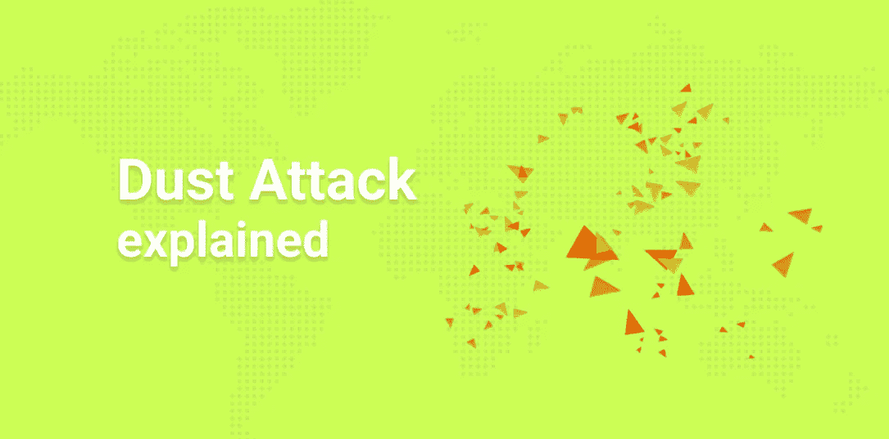

# 比特币灰尘攻击解释

> 原文：<https://medium.com/coinmonks/bitcoin-dust-attack-explained-2b3bebd4b373?source=collection_archive---------0----------------------->

在本文中，我们将考虑加密货币中“灰尘”的概念。术语灰尘或灰尘侵袭也与之相关。让我们弄清楚灰尘交易的危险是什么，以及钱包如何对抗这些攻击。

最初发表于 [NOWNodes 博客](https://nownodes.io/blog/bitcoin-dust-attack-explained)。

# 加密货币中的尘埃是什么

Dust 是攻击者用来向网络发送垃圾邮件的小型交易。在他们的帮助下，他或她可以做两件事:

*   在块中占据一个位置并加载网络，
*   通过 UTXO 将交易发送到特定地址，并通过进一步的传输路径对用户进行去匿名。

BTC 的最小单位是 1 聪。高达 100–200 Satoshi 的交易被视为尘埃。

# 第一种类型的灰尘攻击

此前，在被积极用于支付的加密货币网络(主要是比特币)中，存在争夺一席之地的竞争。这导致了更高的佣金。这在 2017 年底最为明显，当时 BTC 历史上最大的炒作正在等待。

现已不存在的 CoinWallet 或 F2Pool 开始用小额交易填充区块。他们的动机还不完全清楚，但同时也有关于分叉和将块大小从 1mb 增加到 2 MB 的讨论。

灰尘攻击和垃圾邮件交易本身不能被认为是全面的攻击，因为任何人都可以想发送多少就发送多少。他们支付佣金，并有权得到它。但事实证明，网络上的垃圾邮件给其他人带来了不便。会员必须支付更高的费用才能绕过排队的灰尘。否则，事务将无限期地停滞。

这是一种破坏网络的廉价而有效的方法。但是，在引入一些扩展解决方案之前，它一直是有效的，比如批处理和 SegWit，Lightning 网络和网络其他层的引入。目前，只向网络发送大量信息来抵消高额费用更有利可图。

灰尘袭击后，钱包增加了一项新功能——调整佣金率的能力。

# 通过 UTXO 去匿名化

为了更好地理解这种攻击的机制，您需要了解 UTXO。关于这一点，我们有一篇[单独的文章](https://nownodes.io/blog/utxo-vs-account-based-transaction-model)。

钱包金额由输入组成。就像你钱包里的普通钞票和硬币一样。例如，1000 美元可以表示为 500 美元，2 表示 100 美元，5 个硬币表示 60 美元。总共有 8 项。BTC 以同样的方式存储在账户中，这取决于金额是如何形成的以及发生了何种“变化”。

攻击者利用了输入没有混合的事实。他们送进一些灰尘，然后等待它与其他 UTXOs 混合。这可以让你发现哪些地址属于受害者。如果你需要追踪一家大公司或一条重要鲸鱼的地址，analytics 是值得的。知识可用于预测和交易信息、网络钓鱼攻击或勒索。

这个问题最初的解决方案是由彼得·托德提出的。

有必要发送灰尘，以便在一次交易中收集灰尘，而无需支付任何费用。

这意味着任何人都可以向事务添加输入，但是输出是未定义的。然后，交易被发送到 Peter Todd 的服务器，脚本将交易和其他翻译收集在一起。定期接收一次性交易，销毁灰尘。由于很多人的小额转账合并，没有人能说出它在哪里或从哪里来，因此也没有人能知道哪些硬币与地址相关联。这是一种搅拌器。

逐渐更新推出了钱包。Samourai 钱包现在有一个硬币控制功能，你可以用“不要花”的标志标记未知的交易。

硬币控制可以说是对抗这种攻击的最有效的方法。如果收件人可以完全忽略收到的灰尘，他们会保护自己的隐私。此外，不仅攻击者想要取消用户的匿名性，政府下属的实验室也是如此。

## 另外，阅读

*   最好的[密码交易机器人](/coinmonks/crypto-trading-bot-c2ffce8acb2a)
*   [密码本交易平台](/coinmonks/top-10-crypto-copy-trading-platforms-for-beginners-d0c37c7d698c)
*   最好的[加密税务软件](/coinmonks/best-crypto-tax-tool-for-my-money-72d4b430816b)
*   [最佳加密交易平台](/coinmonks/the-best-crypto-trading-platforms-in-2020-the-definitive-guide-updated-c72f8b874555)
*   最佳[加密贷款平台](/coinmonks/top-5-crypto-lending-platforms-in-2020-that-you-need-to-know-a1b675cec3fa)
*   [最佳区块链分析工具](https://bitquery.io/blog/best-blockchain-analysis-tools-and-software)
*   [加密套利](/coinmonks/crypto-arbitrage-guide-how-to-make-money-as-a-beginner-62bfe5c868f6)指南:新手如何赚钱
*   最佳[加密制图工具](/coinmonks/what-are-the-best-charting-platforms-for-cryptocurrency-trading-85aade584d80)
*   [莱杰 vs 特雷佐](/coinmonks/ledger-vs-trezor-best-hardware-wallet-to-secure-cryptocurrency-22c7a3fd391e)
*   了解比特币最好的[书籍有哪些？](/coinmonks/what-are-the-best-books-to-learn-bitcoin-409aeb9aff4b)
*   [3 商业评论](/coinmonks/3commas-review-an-excellent-crypto-trading-bot-2020-1313a58bec92)
*   [AAX 交易所审核](/coinmonks/aax-exchange-review-2021-67c5ea09330c) |推荐代码、交易费用、利弊
*   [德里比特评论](/coinmonks/deribit-review-options-fees-apis-and-testnet-2ca16c4bbdb2) |选项、费用、API 和 Testnet
*   [FTX 密码交易所评论](/coinmonks/ftx-crypto-exchange-review-53664ac1198f)
*   [n 零审核](/coinmonks/ngrave-zero-review-c465cf8307fc)
*   [Bybit 交换审查](/coinmonks/bybit-exchange-review-dbd570019b71)
*   [3Commas vs Cryptohopper](/coinmonks/cryptohopper-vs-3commas-vs-shrimpy-a2c16095b8fe)
*   最好的比特币[硬件钱包](/coinmonks/the-best-cryptocurrency-hardware-wallets-of-2020-e28b1c124069?source=friends_link&sk=324dd9ff8556ab578d71e7ad7658ad7c)
*   最佳 [monero 钱包](https://blog.coincodecap.com/best-monero-wallets)
*   [莱杰 nano s vs x](https://blog.coincodecap.com/ledger-nano-s-vs-x)
*   [Bitsgap vs 3 commas vs quad ency](https://blog.coincodecap.com/bitsgap-3commas-quadency)
*   [莱杰纳米 S vs 特雷佐 one vs 特雷佐 T vs 莱杰纳米 X](https://blog.coincodecap.com/ledger-nano-s-vs-trezor-one-ledger-nano-x-trezor-t)
*   [block fi vs Celsius](/coinmonks/blockfi-vs-celsius-vs-hodlnaut-8a1cc8c26630)vs Hodlnaut
*   Bitsgap 评论——一个轻松赚钱的加密交易机器人
*   为专业人士设计的加密交易机器人
*   [PrimeXBT 审查](/coinmonks/primexbt-review-88e0815be858) |杠杆交易、费用和交易
*   [埃利帕尔泰坦评论](/coinmonks/ellipal-titan-review-85e9071dd029)
*   [SecuX Stone 评论](https://blog.coincodecap.com/secux-stone-hardware-wallet-review)
*   [BlockFi 评论](/coinmonks/blockfi-review-53096053c097) |从您的密码中赚取高达 8.6%的利息