# 2022 年印度 6 大加密交易应用

> 原文：<https://medium.com/coinmonks/bitcoin-exchange-in-india-7f1fe79715c9?source=collection_archive---------1----------------------->

## 购买比特币的最佳加密应用程序

印度的加密货币正在蓬勃发展。现在很容易找到一个密码交易所，但是要找到一个适合你的有点难。所以在这篇文章中，我们将谈论印度最好的比特币交易所和其他加密交易所。

# 摘要

*   比特币交易所是一个帮助投资者交易[比特币](https://blog.coincodecap.com/a-candid-explanation-of-bitcoin)和其他加密货币的平台。
*   [WazirX](https://wazirx.com/invite/ad4e888q) 、 [BuyUcoin](https://trade.buyucoin.com/signup?referral=buyucoin45120546) 、 [CoinDCX](https://coindcx.com/signup?r=70297373$$Dxroxs&utm_medium=coincodecap&utm_campaign=coinmonks) 、 [Unocoin](http://unocoin.com/?ref=U-305402) 、 [Bitbns](https://ref.bitbns.com/64358) 可以认为是印度最好的加密货币交易所。
*   [**WazirX**](https://wazirx.com/invite/ad4e888q) 是印度的加密货币交易平台，后被[币安](https://www.binance.com/en/register?ref=UARTH1S1)收购，为交易者提供了很多机会。
*   [**BuyUcoin**](https://trade.buyucoin.com/signup?referral=buyucoin45120546) 也是一家在印度进行比特币交易的公司，与竞争对手相比，其在 BTC 的提现费用最低。
*   [**CoinDCX**](https://coindcx.com/signup?r=70297373$$Dxroxs&utm_medium=coincodecap&utm_campaign=coinmonks) 为新手提供学习机会，开启他们的密码交易之旅，并收取最低接受者和创建者费用。
*   [**Unocoin**](http://unocoin.com/?ref=U-305402) 是印度加密领域最古老的交易所，因此也是最有经验的。然而，他们收取很高的费用。
*   [**Bitbns**](https://ref.bitbns.com/64358) 恰好是最简单、最有吸引力、最安全的资产交易平台之一。

# 什么是比特币交易所？

加密投资者需要一个平台来交易比特币和其他加密货币，交易所提供这种服务。他们帮助交易者检查加密货币波动的市场价值，并将买家和卖家联系起来，以实现加密货币交易。

# 比特币交易所是如何运作的？

几乎所有的交易所都遵循相似的基本布局。加密平台将愿意进行交易的买家和卖家联系起来。我们可以对它们的功能有一个大致的了解:

*   要购买一枚比特币，你需要以你希望购买的价格下单。
*   现在，要出售一枚比特币，卖家必须下单出售他的比特币。
*   如果你和卖家的报价相同，那么交易所将你连接到卖家(在后端)，交易成功。

为了开始您的交易之旅，我们列出了一些印度最好的加密货币交易平台。

# 购买比特币的最佳加密应用

以下是你应该尝试的印度顶级比特币交易所。有些交流我自己用。

# 1. [WazirX](https://wazirx.com/invite/ad4e888q)

WazirX 是 Nischal Shetty 的印度大脑的产品，自 2017 年起开始运行。它被认为是印度人最常用的交易场所。

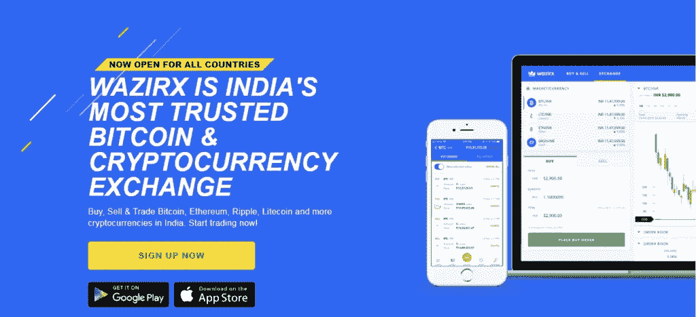

Covert Bitcoin in INR using WazirX - Indian Crypto Exchange

它在印度为交易者提供加密交易所的服务，甚至支持 [P2P 交易所](https://en.wikipedia.org/wiki/Peer-to-peer)。它兼容所有设备，包括笔记本电脑、MacBooks、iPhones 和 Android。WazirX 支持多种类型的加密货币。

WazirX 最近被全球最著名的加密货币交易平台币安收购。

## WazirX 安全吗？

是的，WazirX 是安全的，因为它为每次登录提供了[双因素认证](https://en.wikipedia.org/wiki/Multi-factor_authentication)。他们通过邮件和移动通知标签来通知每一笔成功完成交易的交易。

**WazirX** 提供应用程序锁，防止入侵者访问您的钱包。他们还将大多数加密货币储存在冷库中。

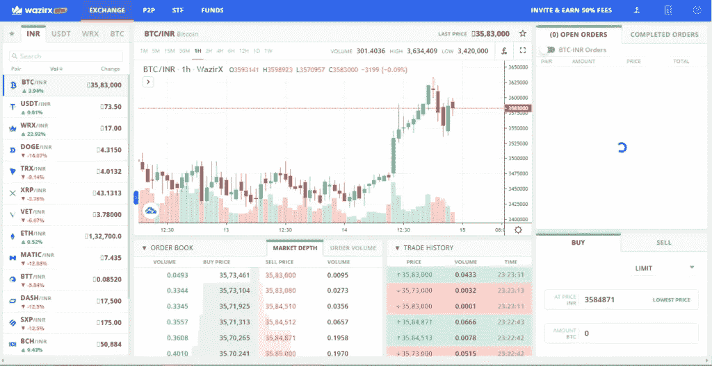

Buy Bitcoin Online using WazirX Exchange— Cryptocurrency India

## WazirX 费用

他们收取 0.2%的费用作为制造者和接受者的费用。他们对存放加密货币不收取任何费用。然而，他们对银行转账收取很高的费用。

在提款的情况下，他们收取 0.0005 BTC 每 BTC 提款，没有印度卢比提款费。

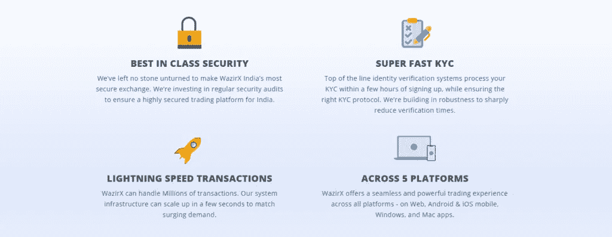

WazirX India Bitcoin

## WazirX 付款方式

WazirX 接受加密货币存款、**银行转账、NEFT & RTGS、IMPS 和** [**UPI**](https://en.wikipedia.org/wiki/Unified_Payments_Interface) 。然而，银行转账或 NEFT 收费 5.9 印度卢比，而合众国际社交易几乎不收费。

## WazirX 的利弊

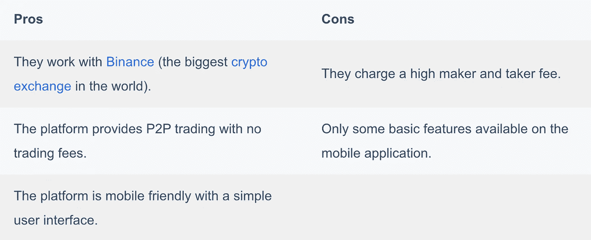

WazirX 提供了印度最好的比特币钱包。了解更多请阅读我们的 [**瓦济克斯评论**](https://coincodecap.com/wazirx-review) 。

# 2.[比特恩斯](https://ref.bitbns.com/64358)

Bitbns 是其中一个具有吸引人的简单用户界面的平台。它的设计考虑到了初学者的慢节奏和投资者的所有要求。

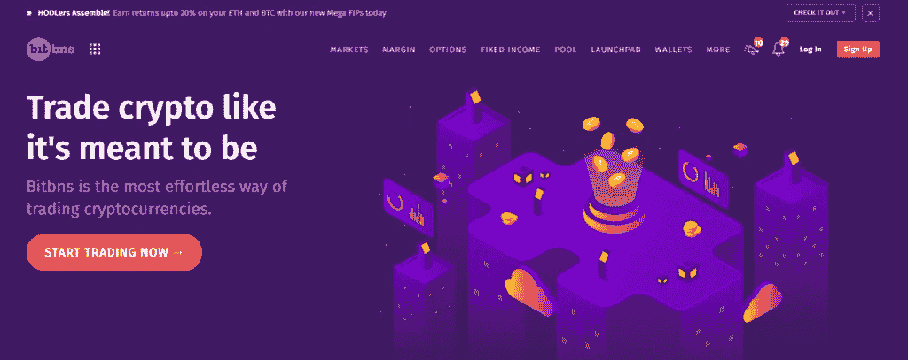

Covert Bitcoin in INR using Bitbns — Indian cryptocurrency exchange

它们提供了非常灵活的广泛功能。您可以通过两个小步骤完成注册过程，即填写您的详细信息并开始加密交易。

Bitbns 为您提供了一个自动化交易的选项，提前决定您希望出售资产的价格。

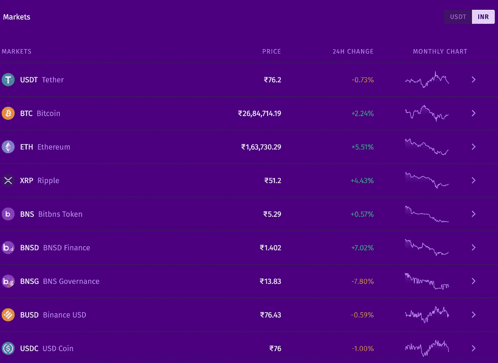

BitBns — list of cryptocurrencies in India

## Bitbns 安全吗？

是的，Bitbns 使用起来是安全的，因为它将近 95%的交易者资产存储在冷库中，并极其小心地处理用户的隐私。此外， *Bitbns* 配备了最好的 A 级安全功能，确保您购买的所有物品安全无虞。

Bitbns 邀请安全团体和个人在所有平台上研究它们，找出它们系统中的漏洞，不给入侵留下任何机会。

它们还为用户数据安全提供双因素身份认证。你可以通过开罚单的方式联系他们，他们会就你关心的问题联系你。

## Bitbns 费用

Bitbns 向其用户收取 0.25%的统一交易费，不包括持有 VIP 通行证的用户。拥有至少价值 25 美元的 BNS 代币就可以快速获得 VIP 服务。

你可以在下表中看到他们的费用划分:

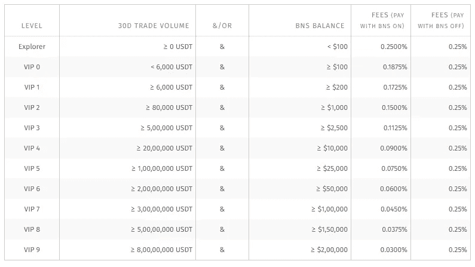

## Bitbns 支付方式

Bitbns 支持所有主要的支付选项，包括 UPI。您还可以通过 NEFT、IMPS、RTGS、网上银行和点对点存款进行存款。

## Bitbns 的利弊

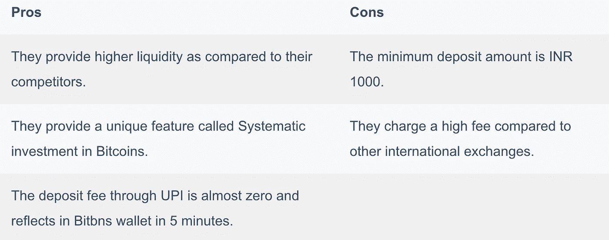

BitBns 提供了印度最好的加密钱包。使用它，你可以轻松地在印度买卖比特币和其他加密货币。

# 3. [CoinDCX](https://coindcx.com/signup?r=70297373$$Dxroxs&utm_medium=coincodecap&utm_campaign=coinmonks)

CoinDCX 是一个初学者友好的印度加密交换，并提供了一个区块链钱包。它拥有来自比特币基地的巨额投资，是印度最大的密码交易平台。他们为您提供 100 多种加密货币作为交换的选择。

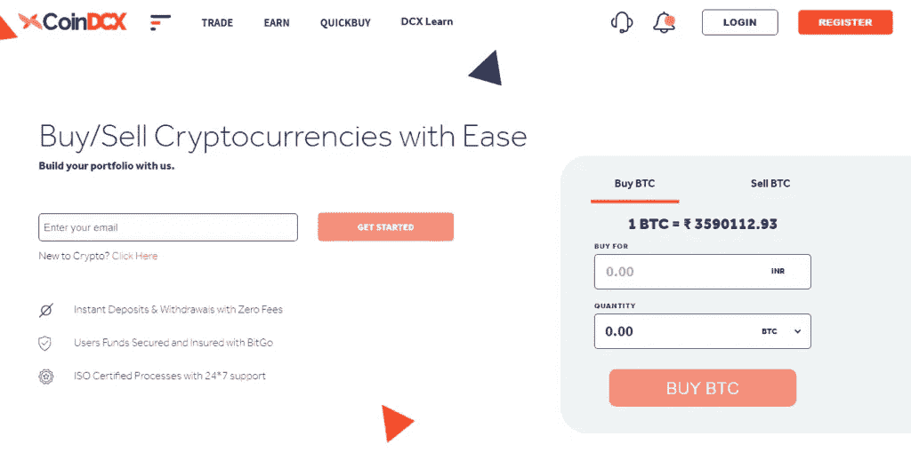

How to buy cryptocurrency in India using CoinDCX - Indian Crypto Exchange

该平台向初学者教授交易和市场知识，从而促进了印度的加密货币交易。你可以随时使用 CoinDCX 查询印度的比特币汇率。

## CoinDCX 安全吗？

是的，CoinDCX 使用起来绝对安全。他们的热门钱包里只有用户加密货币总量的 5%。你所有的个人信息都是安全的，即使是内部成员也无法访问。

CoinDCX 为您提供了双因素身份验证，还为流程中的每次交换提供了通知。

他们甚至通过 Bitgo 为你提供保险，一旦出现安全漏洞，这些保险将会弥补你的损失。

## CoinDCX 费用

CoinDCX 对银行存款收取费用。然而，他们对合众国际社的存款不收或只收很少的费用。

他们向你收取 0.1%的收取费和 0.1%的制作费，这比他们的竞争对手要低。

然而，他们收取每提取一 BTC 0.001 BTC 的巨额费用。

## CoinDCX 付款方式

您可以存入印度卢比或加密货币开始交易。他们允许您通过**银行转账、网上银行、NEFT/RTGS、IMPS 和 UPI** 存入印度卢比。

要提取您的印度卢比资金，您可以直接进行银行转账。

## CoinDCX 利弊

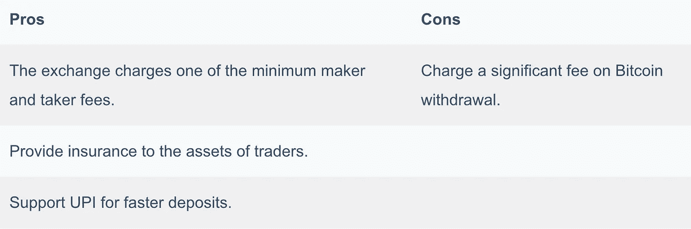

使用 CoinDCX，您可以实时查看印度的 BTC 价格。

# 4.[卜玉昆](https://trade.buyucoin.com/signup?referral=buyucoin45120546)

BuyUcoin 是三个印度大脑的产物，从 2016 年开始运行。你可以使用 BuyUcoin 来交易比特币和其他加密货币。他们还提供在钱包里保存或储存比特币的服务。

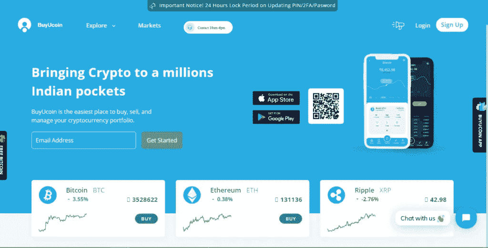

Covert Bitcoin in INR using BuyUcoin — Crypto Exchanges in India

它们是比特币交易的最佳平台之一。然而， [Shinyhunters](https://en.wikipedia.org/wiki/ShinyHunters) 在 2021 年 1 月对其进行了黑客攻击，导致 325k 用户的隐私数据被泄露和丢失。

## BuyUcoin 安全吗？

是的，BuyUcoin 是安全的，因为它使用[加盐算法](https://en.wikipedia.org/wiki/Salt_(cryptography))加密用户的密码，防止对数据的访问。他们将 95%的资金存储在离线冷存储中。

它们提供双因素身份认证和移动应用。然而，该移动应用在 google play 商店的评分为 1.9/5。

## BuyUcoin 费用

他们收取存款费，这取决于他们的银行合作伙伴，0.24%的做市商/收款商费用，以及零场外交易费用。

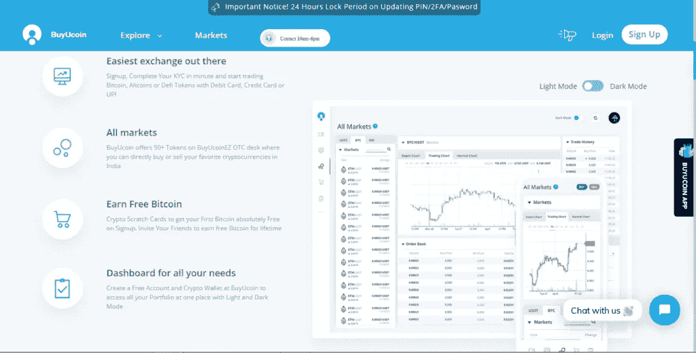

BuyUcoin Login

提取一枚比特币，你需要为每 BTC 支付 0.00125 BTC。然而，存入比特币或任何其他加密货币都是免费的。

## BuyUcoin 付款方式

BuyUcoin 通过借记卡、信用卡、net、网上银行和合众国际社接受支付。您还可以连接您的 [Mobikwik 钱包](https://www.mobikwik.com/)并将其存入 BuyUcoin 钱包。

## BuyUcoin 利弊

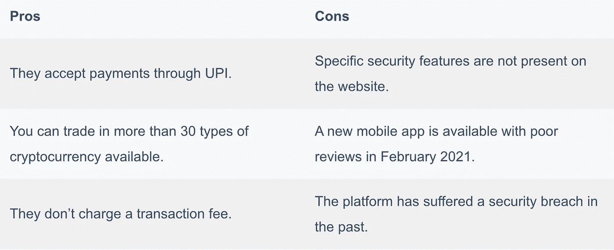

用 BuyUcoin 查比特币印度卢比的价格。

# 5. [Unocoin](http://unocoin.com/?ref=U-305402)

Unocoin 是印度最古老的加密货币交易所之一。它们提供了一个独立于设备的加密交易平台，仅通过移动应用程序就有超过 100 万的交易者。

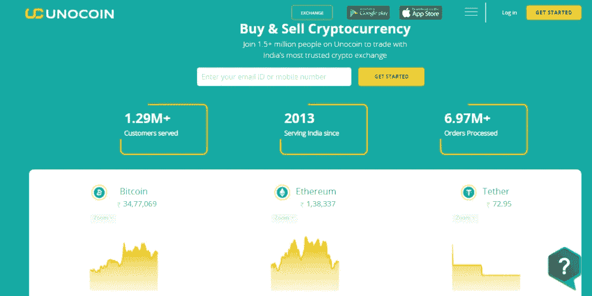

Convert INR to Bitcoin using Unocoin — Best Bitcoin Exchange in India

## Unocoin 安全吗？

是的，Unocoin 是一个安全可靠的平台。他们把交易者的大部分资产储存在冷库里。这些离线存储的比特币地址是在一台电脑中生成的，这台电脑在它的有生之年永远不会连接到互联网。

除此之外， [Unocoin](https://blog.coincodecap.com/go/unocoin) 提供双因素认证，你可以通过指纹保护锁定你的手机应用。

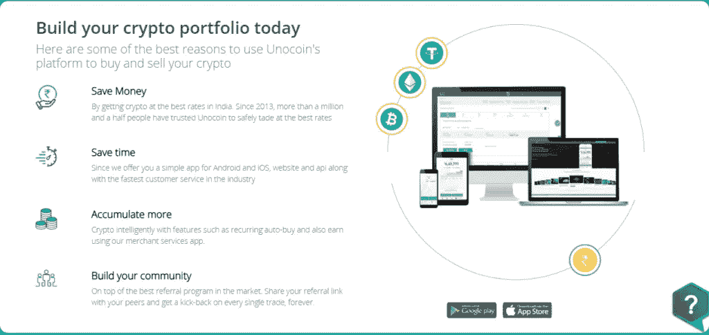

Crypto in India — Unocoin — Indian Cryptocurrency Exchange

## 硬币费

该交易所对比特币交易所收取 0.7%的费用，达到黄金会员资格后，费用降至 0.5%。而在提取比特币时，Unocoin 收取每 BTC 0.0005%的费用。

除了政府收取的 18%的交易费外，Unocoin 还收取 0.4%的做市商费和 0.6%的收款人费。

## 非硬币支付方式

对于提款，Unocoin 通过 NEFT 或银行转账将金额直接转入您的银行账户。

但是，您可以使用 Mobikwik 钱包、借记卡/信用卡、银行转账和 UPI 进行存款。

## 硬币的利与弊

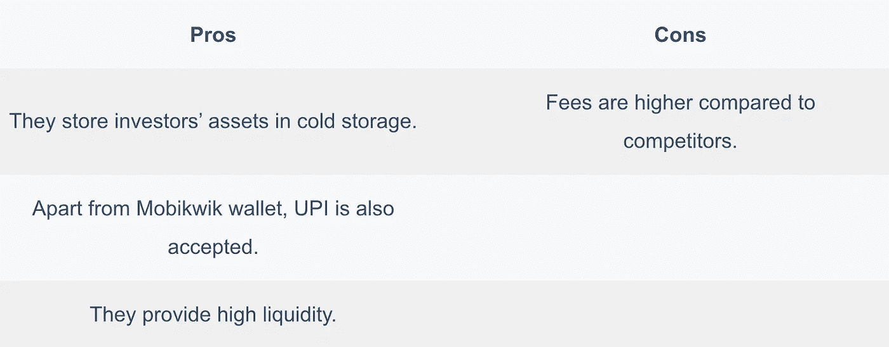

使用 Unocoin 查看印度的加密货币价格。

# 购买比特币印度——结论

考虑到安全性、初学者友好性、收费、用户界面和存款方式等所有特点，我们相信 [**WazirX**](https://wazirx.com/invite/ad4e888q) 将是初学者的最佳选择之一。然而，WazirX 有很高的制造商和接受者费用，这是 [CoinDCX](https://coindcx.com/signup?r=70297373$$Dxroxs&utm_medium=coincodecap&utm_campaign=coinmonks) 或 [Bitbns](https://ref.bitbns.com/64358) 可以替代的。

# 常见问题

**如何在印度购买比特币？如何在印度购买加密货币？**

你可以从印度的交易平台购买比特币，然后储存在你的钱包里。也可以通过各种平台购买一个比特币，提供点对点服务，比如 [LocalBitcoins](https://localbitcoins.com/?ch=1h121) 、 [WazirX](https://wazirx.com/invite/ad4e888q) 、 [Paxful](https://paxful.com/?r=qWQbe6BZnkA) 等。

**在印度如何投资比特币？**

印度有许多加密交易所，为交易者提供了交易一些最受欢迎的加密货币和替代硬币的机会。你可以通过阅读我们关于如何在印度投资比特币的指南来开始你的交易之旅？

**比特币在印度合法吗？**

根据目前的情况，印度政府仍在制定关于加密货币的规则。由于在印度没有管理加密交易的现有规则，它既不合法也不非法。

**如何在印度赚取比特币？**

赚取比特币的方法有很多。一个人可以在与加密货币相关的领域工作，并接受比特币支付。你也可以通过在你的企业接受比特币作为支付方式来赚取比特币。

**如何在印度购买以太坊？**

阅读我们的指南[在印度购买以太坊](https://coincodecap.com/buy-ethereum-in-india)。

**别名在 WazirX 中是什么意思？**

别名只是指一个替代名称。在 WazirX 上输入支付选项时，系统会要求您填写别名。因此，在这一部分，您应该输入您的姓名和其他必需的详细信息。

**如何从瓦济里到币安转机？**

登录您的[**WazirX**](https://coincodecap.com/go/wazirx)**账户。点击**资金**，选择**转账到币安**零手续费。**选择密码**并**输入要转账的金额**。最后输入 WazirX 2FA 完成交易。**

**从比特币银行提取加密货币需要多长时间？**

**加密货币的提取时间取决于特定的加密资产和您要提取的资产数量。比如[比特币](https://coincodecap.com/a-candid-explanation-of-bitcoin)需要四块确认才能转账成功。您的资金可能需要几分钟到几个小时才能反映在您的收款账户中。**

**【Unocoin 是谁创立的？**

**Unocoin 由 [Sathwik Vishwanath、](https://twitter.com/sathvikv)Harish B V 和 [Sunny Ray](https://twitter.com/SunnyRayShow?ref_src=twsrc%5Egoogle%7Ctwcamp%5Eserp%7Ctwgr%5Eauthor) 创立。**

**KYC 在 CoinDCX 有必要吗？**

**不，完成**KYC**并不是强制性的。尽管如此，您的账户仍将被限制在每天 10，000 印度卢比或 4 BTC 加密货币的存款和取款总额内。**

****有没有 CoinDCX 的 app？****

**是的，CoinDcx 有一个 app。你可以从安卓设备的 play store 下载 [CoinDCX 应用](https://play.google.com/store/apps/details?id=com.coindcx&hl=en&utm_source=homepage&utm_medium=Fold10&utm_campaign=rebranding)。**

> **加入 Coinmonks [电报频道](https://t.me/coincodecap)和 [Youtube 频道](https://www.youtube.com/c/coinmonks/videos)了解加密交易和投资**

## **另外，阅读**

*   **[如何在 Uniswap 上交换加密？](https://coincodecap.com/swap-crypto-on-uniswap) | [A-Ads 审查](https://coincodecap.com/a-ads-review)**
*   **[WazirX vs CoinDCX vs bit bns](/coinmonks/wazirx-vs-coindcx-vs-bitbns-149f4f19a2f1)|[block fi vs coin loan vs Nexo](/coinmonks/blockfi-vs-coinloan-vs-nexo-cb624635230d)**
*   **[本地比特币评论](/coinmonks/localbitcoins-review-6cc001c6ed56) | [加密货币储蓄账户](https://coincodecap.com/cryptocurrency-savings-accounts)**
*   **什么是融资融券交易**
*   **[支持卡审核](https://coincodecap.com/uphold-card-review) | [信任钱包 vs MetaMask](https://coincodecap.com/trust-wallet-vs-metamask)**
*   **[Exness 评测](https://coincodecap.com/exness-review)|[moon xbt Vs bit get Vs Bingbon](https://coincodecap.com/bingbon-vs-bitget-vs-moonxbt)**
*   **[如何开始通过加密贷款赚取被动收入](https://coincodecap.com/passive-income-crypto-lending)**
*   **[BigONE 交易所点评](/coinmonks/bigone-exchange-review-64705d85a1d4) | [电网交易 Bot](https://coincodecap.com/grid-trading)**
*   **[氹欞侊贸易评论](https://coincodecap.com/anny-trade-review) | [CoinSpot 评论](https://coincodecap.com/coinspot-review)**

**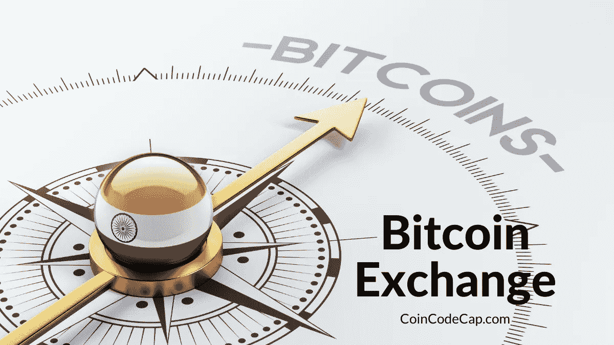**

**Top Bitcoin Exchanges in India**