# 比特币退出策略

> 原文：<https://medium.com/coinmonks/bitcoin-exit-strategy-ff176d81d261?source=collection_archive---------2----------------------->

比特币经历了一场大挤兑，真正开始是在 11 月初。从 10 月 21 日到今天，也就是 3 月 14 日，比特币上涨了大约 400%。这当然是一个很大的进步，还能有多大的进步呢？

随着我们继续度过减半周期的牛市阶段，并且由于我有非常大的配置(几乎所有可用资本)，我开始考虑如何在未来几个月管理我的头寸，这可能意味着获取一些利润并重新平衡投资组合，为牛市后的配置做准备。

这是一个图表，比较了过去三个减半周期，从[计划到](https://twitter.com/100trillionUSD)。

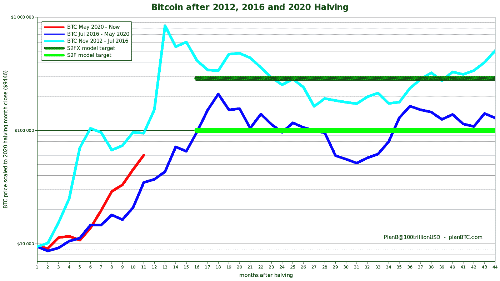

根据历史模式，我们似乎还有更长的路要走。

如果你不熟悉减半周期和由减半触发的价格动态，[这篇文章进入细节](/coinmonks/the-2020-bitcoin-halving-bull-run-why-this-cycle-is-different-80d8af4ce8b6)，它也进入这个减半周期特有的特定条件。

本文不是投资建议，每个人的情况都是独特的，所以在做出投资决定时，你必须考虑到你个人的风险承受能力，你对比特币的信念，投资组合的构建和时间范围。

我会做一个看涨和看跌的案例，并挑选指标来支持每一个案例。

# 看涨案例

看涨的理由在股票和基于流量的估值之间有着非常稳固的基础。 [S2FX](/@100trillionUSD/bitcoin-stock-to-flow-cross-asset-model-50d260feed12) 可能是社区支持最多的，PlanB 甚至说这是他的首选模型，因为它不是时间序列模型。

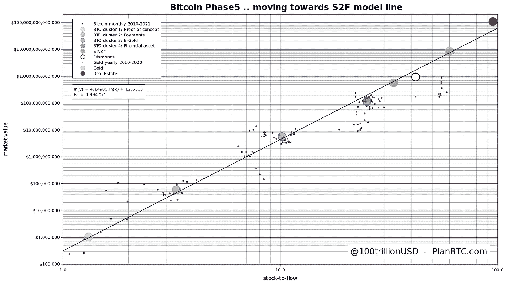

自 2020 年 4 月推出以来，这一模型已经过非常好的回溯测试，并且具有难以置信的先见之明。忽略其他，如果你相信 S2FX 估值，我们还有很长的路要走，至少到 288K 美元。

基于流量的模型和链上数据支持这种估价。我做了自己的基于流量的估值，基于 [Willy Woo 的每美元投资的市值收益](http://charts.woobull.com/bitcoin-gains-per-dollar-invested/)，以及潜在的未来流量和[已确认的流量](http://bitcointreasuries.org)。我的模型建议，本周期的低目标为 9.1 万美元，高目标为 100 万美元。

仅仅看一下以前周期的幅度就可以看出我们还有更长的路要走:

*   2011 年低谷至 2013 年高峰:50，000%
*   2015 年低谷到 2017 年高峰:10，000%
*   2013 年峰值至 2017 年峰值:1，500%
*   2018 年低谷期+10，000% = 32 万美元
*   2017 年峰值+ 1，500% = 31.4 万美元

交易所的储备数量是衡量过去需求和现在稀缺性的指标。我们已经看到交易所的比特币储备急剧减少。

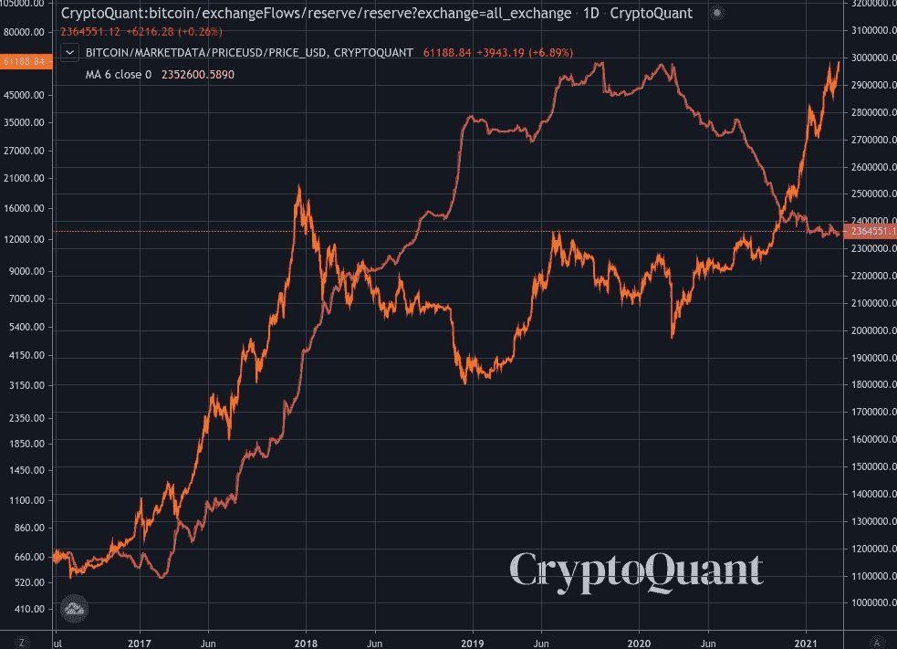

我最喜欢的图表之一是 [HODL 波浪](https://academy.glassnode.com/supply/hodl/hodl-waves#:~:text=Indicator%20Overview-,HODL%20Waves%20represents%20a%20macro%20view%20of%20how%20long%20a,held%20before%20it%20is%20moved.&text=The%20warmer%20colours%20at%20the,moved%20in%20a%20long%20time.)。我喜欢它，因为不同时间长度的持有人的恐惧和贪婪都在图表里。在 2017 年的周期中，大多数 HODL 人对价格的早期飙升做出了反应，然后在抛物线阶段的早期，这些 corhorts 的规模增加，长期持有者开始在周期的峰值附近出售。

这里有一个带注释的图表，显示了已经重复了这个周期的一些模式，并且似乎正在再次重复。2017 年的重演表明，价格将继续上涨两个月。

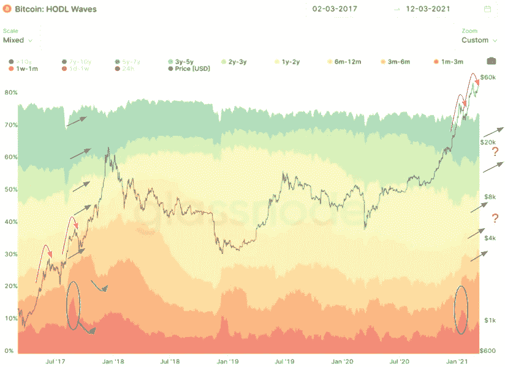

在这个周期中，HODL 的同类似乎都反应更快，所以当我们接近峰值时，这个信号可能会更加嘈杂。

谷歌趋势显示，“比特币”的搜索量是 2017 年峰值的 30%，这表明这还没有达到之前的狂热程度。

[供应调整后的硬币销毁天数](https://academy.glassnode.com/indicators/coin-days-destroyed/cdd-coin-days-destroyed#:~:text=Coin%20Days%20Destroyed%20(CDD)%20is,spent%20for%20a%20long%20time.&text=The%20number%20of%20coin%20days,have%20remained%20dormant%20(unmoved).)本周期已经飙升一次，在 2017 年飙升了几次，比我们本周期迄今为止唯一的一次飙升高出三次。这一指标的上升表明长期持有人在移动硬币，有可能将它们变现。

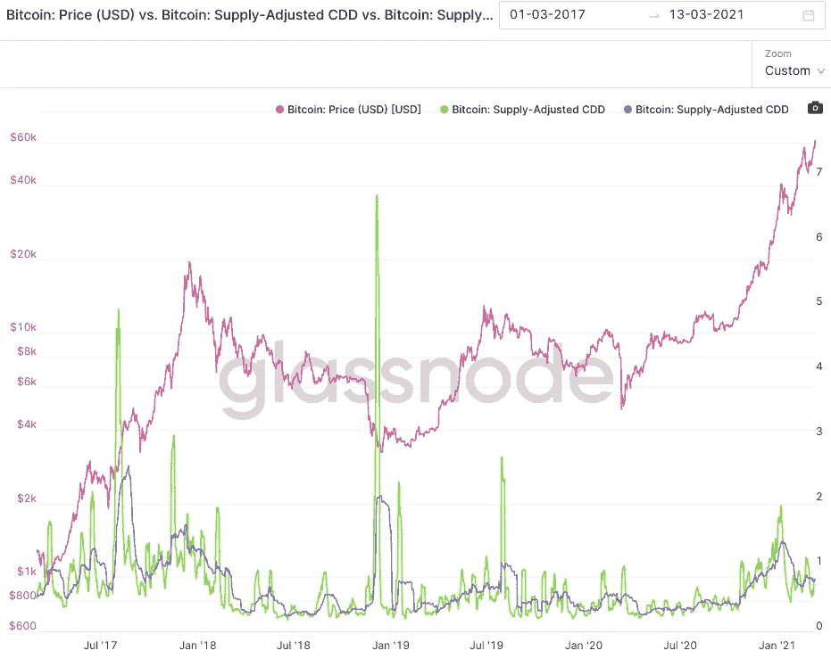

交易所鲸鱼比率尚未达到 2017 年周期峰值的低点。该指标走低表明，小股东(散户)正在主导价格走势。该理论认为，散户投资者进入狂热状态较晚，这是末日即将来临的信号。你可以看到这一指标在 2017 年峰值时大幅下降。不过请注意，这可能是一个滞后指标。

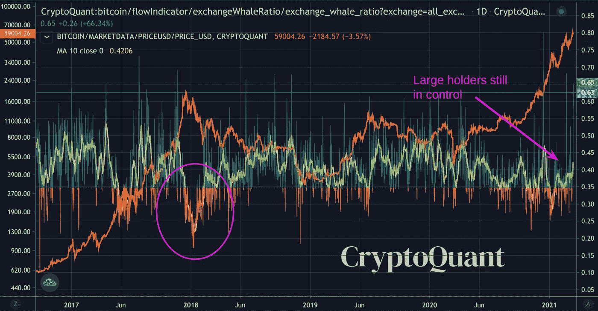

我确实认为至少还会有一波上涨，应该会比上两波上涨一样强劲，甚至更强，前两波上涨幅度分别为 140%和 102%。上次下跌的 100%将使我们达到 87，000 美元。

# 看跌案例

股票到流动一直是模拟比特币价格走势的一种非常令人印象深刻的方式，但减半周期的样本量相当小(三个周期——2017/2018 周期是唯一一个参与者数量真正可观的周期，当前周期尚未完成)。原始的库存到流量模型是一个时间序列模型，并且预测比 S2FX 更低的峰值。这里有一张[现场图](https://digitalik.net/btc/s2fx)，这里有一张截图:

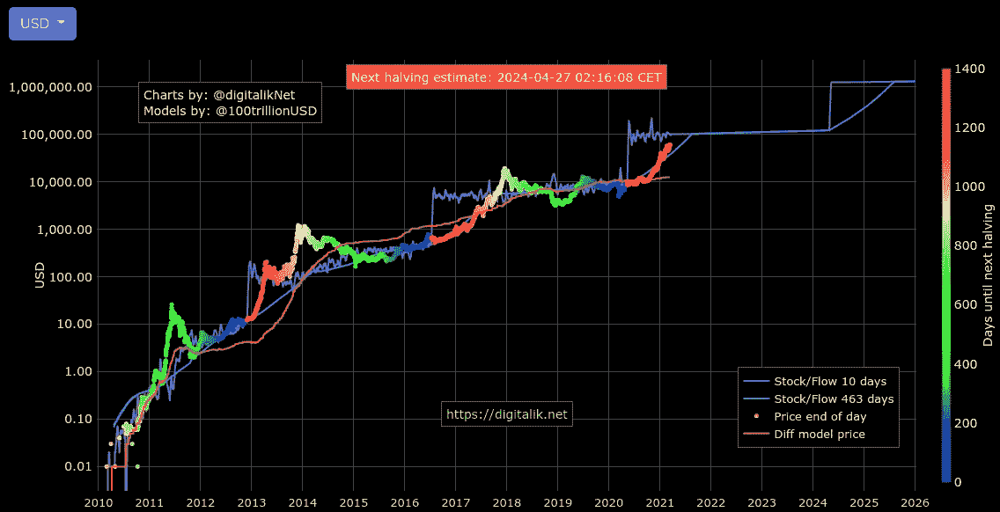

基于这个模型的看跌价值仍然超过 10 万美元。即使我们可能达到 28.8 万美元，这里和那里之间也可能会有明显的下降，就像 2013 年那样。

[Pi 周期顶部指示器](https://www.lookintobitcoin.com/charts/pi-cycle-top-indicator/)即将触发。这一指标准确地称之为比特币历史上的三大主题。

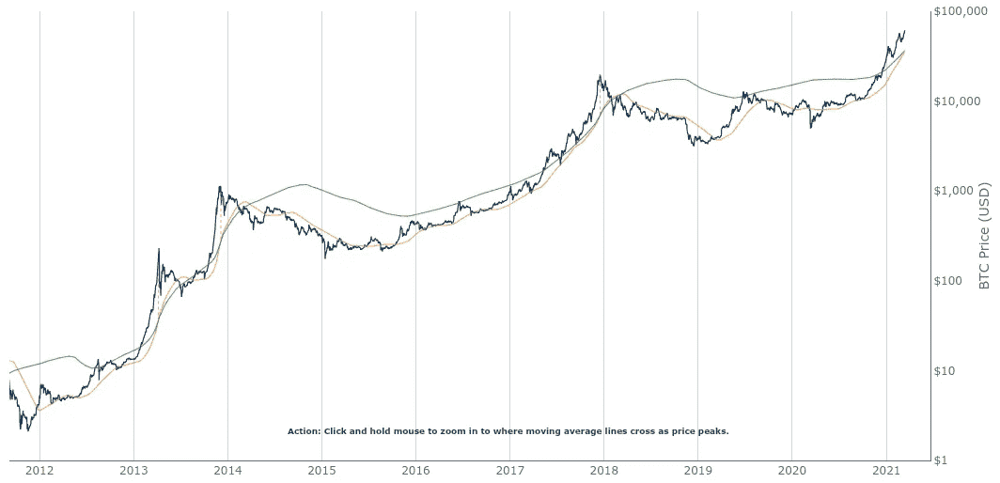

注意，我们在 2013 年有一个双顶，指标分别称之为双顶。

尽管以比特币计算，外汇储备急剧下降，但以美元计算，外汇储备从未如此之高。

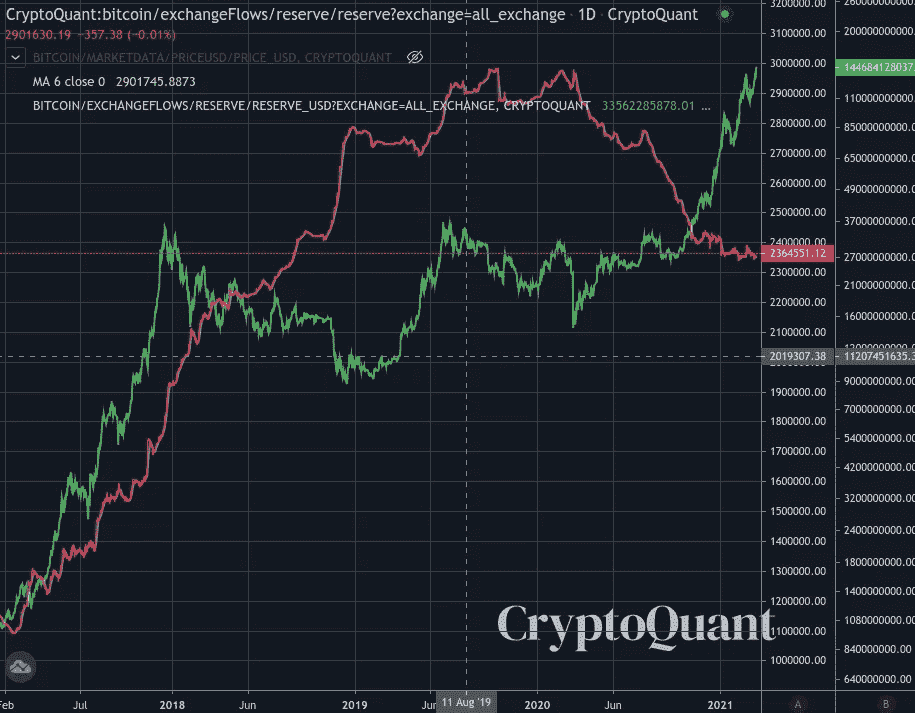

这个指标显然相当紧密地跟踪了比特币的价格，我们在 2017 年也确实看到了同样的事情。

MVRV Z-Score 这个周期一直跑的很热。这意味着比特币相对于其实现的价值——即硬币上次移动时实现的价值——被“高估”了。

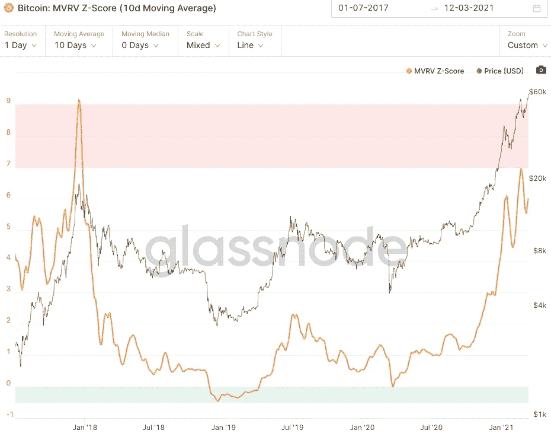

SOPR 也变得相当热，但我认为这更倾向于一个短期指标，它已经在最近两次下跌中恢复得相当好。

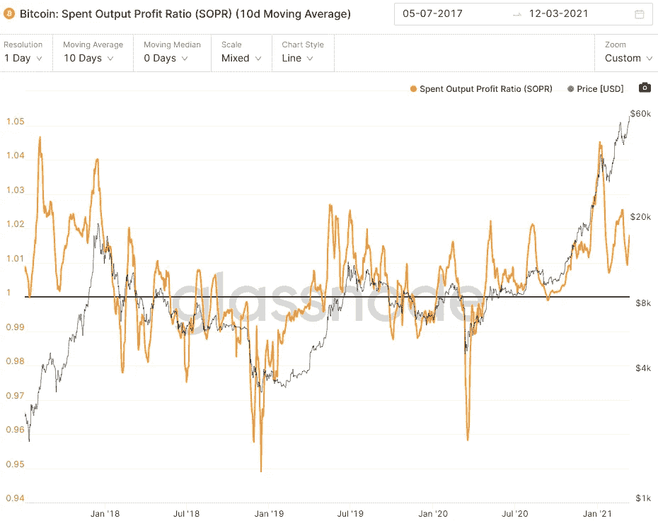

基于这些指标，我确实感觉我们可能会经历一个类似于 2013 年的中间顶部。

# 结论

我在考虑一些宏观因素，这些因素会让我在打电话时产生一些偏见。其中一个与公司在资产负债表上将现金转移到比特币有关。我认为我们只是看到了这种趋势的开始，如果这种趋势开始回升，我持有的信心将会非常高。寻找更多来自公司、保险公司，甚至养老基金或主权财富基金的公告。这些将是非常乐观的指标。

从长远来看，比特币取代美元成为记账单位、取代美国国债成为最原始的抵押品资产的可能性越来越大。如果这种情况发生，我们最有可能至少再经历一个减半周期。如果你的投资理论包括这种结果，你必须在你的头脑中发挥出试图在长期前景非常非常乐观的情况下通过短期下跌进行交易的情绪影响。不管未来两年发生什么，你都能坚守岗位吗？即使其中包括 80%的提取？

由于配置了大量的比特币，我倾向于只在有税收优势的账户中获取 85000 到 90000 美元的利润，或者在我可以避免重大税收事件的情况下出售比特币(尽可能避免短期资本利得)。对我来说，这主要是为了重新平衡投资组合，但如果市场结构看起来合适，我也会考虑重新建仓。

人们在未来两个月管理头寸时可能考虑的因素:

*   你的风险承受能力是多少？你能承受从 9 万美元跌到 5 万美元吗？
*   你的信念水平如何？
*   你的投资组合是否因比特币收益而变得严重失衡？
*   你打算在这个牛市阶段卖掉大部分比特币，还是在这个周期卖掉 HODL，进入下一个周期？

把你的退出计划写下来是个好主意，这有助于你从具体的角度去思考它。在各种场景下，你的精神和情绪状态会是怎样的？你为什么拥有比特币？做好准备。

祝你好运！