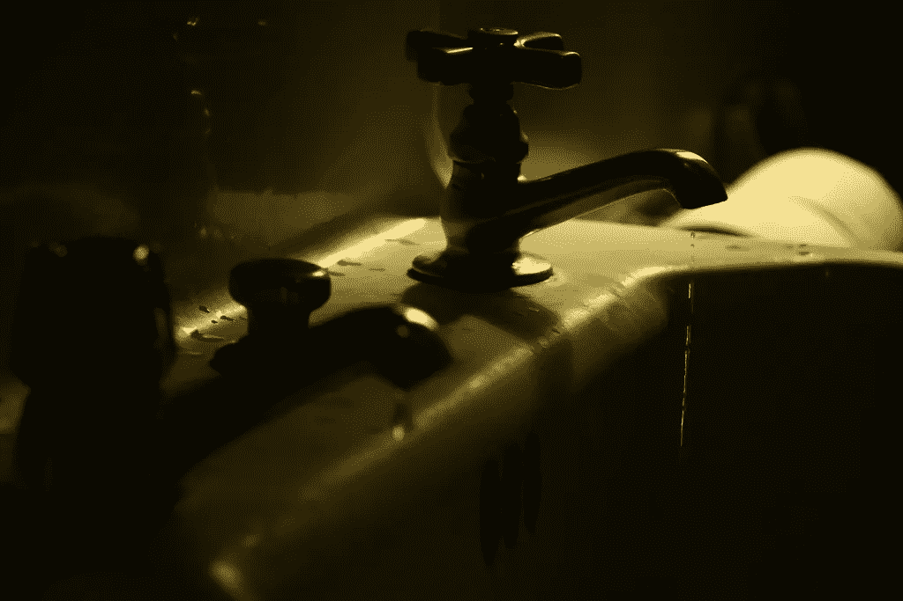

# 比特币龙头:好的、坏的、丑陋的

> 原文：<https://medium.com/coinmonks/bitcoin-faucets-the-good-the-bad-and-the-ugly-a8687c2a2e72?source=collection_archive---------2----------------------->

当我第一次开始探索加密货币世界时，我花了一些时间在比特币龙头网站上。对于那些不熟悉水龙头网站的人来说，它们是向访问者发放少量免费加密货币的网站(即，它们“滴”少量的[比特币](https://blog.coincodecap.com/a-candid-explanation-of-bitcoin/)和替代币)。通常，你通过点击一个按钮并完成验证码来领取免费硬币。硬币慢慢地在你的…