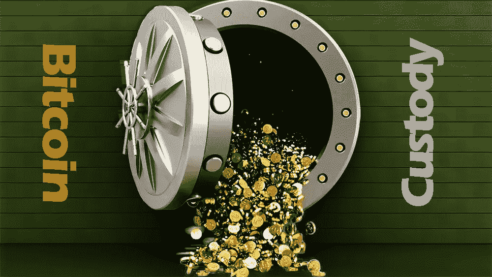

# 比特币的金融化和托管服务，真正的威胁很少有人谈论

> 原文：<https://medium.com/coinmonks/bitcoin-financialization-and-custodial-services-the-real-threat-too-few-talk-about-a2a53fb3d21?source=collection_archive---------4----------------------->

## 金融化将带来新的风险，并将第三方托管增加到目前存量的 50%以上。这可能是比特币的系统性风险。

F 比特币金融化来了。这是华尔街对比特币感兴趣的唯一原因。目的是将比特币包装成某种奇特的金融产品，然后出售获利。然后大量出售，获取高额利润。

有人说这很好，因为它增加了采用率。想想比特币交易所交易基金。对于传统投资者来说，购买 ETF 并获得比特币价格的敞口，无疑比购买实物更容易，因为后者增加了自我托管的复杂性。最近推出的加拿大实物结算 ETF [BTCC](https://www.purposeinvest.com/funds/purpose-bitcoin-etf) 无疑有其优点，自成立以来一直以极快的速度吸引着投资者。

但是当然也有缺点。一个是比特币的金融化可能对实物资产的价格产生的潜在影响。**想想如果 ETF 不是实物而是合成的。这将使投资者从“物理”持有比特币转向持有模拟比特币价格波动的借据。**

事实上，凯特琳龙(Caitlin Long)表示，“如果我们回到导致问题的相同(纸质)工具，比特币的目的是什么”。

如果华尔街创造出足够多的比特币“纸质”替代品，那么对这种实物资产的需求就很容易达到上限。这实际上限制了贵金属的实物需求和价格。

但一件事是引导投资者从实物资产转向纸面产品，另一件事是彻底操纵价格。Crypto IQ 的 Zachary Mashiach [提出了一个案例](https://www.cryptoiqtrading.com/cme-bitcoin-futures-are-poisoning-crypto/)，即芝加哥商业交易所的比特币期货对比特币价格 2018 年至 2019 年的长期下跌负有责任，这与期货市场上涉嫌操纵贵金属的行为有相似之处。

但是我不相信。原因是比特币期货的价格是由币安、比特币基地、Bitfinex、北海巨妖等主要现货交易所设定的。到目前为止，它是由点驱动的。以至于人们可以说，在过去，比特币的价格可能受到操纵，方法是在一个主要的现货交易所抛售大量比特币，引发连锁效应，在现货和期货市场都出现止损。然后头寸被转换以从现货和期货多头头寸反弹中获利。但触发点是在现货市场，而不是相反。如果期货市场和现货市场之间没有联系，那么期货市场上的大宗交易怎么可能引发同样的连锁效应呢？与贵金属市场不同，比特币期货没有实物结算，它们完全是现金结算。这就像一个博彩市场给出赛马的赔率。这不会影响比赛的进程。如果现货市场上的投资者受到期货市场上发生的事情的影响，唯一的可能性将是一种反射性的心理循环。但是谁会关心比特币期货在干什么呢？你先看现货市场还是期货市场？

但毫无疑问，这是一个复杂的问题，我可能会忽略，这可能值得与更了解期货市场如何运作的人一起研究更多细节。

此外，如果我们看看贵金属是如何通过纸制品被操纵的，另一个问题就出现了。贵金属很难审计。需要一个声誉好、值得信赖的审计师。然后，必须对金库进行物理检查，并对金条进行目视识别和计数。在大多数情况下，这种情况每年发生一次。因此，除非有极端的欺诈案例，否则在未分配账户上开借条是小菜一碟，以至于没人真正知道每一盎司库存金属有多少债权，有人说是 100，有人说更多。幸运的是，比特币在这方面明显优于贵金属，因为它在任何时候都是 100%可审计的，不需要值得信赖的审计员。因此，对于华尔街的骗子来说，如果投资者保持警惕，并要求提供储备证明和定期披露比特币地址，玩三张牌的难度会大得多。

但是真正的威胁可能是另一个。这可能是比特币的系统性问题。 **比特币激增的托管服务是罪魁祸首。**

[Jameson Lopp](https://blog.keys.casa/the-custodian-menace/) 和 [Hasu](https://insights.deribit.com/market-research/why-bitcoin-might-not-survive-a-bitcoin-standard/) 已经指出了引起关注的主要原因:

> *(I)“…如果[保管人]出了问题，人们想安全地自行保管，链上的吞吐量限制意味着快速大规模退出是不可行的。另一点是，托管人将更有能力支付非常高的交易费用，以便在彼此之间进行结算交易，从而将普通用户挤出进行链上交易的价格"*
> 
> *(ii)一场政治攻击可能展开，当局“……将要求交易所履行更严格的披露要求，围绕反洗钱/KYC 出台更严厉的规定，等等。最终，来自监管机构和国家的压力导致托管人审查交易并扣押资金”[就像银行为了遵守罗斯福 6102 号行政命令所做的那样]。*
> 
> *(三)对协议的攻击可能展开，由此“保管人协调一个叉子(硬的或软的)并改变规则。任何有争议的分叉都会导致连锁分裂，在这一点上，每一方都通过出售他们不支持的分叉来争夺经济优势。托管人出售他们希望看到消亡的 fork 分支机构，可能会让这变得更加狡猾。”*

关于以上(I)和(iii)中更具技术性的问题以及此类行动的成功几率，有更多有资格的人可以给出更可靠的答案，尽管所强调的风险似乎完全可信。关于第(二)点，更具地缘政治动机的袭击风险，这无疑是一个极有可能发生的情况。但是，如果一方面，人们可以相信比特币经过战斗考验的抗审查能力可以转移这种攻击——最肯定的是，如果人们保管自己的密钥——另一方面，人们不得不担心这种攻击可能对整个网络产生的影响，因为它可能会影响比特币总供应量的 40%至 60%。随着比特币的金融化，未来第三方托管比特币的数量将会成比例增加。因此，这种威胁将成倍增长。

**我希望比特币社区对上述话题有更多的关注和讨论。到目前为止，这些都是相当新的话题，但它们理解起来要复杂得多，而且比过去 10 年里讨论的通常的 FUD 理论潜在的破坏性要大得多。**

最重要的是，社区必须继续教育新的比特币创造者和投资者，让他们了解自我监管和储备证明概念的重要性。现在是做这件事的时候了。

埃隆·马斯克必须证明特斯拉拥有他声称的比特币。比特币制造者不应该相信他，他们应该核实。每一个吹嘘自己所持股份的华尔街巨头或公司投资者也是如此。如果你是特斯拉(Tesla)或 Microstrategy 的投资者，你应该要求该公司向你展示他们的比特币地址，这些地址已经过正式认证，上面有一条用他们的私钥签名的信息。[表格 8K](https://www.sec.gov/fast-answers/answersform8khtm.html) 是不够的，因为它仅仅[显示了重大的资产收购或处置](https://www.microstrategy.com/content/dam/website-assets/collateral/financial-documents/financial-document-archive/Form-8-K_feb-02-2021.pdf)。你希望能够监控他们的比特币持有量，因为这可能会极大地影响你的投资价值。

**开始质疑，不是他们的钥匙，也不是他们的比特币。**

www.bianconiandrea.com—2021 年

**捐赠给**[**www.bianconiandrea.com/**](https://www.bianconiandrea.com/)支持我独立自由的写作

****************************************************************

如果你喜欢这篇文章，请在左下角“鼓掌”x 次，这样会有更多的人分享。非常感谢

******************************************************************

**法律免责声明**:本网站及其中包含的信息仅供一般指导，并不构成法律意见。因此，它不应被用来替代就具体问题与律师的磋商。本文中的所有信息均按“原样”提供，不保证完整性、准确性、及时性或任何形式的明示或暗示的担保。

**投资免责声明**:本网站及其中包含的信息无意成为与所提交材料相关的建议或信用分析的来源，本网站包含的信息和/或文件不构成投资建议。

www.bianconiandrea.com—2021 年

# crypto #区块链#比特币#加密货币#托管#etf #tesla #microstrategy

*原载于 2021 年 2 月 24 日 https://andreabianconi.medium.com***。**

> *加入 Coinmonks [Telegram group](https://t.me/joinchat/EPmjKpNYwRMsBI4p) 并了解加密交易和投资*

## *另外，阅读*

*   *什么是[闪贷](https://blog.coincodecap.com/what-are-flash-loans-on-ethereum)？*
*   *最好的[密码交易机器人](/coinmonks/crypto-trading-bot-c2ffce8acb2a) | [网格交易](https://blog.coincodecap.com/grid-trading)*
*   *[3 商业评论](/coinmonks/3commas-review-an-excellent-crypto-trading-bot-2020-1313a58bec92) | [Pionex 评论](/coinmonks/pionex-review-exchange-with-crypto-trading-bot-1e459d0191ea) | [Coinrule 评论](https://blog.coincodecap.com/coinrule-review-a-perfect-trading-bot)*
*   *[AAX 交易所评论](/coinmonks/aax-exchange-review-2021-67c5ea09330c) | [德里比特评论](/coinmonks/deribit-review-options-fees-apis-and-testnet-2ca16c4bbdb2) | [FTX 交易所评论](/coinmonks/ftx-crypto-exchange-review-53664ac1198f)*
*   *[n 零审核](/coinmonks/ngrave-zero-review-c465cf8307fc) | [Phemex 审核](/coinmonks/phemex-review-4cfba0b49e28) | [PrimeXBT 审核](/coinmonks/primexbt-review-88e0815be858)*
*   *[Bybit Exchange 审查](/coinmonks/bybit-exchange-review-dbd570019b71) | [Bityard 审查](https://blog.coincodecap.com/bityard-reivew) | [CoinSpot 审查](https://blog.coincodecap.com/coinspot-review)*
*   *[3 commas vs crypto hopper](/coinmonks/3commas-vs-pionex-vs-cryptohopper-best-crypto-bot-6a98d2baa203)|[赚取加密利息](/coinmonks/earn-crypto-interest-b10b810fdda3)*
*   *最好的比特币[硬件钱包](/coinmonks/the-best-cryptocurrency-hardware-wallets-of-2020-e28b1c124069?source=friends_link&sk=324dd9ff8556ab578d71e7ad7658ad7c) | [BitBox02 回顾](/coinmonks/bitbox02-review-your-swiss-bitcoin-hardware-wallet-c36c88fff29)*
*   *[莱杰 vs n rave](https://blog.coincodecap.com/ngrave-vs-ledger)|[莱杰 nano s vs x](https://blog.coincodecap.com/ledger-nano-s-vs-x)*
*   *[加密复制交易平台](/coinmonks/top-10-crypto-copy-trading-platforms-for-beginners-d0c37c7d698c) | [比特码复制交易](https://blog.coincodecap.com/bityard-copy-trading)*
*   *[Vauld 评论](https://blog.coincodecap.com/vauld-review) | [YouHodler 评论](/coinmonks/youhodler-4-easy-ways-to-make-money-98969b9689f2) | [BlockFi 评论](/coinmonks/blockfi-review-53096053c097)*
*   *最好的[加密税务软件](/coinmonks/best-crypto-tax-tool-for-my-money-72d4b430816b) | [CoinTracking 评论](/coinmonks/cointracking-review-a-reliable-cryptocurrency-tax-software-5114e3eb5737)*
*   *最佳[加密借贷平台](/coinmonks/top-5-crypto-lending-platforms-in-2020-that-you-need-to-know-a1b675cec3fa) | [杠杆代币](/coinmonks/leveraged-token-3f5257808b22)*
*   *[莱杰纳米 S vs 特雷佐 one vs 特雷佐 T vs 莱杰纳米 X](https://blog.coincodecap.com/ledger-nano-s-vs-trezor-one-ledger-nano-x-trezor-t)*
*   *[block fi vs Celsius](/coinmonks/blockfi-vs-celsius-vs-hodlnaut-8a1cc8c26630)|[Hodlnaut 评论](https://blog.coincodecap.com/hodlnaut-review)*
*   *[Bitsgap 审查](https://blog.coincodecap.com/bitsgap-review) | [Quadency 审查](/coinmonks/quadency-review-a-crypto-trading-automation-platform-3068eaa374e1) | [Bitbns 审查](https://blog.coincodecap.com/bitbns-review)*
*   *[埃利帕尔泰坦评论](/coinmonks/ellipal-titan-review-85e9071dd029) | [赛克斯斯通评论](https://blog.coincodecap.com/secux-stone-hardware-wallet-review)*
*   *[DEX Explorer](https://explorer.bitquery.io/ethereum/dex)|[w](https://explorer.bitquery.io/graphql)|[local bitcoins 评论](https://blog.coincodecap.com/localbitcoins-review)*
*   *最佳[区块链分析](https://bitquery.io/blog/best-blockchain-analysis-tools-and-software)工具| [赚比特币](https://blog.coincodecap.com/earn-bitcoin)*
*   *[加密套利](/coinmonks/crypto-arbitrage-guide-how-to-make-money-as-a-beginner-62bfe5c868f6)指南:新手如何赚钱*
*   *最佳[加密制图工具](/coinmonks/what-are-the-best-charting-platforms-for-cryptocurrency-trading-85aade584d80) | [最佳加密交易所](/coinmonks/crypto-exchange-dd2f9d6f3769)*
*   *[如何在印度购买比特币](https://blog.coincodecap.com/buy-bitcoin-app-india)？*
*   *[印度比特币交易所](/coinmonks/bitcoin-exchange-in-india-7f1fe79715c9) | [比特币储蓄账户](https://blog.coincodecap.com/bitcoin-savings-account)*
*   *了解比特币的[最佳书籍有哪些？](/coinmonks/what-are-the-best-books-to-learn-bitcoin-409aeb9aff4b)*

> *[直接在您的收件箱中获得最佳软件交易](/coinmonks/newsletters/coinmonks)*

**