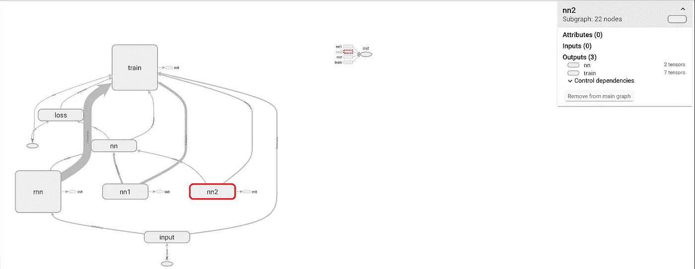
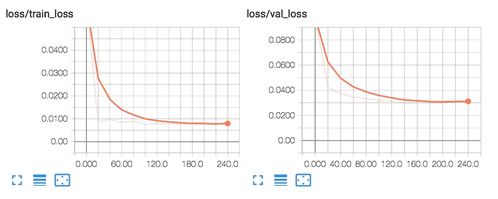
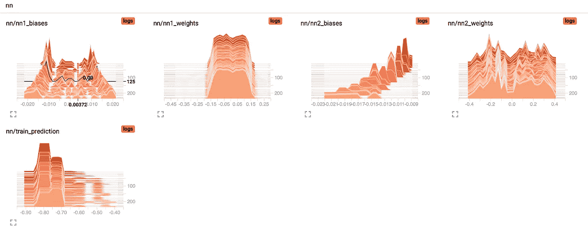

# Tensorflow 中无状态 LSTM 的比特币预测

> 原文：<https://medium.com/coinmonks/bitcoin-forecasts-with-stateless-lstms-in-tensorflow-bad664db3497?source=collection_archive---------4----------------------->


## 介绍

**#动机**加密货币是近年来最具颠覆性的技术之一。如今，市场的总市值达到了[278](https://coinmarketcap.com/all/views/all/)billions，据计算[有 2400 万](https://www.statista.com/statistics/647374/worldwide-blockchain-wallet-users/)人投资了比特币(比特币指的是整个市场，我用比特币指的是单一的加密货币)。即使目前市场不稳定，投机性很强，数据科学技术也可以为希望预测未来行为和趋势的投资者提供有价值的信息。由于噪音、波动性和重要指标的缺乏，这些指标可能无法在网上找到(或至少在公共和免费的公开来源中找到)，我们无法建立一个极其准确的预测环境。然而，数据分析技术可以在一定程度上为投资者提供一些信息，未来的股票市场价格可以在更精确的水平上进行评估。在这里，我提供了一个完整的 Python 框架来执行预测。即使我不期望预测非常精确，这项工作也可能是进一步发展和新改进的起点。

**#摘要**在这篇文章中，我解释了如何通过使用多输出和多输入无状态递归神经网络来预测下一个比特币股票价格。在免费下载了一些数据后，建立了一个机器学习模型来预测第二天和下个月的股票价格。

**#先决条件**我假设你熟悉 Python、递归神经网络和 Tensorflow。如果不是这样，不要担心:确实有很多好东西(看看 Karpathy 的精彩解释[这里](https://karpathy.github.io/2015/05/21/rnn-effectiveness/)和 NG 的课程[这里](https://www.coursera.org/specializations/deep-learning)，[这里](https://www.tensorflow.org/tutorials/)而不是一些学习 TF 的教程)。我也会在旅途中提供一些关于一些技术细节的解释！完整的代码源代码可以在我的 [GitHub 页面](https://github.com/colibri17/bitcoin)找到，大家看看吧！现在，让我们编码吧！

## 编码—预处理

**#Data** 您需要向网络提供您认为对识别比特币趋势很重要的所有数据。这是至关重要的一步:你给网络的数据越好，它们与问题的相关性越高，你产生的预测就越好！在这方面，我通过[熊猫数据阅读器](https://www.github.com/pydata/pandas-datareader)库下载了一些比特币相关数据。我使用 [quandl](https://www.quandl.com) 市场下载比特币和比特币密码货币。

**#绘制**下一步是绘制数据，以了解正在发生的事情。为此，在 Jupyter 笔记本中，您可以简单地使用，这是一个可视化数据的极好资源。Plotly 允许你放大情节，并以一种完整的 javascript 风格四处移动。

**#RNNs** 现在，我们准备定义递归神经网络体系结构。我之前提到过，网络是多输出、多输入和状态完整的。但这意味着什么呢？

*   与许多其他机器学习算法不同，人工神经网络(和 rnn)自然能够同时考虑多个时间序列输入和输出。换句话说，您可以同时向网络馈送多个时间序列数据，并决定不同的预测输出。例如，完全相同的网络可能能够基于全球定位系统坐标和天气条件(3 个输入)预测轮胎的温度和压力(2 个输出)。即一个**多输入多输出**递归神经网络。
*   LSTM 神经网络可以是**无状态或**状态。顾名思义，无状态 LSTMs 不跟踪网络及时传播的内部状态。处理完第一批序列后，他们将内部状态(但不是它们的权重)重置为初始值。相反，状态完整的 LSTMs 会记住各个训练批次的状态(和重量)。因此，虽然前者永远不会考虑大于序列长度的数据相关性，但后者可以记住多个时间步长的数据关系。

**#LSTM 输入**每个机器学习任务的第一步是对输入的数据进行预处理。根据输入数据集和要实现的模型，这可能涉及几个不同的任务:从清理数据到规范化列或平滑输入信号。在这方面，我做了以下工作:

*   **标准化输入特征**。在机器学习中，这种常见的做法主要允许基于梯度的优化算法更好地工作。此外，它通常还提供其他重要的[优势](https://www.quora.com/Why-do-we-normalize-the-data)。
*   **整形数据输入**。数据必须以正确的格式提供给无状态 rnn。输入数据必须是形状为 *B* x *L* x *F* 的张量，其中 *B* 是批量， *L* 是时间步长序列的长度， *F* 是输入特征的数量。在代码中，`sentences_generator`函数将形状为 *L* x *F* 的一般时间序列转换为两个*N*x*L*x*F*和 *N x F* 序列，分别为*、*，其中 *N* 是您可以从数据中检索的总滚动序列数。前者作为输入训练，后者作为目标类。
*   **将数据分成训练验证和测试集**。接下来，我将数据分成三个不相交的集合:用于构建模型的训练集，用于调整网络超参数的验证集，以及用于评估模型的未受破坏且完全不可见的测试集。因为我想预测未来的股票价格，所以训练、验证和测试数据集被及时排序，以便网络可以模拟具有一些历史数据的真实情况，以预测未来。
*   **在每个时期的开始混洗训练数据**。因为网络是无状态的，所以训练数据可以被打乱。该操作[有助于](https://www.quora.com/Why-do-we-need-to-shuffle-inputs-for-stochastic-gradient-descent)减少过度拟合，并提高小批量框架中批量梯度的近似值。

下面你可以按照代码实现所有这些步骤。因为训练数据在每个时期的开始被混洗，所以该操作在代码的下一个块中执行。

## 编码—建模

模型的实现是通过使用 TF 来完成的。与 Keras 不同，TF 允许对正在开发的代码进行更多的控制，在更多的行级别上定义神经网络。在 TF 中，您可以完全定制您的模型，构建特定的损失函数或网络结构。同时，TF 提供了一个完整的框架来评估你的模型在运行时的性能，叫做[张量板](https://www.tensorflow.org/guide/summaries_and_tensorboard)。它允许你在特定的时间步跟踪你选择的张量的值。通过这样做，您可以确定训练中权重开始偏离或验证损失停止减少的确切点。

**#模型结构**为了进行预测，我们生成了一个 LSTM 模型，该模型具有长度为 10 的 128 个训练批次作为输入，每个训练批次由 4 个特征形成。LSTM 处理输入并产生 10 个输出张量，每个输出张量包含由 128 个特征组成的 128 个训练实例。因为我只需要考虑预测的最终时间步长(对应于第二天的预测)，所以我只考虑网络的最后输出，从而产生由 128 个特征形成的 128 个训练批次的张量。依次地，这被馈送到 2 个神经层，这允许逐渐减少特征维度，以产生由 4 个特征组成的 128 个训练元素。根据均方损失函数，将该输出与真实 next 值进行比较。您可以使用张量板查看网络结构:



Network structure in tensor-board

**#Logging** 在代码中，一些张量被添加到张量板要跟踪的变量集中。打开终端并键入以下内容:

```
tensorboard --logdir ./rnn/run1
```

您现在可以看到要跟踪的参数的演变。还要注意，我以预先选择的时间步长保存模型，以便在固定点恢复整个网络状态。通过监控损失，您可以选择要使用的最终最佳模型:在验证集上获得最小值的模型是要选择的好的最终候选模型。



Training and validation loss evolutions



Weights and biases of the last two layers of the network while training

在下面，您可以看到执行所有这些操作的代码块:

## 编码—评估

**#测试数据**每个机器学习过程的最后一部分是评估模型性能。用于此目的的测试数据必须是算法在训练期间根本没有处理的观察结果，以便您可以在真实世界场景中真正验证模型。此外，测试记录具有与训练集相同的数据分布也很重要。请记住，该算法是建立在训练数据之上的，并且(希望如此！)它设法适应底层的数据分布。因此，我假设数据分布不随时间变化，这样我就可以安全地使用历史训练数据来预测未来的市场价格。

**#预测**载入保存的网络后进行预测。执行两种预测:

*   **次日预测**。对于训练、验证和测试集中的每个元素，我预测所有输入特征的下一个值。正如你在下图中看到的，误差很小。
*   **下月预测**。要真正评估模型，仅仅产生第二天的预测是不够的，还需要获得很长时间的预测。第二天的预测确实被认为是接近真实情况的，因此可能会产生误导。相反，长期预测可以给出真实模型性能的感觉，反映真实情况并提供更有用的估计。为了做到这一点，我首先将所有的输入时间序列逐步移动一个，然后对下一个时间步进行新的预测。请注意，在第二种情况下，错误更加明显，即使预测似乎提供了某种未来趋势。

## 丰富

这可能是本文最重要的部分。在此，我提出一些改进整个过程的建议:

*   **收集更多数据。**机器学习中的很多典型问题，可以通过收集更多的数据来解决。在本文中，我使用非常小的样本量来构建神经网络。以更高的频率(每小时或每分钟)收集数据可以极大地帮助网络改善结果，并变得更能概括。
*   **对变量**进行更好的选择。找到问题的相关数据对于生成好的模型至关重要。几个变量可能会影响未来的比特币价格，选择那些可能为这项任务提供有价值信息的变量是至关重要的。那么美元/欧元的变化是否影响了比特币的价格呢？其他加密货币趋势会影响市场吗？
*   **平滑输入时间序列**。预测股票价格的一个问题是输入时间序列中存在的固有噪声(如果你看一下`volume`的图，你可以很容易地识别这种行为)。标准神经网络只是从输入到输出空间的优化的确定性映射，因此在目标类中遭受随机行为。
*   **使时间序列平稳**。平稳时间序列保持时间步长上的均值、方差和协方差。大多数统计预测方法都是基于这样的假设，即通过使用数学变换可以使时间序列近似平稳。一个平稳化的序列相对容易预测:你只需简单地预测它的统计特性在将来会和过去一样！
*   **超调神经网络参数**。没有对网络进行调整，但这是建模的一个重要步骤。从学习率开始，您可以决定调整网络以找到与您提供的数据相关的最佳参数。
*   **改变目标变量。**网络预测所有输入时间序列的次日值。为了及时概括未来的过程，我逐步改变输入时间序列，以包括最近的预测，然后做出新的预测。因此，随着我们不断预测时间的推移，误差自然会增加。例如，由于每个人都想知道一个月后价格是上涨还是下跌，您可能希望将目标变量重新定义为二进制输出(上涨还是下跌)。

感谢您阅读文章！希望你喜欢。如果我有时间(呵呵呵！)，我想写第二个帖子，应用上面的一些建议来改善结果。请在评论中告诉我这对你来说是不是一个好主意！如果有不清楚的地方，欢迎提问，我会尽我所能回答你！