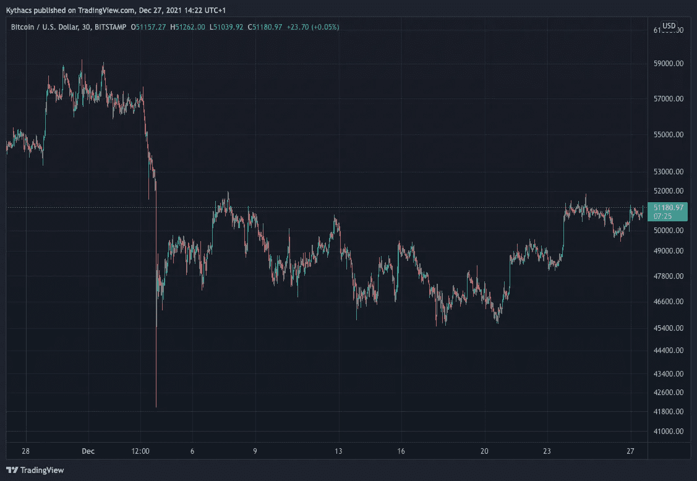
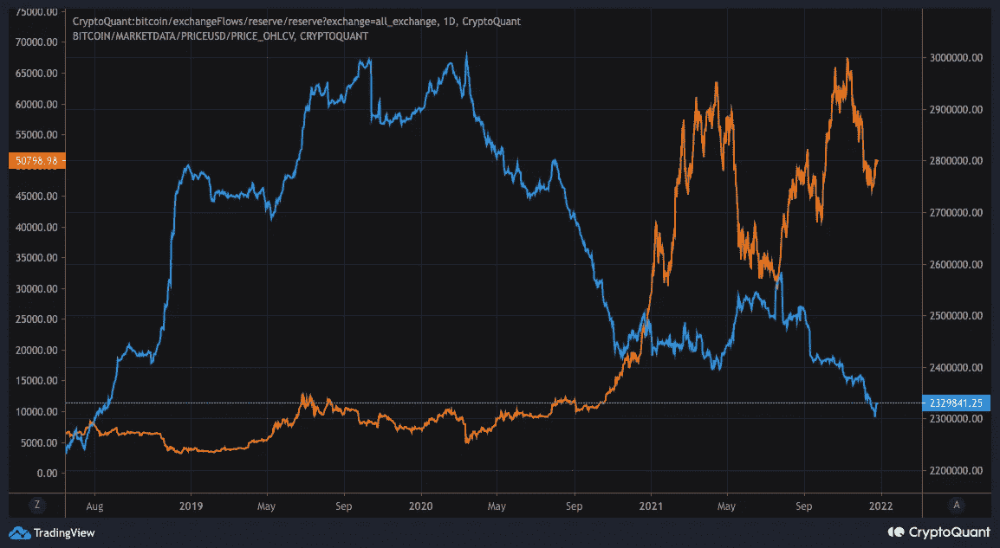
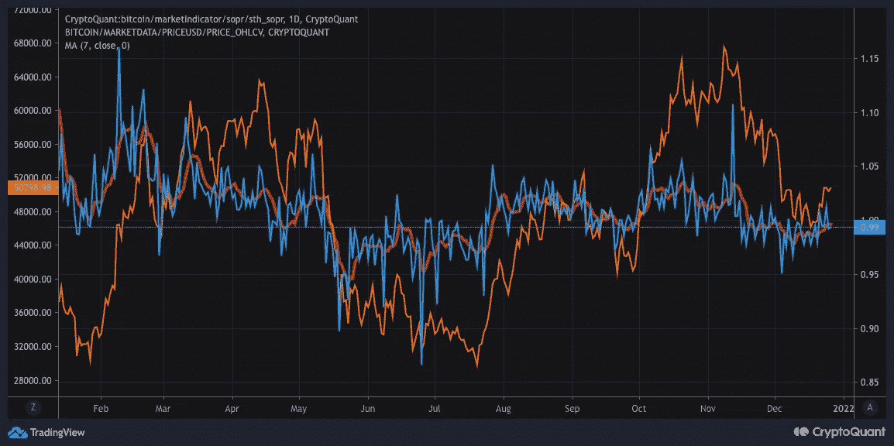

# 比特币、总体市场不确定性、美联储缩减购债规模、价格相关性和连锁基本面

> 原文：<https://medium.com/coinmonks/bitcoin-general-market-uncertainty-fed-tapering-price-correlations-and-on-chain-fundamentals-1012fa16c960?source=collection_archive---------2----------------------->

## 12 月市场总结

2021 年 12 月，比特币和金融市场面临着一些不确定性。我将研究这种不确定性如何影响金融市场和比特币，它们之间是如何关联的，在链上发生了什么，以及对新的一年有什么期待。

总的来说，有些人可能会认为，从环比角度来看，12 月相对平静。这主要是因为市场在 12 月份价格方面已经降温，连锁活动也随之降温。在 12 月初比特币价格暴跌至 4.2 万美元后，价格一直在 4.5 万至 5.2 万美元之间波动。可以说，自圣诞节前一周以来，价格似乎有上升趋势。

Graph 1: Bitcoin Price on Bitstamp (Source: Tradinview)

这种波动在一定程度上是由总体金融市场的不确定性造成的。部分原因是新的 Covid 变体 Omicron 的出现，但最重要的是全球范围内不断上升的通胀，以及随之而来的美联储银行计划缩减规模。

有鉴于此，我还深入研究了比特币和股票(即 S&P500)之间的相关性，因为比特币似乎往往更像是一种风险资产，而不是许多比特币创造者希望的风险规避资产。我在下面的两个 tweet 线程中更详细地查看了这一点。在第一种情况下，我考虑了更长的时间框架，发现自 2020 年以来，标准普尔 500 的价格与比特币的价格越来越正相关。而在此之前，情况一直有些不明朗。因此，随着 2020 年越来越多的机构资金进入市场，比特币也越来越多地与股票同步交易。我们不得不面对这样一种可能性，即一个投资者阶层已经进入市场，他们主要将比特币视为高风险/投机性资产。如果这是真的，在危机中，比特币也将是这些投资者投资组合中第一个被出售的资产。这意味着，如果我们再次面临 2008 年那样的金融危机，比特币的调整将比其他资产类别更加严重。但是，从积极的方面来看，比特币已经成为 2020 年的可投资资产类别。金融机构等。，正在考虑比特币是数字黄金或者可能成为数字黄金的可能性。因此，这是比特币朝着这一方向发展的第一步。虽然这个过程是渐进的，但比特币可能会像数字黄金一样开始交易，比我们预期的更突然。

我也在看第二条推文中圣诞节前最后一周的 5 分钟图表。虽然这很有趣，但请对较短的时间框架持保留态度，因为其中一些可能只是巧合。

考虑相关性后，现在让我们看看链上数据。12 月份的不确定性和价格调整并没有对环比基本面产生负面影响，或者说基本面只是有所改善。

从比特币兑换余额来看，它们延续了异常的下降趋势。

注意:交换流数据在短期内可能不可靠，所以忽略个别数据点。重要的是趋势。

Graph 2: Bitcoin Exchange Reserves (Source: CryptoQuant)

比外汇平衡更重要的是霍德勒行为。我在下面的帖子中对此进行了分析。考虑到这些 HODL 浪潮，我们可以看到，比特币在过去几周面临的价格压力主要不是来自长期持有人，而是来自短期持有人的抛售。这是积极的，因为这意味着长期持有人既没有在 9 月/10 月价格回升期间也没有在价格回调期间大量抛售。因此，比特币掌握在更强的手中。

短期持有人的抛售也得到短期持有人 SOPR 的支持，他在整个 12 月份一直低于 1。低于 1 的值意味着短期持有者大多在亏本出售/移动硬币。在过去的几天里，该指标显示出一些积极的迹象，逐渐回到 1 以上，这意味着短期持有人不再亏本出售硬币。

Graph 3: Bitcoin Short Term Holder SOPR (Source: CryptoQuant)

这意味着潜在的短期持有人卖方枯竭。On-chain College 还会查看市场的净实现利润/亏损图表。

在确定了链上基本面依然强劲甚至正在增强之后，谁还在购买比特币呢？Ecoinometrics 有一个很好的图表来显示谁正在积累。

看他们的图表，是小鱼(地址持有< 1 BTC)在积累，而不是鲸鱼(地址持有 1k 到 10k BTC)。因此，如果你想小鱼目前正在设定价格下限或保持价格不变。我认为这是一个积极因素，因为这意味着散户投资者目前领先于潜在的大投资者进入市场。考虑到购买比特币的并不是鲸鱼，价格一直在波动，而不是大幅上涨也就不足为奇了。

虽然过去几周可能相对平淡，但数据表明，总而言之，如果基本面没有突然恶化(例如，央行更加严厉地打击或金融市场普遍恶化)，比特币仍有望在这个周期迎来新的 ATH。最重要的是，问题是，2022 年，鲸鱼和机构资金还会回来吗？在我看来，是的。机构资金带着新的季度，最重要的是新的一年开始回来，这不是不可能的；机构重新定位的时候到了。这可能不是在 2022 年的第一周，但我预计他们会在 2022 年的某个时候进入 Q1。

**更多定期更新请在 Twitter 上关注我:** [**@JanWues**](https://twitter.com/JanWues)

披露:*此内容仅用于教育目的。它不构成交易建议。过去的表现并不代表未来的结果。不要投资超过你能承受的损失。本文作者可能持有文章中提到的资产。*

> 加入 Coinmonks [电报频道](https://t.me/coincodecap)和 [Youtube 频道](https://www.youtube.com/c/coinmonks/videos)了解加密交易和投资

## 另外，阅读

*   [什么是融资融券交易](https://blog.coincodecap.com/margin-trading) | [成本平均法](https://blog.coincodecap.com/dca)
*   [支持卡审核](https://blog.coincodecap.com/uphold-card-review) | [信任钱包 vs 元掩码](https://blog.coincodecap.com/trust-wallet-vs-metamask)
*   [Exness 点评](https://blog.coincodecap.com/exness-review)|[moon xbt Vs bit get Vs Bingbon](https://blog.coincodecap.com/bingbon-vs-bitget-vs-moonxbt)
*   [如何开始通过加密贷款赚取被动收入](https://blog.coincodecap.com/passive-income-crypto-lending)
*   [BigONE 交易所评论](/coinmonks/bigone-exchange-review-64705d85a1d4) | [电网交易 Bot](https://blog.coincodecap.com/grid-trading)
*   [新加坡十大最佳加密交易所](https://blog.coincodecap.com/crypto-exchange-in-singapore) | [购买 AXS](https://blog.coincodecap.com/buy-axs-token)
*   [投资印度的最佳加密软件](https://blog.coincodecap.com/best-crypto-to-invest-in-india-in-2021) | [WazirX P2P](https://blog.coincodecap.com/wazirx-p2p)
*   [7 个最佳零费用加密交易平台](https://blog.coincodecap.com/zero-fee-crypto-exchanges)
*   [最佳网上赌场](https://blog.coincodecap.com/best-online-casinos) | [期货交易机器人](/coinmonks/futures-trading-bots-5a282ccee3f5)
*   [分散交易所](https://blog.coincodecap.com/what-are-decentralized-exchanges) | [比特恩斯 FIP](https://blog.coincodecap.com/bitbns-fip) | [宾邦评论](https://blog.coincodecap.com/bingbon-review)