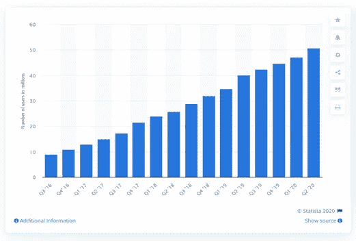
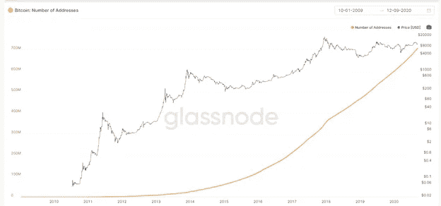
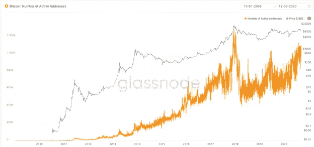
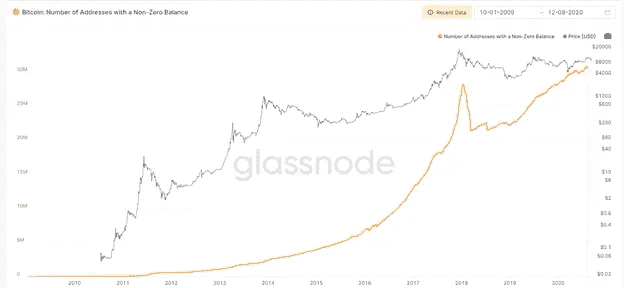
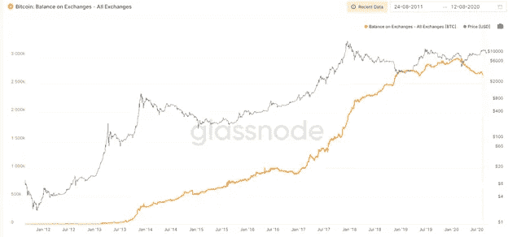

# 比特币:迷失在用户的钱包、钱包的地址和地址的余额中

> 原文：<https://medium.com/coinmonks/bitcoin-getting-lost-in-users-wallets-wallets-addresses-and-addresses-balances-54f95ae59ab?source=collection_archive---------2----------------------->

Photo: Wendy Corniquet — Pixabay

# **用户数量**

这个网站有 5000 万用户。我们的应用程序已经被 2000 万人下载，其中 600 万人激活了它。我的 YouTube 频道有 100 万订户，但只有 50 万人观看视频。

我们专注于用户数量。

有点正确。

**用户数量显示了我们在行业中的地位。重要的是，有 20%的用户在这里。用户和使用帮助我们与竞争对手进行健康的比较。将这些分析放在时间表中，有助于我们构建基于时间的分析，从而评估时间上的因果关系。他们也激发和激励我们。因此，我们倾向于说只有 1%的潜在用户知道这个产品，它有巨大的潜力。**

**你是说钱包总数吗？**

9 月 11 日，在媒体刊物 The Capital Mark Helfman 上发表了一篇关于比特币用例的文章，读起来很有意思。在那篇文章中，一个副标题成为了这篇文章的催化剂:“马克，比特币正在成为主流……”

接下来的图表显示比特币用户的数量正在增加:

Statista July 8 2020 — Source: blockchain.com

事实核查似乎已经成为一种条件反射，尤其是当图表逐渐偏向一方时。首先，我想知道他们是如何得出 5000 万比特币用户的数字的，以及这样的净增长是否可信。我非常尊重 Statista。我关注他们的出版物，并相信他们做公益。所以我更加好奇，想更近距离地观察。

当我查看 Statista 在他们网站上引用的来源时，我发现他们引用的是 Blockchain.com 的区块链钱包数据。事实上，只有 Blockchain 可以验证他们自己的数字，但似乎 Statista 的标题“全球区块链钱包用户数量”有些不清楚。如果他们的意思是 Blockchain.com 的钱包在增加，那么根据 Blockchain.com 的数据来源，他们是正确的。然而，根据马克·赫尔夫曼的文章，如果这种用法是指一般的[比特币](https://blog.coincodecap.com/a-candid-explanation-of-bitcoin)用户，那么就会有无意的误解，因为数据是公司特定的，即使公司有“这个”通用名称，如区块链。

为了避免未来的混乱和帮助一般的知识水平，在这篇文章中，我将尽可能用数字数据来澄清用户、钱包和地址的概念。

# **地址**

一个地址；在[比特币区块链](https://blog.coincodecap.com/a-candid-explanation-of-bitcoin)上，26–35 个字符长的引用是接收和发送该领域货币的适当加密。它的余额可能是 0 或更多。它可能永远不会被使用或被使用超过一次。它可以通过各种渠道在线或离线创建。

**一个地址不是一个用户。一个用户可以有多个地址。地址不关心用户是谁。任何拥有该地址的正确密钥的人都可以使用该地址及其可用余额。**

Total addresses

地址总数

**根据 Glassnode 数据，2020 年 9 月 10 日，有 7.04 亿 58.1 万 259 个比特币地址。**2018 年底对应数字为 4.64 亿，2019 年底为 5.95 亿。地址数量的不断增加并不完全与用户数量的增加联系在一起。主要原因在于出于隐私和安全考虑，一些地址只能被单独使用。

**下面是每天至少使用一次的活跃地址的 Glassnode 数据，它显示了从 2017 年到 2020 年平均每天 60 万到 100 万活跃用户。**该数据与总地址的唯一有意义的关系是 2012–2017 年期间的方向平行性，这对应于从较低基数增加的兴趣。

Active addresses

活动地址

现在让我们检查来自 Glassnode 的非零余额地址。**截至 2020 年 9 月，约有 3100 万个地址有正结余。**

我希望你注意这一点。该图显示了当前链上的最大当前用户数。我将在稍后来交换帐户，因为这是一个不同的附加点。回到这里，这 3100 万个地址属于最多 3100 万个用户，最有可能属于不到 3100 万个用户。这是迄今为止我们第一次可以推断出地址和用户号码之间的联系。

该图显示，2018 年初，正结余地址的数量减少了 650 万个。这与用户因价格调整而离开这个市场有着恰当的联系。**如果同样的逻辑进一步外推，假设每用户地址比率没有重大变化，那么 2017 年末的用户数量到 2019 年 12 月已经突破。**

Addresses with non-zero balance

# **钱包**

**首先，比特币钱包本身并不是现实生活中的钱包。在现实生活中，人们把钱放在钱包里。在比特币区块链中，人们把地址和密钥放进钱包。钱包是一个软件，通过它可以访问和管理发送、接收和加密的地址。**

一个钱包可以存放多个地址。同一个地址(取决于其规格)可以由多个钱包管理。地址不一定需要钱包。

我们知道外面有多少钱包吗？

这是一个非常有趣的问题，因为它的答案对整个社区没有任何结构性的价值。钱包数据从根本上说是公司层面的信息。对于公司和开发者来说，有多少钱包在使用自然是很重要的。

从分析角度来说，钱包数据将与其他区块链数据有着天然的相关性，它将有一个间接的使用案例，但与地址级数据的重要性相比就相形见绌了。

那我们为什么要看钱包数据？从广义上来说，这是因为它是制造和销售这些钱包的公司的一个巨大的宣传来源。当 Blockchain.com 说它有 5000 万个钱包，而且这个数字还在不断上升时，那么它对该公司的了解远远超过对比特币区块链的了解。顺便说一句，值得称赞的是，他们是社区中有价值的成员。

大交易所能保持沉默吗？例如，根据币安的博客，人们可以了解到币安早些时候购买的信托钱包的好处。与真实技术信息相结合的巨大市场机会。

现在我真的希望你们注意:**钱包的至关重要性在于，钱包是通往加密货币世界的主要门户。钱包用户极有可能有意使用提供钱包的公司的服务，实际上成为该公司的客户(通常不收取额外的可见费用)。因此，对于交易所和钱包开发商来说，安全易用的钱包是一个重要的客户获取平台。**

回到这个问题，我们只能通过将每个相关公司的钱包数量相加来找出钱包的数量。这些数字既不透明也不容易获得。此外，我们无法确定每个钱包是否对应于一个唯一的用户。

幸运的是，我们无论如何都不需要这个数据点。

# **用户**

我们从头开始，追溯到用户。我们注意到钱包数据不可用，也不足以计算出用户的总体数量。我们观察到，我们也不能从地址数据中严格地确定用户的数量。我们最好的代理是 3100 万个非零余额的比特币地址。现在让我们进入进一步的细节。

正结余地址对我们解释当前情况有多大帮助？

例如，假设你用所有的比特币买书，而你的地址余额为零。你最近很活跃，但从这个角度来看，你现在不是用户。我将借此机会向 Glassnode 呼吁——是时候制定一个新的指标了:“在过去 12 个月中有正余额的唯一地址的数量”。因此，先前时间段中未被计数的活跃用户也可以被包括在用户计算中。

**回到主题，应添加之前活跃且可轻松重新启动的用户，并从给定期间活跃比特币用户总数中减去同一用户的多个账户。**我没有实用的方法，但是如果有人对这方面有什么建议，可以回复这篇文章。

对于到目前为止已经成功的读者，有些人可能会说“这是什么地址，我的比特币在交易所里”。现在，让我们重新看看 Glassnode 数据。根据下图，Glassnode 计算了以下交易所托管的比特币:比特币基地、火币、币安、Bitmex、Okex、Bitstamp、Bitfinex、北海巨妖、Bittrex、Gemini、Hitbtc、Poloniex、Coincheck 和 Luno。这个数字大约是 259 万比特币。

另一个问题是:有多少用户可能持有交易所存放的比特币？

我们了解到，根据他们自己的披露，比特币基地有 3500 万用户。如果其中 20%是活跃的，那就是 700 万。如果比特币用户略低于比特币统治地位的比例，那么比特币基地可能有 350 万比特币用户。如果数字上无足轻重的机构用户持有比特币基地 93.6 万级托管的比特币的 10%，那么我们可以做如下计算:(936000 x 0.9) / 3500000 = 0.24。因此，每个个人客户(用户)将持有大约 0.24 个比特币。尽管这看起来有点过了，但目前的信息表明比特币基地拥有 350 万或更多的用户。

Bitcoin — 14 exchanges custody data

假设这个用户数量对比特币基地来说是正确的，我们能推断出其他交易所的用户数量吗？

不容易，因为交易行为与托管偏好不一致。**例如，币安的比特币交易量是比特币基地的 5 倍多，而保管的比特币是币安的 3 倍多。**根据平行推断，如果交易行为相似，币安的比特币用户应该是比特币基地的 15 倍。然而，这在我看来不太可能。一个更合理的解释是，不同的用户群有不同的交易行为，因此来自一个交易所的数据在没有大量分析的情况下无法在另一个交易所实现。

然而，如果比特币基地有大约 300 万用户，那么其他交易所可能有至少 10 倍或更多的比特币用户。简而言之，交易所级别的比特币用户可能会比链上用户更多。

让事情变得更加复杂的是，我们应该考虑到(I)用户可以同时拥有链上和交易所级别的账户，(ii)机构基金可以为用户组持有比特币，而不创建直接的单个区块链存在，以及(iii)一些基金级别的用户也可能拥有链上或交易所级别的存在。

最后，可能有大量的零余额地址(或账户),无论是在链上还是在交易所。虽然这些不计入当前的活跃用户数，但这些有过经验的用户代表了一个完全不同的类别。

在我看来，目前的用户数量大约是链上用户的 50%,加上来自交易所的 3000 万用户，总共有 4500 万用户。根据世界人口，这是 0.7%，如果以前有余额的非活跃用户重新加入，这一数字可能会接近。这一数字与 Paribu 在土耳其全国范围内由 Akademetre 进行的比特币调查一致，该调查发现 0.7%的人口投资或交易过加密货币。

# **总之..**

我试图用一些解释、一些推测和大量数据来检验地址、钱包和用户概念。解释中会有技术上的缺陷，但我希望这些数据或信息会有助于你对比特币生态系统的理解。

我个人的总结是**比特币区块链没有用户，也没有钱包，只有地址。这些地址由它们的相关键控制。区块链广播其所有数据，并与所有相关方共享。地址数据是透明和公开的。区块链是公正的，法典就是法律。**

钱包和用户数据对于商业或分析目的是有用的。由于交易所层面的信息是其专有数据，因此只有在与可用原始数据不足相关的高度不确定性的情况下，分析用途才是可能的。

**这一分析让我明白，比特币已经成功度过了 2017 年的上涨和 2018 年的下跌周期。**从那时起，新的服务提供商在生态系统中蓬勃发展，数据质量有所提高，技术创新也在发生。用户回来了，交易所取得了进展，机构用户也加入了进来，尽管数量很少。动荡但有趣的未来在召唤着我们。这一旅程需要可靠的信息和可靠的分析。我希望这篇文章有助于更广泛地评估相关的概念和数据。

*本文准备在 BTCHaber.com 以土耳其语发表，同时也以英语发表。这篇文章的土耳其语版本首先在 BTCHaber.com 发表，然后在媒体上发表。*

Photo: Hulki Okan Tabak — Pixabay

## 另外，阅读

*   最好的[密码交易机器人](/coinmonks/crypto-trading-bot-c2ffce8acb2a)
*   [密码本交易平台](/coinmonks/top-10-crypto-copy-trading-platforms-for-beginners-d0c37c7d698c)
*   最好的[加密税务软件](/coinmonks/best-crypto-tax-tool-for-my-money-72d4b430816b)
*   [最佳加密交易平台](/coinmonks/the-best-crypto-trading-platforms-in-2020-the-definitive-guide-updated-c72f8b874555)
*   最佳[加密贷款平台](/coinmonks/top-5-crypto-lending-platforms-in-2020-that-you-need-to-know-a1b675cec3fa)
*   [最佳区块链分析工具](https://bitquery.io/blog/best-blockchain-analysis-tools-and-software)
*   [加密套利](/coinmonks/crypto-arbitrage-guide-how-to-make-money-as-a-beginner-62bfe5c868f6)指南:新手如何赚钱
*   最佳[加密制图工具](/coinmonks/what-are-the-best-charting-platforms-for-cryptocurrency-trading-85aade584d80)
*   [莱杰 vs 特雷佐](/coinmonks/ledger-vs-trezor-best-hardware-wallet-to-secure-cryptocurrency-22c7a3fd391e)
*   了解比特币最好的[书籍有哪些？](/coinmonks/what-are-the-best-books-to-learn-bitcoin-409aeb9aff4b)
*   [3 商业评论](/coinmonks/3commas-review-an-excellent-crypto-trading-bot-2020-1313a58bec92)
*   [AAX 交易所评论](/coinmonks/aax-exchange-review-2021-67c5ea09330c) |推荐代码、交易费用、利弊
*   [Deribit 审查](/coinmonks/deribit-review-options-fees-apis-and-testnet-2ca16c4bbdb2) |选项、费用、API 和 Testnet
*   [FTX 密码交易所评论](/coinmonks/ftx-crypto-exchange-review-53664ac1198f)
*   [n 零审核](/coinmonks/ngrave-zero-review-c465cf8307fc)
*   [Bybit 交换审查](/coinmonks/bybit-exchange-review-dbd570019b71)
*   [3Commas vs Cryptohopper](/coinmonks/cryptohopper-vs-3commas-vs-shrimpy-a2c16095b8fe)
*   最好的比特币[硬件钱包](/coinmonks/the-best-cryptocurrency-hardware-wallets-of-2020-e28b1c124069?source=friends_link&sk=324dd9ff8556ab578d71e7ad7658ad7c)
*   最佳 [monero 钱包](https://blog.coincodecap.com/best-monero-wallets)
*   [莱杰 nano s vs x](https://blog.coincodecap.com/ledger-nano-s-vs-x)
*   [bits gap vs 3 commas vs quad ency](https://blog.coincodecap.com/bitsgap-3commas-quadency)
*   [莱杰纳米 S vs 特雷佐 1 vs 特雷佐 T vs 莱杰纳米 X](https://blog.coincodecap.com/ledger-nano-s-vs-trezor-one-ledger-nano-x-trezor-t)
*   [block fi vs Celsius](/coinmonks/blockfi-vs-celsius-vs-hodlnaut-8a1cc8c26630)vs Hodlnaut
*   Bitsgap 评论——一个轻松赚钱的加密交易机器人
*   为专业人士设计的加密交易机器人
*   [PrimeXBT 审查](/coinmonks/primexbt-review-88e0815be858) |杠杆交易、费用和交易
*   [埃利帕尔泰坦评论](/coinmonks/ellipal-titan-review-85e9071dd029)
*   [SecuX Stone 评论](https://blog.coincodecap.com/secux-stone-hardware-wallet-review)
*   [BlockFi 评论](/coinmonks/blockfi-review-53096053c097) |从您的密码中赚取高达 8.6%的利息