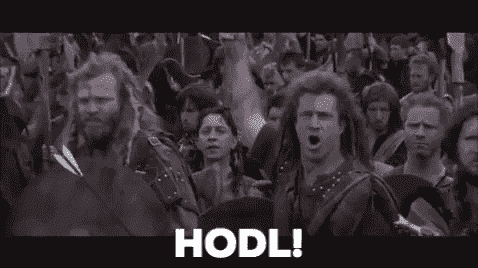
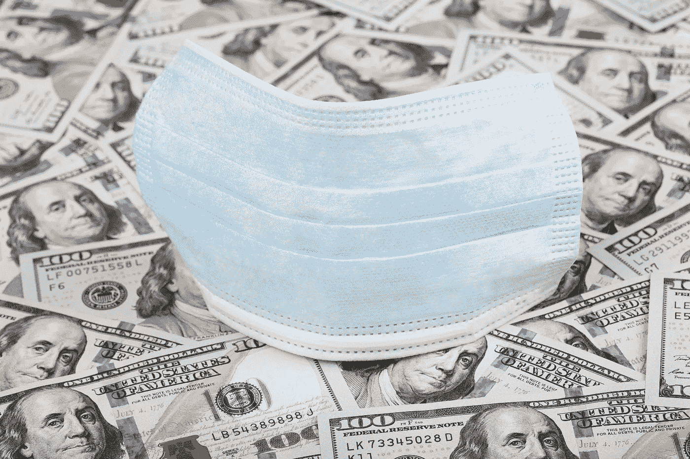
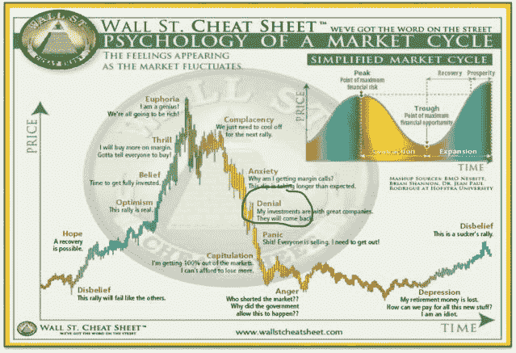

# 比特币&新冠肺炎的世界储备货币

> 原文：<https://medium.com/coinmonks/bitcoin-global-reserve-currencies-amidst-covid-19-9a5695e6d2f8?source=collection_archive---------2----------------------->

Photo by [Priscilla Du Preez](https://unsplash.com/@priscilladupreez?utm_source=medium&utm_medium=referral) on [Unsplash](https://unsplash.com?utm_source=medium&utm_medium=referral)

嘿，秘密球体！首先，我真的希望这篇文章能让你心情愉快。说过去几周是一段疯狂的旅程是保守的说法**-…*哦，等等。我想把我对最近全球市场发生的事情的想法写在纸上。主要是为了帮助我自己消化和代谢所有这些疯狂的东西…但是如果任何人在阅读时能发现它有一点点帮助或者从中找到某种安慰，那就更好了。*

*我字面上是卖了*股市*的顶。听起来很糟糕，对吧？不完全是。当我预测*新冠肺炎*将成为不可避免的 [*熊市*](https://www.investopedia.com/terms/b/bearmarket.asp) 的催化剂时，我错误地预测了*比特币*将成为[T21](https://www.investopedia.com/terms/s/safe-haven.asp)避险资产的*时机*。那我做了什么？我在市场最高点卖掉了我所有的股票，并立即把它们全部投入了比特币，以为我在做强盗式的举动。我不认为*比特币*会与*华尔街*同步波动，或者像过去几周那样充当 [*期货*](https://www.investopedia.com/terms/f/futures.asp) 。*

*我肯定我不是唯一一个认为比特币迟早会成为避险资产的人。回顾过去，很明显比特币经历了 [*价格波动*](https://www.investopedia.com/terms/p/price-action.asp) 的原因，就像它在*新冠肺炎疫情开始时经历的那样。因此，让我们来看看比特币价格波动的一些原因，这样我们就可以在下次发生类似情况时做好更好的准备。**

*   ***甚至*避险资产*在*流动性危机期间也大幅下跌。*** [*流动性危机发生*](https://www.investopedia.com/terms/l/liquidity-crisis.asp) 当资产变得*[*恐慌性抛售*](https://www.investopedia.com/terms/p/panicselling.asp) 随之而来，投资者被迫 [*清算*](https://www.investopedia.com/terms/l/liquidate.asp) 其他资产以便满足[*保证金需求*](https://www.investopedia.com/terms/m/margincall.asp) 之后基本上，人们愿意以他们在经济衰退前不会卖出的价格出售任何资产。例如，在上一次金融危机期间，*黄金*，一种被证实的避险资产，在 6 个月的时间里下跌了 30%。在流动性危机中，现金为王。任何可以卖钱的东西都会被卖掉。不过，这并不一定意味着它不是避险资产。[在 2007 年至 2011 年期间，黄金从大约 600 美元涨到 1800 美元](https://goldprice.org/gold-price-chart.html)，而股票下跌，然后横向下跌*……要点是，*没有任何资产能够在短期内免受流动性危机*的影响。*我相信*比特币*将会经历类似于黄金在华尔街上一次熊市结束前经历的*走势。*****
*   ****比特币没有*断路器*。**到目前为止，2020 年已经出现过多次 [*道琼斯*](https://www.investopedia.com/ask/answers/who-or-what-is-dow-jones/) 开盘后不久跌幅超过 7%的情况。这触发了所谓的*“断路器”*一个*断路器*暂时停止交易，让投资者和交易者有机会喘口气，试图让更清醒的头脑占上风，遏制恐慌性抛售。比特币*没有*有这个。在一个真正的 [*自由市场中*](https://www.investopedia.com/terms/f/freemarket.asp) 优胜劣汰。当比特币开始下跌时，没有什么能让它减速。自从*“日冕经济”开始以来，这已经充分展示了几次***
*   ****比特币没有*交易时间。美国股市收盘时比开盘时多。类似于断路器，当市场关闭时，它允许投资者单独和集体收集他们的想法。一个真正自由的市场的交易时间是一天 24 小时，一周 7 天。就像断路器一样，不停的交易会导致更高的**。*******
*   ****【鲸鱼】*希望在**[***Halvening***](https://bitcoinmagazine.com/guides/what-is-the-halvening)***定于 5 月之前得到尽可能好的价格。****如果我是一头 [*鲸鱼*](https://www.bitcoinmarketjournal.com/whale-crypto/) ，并且我知道单个比特币的*生产成本*即将大幅增加，我会想尽快以*便宜*的价格获得尽可能多的*比特币*。因此，我会对与全球疫情合作、将价格降至异常低位的想法产生兴趣。**
*   **矿工们想在他们拥有的 BTC 仍然高于生产成本的时候卖掉它。很多鲸鱼是 [*矿工*](https://www.investopedia.com/tech/how-does-bitcoin-mining-work/) 很多*矿工*是鲸鱼。所以这一点和最后一点是相互共生的。如果我是一名*矿工*，我预计价格会大幅下降，我会想在价格仍高于生产成本时出售我开采的比特币。根据 Coindesk 上的一篇[文章，挖掘一个比特币帖子“*halve ning”*的价格可能会飙升至 12525 美元。你最好相信没有哪个矿商愿意以低于这个价格出售。也就是说，更多的*比特币被*](https://www.coindesk.com/for-crypto-miners-bitcoins-halving-could-mean-a-doubling-in-costs)**【d】****

****

*   ****人们直起腰来*被清算*！我认为我们看到比特币达到 3000 美元上限的一个原因是，超过某个点后，投资者的多头头寸*将被*清算*。大多数人都没有看到比特币再次跌破 4000-5000 美元，所以很多人都在这个区间做多。我很难想象有人*选择*卖 5k 以下。如果是这样，那是一些*的弱手，我很高兴他们出局了。******
*   *****比特币从*弱手*转移到** [***强手***](https://www.investopedia.com/terms/s/stronghands.asp) **。**我希望当我们经历了那个巨大的 [*红色烛台*](https://www.investopedia.com/terms/r/red-candlestick.asp) 的时候，没有人在读这个恐慌性抛售！如果你做了，我希望你能以更好的价格重新进入。对于那些没有重新进入的人来说，好吧，你被淘汰了，现在有一个更有信心和/或更有头脑的人拥有了你的比特币。虽然这对你来说可能很糟糕，但对整个市场来说是利好消息。比如说；假设你在 2018 年 12 月至 2019 年 3 月期间积累了 35000 美元的比特币，最近以 105000 美元的价格卖出。然后你以 5000 美元的价格回购。要获得同样的 3 倍回报，比特币必须达到 1.5 万美元。这鼓励了新的 [*支撑位*](https://www.investopedia.com/terms/s/support.asp) 并增加了总体 [*市值*](https://www.investopedia.com/investing/market-capitalization-defined/) ，最终降低了资产的波动性，同时巩固了其在历史上的地位。看涨 AF。***

**如果你和我一样，在难以置信的卖出和重新进场的机会到来之前没有看到所有这些迹象，不要自责。后知后觉是 20/20。预测未来很容易。很难预测未来何时会发生。当我不知道比特币价值实现的时机时，我绝对想现在就拿着一大包比特币。让我们探究一下为什么！**

> ****艰难的时刻即将到来……****

****

**我相信我们即将进入两年多的衰退。如果发生这种情况，我认为比特币的价值必须在股市开始缓慢但不可避免的上涨之前实现。特别是考虑到迫在眉睫且备受期待的“****”***事件将于 2020 年 5 月发生。对于鲸鱼和我们这些足够勇敢的人来说，这是一个千载难逢的机会，他们可以 [*购买蘸酱*](https://www.investopedia.com/terms/b/buy-the-dips.asp) 并冒着潜在的风险 [*一路抓刀*](https://www.investopedia.com/terms/f/fallingknife.asp) 。***

**世界各地的美联储和 T2 的中央银行基本上只是通过印出更多的 T4“垄断货币”(除了被政府视为法定货币之外，没有任何东西支持的货币)来拖延时间。同时在 [*区块链*](https://www.investopedia.com/terms/b/blockchain.asp) 上挖掘一个区块的比特币奖励将减半。由于 [*法定货币*](https://www.investopedia.com/terms/f/fiatmoney.asp) 坚持其*通货膨胀*的本质，比特币本质上仍然是*通货紧缩*。你不能写这种狗屎！**

> **“心理学一直试图维护人性。历史一直在破坏这种努力。”梅森·库利**

**出于上下文的考虑，让我们回顾一下上一次金融危机的历史书。根据图表[显示，2007 年 10 月*道琼斯*指数大约在 14000 点。2009 年 3 月，该指数跌至约 6500 点。我看到类似的衰退即将来临。](https://finance.yahoo.com/quote/%5EDJI/chart/#eyJpbnRlcnZhbCI6ImRheSIsInBlcmlvZGljaXR5IjoxLCJ0aW1lVW5pdCI6bnVsbCwiY2FuZGxlV2lkdGgiOjEsImZsaXBwZWQiOmZhbHNlLCJ2b2x1bWVVbmRlcmxheSI6dHJ1ZSwiYWRqIjp0cnVlLCJjcm9zc2hhaXIiOnRydWUsImNoYXJ0VHlwZSI6ImxpbmUiLCJleHRlbmRlZCI6ZmFsc2UsIm1hcmtldFNlc3Npb25zIjp7fSwiYWdncmVnYXRpb25UeXBlIjoib2hsYyIsImNoYXJ0U2NhbGUiOiJsaW5lYXIiLCJzdHVkaWVzIjp7IuKAjHZvbCB1bmRy4oCMIjp7InR5cGUiOiJ2b2wgdW5kciIsImlucHV0cyI6eyJpZCI6IuKAjHZvbCB1bmRy4oCMIiwiZGlzcGxheSI6IuKAjHZvbCB1bmRy4oCMIn0sIm91dHB1dHMiOnsiVXAgVm9sdW1lIjoiIzAwYjA2MSIsIkRvd24gVm9sdW1lIjoiI2ZmMzMzYSJ9LCJwYW5lbCI6ImNoYXJ0IiwicGFyYW1ldGVycyI6eyJ3aWR0aEZhY3RvciI6MC40NSwiY2hhcnROYW1lIjoiY2hhcnQifX19LCJwYW5lbHMiOnsiY2hhcnQiOnsicGVyY2VudCI6MSwiZGlzcGxheSI6Il5ESkkiLCJjaGFydE5hbWUiOiJjaGFydCIsImluZGV4IjowLCJ5QXhpcyI6eyJuYW1lIjoiY2hhcnQiLCJwb3NpdGlvbiI6bnVsbH0sInlheGlzTEhTIjpbXSwieWF4aXNSSFMiOlsiY2hhcnQiLCLigIx2b2wgdW5kcuKAjCJdfX0sImxpbmVXaWR0aCI6Miwic3RyaXBlZEJhY2tncm91bmQiOnRydWUsImV2ZW50cyI6dHJ1ZSwiY29sb3IiOiIjMDA4MWYyIiwic3RyaXBlZEJhY2tncm91ZCI6dHJ1ZSwiZXZlbnRNYXAiOnsiY29ycG9yYXRlIjp7ImRpdnMiOnRydWUsInNwbGl0cyI6dHJ1ZX0sInNpZ0RldiI6e319LCJjdXN0b21SYW5nZSI6bnVsbCwicmFuZ2UiOm51bGwsInNldFNwYW4iOm51bGwsInN5bWJvbHMiOlt7InN5bWJvbCI6Il5ESkkiLCJzeW1ib2xPYmplY3QiOnsic3ltYm9sIjoiXkRKSSIsInF1b3RlVHlwZSI6IklOREVYIiwiZXhjaGFuZ2VUaW1lWm9uZSI6IkFtZXJpY2EvTmV3X1lvcmsifSwicGVyaW9kaWNpdHkiOjEsImludGVydmFsIjoiZGF5IiwidGltZVVuaXQiOm51bGwsInNldFNwYW4iOm51bGx9XX0%3D)**

**这不是一个预测，但看到*道指*在 15k-18k 点之间触底并不奇怪。一旦触底，随着信心慢慢恢复，市场可能会继续水平移动一段时间。据统计，这种情况每 10-12 年发生一次。事情变得非常可怕的可能性总是存在的，我们进入了类似于*大萧条*的情况，我们损失了 90%的市值，并且持续了大约 3-4 年。试图应用元理性，它可能会落在两者之间。尽管，如果它与*大萧条*有一点点相似，它将成为比特币的好莱坞剧本，因为全球对*法定货币*的信心将会动摇。**

**然而，如果最近签署的经济刺激方案能够实现其预期目标，这一切都将被推迟。听起来是件好事，对吧？不完全是。让我们谈谈那个。**

> ****恶性通货膨胀之路****

**在我看来，刺激计划就像他们所说的声音一样。当经济不景气时，它们是经济的兴奋剂。**

***兴奋剂让人上瘾！无论怎么解释，他们都肯定治不好抑郁症的根本原因。以一个瘾君子*为例。那个人可能永远不会有一天醒来说“嘿，今天，我要成为一个冰毒瘾君子。”然而有一天，他们尝试了一点冰毒。感觉很好，所以他们又做了一次。他们仍然没有依赖这种药物，但是在足够的娱乐性使用之后，他们变得依赖了。这种依赖成为他们的新常态，最终药物不再像以前那样影响他们。为了追求那种快感，他们不得不增加剂量，最终他们要么过量而死，要么为了生存而被迫对他们的生活做出巨大的改变。**

****

**这与美国政府目前试图安抚投资者的做法非常相似。但是，问题是这些刺激并不能解决根本问题。事实上，它们只会让事情变得更糟。根本问题不在于*新冠肺炎*。事实证明，这种疫情只是焚化美元购买力的一种较轻的流体。向市场注入大量“新”资金并不能减轻投资者对一种致命病毒的担忧。**

**此外，谁能说这种*封锁*不会持续更长时间呢？客观地说，根据 Statista.com 的，*预测的美国 2020 年的***GDP 大致为 22 万亿美元。最近签署生效的刺激方案将近 2.2 万亿美元，仅相当于美国年 GDP 的 10%。使用相同的比率；一年的 10%大致是 36 天。这意味着 2.2 万亿美元只能为我们争取 36 天的时间，然后我们要么让小企业和非必要的工人重返工作岗位，要么被迫印出更多的垄断货币，进一步稀释货币供应，导致通货膨胀。****

***请记住，就像冰毒瘾君子不得不增加他们的剂量一样，最新的刺激方案几乎是奥巴马政府时期部署的 [*美国复苏和再投资法案*](https://www.thebalance.com/arra-details-3306299) 的三倍。每当我们实施刺激计划，美元的购买力就会减少。***

**顺便说一下，我认为经济刺激方案带来的积极效应表明我们目前正处于“*否认阶段”*。我相信华尔街还没有经历更多的价格下跌。为了更好地理解市场背后的心理，请看下图。**

****

> **中国在这一切中处于什么位置？**

**让我们花一点时间把前面提到的*刺激方案*与中国[**已经将其货币**](https://modernconsensus.com/cryptocurrencies/china-completes-digital-yuan-design/) *数字化的事实结合起来；*袁*。这是美国在美元上没有做过的事情。当一个国家将其货币数字化时，全球投资者投资这种特定货币就容易多了。***

**这与中国目前拥有的制药、制造和供应链优势相结合，使中国处于一个对美国保持其作为世界储备货币*的地位构成切实威胁的位置。猜猜谁目前拥有最多的外汇储备……根据 thebalance.com 的一篇文章[，如果你猜对了中国。](https://www.thebalance.com/what-is-a-reserve-currency-1978926)***

***那么*如果人们开始选择其他货币，比如人民币*而不是美元*会发生什么？他们把贬值的美元汇回美国。对于我们这些别无选择只能使用美元的人来说，这对美元的购买力有什么影响？它导致 [*恶性通货膨胀*](https://www.investopedia.com/terms/h/hyperinflation.asp) 。出于非常不同的原因，美国可能会陷入与津巴布韦和委内瑞拉近年来经历的情况类似的境地。所有平坦的道路都会导致恶性通货膨胀。******

> 作为个人，我们如何避免这种情况？

那么到目前为止我们学到了什么？*美元*受到威胁，*中国*掌握着钥匙，我们的政府*人为*和*暂时*支撑美国股市。不管这是有意还是无意，它操纵了市场的心理。这不是有机的，也不健康。

幸运的是，对于我们的经济和全世界的冰毒吸食者来说，没有人需要死。作为个人，我们只需要做出根本性的改变。希望我们昏睡而笨重的联邦政府以某种方式与时俱进是不现实的。好消息是，有一种方法可以确保你目前拥有的*美元*不会在不可避免地遇到麻烦时被浪费掉。为了确保这一点，我们需要大幅提高我们对稳健货币的标准。这可能正是我们迫切需要的警钟。

> **健全货币 vs 法定货币**

理解健全货币和 T2 法定货币的区别是很重要的。*法定货币*是一种交换媒介，一种记账单位，其可携带、耐用、可分割、可替代。健全的金钱也是所有这些东西，但是还有一个极其重要的品质。其一 [***存储的值为***](https://www.investopedia.com/terms/s/storeofvalue.asp) 。

在其他法定货币中，美元可以被政府印掉。这稀释了供给，并不断将财富从你的口袋转移到政府和银行系统。同样不能说*健全的金钱*和*价值储存。*健全货币*的例子*有黄金、白银、*比特币*。

> **总之**

所以如果你坐在这里想知道你刚刚读了什么，让我们来看看要点。

1.  很明显，我们正在进入一场衰退，政府正试图通过大规模的刺激计划来摆脱困境。但是，随着美联储和世界各地的其他中央银行印更多的钱，支撑股市，*比特币*变得更加稀缺。这是对比特币的**看涨**。
2.  中国有能力成为全球储备货币。这可能导致美元经历恶性通货膨胀，并极大地影响美国公民的财富。
3.  **法定货币不是健全的货币。为了保护财富，我将会用我的货币(美元)来换取金钱/价值储存，比如黄金、白银和比特币。**

我希望你能从中发现一些价值。我知道我感觉好多了。给我发一条关于你对这些疯狂行为的感受的微博！[https://twitter.com/Nick_Odio](https://twitter.com/Nick_Odio)

向前看，

尼克·奥迪奥

顺便说一句，我正在寻找有偿演出，所以如果你正在寻找我放下的东西，或者知道有人可能知道，请随时给我发电子邮件，地址是***youalreadyknodio@gmail.com****。我喜欢学习，并将深入钻研所有深奥的东西。我的一些专业领域包括但不限于加密货币/数字资产/分布式账本、健康&健康、生物黑客、全球事务、音乐、体育、商业、科学和旅游！*

关注我 ***推特***:【https://twitter.com/Nick_Odio】T4

在 ***Instagram*** 上关注我:@ youalreadyknodio

**来源:**

 [## 什么是加密投资中的鲸鱼？-比特币市场杂志

### 对于任何行业，甚至只是一种新的资产，都有人在第一时间进入。他们是否有远见…

www.bitcoinmarketjournal.com](https://www.bitcoinmarketjournal.com/whale-crypto/)  [## 对于加密矿工来说，比特币减半可能意味着成本翻倍

### 对于加密矿工来说，比特币减半可能意味着成本翻倍，比特币投资者推测即将减半…

www.coindesk.com](https://www.coindesk.com/for-crypto-miners-bitcoins-halving-could-mean-a-doubling-in-costs)  [## 什么是‘Halvening’？

### 减半(有时被称为“减半”)是比特币的整体补贴减半的时刻。的…

bitcoinmagazine.com](https://bitcoinmagazine.com/guides/what-is-the-halvening)  [## 美国国内生产总值-2030 年预测

### 该图表显示了美国 2019 财年至……的国内生产总值预测

www.statista.com](https://www.statista.com/statistics/216985/forecast-of-us-gross-domestic-product/) [](https://finance.yahoo.com/quote/%5EDJI/chart/#eyJpbnRlcnZhbCI6ImRheSIsInBlcmlvZGljaXR5IjoxLCJ0aW1lVW5pdCI6bnVsbCwiY2FuZGxlV2lkdGgiOjEsImZsaXBwZWQiOmZhbHNlLCJ2b2x1bWVVbmRlcmxheSI6dHJ1ZSwiYWRqIjp0cnVlLCJjcm9zc2hhaXIiOnRydWUsImNoYXJ0VHlwZSI6ImxpbmUiLCJleHRlbmRlZCI6ZmFsc2UsIm1hcmtldFNlc3Npb25zIjp7fSwiYWdncmVnYXRpb25UeXBlIjoib2hsYyIsImNoYXJ0U2NhbGUiOiJsaW5lYXIiLCJzdHVkaWVzIjp7IuKAjHZvbCB1bmRy4oCMIjp7InR5cGUiOiJ2b2wgdW5kciIsImlucHV0cyI6eyJpZCI6IuKAjHZvbCB1bmRy4oCMIiwiZGlzcGxheSI6IuKAjHZvbCB1bmRy4oCMIn0sIm91dHB1dHMiOnsiVXAgVm9sdW1lIjoiIzAwYjA2MSIsIkRvd24gVm9sdW1lIjoiI2ZmMzMzYSJ9LCJwYW5lbCI6ImNoYXJ0IiwicGFyYW1ldGVycyI6eyJ3aWR0aEZhY3RvciI6MC40NSwiY2hhcnROYW1lIjoiY2hhcnQifX19LCJwYW5lbHMiOnsiY2hhcnQiOnsicGVyY2VudCI6MSwiZGlzcGxheSI6Il5ESkkiLCJjaGFydE5hbWUiOiJjaGFydCIsImluZGV4IjowLCJ5QXhpcyI6eyJuYW1lIjoiY2hhcnQiLCJwb3NpdGlvbiI6bnVsbH0sInlheGlzTEhTIjpbXSwieWF4aXNSSFMiOlsiY2hhcnQiLCLigIx2b2wgdW5kcuKAjCJdfX0sImxpbmVXaWR0aCI6Miwic3RyaXBlZEJhY2tncm91bmQiOnRydWUsImV2ZW50cyI6dHJ1ZSwiY29sb3IiOiIjMDA4MWYyIiwic3RyaXBlZEJhY2tncm91ZCI6dHJ1ZSwiZXZlbnRNYXAiOnsiY29ycG9yYXRlIjp7ImRpdnMiOnRydWUsInNwbGl0cyI6dHJ1ZX0sInNpZ0RldiI6e319LCJjdXN0b21SYW5nZSI6bnVsbCwicmFuZ2UiOm51bGwsInNldFNwYW4iOm51bGwsInN5bWJvbHMiOlt7InN5bWJvbCI6Il5ESkkiLCJzeW1ib2xPYmplY3QiOnsic3ltYm9sIjoiXkRKSSIsInF1b3RlVHlwZSI6IklOREVYIiwiZXhjaGFuZ2VUaW1lWm9uZSI6IkFtZXJpY2EvTmV3X1lvcmsifSwicGVyaW9kaWNpdHkiOjEsImludGVydmFsIjoiZGF5IiwidGltZVVuaXQiOm51bGwsInNldFNwYW4iOm51bGx9XX0%3D) [## 道琼斯工业平均指数(^DJI)图表、数据和新闻-雅虎财经

### 从以下网址查找道琼斯工业平均指数(^DJI)的最新信息，包括数据、图表、相关新闻等

finance.yahoo.com](https://finance.yahoo.com/quote/%5EDJI/chart/#eyJpbnRlcnZhbCI6ImRheSIsInBlcmlvZGljaXR5IjoxLCJ0aW1lVW5pdCI6bnVsbCwiY2FuZGxlV2lkdGgiOjEsImZsaXBwZWQiOmZhbHNlLCJ2b2x1bWVVbmRlcmxheSI6dHJ1ZSwiYWRqIjp0cnVlLCJjcm9zc2hhaXIiOnRydWUsImNoYXJ0VHlwZSI6ImxpbmUiLCJleHRlbmRlZCI6ZmFsc2UsIm1hcmtldFNlc3Npb25zIjp7fSwiYWdncmVnYXRpb25UeXBlIjoib2hsYyIsImNoYXJ0U2NhbGUiOiJsaW5lYXIiLCJzdHVkaWVzIjp7IuKAjHZvbCB1bmRy4oCMIjp7InR5cGUiOiJ2b2wgdW5kciIsImlucHV0cyI6eyJpZCI6IuKAjHZvbCB1bmRy4oCMIiwiZGlzcGxheSI6IuKAjHZvbCB1bmRy4oCMIn0sIm91dHB1dHMiOnsiVXAgVm9sdW1lIjoiIzAwYjA2MSIsIkRvd24gVm9sdW1lIjoiI2ZmMzMzYSJ9LCJwYW5lbCI6ImNoYXJ0IiwicGFyYW1ldGVycyI6eyJ3aWR0aEZhY3RvciI6MC40NSwiY2hhcnROYW1lIjoiY2hhcnQifX19LCJwYW5lbHMiOnsiY2hhcnQiOnsicGVyY2VudCI6MSwiZGlzcGxheSI6Il5ESkkiLCJjaGFydE5hbWUiOiJjaGFydCIsImluZGV4IjowLCJ5QXhpcyI6eyJuYW1lIjoiY2hhcnQiLCJwb3NpdGlvbiI6bnVsbH0sInlheGlzTEhTIjpbXSwieWF4aXNSSFMiOlsiY2hhcnQiLCLigIx2b2wgdW5kcuKAjCJdfX0sImxpbmVXaWR0aCI6Miwic3RyaXBlZEJhY2tncm91bmQiOnRydWUsImV2ZW50cyI6dHJ1ZSwiY29sb3IiOiIjMDA4MWYyIiwic3RyaXBlZEJhY2tncm91ZCI6dHJ1ZSwiZXZlbnRNYXAiOnsiY29ycG9yYXRlIjp7ImRpdnMiOnRydWUsInNwbGl0cyI6dHJ1ZX0sInNpZ0RldiI6e319LCJjdXN0b21SYW5nZSI6bnVsbCwicmFuZ2UiOm51bGwsInNldFNwYW4iOm51bGwsInN5bWJvbHMiOlt7InN5bWJvbCI6Il5ESkkiLCJzeW1ib2xPYmplY3QiOnsic3ltYm9sIjoiXkRKSSIsInF1b3RlVHlwZSI6IklOREVYIiwiZXhjaGFuZ2VUaW1lWm9uZSI6IkFtZXJpY2EvTmV3X1lvcmsifSwicGVyaW9kaWNpdHkiOjEsImludGVydmFsIjoiZGF5IiwidGltZVVuaXQiOm51bGwsInNldFNwYW4iOm51bGx9XX0%3D)  [## “这是一场噩梦”:津巴布韦与恶性通货膨胀作斗争

### 津巴布韦哈拉雷(美联社)-当去购物时，以赛亚·马切库唯一能做好预算的就是震惊。恶性通货膨胀是…

apnews.com](https://apnews.com/1ce81eed4b064a529163513931b30178)  [## 黄金价格图表

### 这个页面有一个实时的交互式黄金价格图表。黄金的当前价格可以通过盎司、克或…

goldprice.org](https://goldprice.org/gold-price-chart.html)  [## 中国完成数字人民币设计

### 该国的数字货币/电子支付(DC/电子支付)项目的下一步——它一直在反复推敲…

modernconsensus.com](https://modernconsensus.com/cryptocurrencies/china-completes-digital-yuan-design/)  [## 世界金融体系如何使用储备货币

### 储备货币是政府和机构大量持有的货币，作为…

www.thebalance.com](https://www.thebalance.com/what-is-a-reserve-currency-1978926)  [## 投资媒体

### Investopedia 是全球领先的网上金融内容来源，从市场新闻到退休…

www.investopedia.com](https://www.investopedia.com/) 

> [直接在您的收件箱中获得最佳软件交易](https://coincodecap.com/?utm_source=coinmonks)

