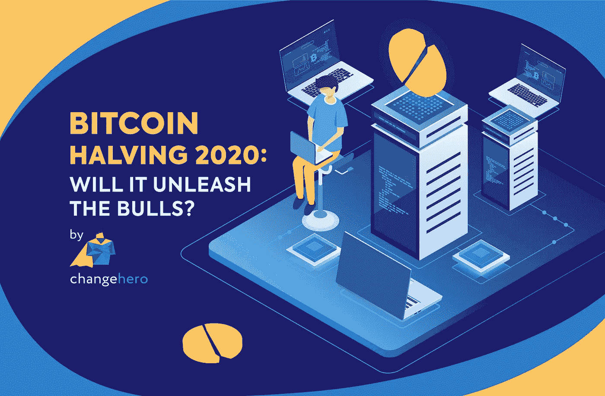
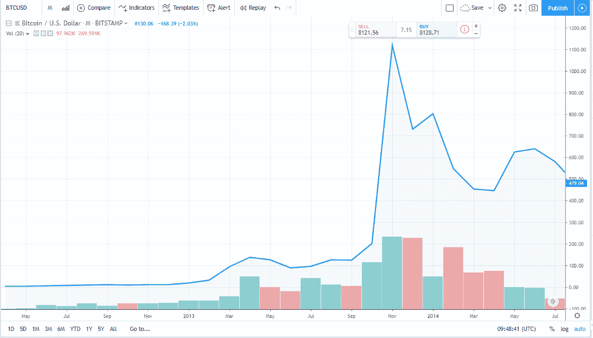
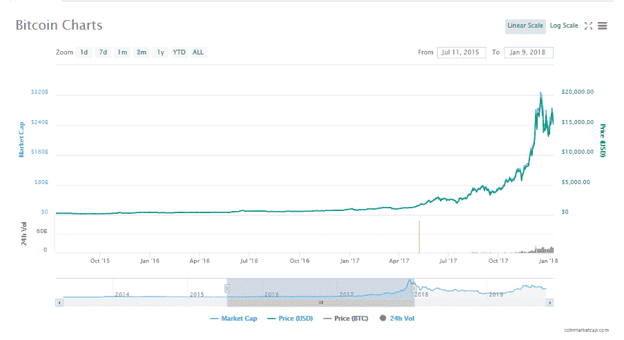
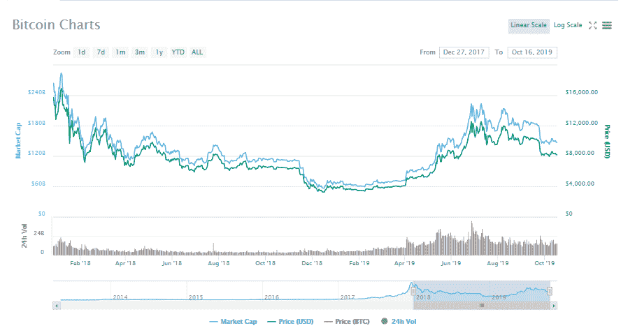
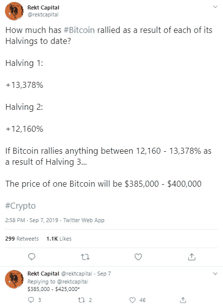
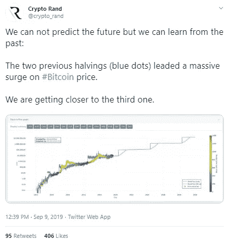
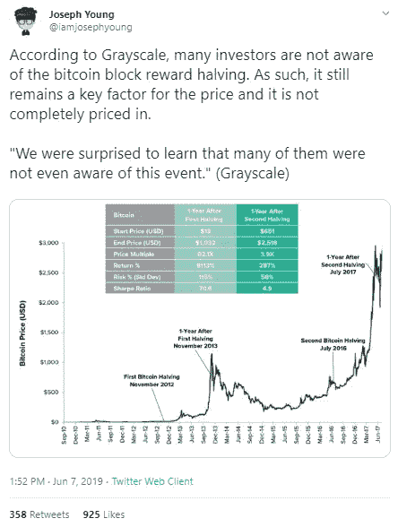

# 2020 年比特币减半:会释放多头吗？

> 原文：<https://medium.com/coinmonks/bitcoin-halving-2020-will-it-unleash-the-bulls-784ef05de81f?source=collection_archive---------0----------------------->

随着比特币减半的临近，社区中的嗡嗡声加剧，并导致一些有趣的辩论。一些人预测 BTC 的价格将会飞涨，一些人认为这将是投资者的又一场灾难。

在[之前的博客文章](/@changehero/a-quick-guide-to-crypto-halving-3a4fb7d4587c)中，我们从更广泛的角度概述了减半的想法，在深入研究之前快速浏览一下。在这个系列的第二部分， [ChangeHero](https://changehero.io/) 为您带来了比特币减半事件的详细分析，以及对明年即将到来的事件的见解和预期。

比特币由中本聪于 2009 年开发，可以说是世界上第一种去中心化的货币。为了确保新比特币的均匀分布，他创造了一种算法，用新开采的比特币奖励矿工。最初，奖励定为每块 50BTCs，但有一些附加条件。每 210，000 个区块或大约四年，采矿奖励将减半，直到所有 2100 万个比特币被开采。这样做是为了保持硬币的价值不变，维持需求。查看上一篇文章，了解这个概念的[详细解释](/@changehero/a-quick-guide-to-crypto-halving-3a4fb7d4587c)。

## **减半首映**

重要的是要考虑减半事件之前比特币的先前表现。在有史以来第一次减半事件的一年前，BTC 的交易价格约为 3 美元，并在接下来的时间里继续增长。在 2012 年 11 月的第一次减半活动中，BTC 的交易价格略高于 12 美元，每块 50 BTC 的奖励减半，设定为每块 25 BTC。

Source: [Trading View](https://www.tradingview.com/chart/)

虽然减半事件后硬币没有立即受到影响，但 BTC 在接下来的一年继续增长。6 月份出现了短暂的熊市，8 月份价格开始快速上涨。比特币在 2013 年 11 月突破了一千美元大关。当时，在熊市到来之前，BTC 的交易价格超过了 1119.80 美元。

## **类似的妹子**

第二次减半活动获得了社区的更多关注，许多人预计它会产生类似的结果。接下来的比赛在 2016 年 7 月举行，街区奖励进一步降低至每街区 12.5BTC。2015 年市场是熊市，今年 7 月，BTC 的交易价格略高于 250 美元。在接下来的几个月里，价格大幅上涨，在第二次减半时，交易价格超过了 600 美元。

Source: [CoinMarketCap](https://coinmarketcap.com/currencies/bitcoin/)

与之前的减半事件类似，比特币的价格没有立即发生变化。然而，在随后的几个月里，BTC 继续稳步增长，没有出现任何大的波动。2017 年可以说是比特币之年，我们都清楚地知道发生了什么。比特币从 2017 年 7 月开始大规模牛市，并在同年 12 月 17 日达到 20，089 美元的历史高点。

考虑到前两个减半事件，可以发现一些共同的线索。在这两种情况下，减半之前都有一个熊市。值得注意的一点是，减半后比特币的价格不会立即受到影响。在这两种情况下，价格都在一年后创出新高。从这些模式来看，可以说减半事件更多的是一个新的比特币牛市开始的催化剂。

## 【2020 年减半

下一次比特币减半可能发生在 2020 年 5 月，届时每块奖励将降至 6.25BTC。截至发稿时，当前区块高度为 599，586，离第三次减半事件还剩 30，414 个区块。

Source: [CoinMarketCap](https://coinmarketcap.com/currencies/bitcoin/)

2018 年是 crypto 的熊市，与之前的事件一致。2019 年初，价格开始暴涨，最近面临一些波动。这些迹象表明，这一事件可能会重演历史。

## **谈论小镇**

这一事件在社区中引起了极大的关注，并成为辩论的话题。我们在社区中看到了关于减半事件的各种意见。Bitman 的联合创始人韩吉·吴[表示，减半后，比特币的未来将是暗淡的。他还补充说，最近莱特币减半就是一个例子，比特币也会效仿。另一方面，Bloq 董事长马修·罗扎克(Matthew Roszak)对比特币的未来高度乐观，并预测比特币的交易价格将达到 10 万美元。](https://www.coindesk.com/next-bitcoin-halving-could-squeeze-out-retail-miners-but-jurys-split-on-price)

Source: [Twitter](https://twitter.com/rektcapital/status/1170305226877952000?ref_src=twsrc%5Etfw%7Ctwcamp%5Etweetembed%7Ctwterm%5E1170305226877952000&ref_url=https%3A%2F%2Fwww.newsbtc.com%2F2019%2F09%2F09%2Flooking-towards-the-bitcoin-halving-will-btc-price-pump-in-2020%2F)

区块链社区中一些最著名的分析家、专家和热心人士已经仔细研究了这个数字，得出了相当有希望的数字。知名交易商和分析师 [Rekt Capital](https://twitter.com/rektcapital/status/1170305226877952000?ref_src=twsrc%5Etfw%7Ctwcamp%5Etweetembed%7Ctwterm%5E1170305226877952000&ref_url=https%3A%2F%2Fwww.newsbtc.com%2F2019%2F09%2F09%2Flooking-towards-the-bitcoin-halving-will-btc-price-pump-in-2020%2F) 估计，前两次减半事件分别导致比特币价格上涨 13，378%和 12，160%。基于这些数据，这位分析师甚至预测一枚比特币将价值超过 40 万美元。

Source: Twitter

除此之外， [Crypto Rand](https://twitter.com/crypto_rand/status/1170995156683808770?ref_src=twsrc%5Etfw%7Ctwcamp%5Etweetembed%7Ctwterm%5E1170995156683808770&ref_url=https%3A%2F%2Fwww.newsbtc.com%2F2019%2F09%2F09%2Flooking-towards-the-bitcoin-halving-will-btc-price-pump-in-2020%2F) 还提出减半事件会导致比特币价格大幅飙升。另一位名叫[约瑟夫·杨](https://twitter.com/iamjosephyoung/status/1136949078879744000?ref_src=twsrc%5Etfw%7Ctwcamp%5Etweetembed%7Ctwterm%5E1136949078879744000&ref_url=https%3A%2F%2Fwww.newsbtc.com%2F2019%2F09%2F09%2Flooking-towards-the-bitcoin-halving-will-btc-price-pump-in-2020%2F)的密码爱好者暗示，halvings 遵循一定的模式，在事件发生后的一年内，价格将达到最高点。这两个有趣的模式与我们之前提到的发现一致。

## **栅栏的另一边**

当狂热分子和投资者在统计数字时，矿商们正准备应对这一行为的后果。随着街区奖励的减少，维持农场和支付账单将变得更加困难。如果比特币价格在减半后暴跌，对矿商来说将是毁灭性的。韩吉·吴[建议](https://www.forbes.com/sites/billybambrough/2019/10/14/bitmain-ceo-jihan-wu-made-an-uncertain-2020-bitcoin-warning/#b4e82c01ecc6)如果减半不会影响比特币的价格，那么矿工们应该努力提高设备的效率和计算能力，以便留在游戏中。他还补充说，尽管面临困境，但现在是投资加密采矿的正确时机。

## **老调重弹，一语双关！**

比特币减半无疑是加密领域的一件大事，有可能改变行业的进程，并影响投资者、矿工和整个社区的生活。ChangeHero 认为，即将到来的比特币减半事件将在不久的将来导致牛市。同样公平的是，不管结果如何，讨论这个话题将会提高社区的意识并刺激大众接受。

在[推特](https://twitter.com/Changehero_io)、[脸书](https://www.facebook.com/Changehero.io/)和[媒体](/@changehero)上关注 [ChangeHero](https://changehero.io/) 以获取更多此类信息丰富且有趣的文章。

> [在您的收件箱中直接获得最佳软件交易](https://coincodecap.com/?utm_source=coinmonks)

