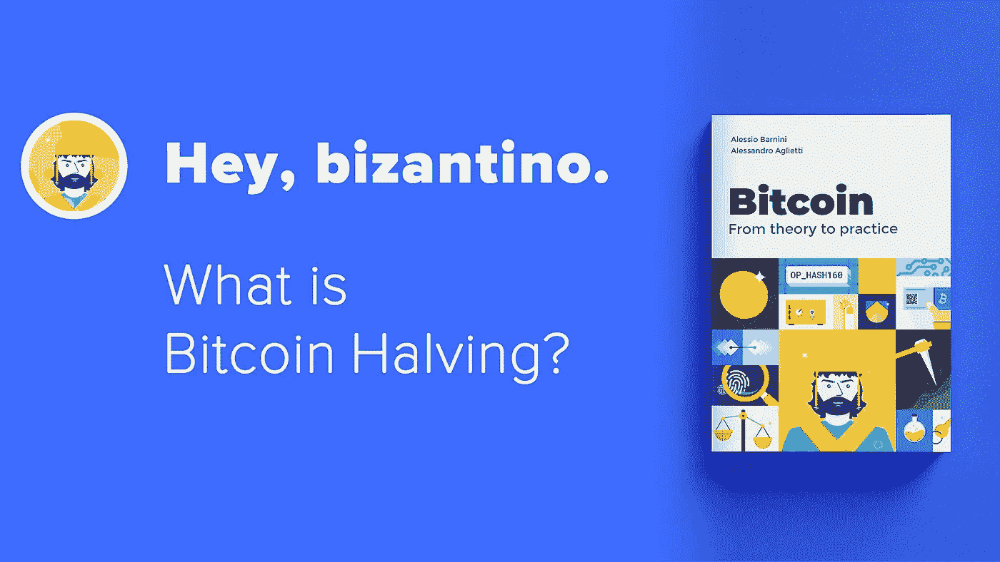

# 比特币减半:技术深度跳水

> 原文：<https://medium.com/coinmonks/bitcoin-halving-a-technical-deep-dive-hacker-noon-47976e0fd30c?source=collection_archive---------2----------------------->



📒 [Book Bitcoin from theory to practice (Amazon)](https://amzn.to/2Ym4gz6)

今天(2020 年 5 月 11 日)对比特币来说是非常重要的一天。今天我们将减半！

减半是一个经常发生的事件，每 4 年矿工得到的解决工作证明的奖励被减半。

更准确地说:每 210，000 个街区，奖励就会减半。每 10 分钟开采一个区块。这就是为什么 210.000 块相当于 1458 天，那相当于 3.99 年！

此时此刻，区块链有 629.992 个街区。当一个矿工将找到一个高度为 630.000 的新块时，12 年将从 genesis 块过去，奖励将是每块 6.25 个比特币而不是 12.5 个比特币。

我们可以在 regtest 环境中重现相同的行为。

请注意:在 regtest 中，减半发生在不同的高度。我们需要挖掘 449 个区块，以便拥有与 mainnet 相同的场景。在高度为 449 的区块，奖励是 12.5 个比特币，当我们挖掘另一个区块时，奖励将是 6.25 个比特币。

> *在行动中*

首先，我们需要使用没有块的 regtest 环境。

```
$ bitcoin-cli getblockchaininfo
{
  "chain": "regtest",
  "blocks": 0,
  "headers": 0,
  "bestblockhash": "0f9188f13cb7b2c71f2a335e3a4fc328bf5beb436012afca590b1a11466e2206",
  "difficulty": 4.656542373906925e-10,
  "mediantime": 1296688602,
  "verificationprogress": 1,
  "initialblockdownload": true,
  "chainwork": "0000000000000000000000000000000000000000000000000000000000000002",
....
```

我们可以使用 *generatetoaddress* 命令挖掘 449 个块。

```
bitcoin-cli generatetoaddress 449 $(bitcoin-cli getnewaddress '' 'bech32')
```

我们得到许多块散列，我们可以探索最后一个并得到它的 **coinbase** 。 **coinbase** 总是块的第一个事务。这是一个特殊的交易，矿工为自己创造，以获得奖励。

```
$ LAST_BLOCK_HASH=$(bitcoin-cli getbestblockhash)

$ TX=$(bitcoin-cli getblock $LAST_BLOCK_HASH | jq -r '.tx | last')

$ bitcoin-cli getrawtransaction $TX 2

{
  "txid": "7fb99af2ab497b94a6de2dcd91d3a5a97d31eaf8d0f8dd43ff4100a2f78efd8a",
  "hash": "ee38f615f26776913cf1b2a7a351c4f80e1777cbf3950fc22be42c2eafa7450b",
  "version": 2,
  "size": 170,
  "vsize": 143,
  "weight": 572,
  "locktime": 0,
  "vin": [
    {
      "coinbase": "02c1010101",
      "sequence": 4294967295
    }
  ],
  "vout": [
    {
      "value": 12.50000000,
      "n": 0,
      "scriptPubKey": {
        "asm": "0 5f04362ef3474238aba0b9691c754285ad5dc735",
        "hex": "00145f04362ef3474238aba0b9691c754285ad5dc735",
        "reqSigs": 1,
        "type": "witness_v0_keyhash",
        "addresses": [
          "bcrt1qtuzrvthngapr32aqh953ca2zskk4m3e42nqdtz"
        ]
      }
    },
    {
      "value": 0.00000000,
      "n": 1,
      "scriptPubKey": {
        "asm": "OP_RETURN aa21a9ede2f61c3f71d1defd3fa999dfa36953755c690689799962b48bebd836974e8cf9",
        "hex": "6a24aa21a9ede2f61c3f71d1defd3fa999dfa36953755c690689799962b48bebd836974e8cf9",
        "type": "nulldata"
      }
    }
  ],
  "hex": "020000000001010000000000000000000000000000000000000000000000000000000000000000ffffffff0502c1010101ffffffff02807c814a000000001600145f04362ef3474238aba0b9691c754285ad5dc7350000000000000000266a24aa21a9ede2f61c3f71d1defd3fa999dfa36953755c690689799962b48bebd836974e8cf90120000000000000000000000000000000000000000000000000000000000000000000000000",
  "blockhash": "1eb8af036a9b6613c10d1148ef64ee2c86f166085715f4d01c89907fa5086296",
  "confirmations": 1,
  "time": 1606386368,
  "blocktime": 1606386368
}
```

我们可以读出**“值”:12.50000000** 。这是奖励。现在让我们去挖掘另一个块，以复制相同的 mainnet 的行为。

```
$ bitcoin-cli generatetoaddress 1 $(bitcoin-cli getnewaddress '' 'bech32')

$ LAST_BLOCK_HASH=$(bitcoin-cli getbestblockhash)

$ TX=$(bitcoin-cli getblock $LAST_BLOCK_HASH | jq -r '.tx | last')

$ bitcoin-cli getrawtransaction $TX 2
{
  "txid": "2c8a9cbe986cd3a05aff1cb70183e8e9489916fd2e3dfe73a0772e99edc899c0",
  "hash": "5c94f6bdbd32032f4ae3d5c6c4dde014e7bb60a7cda9151ea253b3856c2f5b0e",
  "version": 2,
  "size": 170,
  "vsize": 143,
  "weight": 572,
  "locktime": 0,
  "vin": [
    {
      "coinbase": "02c2010101",
      "sequence": 4294967295
    }
  ],
  "vout": [
    {
      "value": 6.25000000,
      "n": 0,
      "scriptPubKey": {
        "asm": "0 1f638364fc2154626cfeb2ffdbed23289a037043",
        "hex": "00141f638364fc2154626cfeb2ffdbed23289a037043",
        "reqSigs": 1,
        "type": "witness_v0_keyhash",
        "addresses": [
          "bcrt1qra3cxe8uy92xym87ktlahmfr9zdqxuzryctd4h"
        ]
      }
    },
    {
      "value": 0.00000000,
      "n": 1,
      "scriptPubKey": {
        "asm": "OP_RETURN aa21a9ede2f61c3f71d1defd3fa999dfa36953755c690689799962b48bebd836974e8cf9",
        "hex": "6a24aa21a9ede2f61c3f71d1defd3fa999dfa36953755c690689799962b48bebd836974e8cf9",
        "type": "nulldata"
      }
    }
  ],
  "hex": "020000000001010000000000000000000000000000000000000000000000000000000000000000ffffffff0502c2010101ffffffff0240be4025000000001600141f638364fc2154626cfeb2ffdbed23289a0370430000000000000000266a24aa21a9ede2f61c3f71d1defd3fa999dfa36953755c690689799962b48bebd836974e8cf90120000000000000000000000000000000000000000000000000000000000000000000000000",
  "blockhash": "04eec4981e77406bb79284f89dd3afa7f028615c4e1e4fa2bed2abc8cc28f11f",
  "confirmations": 1,
  "time": 1606386591,
  "blocktime": 1606386591
}
```

我们可以读出**“值”:6.25000000** ，减半完成！

请记住:首先，您可以找到我们的[复位器](https://github.com/bitcoin-dalla-teoria-alla-pratica/Bitcoin-in-Action/blob/master/Video%201%20-%20Halving/main.sh?ref=hackernoon.com) y 点编号 2 的代码，不要错过这个意大利语视频！🇮🇹

请继续收听本台，为下一篇文章做准备。

*原载于 2020 年 12 月 6 日 https://hackernoon.com*[](https://hackernoon.com/bitcoin-halving-a-technical-deep-dive-8y1a3zfb)**。**