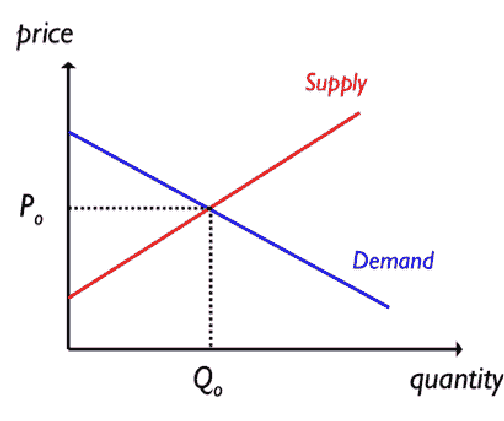
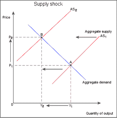

# 比特币减半基础知识

> 原文：<https://medium.com/coinmonks/bitcoin-halving-basics-53a830409ac7?source=collection_archive---------1----------------------->

几个小时后，世界上最强大的加密货币将变得更加强大。是的，我们正在谈论比特币……尽管我们周围的世界继续变得越来越令人困惑……而且你、我或其他任何人——包括唐纳德·特朗普和杰罗姆·鲍威尔——都无法阻止它。

# 那么，比特币是什么？

比特币是一种数字化、去中心化、开源的点对点(P2P)加密货币，也是不可改变的，具有通缩供应时间表，并且不能被任何人没收。比特币有几个用例，但今天我们只是为了纪念今天的减半事件而关注它的通缩供应计划。

通过把比特币和其他加密货币扔进同一个桶里，你可以很容易地激怒比特币持有者。对他们来说，这就好比说迈克尔·乔丹“只是一个篮球运动员”，而忽略了这样一个事实:他是一个全球偶像，已经积累了数十亿美元，可以说是这个星球上最有才华的运动员。

同样，比特币不仅仅是“一种加密货币”。事实上，其通缩供应计划使其比其他加密货币如以太币、XRP 币或莱特币更接近黄金和白银。但从技术上讲，它也不是一种商品。所以我们暂且称之为“数字黄金”，好吗？

# 比特币由谁控制？

如前所述，比特币是一种去中心化的 P2P 加密货币。所以通俗地说，它不受中央银行或政府的控制。它也没有首席执行官。比特币不受任何人控制，但每个人都可以参与其中。我的意思是:

你可以通过从交易所购买比特币，并将其转移到私人钱包中，从而拥有一些比特币。这个钱包就像一个个人银行账户，除了你拥有银行，可以 24/7/365 存取你的资金。如果你的比特币离线存放在一个冰冷的钱包里，没人能冻结你的账户或没收你的比特币，但同时它没有得到联邦存款保险公司的保险。因此，你要对自己的安全负百分之百的责任。

“工作证明”是保护比特币网络的去中心化系统。基本上，拥有特殊软件的矿工通过电力消耗能量来核实和批准所有交易。这些交易发生在区块链。区块链是一个公共账本，然而交易者的身份仍然是私人的。所有未决交易都集中在一个“块”中，需要 10 到 20 分钟才能获得批准。在那段时间里，比特币矿工“比赛”解决一个数学证明，该证明本质上是验证和批准交易的合法性，并防止相同硬币的重复支出。

(旁注。对于区块链上发生的腐败活动——比如，向两个不同的地址支付完全相同的比特币——需要矿工们至少 51%的共识。*因此，随着比特币在采用方面变得更加广泛，矿工人数增加，执行 51%的攻击也变得越来越困难*。)

矿工花费精力的动机是赢得验证新区块的数学竞赛。每个区块由两部分组成:补贴和交易费。到目前为止，补贴是整体奖励的最大部分，由新铸造的硬币组成。这项补贴奖励给最先解出方程式的矿工。交易费只占了很小一部分，但它们为其余的矿商提供了继续维护系统完整性的激励。

在比特币的早期，块奖励是 50 BTC。然而，系统中有一个不可逆转的协议，要求每 210，000 个街区奖励减半。这种情况每四年左右发生一次，并将持续到 2140 年，届时我们将达到 2100 万比特币的最终供应上限。

到目前为止，比特币经历了两次“减半”事件——第一次是在 2012 年，当时区块奖励从 50 BTC 升至 25 BTC，第二次是在 2016 年，当时区块奖励从 25 BTC 升至 12.5 BTC。在不到一周的时间里，[比特币](https://blog.coincodecap.com/a-candid-explanation-of-bitcoin/)将经历第三次减半，因为块奖励计划减半，从 12.5 BTC 降至 6.25 BTC——这正是我写这篇文章的原因。

那么，这一切到底意味着什么呢？

# 经济学

在我们进入实质之前，我们需要后退一步，确保我们对供求规律有一个正确的理解。

供求定律是你在任何基础经济学课程中首先要学的东西之一。它决定了任何商品或服务的价格。

正如你在上面的曲线上看到的，任何给定商品或服务的价格可以在 y 轴上找到，数量可以在 x 轴上找到。

向下倾斜的蓝线代表需求。在其他条件不变的情况下，它可以这样解释:*随着一种产品或服务的价格***上涨，人们已经买不起以前那么多了；因此，需求量* ***减少*** *(反之亦然)。**

*向上倾斜的红线代表供给。在其他条件相同的情况下，它可以这样解释:*随着产品或服务的价格***，供应商有* ***更多的激励*** *来生产和销售更多的产品或服务，从而获取更多的利润(反之亦然)。***

**综上所述，需求方的价格和数量是反比关系，供给方的价格和数量是正比关系。**

**嘣。对经济学的基本理解。**

**但这正是事情开始变得有趣的地方。**

# **需求冲击**

**需求最终决定了商品或服务的价格。**

**还记得几个月前围绕冠状病毒的大规模歇斯底里开始的时候吗？3M 公司 N95 呼吸器价格的变化是需求冲击影响的一个主要例子(一个 10 包装的呼吸器在不到一个月的时间里从 18.20 美元飙升至 99.99 美元)。**

****

**上图完美地展示了积极需求冲击的影响。“D1”代表大规模歇斯底里发作前的总需求，“D2”代表近一个月后的总需求。注意从 P1 → P2 的价格调整。由于消费者的需求超过了供给，每一种可销售的呼吸器的竞争比以前更加激烈。这使得价格上涨了很多很多。**

**(在负面需求冲击的情况下——比如，发现呼吸器实际上增加了感染病毒的几率——价格显然会暴跌。)**

# **供应冲击**

**现在想象一下，你在佛罗里达州种植橙子，而美国每年一半的收成被飓风摧毁。退一步说，这是一个不幸的事件，但你知道三件事是真实的:(1)人们仍然想消费橙子，(2)市场上可销售的橙子总量将会减少，以及(3)作为农民，你仍然需要实现收支平衡。假设橙子的需求量一如既往地高，那么在这种负供给冲击的情况下，橙子的价格会发生什么变化呢？**

****

***在其他条件相同的情况下，每种畅销的橙子都会有更多的***竞争；因此出价最高的人将得到橘子。这将不可避免地推动价格上涨，从上图中的 A 点→ B 点可以看出这一点****

**把市场想象成一场小型拍卖可能会有所帮助。在这种情况下，除非出价最高的人和出价最低的人就价格达成一致，否则交易不会达成。让我们称这个点为“市场均衡”**

**现在，让我们运行几个数字，并将它带回比特币的背景。**

# **比特币即将到来的供应冲击(又名“减半”)**

**为了避免混淆，请允许我澄清一些事情:**

**已经有超过 1800 万枚比特币在流通——这些比特币将会被减半。当我们谈论比特币减半时，我们指的是新铸造的比特币(T3)在 T2 的数量——这些比特币将减少 50%。**

**这有点像一个不断后退的地平线:****越接近*** *我们获得 2100 万比特币的供应上限，* ***越困难*** *就越难以获得新的比特币。****

**目前，大约有 1800 万比特币的现有库存(或供应)，当前的整体回报是 12.5 BTC，市场对每枚比特币的定价在 9000 美元左右——这是市场均衡。**

**在几个小时内，唯一会改变的是街区奖励，因为它被减半，从每街区 12.5 BTC(每天 1800 BTC)到每街区 6.25 BTC(每天 900 BTC)。**

**知道了我们对供求经济学的了解，以及当高需求的东西出现负供给冲击时会发生什么，比特币的价格会发生什么变化？**

**答案:*如果需求保持不变，* *那么每一枚新铸造的比特币都会比之前的整体奖励更具竞争力。由于需求将暂时超过供给，价格将不得不向上调整到一个更高的平衡点。***

**数字上升。**

**这就是最近所有的热门话题。**

**但是不要搞错，这里的关键词是“其他一切都一样”，因为其他一切——失业率、消费者信心等——都不会一成不变。此外，由于这种减半是在 11 年多前就被纳入协议中的，因此它不能真正被视为“震惊”或“惊喜”，因为它在几年前就已为人所知。但是现在，我们将忽略有效市场假说，探究为什么人们一直在期待比特币的第三次减半事件。**

# **前几次降价对价格的影响**

**从历史上看，比特币之前的两次降价都与价格的大幅上涨有关。第一次减半发生在 2012 年 11 月，当时价格约为 13 美元。六个月后的 2013 年 4 月，比特币价格飙升至 238 美元，最终在一年后的 2013 年 11 月达到 1242 美元。第二次减半发生在 2016 年 7 月，当时比特币的价格为 650 美元。大约 18 个月后，它达到了 19498.63 美元的历史高点。**

****

**如你所见，比特币价格减半的影响远非立竿见影。在过去，比特币达到历史新高需要长达 18 个月的时间。这一次可能需要更长、更短的时间，或者根本不会发生。**

**你的猜测和我的一样好。**

**和往常一样，这些都不是投资建议。但如果你决定购买比特币，我有三条建议:**

1.  **自己做研究，只在你能承受损失的情况下投资比特币。理论上讲，比特币可能会归零。**
2.  **要有耐心。比特币是一头易变的野兽，波动是双向的。比特币的价格在任何一天波动 5%都是正常的。事实上，它在 2020 年 3 月 12 日下降了 50%以上。然而，随着采用的增加，波动性将会降低。但现在，如果你想享受大规模的牛市，你需要忍受它的剧烈下跌。**
3.  **做自己的银行，要有规划。唯一比投资回报更重要的是……投资的回报*。由于像比特币基地这样的交易所很容易被黑客攻击(2014 年 Mt. Gox)，将你的硬币转移到线下钱包将是明智的。当要从桌上拿走一些利润时，你首先需要确保你仍然有机会拿到你的硬币。***

**现在，是时候放松一下，看看这件事的结局了！**

****

> **[在您的收件箱中直接获得最佳软件交易](https://coincodecap.com/?utm_source=coinmonks)**

****