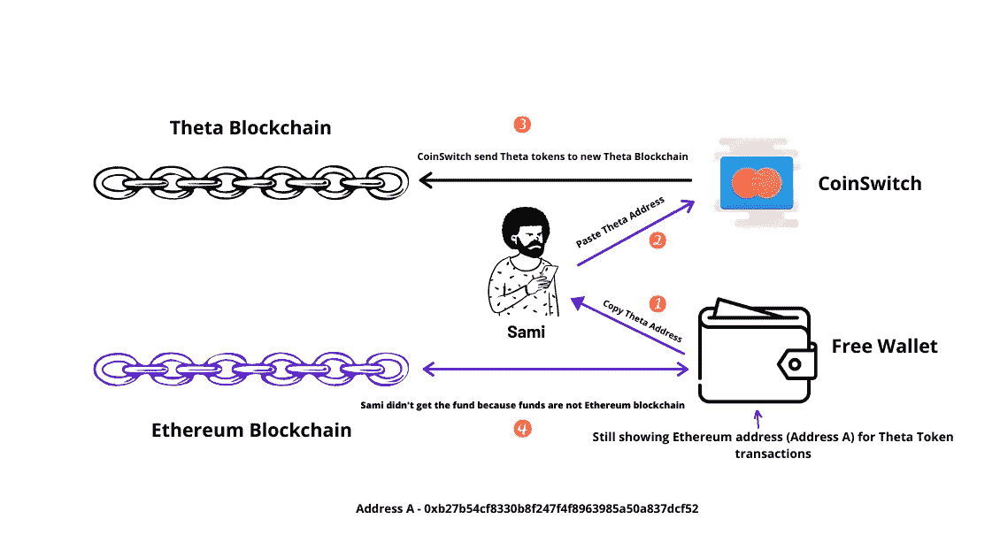

# 比特币减半就要来了……😍

> 原文：<https://medium.com/coinmonks/bitcoin-halving-is-coming-842ac0146cff?source=collection_archive---------1----------------------->

## Freewallet 窃取资金，CoinCodeCap 开发者报告

嘿伙计们，

我希望你是安全的。让我们开始本周的更新。

*   【Sami 如何向 Freewallet 输掉 5000 美元
*   [分析加密货币项目的开发者](https://blog.coincodecap.com/analyzing-developers-in-cryptocurrency-projects/)👨‍💻
*   阅读本周最重要的[加密新闻](/coinmonks/bmws-blockchain-solution-launching-china-s-national-blockchain-live-in-april-hitachi-33b25d5c61d9)作者[凯尔·埃利科特](https://medium.com/u/7e29992d1be?source=post_page-----22e4d9062741----------------------)
*   点击阅读本周的 CoinCodeCap 简讯[。](https://coincodecap.substack.com/p/cool-new-features-and-blog-revamp)

> 比特币没有股息或潜在的未来股息，因此不像股票。更像是收藏品或商品。
> 
> *——*[****S*中本聪***](https://bitcointalk.org/index.php?topic=845.msg11403#msg11403)

## ***比特币减半***

*第三次比特币减半估计在 2020 年 5 月 11 日，大家都很好奇会发生什么，别急，看这个 4 分钟的视频 或一个关于比特币减半的 1 小时直播 由 [Andreas M. Antonopoulos](https://medium.com/u/898f59563d67?source=post_page-----842ac0146cff--------------------------------) 制作。*

## ***必读故事***

*[**萨米如何将 5000 美元输给自由钱包**](https://blog.coincodecap.com/how-sami-lost-5000-to-freewallet/)**——**这是 [Mhd 萨米](https://twitter.com/samijomana)(此处关于萨米)的故事，他将 5000 美元输给了[自由钱包](https://freewallet.org/)，一个保管人加密钱包。这对任何使用保管人加密产品的人来说都是很好的学习。*

**

# *头条新闻*

*   *[我如何在 2020 年 3 月的比特币崩盘中损失了 3 万美元](/coinmonks/how-i-lost-30-000-in-the-march-2020-bitcoin-crash-9b435a3d2a45)——[卡特迈](https://medium.com/u/5cd3a658183f?source=post_page-----842ac0146cff--------------------------------)*
*   *[什么是曲线金融？](/coinmonks/what-is-curve-finance-18c0b1448f43) — [危险张](https://medium.com/u/fea3514f689b?source=post_page-----842ac0146cff--------------------------------)*
*   *[揭穿币安的选项](/coinmonks/debunking-binance-options-4fd6c3b08471)——[豪斯基](https://medium.com/u/a946b608431f?source=post_page-----842ac0146cff--------------------------------)*
*   *[DeFi 货币市场项目(DMM)回顾](/coinmonks/a-review-of-defi-money-market-project-dmm-5a68c10b36e3)*
*   *[从堆叠机到功能机](/coinmonks/from-stack-machine-to-functional-machine-step-2-currying-f26c7f8b7220) — [Loredana Cirstea](https://medium.com/u/b554eeee4b2e?source=post_page-----842ac0146cff--------------------------------)*
*   *[教程:Jetson Nano (ARM)上 Keep 的随机信标客户端——Parley Labs](/coinmonks/tutorial-keeps-random-beacon-client-on-jetson-nano-arm-parley-labs-4c0e7d08ba0a)*
*   *第二章:货币、信贷和债务——[雷伊·达里奥](https://medium.com/u/a29615f64d53?source=post_page-----842ac0146cff--------------------------------)*
*   *[以太坊 Mainnet 测试用 Python 和 Brownie](/@iamdefinitelyahuman/ethereum-mainnet-testing-with-python-and-brownie-82a61dee0222) [Ben Hauser](https://medium.com/u/1f38e34e130f?source=post_page-----842ac0146cff--------------------------------)*
*   *[更多关于 ETH 2.0 的经济学](/@Austerity_Sucks/more-on-the-economics-of-eth-2-0-26a505fd025)——[紧缩糟透了](https://medium.com/u/dbeb6ac5cd69?source=post_page-----842ac0146cff--------------------------------)*
*   *[Fawkes-crypto——构建 zkSNARKs 的一个新的轻量级框架](/zeropool/fawkes-crypto-a-new-lightweight-framework-for-building-zksnarks-eca22ff1e14b) — [Igor Gulamov](https://medium.com/u/ff00d5d0ee10?source=post_page-----842ac0146cff--------------------------------)*

*加入我们的 [***电报频道***](https://t.me/joinchat/FyuZERD5oyp6LWbwLASOKQ) 来谈论新的加密产品和区块链生态系统。*

*   *如果你经营一家公司，请填写 [**这份由**](https://www.surveymonkey.com/r/remote_working_crypto_survey_covid19) **[LaborX](https://laborx.com/) 团队进行的** 调查，了解当前的疫情对你的业务的影响。*
*   *你们检查过 [PaymentX](https://paymentx.io/?utm_source=coinmonks) 发票工具吗？让我知道你的经历如何。*
*   *时事通讯的标题是引用卡特·格拉斯的话*

> *[直接在您的收件箱中获得最佳软件交易](https://coincodecap.com/?utm_source=coinmonks)*

**

# *在 Coinmonks 上发布*

*如果你喜欢在 crypto/区块链空间上写教育文章，并且想在 Coinmonks 出版物上发表。只需在**发邮件给我或者 DM 我**[***推特***](https://twitter.com/coinmonks)***

> ****“我们是一个非宣传性和非营利性的教育出版物，如果你喜欢阅读***[*【你也可以把我们*](/coinmonks/monks-need-your-help-7440418d67ec) *】。******

******暂时就这样，送我❤️，下次再说。******