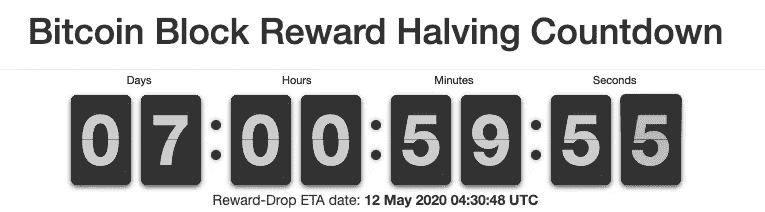
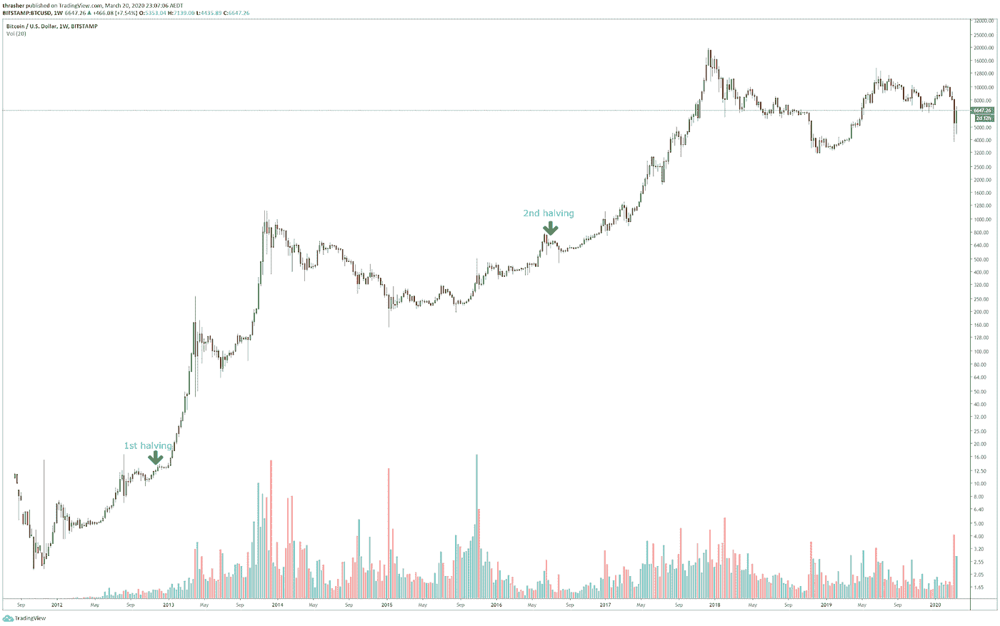
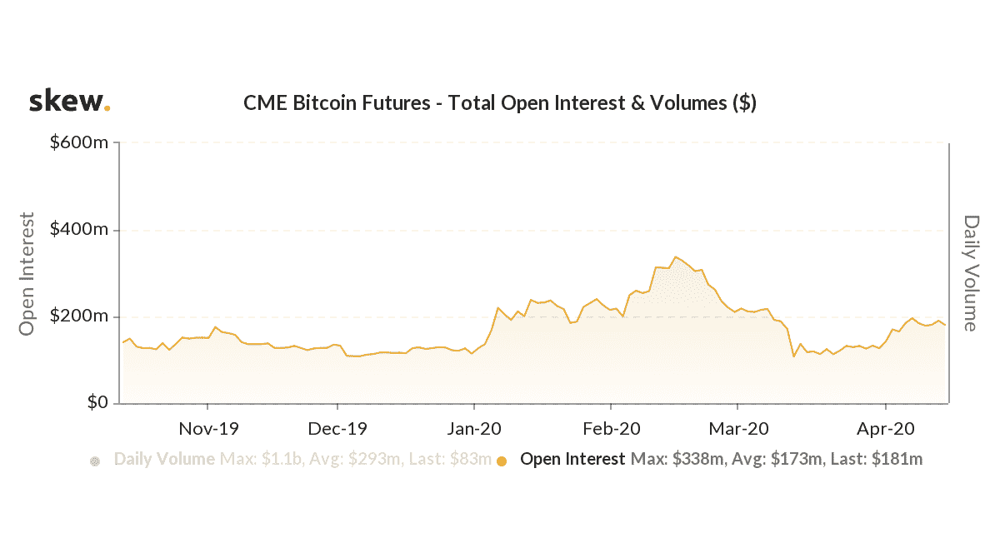
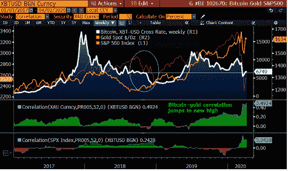

# 比特币减半&走向成熟的一步

> 原文：<https://medium.com/coinmonks/bitcoin-halving-the-step-to-maturation-1cbf2aa3c64b?source=collection_archive---------3----------------------->

距离期待已久的比特币减半还有大约一周的时间。

你可以通过访问任何交易所、在线杂志或数据聚合网站，轻松找到倒计时页面。是的——每个人都在等待。

Source: Bitcoin Block Half

这是一个既带来可预测性又带来不确定性的事件。

# 什么是可预测的？

比特币被设计成一种通货紧缩的货币，像黄金一样有 2100 万的固定供应量。随着时间的推移，比特币的发行会减少，从而变得更加稀缺。

最初创建时，每块 50 个比特币作为对矿工的奖励。每开采 210，000 个区块后(大约每 4 年)，区块奖励减半，并将继续减半，直到每个区块的区块奖励变为 0(大约到 2140 年)。

2020 年 5 月 12 日 06:18 UTC 左右(截至发稿时)，比特币的块奖励将从 12.5 BTC 降至 6.25 BTC。

# 什么是不确定的？

Source: [https://www.bitcoinblockhalf.com/](https://www.bitcoinblockhalf.com/)

如图所示，我们可以注意到价格在每减半后会有一个显著的上涨。

但是，当股票市场和加密市场由于全球新冠肺炎疫情而比往常更加不稳定时，这一次会是一个不同的故事吗？

在过去的几个月里，由于冠状病毒疫情及其余波，加密市场发生了巨大的震荡。3 月 12 日，比特币价格在一天之内暴跌 40%，触及 3800 美元，标志着今年的黑色星期四。

股票市场也经历了一场严重的崩盘。美国股市 10 天内 4 次触发“熔断机制”。

就在最近，比特币价格飙升至 9000 美元以上，根据 [CoinMarketCap](https://coinmarketcap.com/currencies/bitcoin/) 的统计数据，在撰写本文时，比特币价格已回落至 8864 美元。

没有人确切知道减半发生时情况会如何。比特币价格会更加波动还是会稳定下来？

# 2020 比特币成熟度测试

根据[彭博加密展望(2020 年 4 月版)](https://data.bloomberglp.com/professional/sites/10/Bloomberg-Crypto-Outlook-April-2020.pdf)，尽管今年股市大幅震荡，但期货未平仓合约不断增加，波动性下降，相对表现优异，这表明**比特币正从投机性加密资产走向数字版黄金。**

## 增加期货未平仓合约

Source: skew

芝加哥商品交易所(CME)上市的比特币期货合约数量已从 3 月份的低点大幅回升，表明希望购买这种加密货币的机构出现复苏。高成交量也代表着对高度投机的牛市的驯服。

# 波动性下降

Source: Bloomberg

这张图表显示，比特币和黄金的相关性已跃升至 2010 年以来的最高水平，是股票的两倍，这表明比特币现在正在脱离股票，加入黄金。

# 比特币跑赢股市

除此之外，比特币越来越不像是一种风险资产。2020 年第一季度，当标准普尔 500 显示回调 20%时，比特币仍上涨约 9%。

# 综上

2020 年标志着比特币从投机资产向加密市场版黄金过渡的关键考验。我们相信，第一个诞生的密码将通过测试，走向成熟的黄金资产。

在 Leverj，我们正在积极开发分散化的衍生品市场，包括预计将在几个月后推出的比特币永久交易。

请访问 [live.leverj.io](https://live.leverj.io/) 从现在起，在有限的时间内享受我们的零费用交易。在[推特](https://twitter.com/Leverj_io)上关注我们，或者加入我们的[电报](https://t.me/leverj)群组，继续关注我们的更新。

**请牢记**

美国人不允许在[级别](https://live.leverj.io/)交易。来自受制裁国家或 OFAC 特别指定国家(SDN)的用户也不允许使用该系统。

在您进行交易之前，请确保您在法律上被允许交易加密货币、衍生产品和本平台上提供的来自您所在司法管辖区的任何其他工具。

本文中的任何内容都不构成要约、邀约或投资建议。

> [直接在您的收件箱中获得最佳软件交易](https://coincodecap.com/?utm_source=coinmonks)

