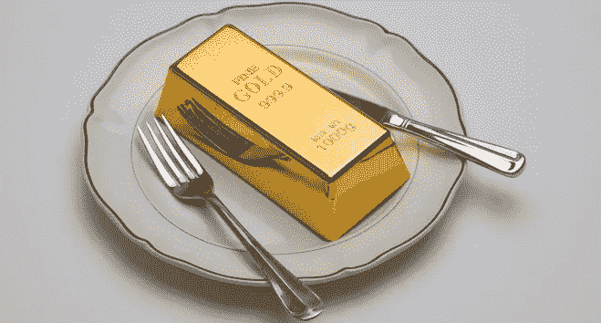

# 比特币没有内在价值——这很好。

> 原文：<https://medium.com/coinmonks/bitcoin-has-no-intrinsic-value-and-thats-great-e6994adbfe0f?source=collection_archive---------0----------------------->

内在价值。比特币怀疑论者喜欢谈论它。他们的论点通常如下:“比特币不能作为货币使用，因为它没有任何商品的内在价值。要想成为一种可行的货币，它必须首先被接受并被用于该物品固有的其他商品用途，然后随着时间的推移慢慢成为一种货币。例如:因为黄金可以用在…